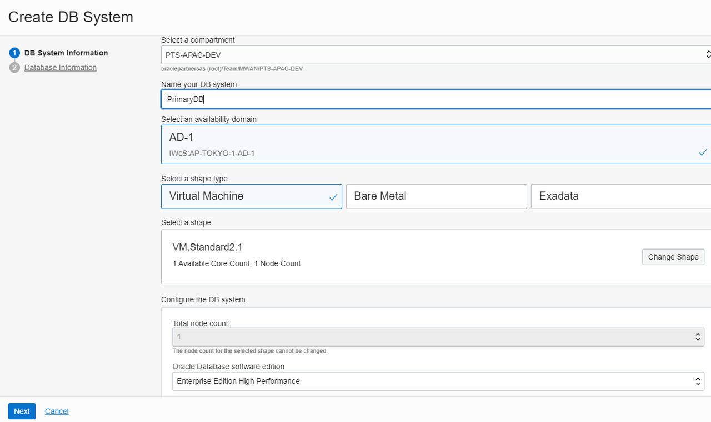
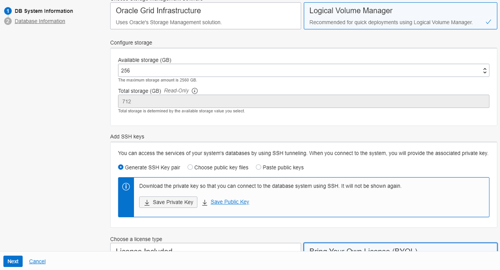
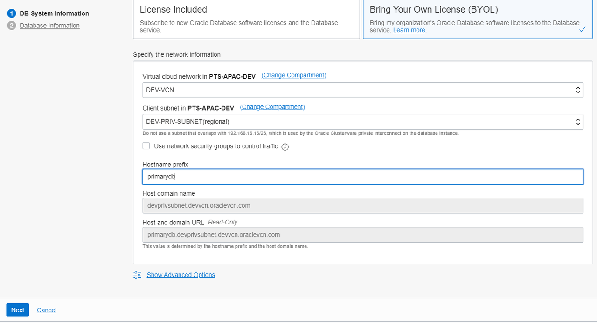
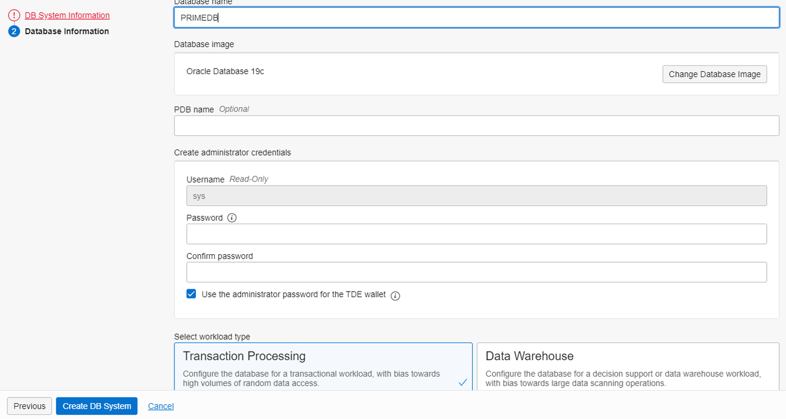

# Create the Database Cloud Service

## Introduction
The Oracle Database Cloud Service automates the provisioning and management of the Oracle database in the cloud.  We will create the Oracle Database Cloud Service as the primary database in one of the cloud regions.  The standby database will be automatically created when we set Data Guard association later.  Data Guard supports RAC databases, but we'll use a single instance database in the lab.  Standard Edition does not support Data Guard, we will use the Enterprise Edition.

Estimated lab time:  5 minutes
Estimated wait time: 20 minutes to create database

### Objective
- Create the Oracle Database Cloud Service as the primary database

### Prerequisite
- VCN with private subnet

## Task 1: Create the Oracle Database Cloud Service
1. Select a region for your primary database.
2. Select the menu Oracle Databases then Bare Metal, VM, and Exadata.
3. Select your compartment.
4. Click Create DB System.
5. Ensure your compartment is selected.
6. Enter a name for your database for the UI display.
7. Keep the default Database image or change to the version you want.  
8. If you have more than one availability domain, select any one.
9. For the lab we will use a virtual machine with only one core.  

  

10. For faster provisioning of the database for this lab, select Logical Volume Manager.

11. Use the default storage size.

12. Add your SSH public key.

  

13. Select BYOL if you have an existing Oracle license to use.   If not, select License Included which means you are subscribing to a new database license.  If you are using a free credits account, you will not be charged.

14. Select your VCN you created earlier.

15. Select the private subnet.  Your databases should be provisioned in a private subnet for security.

16. Give it a hostname prefix.

17. Click Next

  

18. Provide a database name, must be 8 characters or less.

19. Provide a strong password for your database sys user.

20. Select Transaction Processing or Data Warehouse.

21. Click Create DB System.  Your Oracle Database Cloud Service will be created in a few minutes.

  

You may now [proceed to the next lab](#next).

## Acknowledgements
* **Author** - Milton Wan, Database Product Management, Dec 2020
* **Last Updated By/Date** - Milton Wan, Jun 2021
