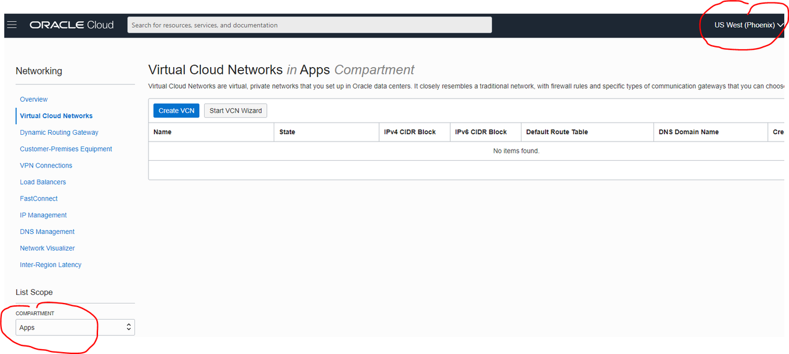
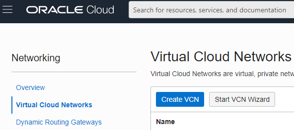
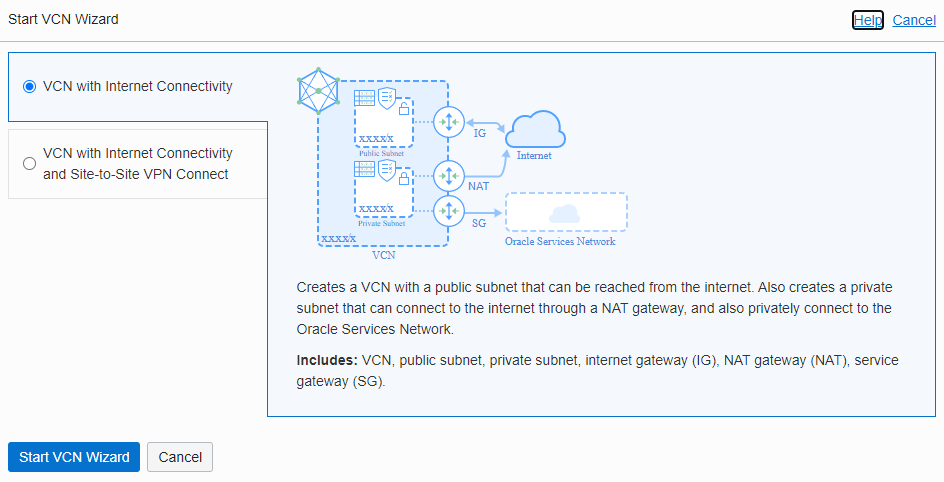
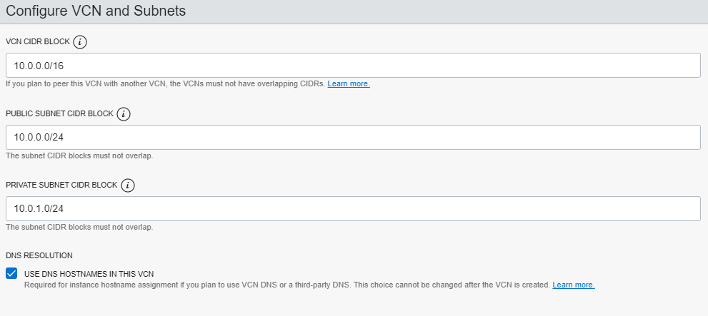

# Create your Virtual Cloud Network

## Introduction
Create a Virtual Cloud Network on the primary region and the secondary region.  Although they are in different regions, the VCNs must both be in the same compartment. And they must not have overlapping VCN IP address blocks.

Estimated lab time:  5 minutes

### Objective
- Create the VCN using the wizard

### Prerequisite
- Oracle Cloud Account
- User policy to create the VCN

## Task 1: Sign in to Oracle Cloud
1. Sign in to your tenancy with your username and password.

## Task 2: Create a Virtual Cloud Network  

You will provision the Oracle Database Cloud Service on this network.

1. Go to the Networking menu and select Virtual Cloud Network

2. Select your region and compartment

  

3. Click Start VCN Wizard

  

4. Select VCN with Internet Connectivity to create your cloud network.

5. Click Start VCN Wizard.  

  

6. Give your VCN a name of your choice.

7. Enter a CIDR block.  The CIDR block must not be the same as your cross region CIDR block because we will need to peer them together later so they must be different.  

ie: 10.0.0.0/16 for one region and 11.0.0.0/16 for the peer region.

8. Update your subnet CIDR block accordingly.

  

9. Click Next and then Click Create.  Your cloud network will be created quickly.

## Task 3: Create the second Virtual Cloud Network on your Peer Region
Now do the same steps as above and create another VCN on your peer region.  
1. Switch to your peer region and create your VCN with the wizard.  

Remember it must be in the same compartment but with a different CIDR block.

You may now [proceed to the next lab](#next).

## Acknowledgements
* **Author** - Milton Wan, Database Product Management, Dec 2020
* **Last Updated By/Date** - Milton Wan, Jun 2021
