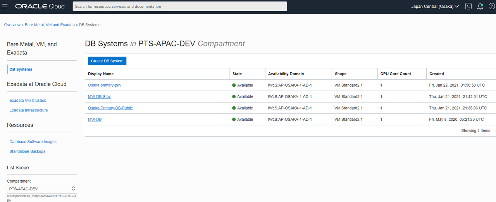
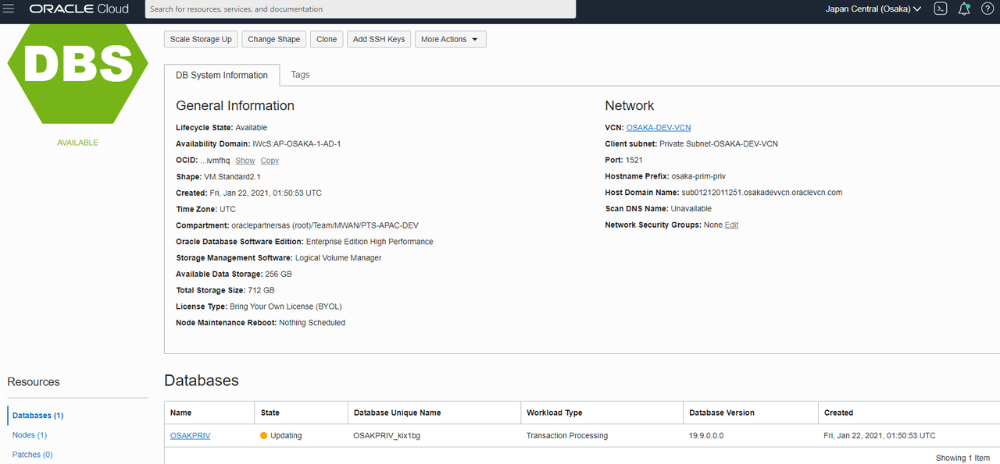
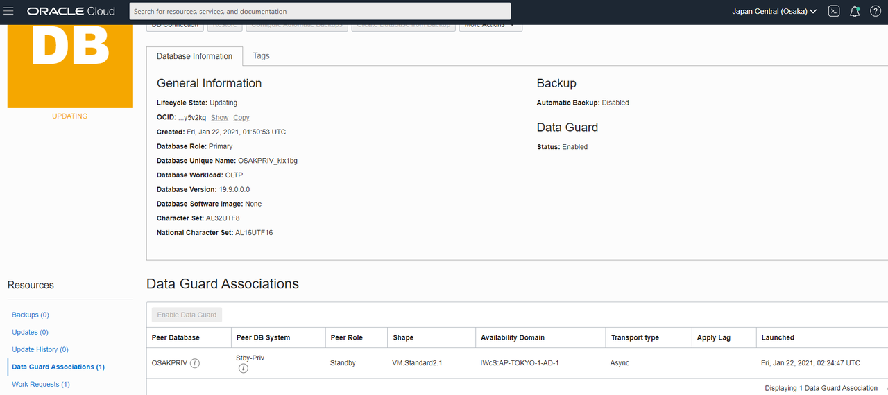
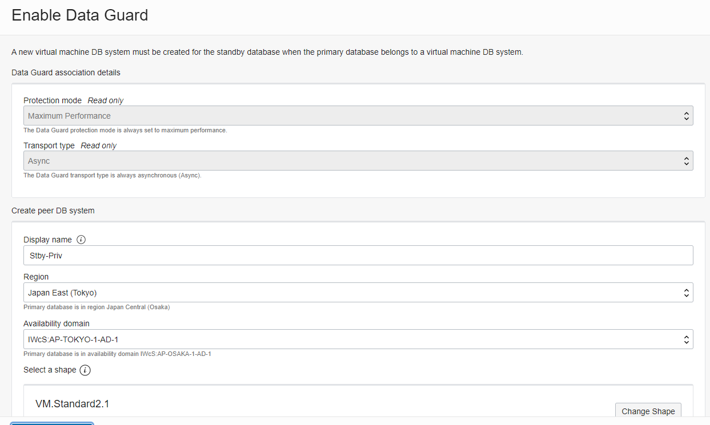
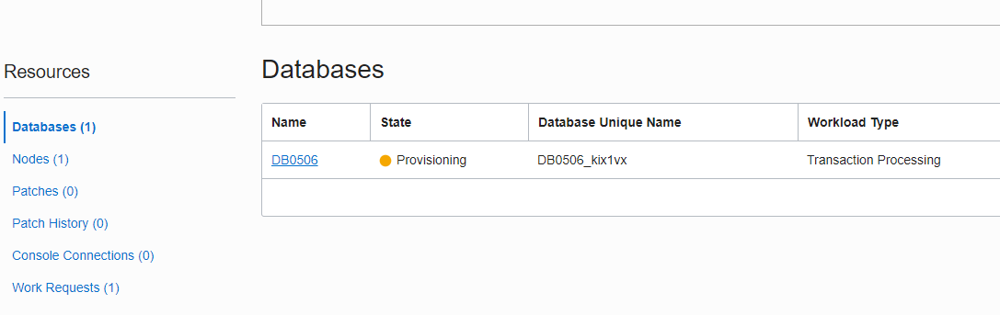
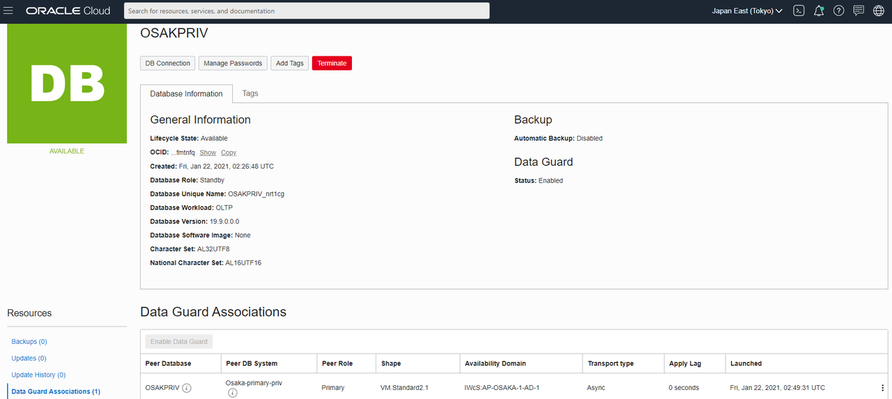

# Set Data Guard Association

## Introduction
Setting up Data Guard for Database Cloud Service is a simple process called association.  We enable Data Guard in the primary database and the standby database is automatically created.

Estimated lab time:  10 minutes

### Objective
- Enable Data Guard for Oracle Database Cloud Service

### Prerequisite

- VCN for both the primary and standby regions are created

- Database Cloud Service Enterprise Edition or higher edition is created

- DRGs and RPCs are created

- RPC connection is peered

- Route Rules and Security Lists are configured for secure communication between primary and standby VCNs

## Task 1: Enable Data Guard by Association
1. Navigate to your Database Cloud Service in your primary region.

  

2. Go to your database details page.

3. Select your database under resources.

  

4. Select Data Guard Associations.

5. Click Enable Data Guard for your database.

  

Data Guard is defaulted to Maximum Performance Protection Mode which means the redo log is transmitted to the standby immediately and does not wait for the standby to complete the redo apply.  It is also set to Async Transport type.  Maximum Protection mode is not available at this time.

6. Enter a name for your peer standby database.

7. Enter the region of your standby.

8. Enter the availability domain you want to install the standby.  Some regions only have one availability domain.

9. Select the shape or size of the standby database.

10. Select your standby VCN.

11. Select the subnet in the standby VCN that will host your standby database.

12. Enter a hostname prefix.

13. Enter the password for the standby database.  It should be the same as the primary database.

14. Click Enable Data Guard.

  

Because the networking and remote peering connection is configured, the standby database and Data Guard will automatically be created.

## Task 2: Check your standby region.  
1. Ensure the standby database is provisioning.

  

2. Check the Data Guard association.  You will see the primary being associated.

  

Completed. The standby database is now ready for a failover or a switchover.

You may now [proceed to the next lab](#next).

## Acknowledgements
* **Author** - Milton Wan, Database Product Management, Dec 2020
* **Last Updated By/Date** - Milton Wan, Jun 2021
