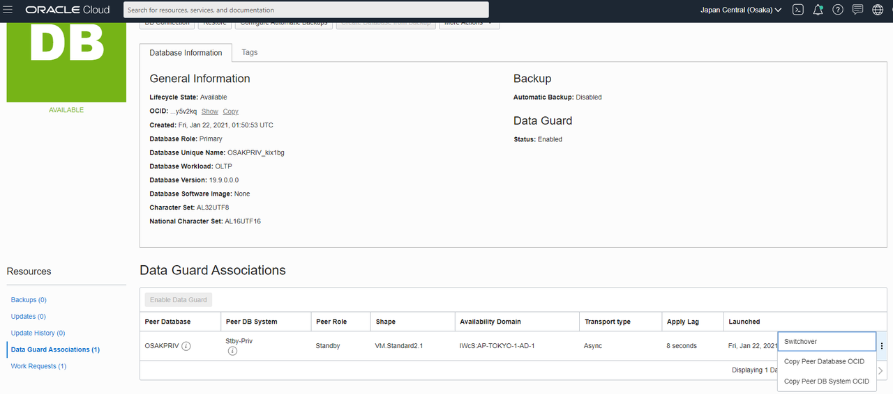
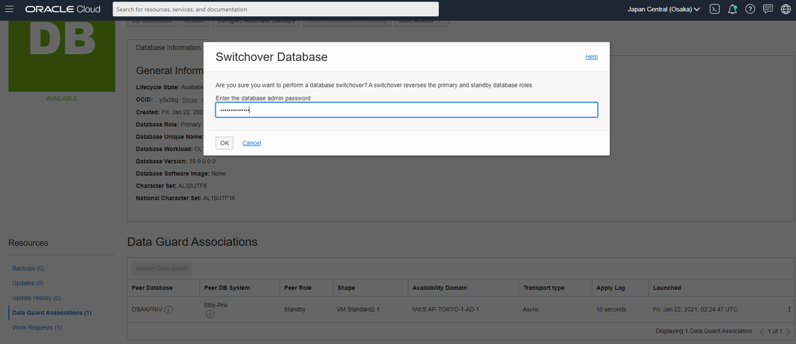
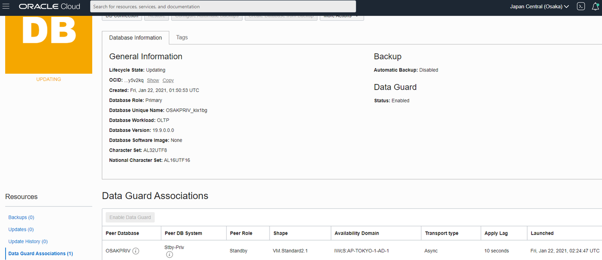
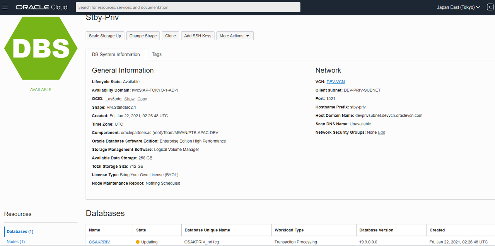

# Test the Data Guard Switchover

## Introduction
We will test the Data Guard configuration across regions by switching the roles of the primary and standby database.  Switchover can be used to perform planned maintenance of the primary database.

Estimated lab time:  5 minutes
Estimated wait time: 15 minutes for Switchover

### Objective
- Perform a switchover

## Task 1: Test Switchover
1. Navigate to the Data Guard Associations of the primary database.

2. Click the 3-dot action menu on right and select Switchover

   The process will begin to make the standby database the primary.
    

3. Enter the database password for sys when prompted.

    

    

    

In a few minutes the roles will be changed and the standby database will become the primary.  The switchover use case can be used for planned maintenance operations in the primary region.

End of workshop.

## Acknowledgements
* **Author** - Milton Wan, Database Product Management, Dec 2020
* **Last Updated By/Date** - Milton Wan, Jun 2021
