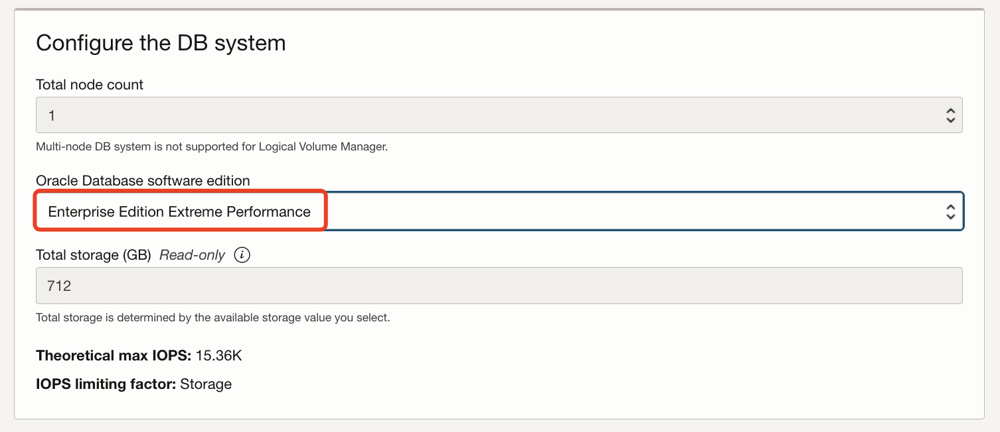
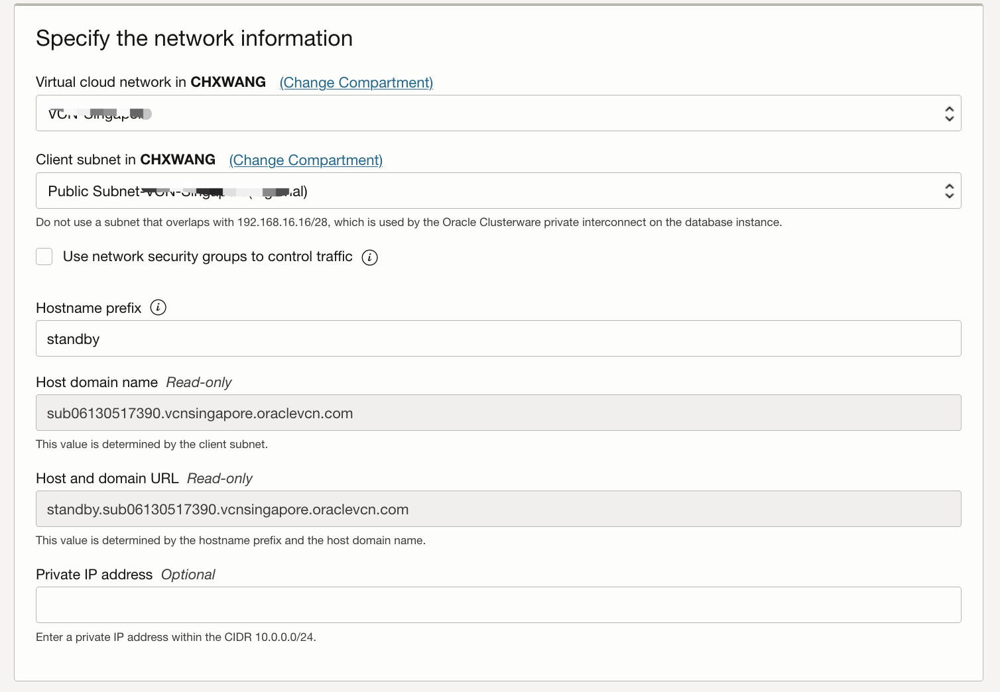
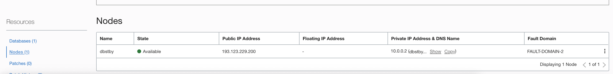

# Provision DBCS on OCI

## Introduction
In this lab you will provision a Database Cloud Service on OCI to act as the standby database in the cloud. You will create a different VCN in different region from the on-premise database, and provision a DBCS in that VCN. 

Estimated Lab Time: 30 minutes

### Objectives

-   Create the VCN
-   Create the DB system

### Prerequisites

This lab assumes you have already completed the following:
- An Oracle Free Tier, Always Free, Paid or LiveLabs Cloud Account
- Create a SSH Keys pair

## Task 1: Create the VCN

1. Click the **Navigation Menu** in the upper left, navigate to **Networking**, and select **Virtual Cloud Networks**.
   
	 

2. Click **Start VCN Wizard**.

    

3. Select **VCN with Internet Connectivity**, and then click **Start VNC Wizard**. 

    

4. Enter a unique VCN Name and accept the following default value:

    - VCN CIDR BLOCK: 10.0.0.0/16
    - Public Subnet CIDR Block: 10.0.0.0/24
    - Private Subnet CIDR Block: 10.0.1.0/24

    

5. Click **Next**, review the VCN and click **Create**. After success created, click **Close**.

6. In the VCN detail page, click **Security Lists** under Resources, then click the **Default Security List** link.

    

7. Click **Add Ingress Rules**.

    

8. Add an Ingress Rule to allow TCP traffic for port 1521, 

    

## Task 2: Create the DB System

1. Open the navigation menu. Under **Oracle Database**, click **Oracle Base Database(VM, BM)**.

2. Click **Create DB System**.

3. On the **Create DB System** page, provide the basic information for the DB system:

    - **Select a compartment:** use the compartment which assign to you.
    - **Name your DB system:** enter a unique name of your DB system
    - **Select an availability domain:** The **availability domain** in which the DB system resides.
    - **Select a shape type:** Choose **Virtual Machine**
    - **Select a shape:** change the Shape to **VM.Stanard.E4.Flex**, 1core OCPU, 16GB Memory.

    

   

4. In the **Configure Storage** section, change the storage to the following(we choose the lowest resource because it's a lab):

    - Choose storage management software to **Logical Volume Manager**.
    - Configure storage performance to **Balanced**.
    
    
    
4. In the **Configure the DB system** section, specify the following:

    - **Total node count:** 1
    - **Oracle Database software edition:** choose **Enterprise Extreme Performance**.
    

    

​    

5. Upload the SSH Keys and Choose license type as **Bring Your Own License(BYOL)**

    

5. Specify the network information, Choose the VCN, public subnet you prepare in previous. Input the **Hostname prefix**.

    

5. Click **Next**.

5. In the **Database Information** page, Specify the following:

    - **Database name:** **ORCL**, same as the on premise database

    - Click **Change Database Image**

       

    - Turn on the **Display all available versions**, select the Database version: 19.x.0.0, same version as the on premise database

       

    - **PDB name:** orclpdb

    - Enter a strong password

    
    
    - Accept other default values, Click the **Create DB System**.
    
6. Wait about 20 minutes. Then the Database is ready.

   

11. Write down your Database Unique Name ie: `ORCL_nrt1d4`.

8. Click the **Nodes**,  write down the public ip address of the database host node and the Host Domain Name.

   

You have completed the Database Cloud provisioning steps.  It will be used as your standby database.

You may proceed to the next lab.

## Acknowledgements
* **Author** - Minqiao Wang, Oracle China
* **Last Updated By/Date** - Minqiao Wang, Mar. 2023

