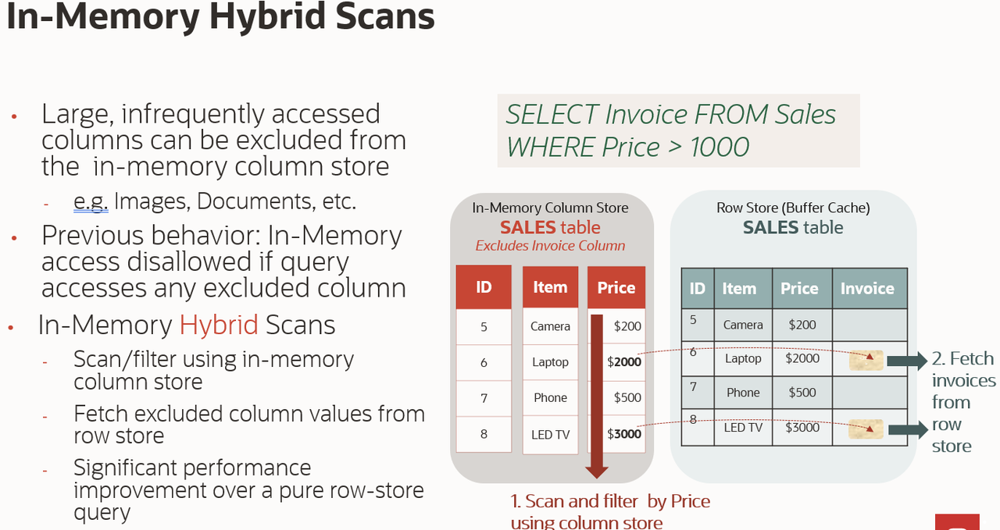
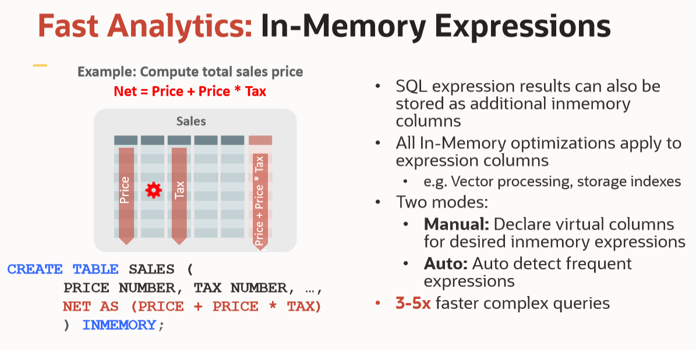

# In-Memory Queries

## Introduction


### Lab Preview

Watch a preview videos of In-Memory Column Store features.

#### Part 1
[](youtube:P6GZaykqHwI)

#### Part 2
[](youtube:Du-DNEU_0Y4)

## Task 1: Querying the In-Memory Column Store

Now that you’ve gotten familiar with the IM column store let’s look at the benefits of using it. You will execute a series of queries against the large fact table LINEORDER, in both the buffer cache and the IM column store, to demonstrate the different ways the IM column store can improve query performance above and beyond the basic performance benefits of accessing data in memory only.

1.  Let's switch to the Part2 folder and log back in to the PDB.
    ````
    <copy>
    cd /home/oracle/labs/inmemory/Part2
    sqlplus ssb/Ora_DB4U@localhost:1521/orclpdb
    </copy>
    ````

2.  Let's begin with a simple query:  *What is the most expensive order we have received to date?*  There are no indexes or views setup for this.  So the execution plan will be to do a full table scan on the LINEORDER table.  Note the elapsed time.

    ````
    <copy>
    set pages 9999
    set lines 100
    set timing on

    SELECT
    max(lo_ordtotalprice) most_expensive_order,
    sum(lo_quantity) total_items
    FROM lineorder;
    set timing off
    select * from table(dbms_xplan.display_cursor());
    @../imstats.sql
    </copy>
    ````

    The execution plan shows that we performed a TABLE ACCESS INMEMORY FULL of the LINEORDER table.
    ````
       MOST_EXPENSIVE_ORDER TOTAL_ITEMS
    -------------------- -----------
               55279127   612025456

    Elapsed: 00:00:00.06
    SQL>
    PLAN_TABLE_OUTPUT
    --------------------------------------------------------------------------------------
    SQL_ID  3pq3q3v6x27p9, child number 0
    -------------------------------------
    SELECT max(lo_ordtotalprice) most_expensive_order, sum(lo_quantity)
    total_items FROM lineorder

    Plan hash value: 2267213921

    -----------------------------------------------------------------------------------------
    | Id  | Operation                   | Name      | Rows  | Bytes | Cost (%CPU)| Time     |
    -----------------------------------------------------------------------------------------
    |   0 | SELECT STATEMENT            |           |       |       |  2045 (100)|          |
    |   1 |  SORT AGGREGATE             |           |     1 |     9 |            |          |
    |   2 |   TABLE ACCESS INMEMORY FULL| LINEORDER |    23M|   205M|  2045  (12)| 00:00:01 |
    -----------------------------------------------------------------------------------------

    NAME                                                              VALUE
    -------------------------------------------------- --------------------
    CPU used by this session                                             22
    IM scan CUs columns accessed                                         88
    IM scan CUs columns theoretical max                                 748
    IM scan CUs memcompress for query low                                44
    IM scan rows                                                   23996604
    IM scan rows projected                                               44
    session logical reads                                            179354
    session logical reads - IM                                       178671
    session pga memory                                             12779928
    table scans (IM)                                                      1
    ````


    "IM scan CUs memcompress for query low" is the number of IMCUs accessed for each column in the table.

    The above query access 2 columns (lo\_ordtotalprice and lo\_quantity ) and no where condition. This is indicated by "IM scan CUs columns accessed" = 88. This is because we accessed 2 columns in the query. (2 *44 =88)

    If the query had a where clause on any other columns, then those CUs would need to accessed  and value of  "IM scan CUs columns accessed" will be a multiple of "IM scan CUs memcompress for query low" and number of distinct columns accessed.

    For a quick referance to some important IM events, check out this [blog](https://blogs.oracle.com/in-memory/popular-statistics-with-database-in-memory).

    To execute the same query against the buffer cache you will need to disable the IM column store either through a hint called NO\_INMEMORY or at session level parameter INMEMORY\_QUERY as in the syntax below.


    ALTER SESSION SET INMEMORY_QUERY= DISABLE|ENABLE;


  3. Rerun the query with NO\_INMEMORY hint and note the new elapsed time and plan.

    ````
    <copy>
    connect ssb/Ora_DB4U@localhost:1521/orclpdb
    set timing on
    select /*+ NO_INMEMORY */ max(lo_ordtotalprice) mostexpensiveorder, sum(lo_quantity) totalitems from LINEORDER;
    set timing off
    select * from table(dbms_xplan.display_cursor());
    @../imstats.sql
    </copy>
    ````
    As you can see this run took longer and the CPU cost of running the query is significantly high.

    The IM column store only has to scan two columns - lo\_ordtotalprice and lo\_quantity - while the row store has to scan all of the columns in each of the rows until it reaches the lo\_ordtotalprice and lo\_quantity columns. The IM column store also benefits from the fact that the data is compressed so the volume of data scanned is much less.  Finally, the column format requires no additional manipulation for SIMD vector processing (Single Instruction processing Multiple Data values). Instead of evaluating each entry in the column one at a time, SIMD vector processing allows a set of column values to be evaluated together in a single CPU instruction.

    In order to confirm that the IM column store was used, we need to examine the session level statistics. Notice that in the INMEMORY run several IM statistics show up (for this lab we have only displayed some key statistics – there are lots more!). The only one we are really interested in now is the "IM scan CUs columns accessed" which highlights IM optimization to further improve performance.

## Task 2: In-Memory Storage Index
  In the [*Introduction and Overview*](?lab=introduction-overview#3.In-MemoryStorageIndexes), we saw how min-max and dictionary based pruning could work as Index. We will now query the table and filter based on a where condition.

1.  Let's look for a specific order in the LINEORDER table based on the order key.  Typically, a full table scan is not an efficient execution plan when looking for a specific entry in a table.  

    ````
    <copy>
    set timing on

    select  lo_orderkey, lo_custkey, lo_revenue
    from    LINEORDER
    where   lo_orderkey = 5000000;

    set timing off

    select * from table(dbms_xplan.display_cursor());

    @../imstats.sql
    </copy>
    ````


2.  Do you think indexing lo\_orderkey would provide the same performance as the IM column store? For this lab, there is an invisible index already created on the lo\_orderkey column on the LINEORDER table. By using the parameter OPTIMIZER\_USE\_INVISIBLE_INDEXES we can compare the performance of the IM column store and the index. Let's see how well the index performs.  

    ````
    <copy>
    alter session set optimizer_use_invisible_indexes=true;

    set timing on

    Select  /* With index */ lo_orderkey, lo_custkey, lo_revenue
    From    LINEORDER
    Where   lo_orderkey = 5000000;

    set timing off

    select * from table(dbms_xplan.display_cursor());

    @../imstats.sql
    </copy>
    ````
    We observe that when the index is available on the filter column of the query, the optimizer can choose INDEX RANGE SCAN over INMEMORY FULL TABLE SCAN. The CPU cost for Index scan in this case is also lower than InMemory scan. *In a POC, it is possible not to see significant improvement from InMemory for the queries that are well tuned and indexed.*


3.  Analytical queries have more than one equality WHERE clause predicate. What happens when there are multiple single column predicates on a table? Traditionally you would create a multi-column index. Can InMemory  compete with that?  

    Let’s change our query to look for a specific line item in an order and monitor the session statistics:

    To execute the query against the IM column store type.  

    ````
    <copy>
    set timing on

    select
    lo_orderkey, lo_custkey, lo_revenue
    from LINEORDER where
    lo_custkey = 5641
    and lo_shipmode = 'XXX AIR'
    and lo_orderpriority = '5-LOW';

    set timing off

    select * from table(dbms_xplan.display_cursor());

    @../imstats.sql
    </copy>
    ````
    You can see that the *TABLE ACCESS INMEMORY FULL*  is used even through there is an INDEX on lo_orderkey. In fact, INMEMORY may reduce the need to have multiple indexes on the Database.
    *This not only speeds up analytic query with fewer indexes, but also improve DML and load performance due to fewer indexes.*

## Task 3: In-Memory Hybrid Scans
An In-Memory hybrid scan accesses a table in the IM column store when not all columns are populated.

  
Before Oracle Database 21c, if a query referenced any column with the NO INMEMORY setting, then the query accessed all data from the row store. Therefore, the table scan could not take advantage of columnar formats, predicate pushdown, and other In-Memory features. Starting in Oracle Database 21c, queries that reference both INMEMORY and NO INMEMORY columns can access columnar data.

In Lab 1, we saw that we can load only required columns of a table to conserver In-Memory pool.
With Hybrid Scans, we increase the probability of a query running In-Memory even if some of the columns are not In-Memory. This feature enables optimal use of memory resources to boost performance of queries.

1. Alter table to remove a column from In-Memory.

      ````
      <copy>
      ALTER TABLE lineorder  INMEMORY NO INMEMORY (lo_revenue);
      </copy>
      ````
2. Verify the In-Memory parameters at column level.
      ````
      <copy>
      set pages 11408506880
      col table_name format a10
      col column_name format a20
      col inmemory_compression format a20
      SELECT TABLE_NAME, COLUMN_NAME, INMEMORY_COMPRESSION
      FROM V$IM_COLUMN_LEVEL
      WHERE TABLE_NAME = 'LINEORDER'; </copy>

      TABLE_NAME COLUMN_NAME          INMEMORY_COMPRESSION
      ---------- -------------------- --------------------
      LINEORDER  LO_ORDERKEY          DEFAULT
      LINEORDER  LO_LINENUMBER        DEFAULT
      LINEORDER  LO_CUSTKEY           DEFAULT
      LINEORDER  LO_PARTKEY           DEFAULT
      LINEORDER  LO_SUPPKEY           DEFAULT
      LINEORDER  LO_ORDERDATE         DEFAULT
      LINEORDER  LO_ORDERPRIORITY     DEFAULT
      LINEORDER  LO_SHIPPRIORITY      DEFAULT
      LINEORDER  LO_QUANTITY          DEFAULT
      LINEORDER  LO_EXTENDEDPRICE     DEFAULT
      LINEORDER  LO_ORDTOTALPRICE     DEFAULT
      LINEORDER  LO_DISCOUNT          DEFAULT
      LINEORDER  LO_REVENUE           NO INMEMORY
      LINEORDER  LO_SUPPLYCOST        DEFAULT
      LINEORDER  LO_TAX               DEFAULT
      LINEORDER  LO_COMMITDATE        DEFAULT
      LINEORDER  LO_SHIPMODE          DEFAULT

      ````
3. Rerun the previous query and observe the plan. execution plan shows that the optimizer chose an In-Memory hybrid scan.
      ````
      <copy>
      set linesize 200
      set timing on

      select
      lo_orderkey, lo_custkey, lo_revenue
      from LINEORDER where
      lo_custkey = 5641
      and lo_shipmode = 'XXX AIR'
      and lo_orderpriority = '5-LOW';

      set timing off

      select * from table(dbms_xplan.display_cursor());
      </copy>

      Plan hash value: 4017770458
      -------------------------------------------------------------------------------------------------
      | Id  | Operation                           | Name      | Rows  | Bytes | Cost (%CPU)| Time     |
      -------------------------------------------------------------------------------------------------
      |   0 | SELECT STATEMENT                    |           |       |       | 48992 (100)|          |
      |*  1 |  TABLE ACCESS INMEMORYFULL (HYBRID)| LINEORDER |     1 |    44 | 48992   (1)| 00:00:02 |
      -------------------------------------------------------------------------------------------------

      Predicate Information (identified by operation id):
      ---------------------------------------------------
         1 - filter(("LO_CUSTKEY"=5641 AND "LO_SHIPMODE"='XXX AIR' AND
                  "LO_ORDERPRIORITY"='5-LOW'))

      ````


## Task 4: In-Memory Joins and In-Memory Aggregation

Up until now we have been focused on queries that scan only one table, the LINEORDER table. Let’s broaden the scope of our investigation to include joins and parallel execution. This section executes a series of queries that begin with a single join between the  fact table, LINEORDER, and a dimension table and works up to a 5 table join. The queries will be executed in both the buffer cache and the column store, to demonstrate the different ways the column store can improve query performance above and beyond the basic performance benefits of scanning data in a columnar format.

1. Reconnect to SSB user to clear out session level stats

      ````
      <copy>

      connect ssb/Ora_DB4U@localhost:1521/orclpdb
      </copy>    
      ````


2. Join the LINEORDER and DATE_DIM tables in a "What If" style query that calculates the amount of revenue increase that would have resulted from eliminating certain company-wide discounts in a given percentage range for products shipped on a given day (Christmas eve 1996).  In the first one, execute it against the IM column store.  

      ````
      <copy>
         set timing on
         set pages 9999
         set lines 100

         SELECT SUM(lo_extendedprice * lo_discount) revenue
         FROM   lineorder l,
         date_dim d
         WHERE  l.lo_orderdate = d.d_datekey
         AND    l.lo_discount BETWEEN 2 AND 3
         AND    l.lo_quantity < 24
         AND    d.d_date='December 24, 1996';

         set timing off

         select * from table(dbms_xplan.display_cursor());

         @../imstats.sql
         </copy>
      ````


   The IM column store has no problem executing a query with a join because it is able to take advantage of Bloom Filters.  It’s easy to identify Bloom filters in the execution plan. They will appear in two places, at creation time and again when it is applied. The Bloon filter plans start with <b> :BF00X </b> plan above. You can also see what join condition was used to build the Bloom filter by looking at the predicate information under the plan.

3. Let's run against the buffer cache now and observer that it is a lot slower.  

      ````
      <copy>
      connect ssb/Ora_DB4U@localhost:1521/orclpdb
      set timing on

      select /*+ NO_INMEMORY */
      sum(lo_extendedprice * lo_discount) revenue
      from
      LINEORDER l,
      DATE_DIM d
      where
      l.lo_orderdate = d.d_datekey
      and l.lo_discount between 2 and 3
      and l.lo_quantity < 24
      and d.d_date='December 24, 1996';

      set timing off

      select * from table(dbms_xplan.display_cursor());

      @../imstats.sql
      </copy>
      ````


4. Let’s try a more complex query that encompasses three joins and an aggregation to our query. This time our query will compare the revenue for different product classes, from suppliers in a certain region for the year 1997. This query returns more data than the others we have looked at so far so we will use parallel execution to speed up the elapsed times so we don’t need to wait too long for the results.  

      ````
      <copy>
      set timing on

      SELECT d.d_year, p.p_brand1,SUM(lo_revenue) rev
      FROM   lineorder l,
         date_dim d,
         part p,
         supplier s
      WHERE  l.lo_orderdate = d.d_datekey
      AND    l.lo_partkey = p.p_partkey
      AND    l.lo_suppkey = s.s_suppkey
      AND    p.p_category = 'MFGR#12'
      AND    s.s_region   = 'AMERICA'
      AND    d.d_year     = 1997
      GROUP  BY d.d_year,p.p_brand1;

      set timing off

      select * from table(dbms_xplan.display_cursor());

      @../imstats.sql
      </copy>
      ````

   The IM column store continues to out-perform the buffer cache query but what is more interesting is the execution plan for this query:

   In this case, we noted that three join filters have been created <b>(:KV000X)</b> and applied to the scan on the LINEORDER table, one for the join to DATE_DIM table, one for the join to the PART table, and one for the join to the SUPPLIER table. How is Oracle able to apply three join filters when the join order would imply that the LINEORDER is accessed before the SUPPLER table?

   This is where Oracle’s 30 plus years of database innovation kicks in. By embedding the column store into Oracle Database we can take advantage of all of the optimizations that have been added to the database. In this case, the Optimizer has switched from its typically left deep tree to create a right deep tree using an optimization called ‘swap\_join\_inputs’.

## Task 5: In-Memory Join Group

   A new In-Memory feature called Join Groups was introduced with the Database In-Memory Option in Oracle Database 12.2.  Join Groups can be created to significantly speed up hash join performance in an In-Memory execution plan.  Creating a Join Group involves identifying up-front the set of join key columns (across any number of tables) likely to be joined with by subsequent queries.  
    For the above example, we can create a In-Memory Join Group on the join column l.lo\_orderdate = d.d\_datekey.
    If you observe a HASH JOIN plan for inmemory, there are 2 operations. One is *JOIN FILTER CREATE* for  Bloom filter. The other is *JOIN FILTER USE* to consume it. Pre-creating the *Join Group* increases the performance of queries by using the prebuilt Join groups.

1.  Create a Join Group

      ````
      <copy>
      CREATE INMEMORY JOIN GROUP  JoinGroup (lineorder(lo_orderdate),date_dim (d_datekey));
      </copy>
      ````

  This will improve query performance further and reduce CPU cycles to to join tables.

## Task 6: In-Memory Expressions



   In-Memory Expressions (IM expressions) provide the ability to materialize simple deterministic expressions and store them in the In-Memory column store so they only need to be calculated once, not each time they are accessed. They are also treated like any other column in the IM column store so the database can scan and filter those columns and take advantage of all Database In-Memory query optimizations like SIMD vector processing and IM storage indexes.

   There are actually two types of IM expressions:
    <b>Automatically detected IM expression </b> which is stored as a hidden virtual column when captured.
    <b> User-defined expressions on In-Memory virtual column </b> (IM virtual column) that meets the requirements of an IM expression.
    The detected IM expressions are captured in the new Expression Statistics Store (ESS). IM expressions are fully documented in the In-Memory Guide.


 1. Run a select statement with an expression without enabling expression optimization.
      ````
         <copy>
         set timing on
         SELECT lo_shipmode, SUM(lo_ordtotalprice),
         SUM(lo_ordtotalprice - (lo_ordtotalprice*(lo_discount/100)) + lo_tax) discount_price
         FROM LINEORDER
         GROUP BY lo_shipmode ORDER BY lo_shipmode;
         set timing off

         select * from table(dbms_xplan.display_cursor());

         @../imstats.sql
         </copy>
         ````
   When the query runs in memory with Expression Optimization, a new statistic  <b> IM Scan EU </b> is used.

   Notice the following expression in the query:

      ````
      (lo_ordtotalprice - (lo_ordtotalprice*(lo_discount/100)) + lo_tax)

      ````

This expression is simply an arithmetic expression to find the total price charged with discount and tax included, and is deterministic. We will create a virtual column and re-populate the LINEORDER table to see what difference it makes.

 2. To populate virtual columns in the IM column store we need to ensure that the initialization parameter INMEMORY\_VIRTUAL\_COLUMNS is set to ENABLE.

  The default is MANUAL which means that you must explicitly set the virtual columns as INMEMORY enabled. Set it to enable at table level.
      ````
      SQL> <copy> show parameter INMEMORY_VIRTUAL_COLUMNS
            alter system set inmemory_virtual_columns=enable;
            show parameter INMEMORY_VIRTUAL_COLUMNS </copy>

      NAME                                 TYPE        VALUE
      ------------------------------------ ----------- ------------------------------
      inmemory_virtual_columns             string      MANUAL

      SQL> alter system set inmemory_virtual_columns=enable;
      System altered.
      ````
3. Next, we will add a virtual column to the LINEORDER table for the expression we identified above and re-populate the table:

      ````
      <copy>
      alter table lineorder no inmemory;
      alter table lineorder add v1 as (lo_ordtotalprice - (lo_ordtotalprice*(lo_discount/100)) + lo_tax);
      alter table lineorder inmemory ;
      select /*+ noparallel */ count(*) from lineorder ;
      </copy>
      ````

4. Now let's re-run our query and see if there is any difference:
      ````
      <copy>
      set timing on
      SELECT lo_shipmode, SUM(lo_ordtotalprice),
      SUM(lo_ordtotalprice - (lo_ordtotalprice*(lo_discount/100)) + lo_tax) discount_price
      FROM LINEORDER
      GROUP BY lo_shipmode
      ORDER BY lo_shipmode;
      set timing off

      select * from table(dbms_xplan.display_cursor());

      @../imstats.sql
      </copy>
      ````
Notice the statistics that start with "IM scan EU ...". IM expressions are stored in the IM column store in In-Memory Expression Units (IMEUs) rather than IMCUs, and the statistics for accessing IM expressions all show "EU" for "Expression Unit".

5. You can also confirm that the virtual column is loaded looking up V$IM\_IMECOL\_CU view.

      ````
      <copy>
      select o.owner,o.object_name,e.column_name,e.sql_expression,count( distinct e.imcu_addr) num_imeu
      from dba_objects o,V$IM_IMECOL_CU e where
      o.object_id=e.objd and o.owner='SSB' and o.object_name='LINEORDER'
      group by  o.owner,o.object_name,e.column_name,e.sql_expression;
      </copy>
      ````

This simple example shows that even relatively simple expressions can be computationally expensive, and the more frequently they are executed the more savings in CPU resources IM expressions will provide.

   <b>Automatic IM expressions :</b>
  Optimizer tracks expressions and stores them in a repository called the Expression Statistics Store (ESS). Along with the expression and other information, the number of times the expression was evaluated and the cost of evaluating the expression are tracked. This is exposed in the ALL|DBA|USER\_EXPRESSION\_STATISTICS view and Database In-Memory uses this information to determine the 20 most frequently accessed expressions in either the past 24 hours (i.e. LATEST snapshot) or since database creation (i.e. CUMULATIVE snapshot). The following is an example for the LINEORDER table in my test system for the LATEST snapshot.

  6. In order to populate automatically detected IM expressions the INMEMORY_EXPRESSIONS_USAGE parameter must be set to either ENABLE (the default) or DYNAMIC_ONLY.
      ````
      <copy> show parameter INMEMORY_EXPRESSIONS_USAGE </copy>

      NAME                                 TYPE        VALUE
      ------------------------------------ ----------- ------------------------------
      inmemory_expressions_usage           string      ENABLE
      ````

7.   Let us restore the lineorder table and drop the virtual column.
      ````
      <copy>
      alter table lineorder no inmemory;
      ALTER TABLE lineorder DROP COLUMN v1;
      alter table lineorder inmemory ;
      select /*+ noparallel */ count(*) from lineorder ;
      </copy>
      ````

Since 18c, there are 2 ways to capture the expressions automatically. They are either during a window or current.
For the window function, we use dbms\_inmemory\_admin.ime\_open\_capture_window() to start.
dbms\_inmemory\_admin.ime\_close\_capture\_window() to stop capturing the inmemory expression and run
dbms\_inmemory\_admin.ime\_capture\_expressions('WINDOW') to automatically generate automatic In-Memory expressions.
The other alternative is to run dbms\_inmemory\_admin.ime\_capture\_expressions('CURRENT') which will capture the expressions from the shared pool.

8. In our example, we will capture the sqls from shared pool using the "CURRENT" expression.

      ````
      <copy>
      set timing on
      set autotrace traceonly
      SELECT lo_shipmode, SUM(lo_ordtotalprice),
      SUM(lo_ordtotalprice - (lo_ordtotalprice*(lo_discount/100)) + lo_tax) discount_price
      FROM LINEORDER
      GROUP BY lo_shipmode
      ORDER BY lo_shipmode;
      set timing off
      set autotrace off

      @../imstats.sql
      </copy>
      ````
9.  Now capture the sql expressions from shared pool.
      ````
      <copy>
      exec dbms_inmemory_admin.ime_capture_expressions('CURRENT');
      </copy>
      ````
10. Now check if the expression is captured.
      ````
      <copy>COL OWNER FORMAT a6
      COL TABLE_NAME FORMAT a9
      COL COLUMN_NAME FORMAT a25
      SET LONG 50
      SET LINESIZE 150

      SELECT OWNER, TABLE_NAME, COLUMN_NAME, SQL_EXPRESSION
      FROM DBA_IM_EXPRESSIONS;</copy>

      ````

11. Now rerun the query and verify you see "IM scan EU ..." instead on only "IM scan CU ..." statistics.

      ````
      <copy>set timing on
      set autotrace traceonly
      SELECT lo_shipmode, SUM(lo_ordtotalprice),
      SUM(lo_ordtotalprice - (lo_ordtotalprice*(lo_discount/100)) + lo_tax) discount_price
      FROM LINEORDER
      GROUP BY lo_shipmode
      ORDER BY lo_shipmode;
      set timing off
      set autotrace off

      @../imstats.sql
      </copy>
      ````

   How to tell if the IM expression has actually been populated? There is another view, V$IM\_IMECOL\_CU that shows the columns populated and number of IMEUs they occupy.
   To drop expressions, DBMS\_INMEMORY\_ADMIN.IME\_DROP\_ALL\_EXPRESSIONS procedure drops all SYS\_IME expression virtual columns in the database. The DBMS\_INMEMORY.IME\_DROP\_EXPRESSIONS procedure drops a specified set of SYS\_IME virtual columns from a table.

## Task 7: In-Memory Optimized Arithmetic

Using the native binary representation of numbers rather than the full precision Number format means that certain aggregation and arithmetic operations are tens of times faster than in previous version of In-Memory as we are
able to take advantage of the SIMD Vector processing units on CPUs


In-Memory Optimized Arithmetic are available in 18c and encodes the NUMBER data type as a fixed-width native integer scaled by a common exponent. This enables faster calculations using SIMD hardware. The Oracle Database NUMBER data type has high fidelity and precision. However, NUMBER can incur a significant performance overhead for queries because arithmetic operations cannot be performed natively in hardware. The In-Memory optimized
number format enables native calculations in hardware for segments compressed with the QUERY LOW compression option.

Not all row sources in the query processing engine have support for the In-Memory optimized number format so the IM column store stores both the traditional Oracle Database NUMBER data type and the In-Memory optimized number type. This dual storage increases the space overhead, sometimes up to 15%.

In-Memory Optimized Arithmetic is controlled by the initialization parameter INMEMORY\_OPTIMIZED\_ARITHMETIC. The parameter values are DISABLE (the default) or ENABLE. When set to ENABLE, all NUMBER columns for tables that use FOR QUERY LOW compression are encoded with the In-Memory optimized format when populated (in addition to the traditional Oracle Database NUMBER data type). Switching from ENABLE to DISABLE does not immediately drop the optimized number encoding for existing IMCUs. Instead, that happens when the IM column store repopulates affected IMCUs.


1. Verify that the parameter INMEMORY\_OPTIMIZED\_ARITHMETIC is disabled and run the query below.

      ````
      <copy>
      show parameter INMEMORY_OPTIMIZED_ARITHMETIC
      set timing on
      select /*+ no_result_cache */sum(LO_TAX  ), sum( LO_ORDTOTALPRICE ), sum( LO_REVENUE  ), avg(lo_tax) , avg ( LO_ORDTOTALPRICE) from lineorder;
      set timing off
      @../imstats.sql
      </copy>

      SUM(LO_TAX) SUM(LO_ORDTOTALPRICE) SUM(LO_REVENUE) AVG(LO_TAX)
      ----------- --------------------- --------------- -----------
      AVG(LO_ORDTOTALPRICE)
      ---------------------
         96000368            4.5337E+14      8.7191E+13  4.00058142
               18893047.2


      Elapsed: 00:00:00.92

      ````

Note the time time the query took with INMEMORY\_OPTIMIZED\_ARITHMETIC disable. 

2. Now let us enable and rerun the query.

      ````
      SQL> <copy> show parameter INMEMORY_OPTIMIZED_ARITHMETIC
            alter system set INMEMORY_OPTIMIZED_ARITHMETIC=enable;
            show parameter INMEMORY_OPTIMIZED_ARITHMETIC </copy>

            NAME                                 TYPE        VALUE
            ------------------------------------ ----------- ------------------------------
            inmemory_optimized_arithmetic        string      ENABLE

            SQL> alter system set INMEMORY_OPTIMIZED_ARITHMETIC=enable;
            System altered.
      ````
3. Now repopulate Lineorder table.
      ````
      <copy>
      alter table lineorder no inmemory;
      alter table lineorder inmemory ;
      select /*+ noparallel */ count(*) from lineorder ;

      </copy>
      ````
4. Verify that the table is completely loaded into memory before running the the query.

      ````
      <copy>
      col object_name format a20
      SELECT a.OBJECT_NAME, b.INMEMORY_PRIORITY, b.POPULATE_STATUS, count(1) IMCUs,sum(num_rows),
      TO_CHAR(c.CREATETIME, 'MM/DD/YYYY HH24:MI:SS.FF2') START_POP,
      TO_CHAR(MAX(d.TIMESTAMP),'MM/DD/YYYY HH24:MI:SS.FF2') FINISH_POP
      FROM DBA_OBJECTS a, V$IM_SEGMENTS b,
      V$IM_SEGMENTS_DETAIL c, V$IM_HEADER d
      WHERE
      a.OBJECT_NAME = b.SEGMENT_NAME
      AND a.OBJECT_TYPE = 'TABLE'
      AND a.OBJECT_ID = c.BASEOBJ
      AND c.DATAOBJ = d.OBJD
      GROUP BY a.OBJECT_NAME, b.INMEMORY_PRIORITY, b.POPULATE_STATUS, c.CREATETIME
      ORDER BY FINISH_POP;
      /
      </copy>
      ````
5.  At this point, we have set INMEMORY\_OPTIMIZED\_ARITHMETIC=enable, and triggered the repopulation of Lineorder table and verified that the loading is complete. Once you see that LINEORDER table status is complete run the query below.
      ````
      <copy>
      set timing on
      select /*+ no_result_cache */sum(LO_TAX  ), sum( LO_ORDTOTALPRICE ), sum( LO_REVENUE  ), avg(lo_tax) , avg ( LO_ORDTOTALPRICE) from lineorder;
      set timing off
      @../imstats.sql
      </copy>
      SUM(LO_TAX) SUM(LO_ORDTOTALPRICE) SUM(LO_REVENUE) AVG(LO_TAX)
      ----------- --------------------- --------------- -----------
      AVG(LO_ORDTOTALPRICE)
      ---------------------
         96000368            4.5337E+14      8.7191E+13  4.00058142
               18893047.2

      Elapsed: 00:00:00.12
      ````

In our case the query timing reduced from 0.92 to 0.12 seconds. Although its 7 times faster(.92/.12 = 7), the dataset in this case is small and since data is already in memory, computation is fast to begin with. While for larger tables, the performance benefit is significant, the table will need to be loaded in *COMPRESS QUERY LOW* mode which will occupy more memory then COMPRESS QUERY HIGH.
While InMemory Arithemtic is a good feature, since it can only run on "QUERY LOW" , it would take up much more memory. A cost/benefit analysis should be considered before enabling this feature. It depends on how many queries have aggregation/aggregation groupings and amount of memory in the system.


## Conclusion

In this lab you had an opportunity to try out Oracle’s In-Memory performance claims with queries that run against a table with over 23 million rows (i.e. LINEORDER), which resides in both the IM column store and the buffer cache. From a very simple aggregation, to more complex queries with multiple columns and filter predicates, the IM column store was able to out perform the buffer cache queries. Remember both sets of queries are executing completely within memory, so that’s quite an impressive improvement.

These significant performance improvements are possible because of Oracle’s unique in-memory columnar format that allows us to only scan the columns we need and to take full advantage of SIMD vector processiong. We also got a little help from our new in-memory storage indexes, which allow us to prune out unnecessary data. Remember that with the IM column store, every column has a storage index that is automatically maintained for you.

## Acknowledgements

- **Author** - Vijay Balebail , Andy Rivenes
- **Last Updated By/Date** Rajeev Rumale, July 2021


