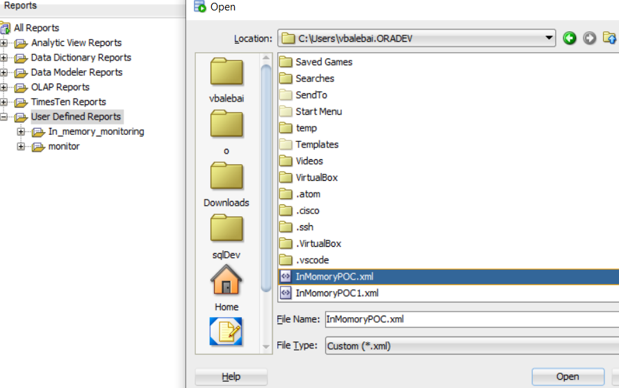
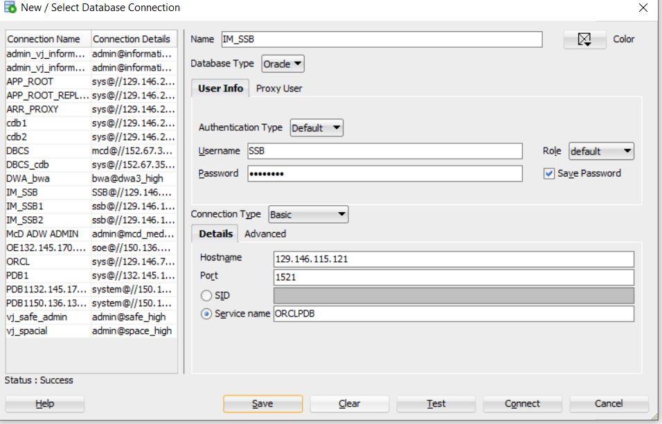
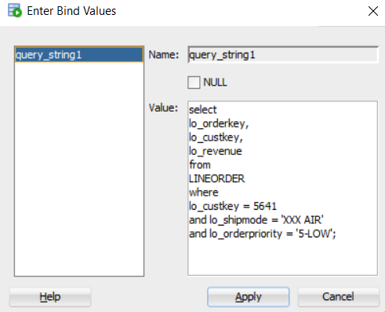
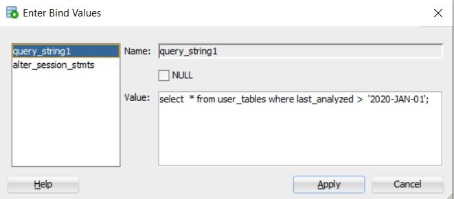
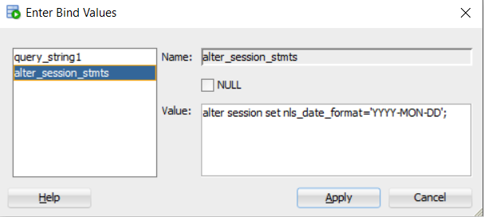
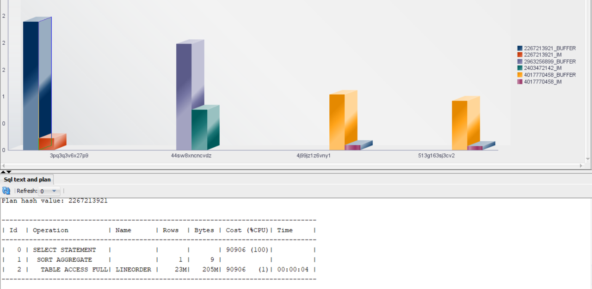

# In-Memory Tool

## Introduction

 In this Lab, we will compare the performance of sql queries running with and without Database In-Memory. To automate this comparison we are providing Sql Developer "User Defined Reports".

 These reports are also available on  [github](https://raw.githubusercontent.com/vijaybalebail/In-memory-workshop/master/In_memory/sqlDev/InMemoryPOC.xml) for you to use in your own test environments.


## Install

The SQL In-Memory POC tool is loaded into SQL Developer as a "User Defined Reports".

1. Download the Report script from [your Browser](https://raw.githubusercontent.com/vijaybalebail/In-memory-workshop/master/In_memory/sqlDev/InMemoryPOC.xml). Then right click and choose "save as"  to save the XML file.

  

2. Open SQL Developer and click on Views--> Reports


3. Under "User Defined Reports", Right click and select "Open Report". Open the xml file saved in step 1.


That is it. You have installed the In-Memory POC tool. Next, we need to connect to the test environment.

4. Add a New Connection. Click on the "+" icon in the upper left corner under connections window frame.
    

     We will run Queries as SSB/Ora_DB4U user for service orclpdb.
    
    Click the "Test" button and if successful click "Save" to save the connection alias.

5. Expand the "User Defined Report" --> "In_Memory POC tool" and click "Load Runstats" and choose the connection you just created. When you run it for the first time, you will get the following message displayed.

    ````
      As the sys user please grant access to following tables and run again
      grant select on SYS.V_$STATNAME to SSB;
      grant select on SYS.V_$MYSTAT to SSB;
      grant select on SYS.V_$TIMER to SSB;
      grant select on SYS.V_$LATCH to SSB;
      grant select on SYS.V_$SESSTAT to SSB;
      Table Created
      ORA-01031: insufficient privileges
      package recompiled in user SSB
      ORA-24344: success with compilation error
    ````

6. To run these grant statements, open a terminal window and start  sql\*plus. Copy and run the following.

    ````
      <copy>
      connect / as sysdba
      alter session set container=ORCLPDB;
      grant select on SYS.V_$STATNAME to SSB;
      grant select on SYS.V_$MYSTAT to SSB;
      grant select on SYS.V_$TIMER to SSB;
      grant select on SYS.V_$LATCH to SSB;
      grant select on SYS.V_$SESSTAT to SSB;
      </copy>
    ````
7. After granting the privileges, re-run the "Load Runstats" report. After about 10 seconds, you should get the following display.

    ````
      temp table run_stats is already created
      view recreated
      package recompiled in user SSB
      Package body recompiled in user SSB
      You are ready to run the report
    ````
You have successfully imported the user defined report.

## Task 1: View the objects loaded In-Memory.

Click on the report "in-memory-objects"
This displays the tables that are loaded into the In-Memory pool. You should see LINEORDER,PART,CUSTOMER,DATE_DIM and  SUPPLIER. If you don't see all of the above objects, ( they may not all have been populated yet ), run the "Load all inmemory tables" report to force load all the missing tables.


The above chart shows space used per table In-Memory, compared to space on disk. Notice, that space In-Memory is less than on disk due to default In-Memory compression.

## Task 2: Run In-Memory Query vs  Buffer Cache.

1. Click on **In-Memory Query vs  Buffer Cache**.
2. In the popup , enter the following query to see the performance difference, SQL Plan and stats.

    ````
    <copy>
    select
    lo_orderkey,
    lo_custkey,
    lo_revenue
    from
    LINEORDER
    where
    lo_custkey = 5641
    and lo_shipmode = 'XXX AIR'
    and lo_orderpriority = '5-LOW'; </copy>
    ````
  

 3. Click **Apply**. The tool will display the following.

    ````
        query string is :
        select
        lo_orderkey,
        lo_custkey,
        lo_revenue
        from
        LINEORDER
        where
        lo_custkey = 5641
        and lo_shipmode = 'XXX AIR'
        and lo_orderpriority = '5-LOW'

        IN MEMORY PLAN
        Plan hash value: 4017770458

        ----------------------------------------------------------------------------------------
        | Id  | Operation                  | Name      | Rows  | Bytes | Cost (%CPU)| Time     |
        ----------------------------------------------------------------------------------------
        |   0 | SELECT STATEMENT           |           |     1 |    44 |  9459   (2)| 00:00:01 |
        |*  1 |  TABLE ACCESS INMEMORY FULL| LINEORDER |     1 |    44 |  9459   (2)| 00:00:01 |
        ----------------------------------------------------------------------------------------

        Predicate Information (identified by operation id):
        ---------------------------------------------------

          1 - inmemory("LO_CUSTKEY"=5641 AND "LO_SHIPMODE"='XXX AIR' AND
                      "LO_ORDERPRIORITY"='5-LOW')
              filter("LO_CUSTKEY"=5641 AND "LO_SHIPMODE"='XXX AIR' AND
                      "LO_ORDERPRIORITY"='5-LOW')

        BUFFER CACHE PLAN
        Plan hash value: 4017770458

        -------------------------------------------------------------------------------
        | Id  | Operation         | Name      | Rows  | Bytes | Cost (%CPU)| Time     |
        -------------------------------------------------------------------------------
        |   0 | SELECT STATEMENT  |           |     1 |    44 | 91044   (1)| 00:00:04 |
        |*  1 |  TABLE ACCESS FULL| LINEORDER |     1 |    44 | 91044   (1)| 00:00:04 |
        -------------------------------------------------------------------------------

        Predicate Information (identified by operation id):
        ---------------------------------------------------

          1 - filter("LO_CUSTKEY"=5641 AND "LO_SHIPMODE"='XXX AIR' AND
                      "LO_ORDERPRIORITY"='5-LOW')

        .09 sec in memory, 1.02 sec in SGA ----
        11 X times faster


        Run #  01 ran in .09  seconds
        Run #  02 ran in 1.05  seconds
        ###########################################################################
        Statistics                               | inmemory       | buffer        
        ###########################################################################
        CPU used by this session................ |              9 |            106
        HSC Heap Segment Block Changes.......... |              0 |              2
        IM SubCU-MM CUs Examined................ |              6 |              0
        IM SubCU-MM CUs Selected................ |              3 |              0
        IM SubCU-MM SubCUs Eliminated........... |          2,648 |              0
        IM SubCU-MM SubCUs in Selected CUs...... |          3,108 |              0
        IM scan CUs columns accessed............ |              8 |              0
        IM scan CUs columns theoretical max..... |            748 |              0
        IM scan CUs current..................... |             44 |              0
        IM scan CUs invalid or missing revert to |             16 |              0
        IM scan CUs memcompress for query low... |             44 |              0
        IM scan CUs no cleanout................. |             44 |              0
        IM scan CUs pcode pred evaled........... |             10 |              0
        IM scan CUs pcode selective done........ |              4 |              0
        IM scan CUs predicates applied.......... |             90 |              0
        IM scan CUs predicates optimized........ |            126 |              0
        IM scan CUs predicates received......... |            132 |              0
        IM scan CUs pruned...................... |             42 |              0
        IM scan CUs readlist creation accumulate |              9 |              0
        IM scan CUs readlist creation number.... |             44 |              0
        IM scan CUs split pieces................ |             65 |              0
        IM scan bytes in-memory................. |  1,386,345,809 |              0
        IM scan bytes uncompressed.............. |  2,134,966,644 |              0
        IM scan delta - only base scan.......... |             44 |              0
        IM scan rows............................ |     22,417,090 |              0
        IM scan rows optimized.................. |     21,365,119 |              0
        IM scan rows projected.................. |              1 |              0
        IM scan rows valid...................... |      1,051,971 |              0
        IM scan segments disk................... |              0 |              1
        IM scan segments minmax eligible........ |             44 |              0
        IM simd compare calls................... |             18 |              0
        IM simd compare selective calls......... |              1 |              0
        IM simd decode symbol calls............. |              3 |              0
        IM simd decode unpack calls............. |              3 |              0
        IM simd decode unpack selective calls... |              3 |              0
        buffer is not pinned count.............. |              2 |             19
        calls to get snapshot scn: kcmgss....... |              2 |             17
        calls to kcmgcs......................... |              2 |             30
        consistent changes...................... |              0 |              2
        consistent gets......................... |         25,154 |        333,545
        consistent gets examination............. |              0 |              1
        consistent gets examination (fastpath).. |              0 |              1
        consistent gets from cache.............. |         25,154 |        333,545
        consistent gets pin..................... |         25,154 |        333,544
        consistent gets pin (fastpath).......... |         25,154 |        333,544
        db block changes........................ |              0 |              4
        db block gets........................... |              0 |              2
        db block gets from cache................ |              0 |              2
        db block gets from cache (fastpath)..... |              0 |              2
        enqueue releases........................ |              1 |              6
        enqueue requests........................ |              1 |              6
        execute count........................... |              2 |             17
        index fetch by key...................... |              0 |              1
        lob writes.............................. |              0 |              1
        lob writes unaligned.................... |              0 |              1
        logical read bytes from cache........... |    206,061,568 |  2,732,417,024
        no work - consistent read gets.......... |         25,152 |        333,514
        non-idle wait count..................... |              3 |              2
        opened cursors cumulative............... |              2 |             17
        parse count (hard)...................... |              0 |              1
        parse count (total)..................... |              1 |             14
        parse time cpu.......................... |              0 |              1
        parse time elapsed...................... |              0 |              1
        recursive calls......................... |              9 |            123
        recursive cpu usage..................... |             10 |            105
        redo entries............................ |              0 |              2
        redo size............................... |              0 |            340
        session cursor cache hits............... |              2 |             13
        session logical reads - IM.............. |        311,540 |              0
        session pga memory...................... |        262,144 |     -1,769,472
        session uga memory...................... |            -40 |             40
        sorts (memory).......................... |              1 |              2
        table fetch by rowid.................... |              0 |              1
        table scan blocks gotten................ |         25,152 |        333,513
        table scan disk IMC fallback............ |      1,809,733 |              0
        table scan disk non-IMC rows gotten..... |              0 |     23,996,826
        table scan rows gotten.................. |      2,861,704 |     23,996,976
        table scan rs2.......................... |              1 |              0
        table scans (IM)........................ |              1 |              0
        table scans (short tables).............. |              1 |              3
        undo change vector size................. |              0 |            136
        workarea executions - optimal........... |              3 |              4
        workarea memory allocated............... |             11 |            -13
        ###########################################################################
    ````

 From the generated report, observe the SQL PLAN operation "*TABLE ACCESS INMEMORY FULL*" when INMEMORY is enabled and "*TABLE ACCESS FULL*" when disabled.

 Now look at the relevant DB stats to see the In-Memory optimizations.

## Task 3: Run In-Memory Query vs  Buffer Cache with custom session parameters.

Some sql queries might need to modify session parameters like Parallel Degree, NLS date formats, HINTS, tuning parameters, etc.

1. Click and open **InMemory vs Buffer with Session Parameter** and select **query_string**.

    ````
    <copy>
    select  * from user_tables where last_analyzed >  '2020-JAN-01';
    </copy>
    ````
  

2. Now run the sql report without any session information, it will error out. To prevent this, you can either alter the sql include TO\_DATE() syntax or change the NLS\_DATE\_FORMAT session parameter. Changing the session parameter is a better option as it would not change the SQL\_ID of the query you are running.

3. Next click  **alter\_session\_stmt** and enter the following session information.

    ````
    <copy>
    alter session set nls_date_format='YYYY-MON-DD';
    </copy>
    ````

  


  Next we can see other useful reports which could help during a POC.


## Task 4: Top InmemorySQL Report




You can click on 'Top Sqತ InMemory' report.  This report generates a chart showing top SQL In-Memory queries for the last hour. If the same query SQL_ID has also run using the buffer cache, that too will be displayed for comparison.

## Acknowledgements

- **Author** - Vijay Balebail
- **Last Updated By/Date** - Kamryn Vinson, July 2021
