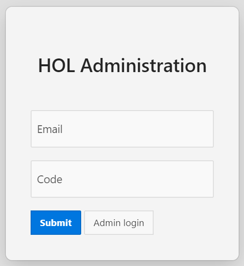
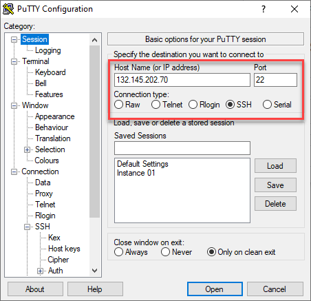
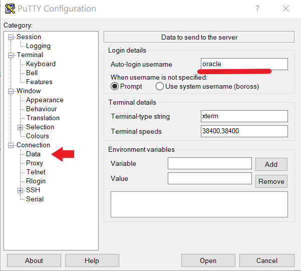
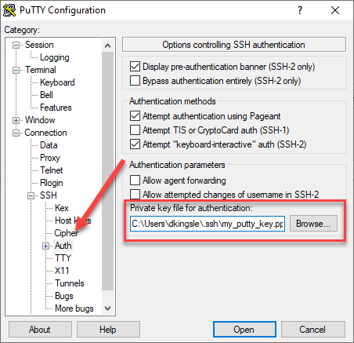
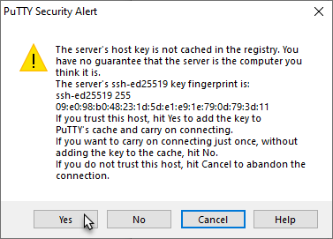
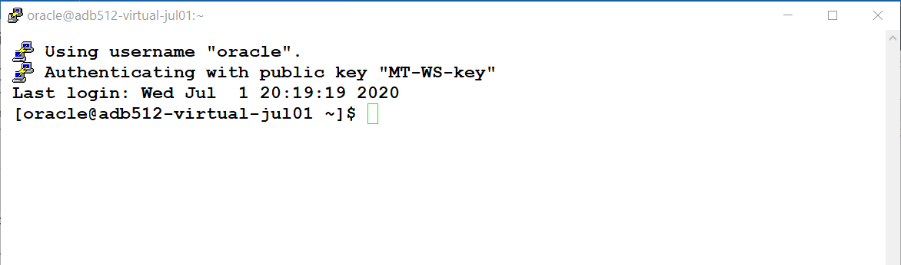
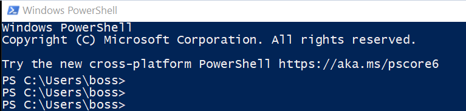
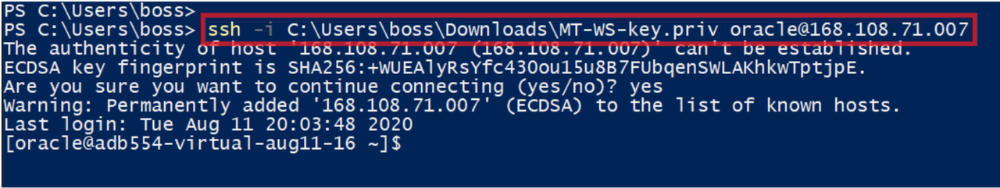
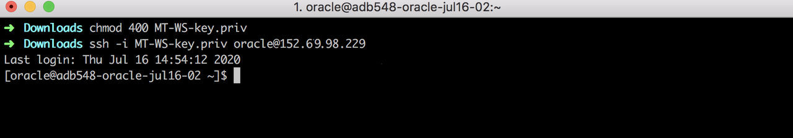

#  Connection setup


**Please change the lab setup to point to livelab event and NOVNC URL. Once the NoVNC image setup is completed.  Check with Robert Pastjin for the deployment and availability of NoVNC image in the Live labs staging area.**

*** The below text needs to be removed after that ***

----

## Obtain an IP address and a Secure Key File
Your instructor will provide you with both a **Virtual Machine IP address** and a **SSH secure key file**.

## Obtain a Virtual Machine IP address and secure key file

1.  Visit the website **[Hands On Lab Administration](http://holadmin.oraclepts.nl/)** and then enter your email and the secret code provided by your instructor.  Then hit "Submit".

    

Each lab participant will be provided a unique **IP address** and a download link to a **SSH secure key file**

## Connect to server with ssh key
  By now, you have the IP address and the SSH to remote login to the server. You can connect to the provisioned server from Windows Putty tool, Windows Powershell or from MAC notebook.
  The Sql\*Developer lab requirs you a GUI. To complete that lab, you can either install Sql\*Developer on the laptop or use remote Desktop to it.

### Windows Users: Connect using Putty

1.  Download and **[Install Putty](https://www.putty.org/)** and then open the PuTTY utility from the Windows start menu.   In the **Host Name dialog box**, enter the IP Address of your OCI Compute Instance.  This will be provided from your instructor.

    

2.  Under **Category** select **Connection** and then choose the **Data** field.  Enter the username ```oracle```.  

    

3.  Under **Category**, navigate to **Connection** - **SSH** and choose the **Auth** category.   Click on the **Browse** button and locate the ```Private Key file``` you downloaded earlier.   

    

4. Click Session in the left navigation pane.  Enter a new Session Name (like **Oracle MT**) in the Saved Sessions box.  Then click **Save** to save your session details.  You can later **Load** this session if needed.

5. Now Click the **Open** button to initiate the SSH connection to your cloud instance.  

6.  Click **Yes** to bypass the Security Alert about the uncached key.

    

7.  Connection successful.   You are now securely connected to an OCI Cloud instance.

    

You are now able to connect securely using the Putty terminal utility.

### Windows Users: Connect using ssh with Windows PowerShell

Windows 10 users can use Windows PowerShell to run the workshop.

1. **How to run PowerShell on Windows 10** - Press WindowsKey\+R to open the Run Dialog Box, then type <em>powershell</em> in the text box.  You can click OK \(or press Enter\) to open a regular PowerShell window.

    

2. Your instructor will provide you with an IP address and a secure key file \(MT-WS-key.priv\).  Use the key and IP address to log in to the SSH client as shown in the following example.  **Remember to use your own IP address.**

    ```
    ssh -i c:\Users\name\Downloads\MT-WS-key.priv oracle@168.xxx.xx.xxx
    ```

    

You are now connected securely using your Windows PowerShell utility.

### Mac Users: Connect using ssh

Mac users typically use their favorite terminal (Terminal.app, iTerm, etc) to run the workshop.

1. Your instructor will provide you with an IP address and a secure key file (MT-WS-key.priv).  After downloading the key file, run the following command to change the file permissions to 400 to better secure the key.

    ````
    <copy>chmod 400 MT-WS-key.priv</copy>
    ````
2. Use the key and IP address to log in to the SSH client as shown in the following example.  **Remember to use your own IP address.**

    ````
    ssh -i MT-WS-key.priv oracle@168.xxx.xx.xxx
    ````
<p>


You are now connected securely using your Mac terminal utility.

## Workshop Lap Setup

Run this command to setup the schema, SSB, you will use for this lab. This script takes about 15 minutes to complete. It downloads the ssb.dmp file and then imports it.
````
<copy>
sudo su - oracle << TEST
cd /home/oracle
wget https://objectstorage.us-phoenix-1.oraclecloud.com/n/oraclepartnersas/b/InMemory_Workshop/o/labs.zip
unzip -o /home/oracle/labs.zip
rm /home/oracle/labs.zip
chmod +x /home/oracle/labs/inmemory/importssb.sh
/home/oracle/labs/inmemory/importssb.sh
TEST
</copy>
````

----
