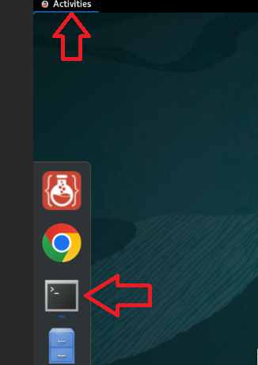
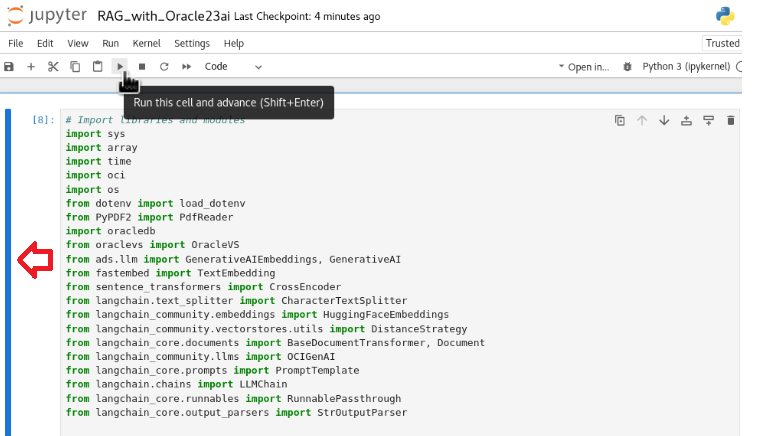
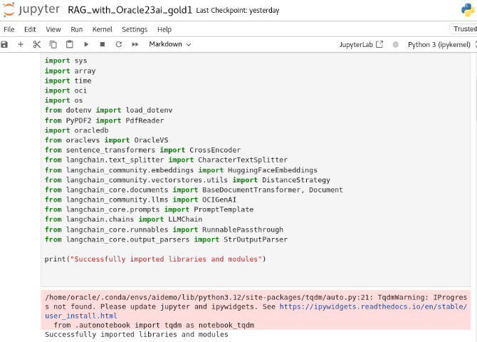

# Lab 1: Build and Run the RAG Application with Oracle AI Vector Search and LangChain

## Introduction

A typical RAG application design has 7 steps and requires a vector store.  Oracle Database 23ai will be used as the vector store. In this lab, we will use documents as the source data, but you can apply these steps to other data types including audio and video.
1.	Load your document.
2.	Transform the document to text.
3.	Chunk the text document into smaller pieces.
4.	Using an embedding model, embed the chunks as vectors into Oracle Database 23ai.
5.	Ask the question for the prompt, the prompt will use the same embedding model to vectorize the question.
6.	The question will be passed to Oracle Database 23ai and a similarity search is performed on the question.
7.	The results (context) of the search and the prompt are passed to the LLM to generate the response.

 

Estimated Time: 10 min

To simplify and complete this application in less than 10 minutes, we have created an image with Oracle Database 23ai.  The Python application template has also been created and a number of library modules have been installed.  We will have you execute the important steps for the RAG application by running the Python code snippets in Jupyter notebook to build the RAG application.

### Objectives

In this lab, you will:
* Use the LangChain framework to build the RAG application with Oracle Database 23ai

### Prerequisites

* Environment with Oracle Database 23ai

## Task 1: Launch Jupyter Lab Notebook

1. From the Activities menu, open a terminal window if it is not already opened.

 

2. From the terminal OS prompt type the following:

```
    $ cd /home/oracle/AIdemo
    $ jupyter notebook
```

 


1. Open the notebook **"RAG_with_Oracle23ai_gold1.ipynb"**. You can double click or right-click and select **Open**.
   


If you want to enlarge the window and have larger fonts, you can zoom in with the browser.


## Task 2: Run the RAG application code snippets in Jupyter notebook

Now you're ready to run each code snippet in sequence starting from the top in Jupyter.  To run a code snippet, select the cell of the code and click **Run** to execute the code.  You don't need to edit any of the code for this application to run.

When the code snippet has completed running a number will appear in the square brackets. You can then proceed to the next cell and code snippet.  Some of the code will print an output so you can get feedback. Pay attention to the 7 steps for RAG as you proceed. At any time you can also re-run the code snippets in the Jupyter cell.

Python libraries and modules have already been installed for this RAG application. Note the libraries for **LangChain** and a new library for the Oracle AI Vector Search, **OracleVS**. 

Let's import the libraries.

1. Select the code snippet and click **Run** in Jupyter. A blue line indicates the cell is selected.

  

 You may get a warning message as shown below. You can ignore this and click **Run** to proceed.

  

```python
# Import libraries and modules

import sys
import array
import time
import oci
import os
from dotenv import load_dotenv
from PyPDF2 import PdfReader
import oracledb
from oraclevs import OracleVS
from ads.llm import GenerativeAIEmbeddings, GenerativeAI
from sentence_transformers import CrossEncoder
from LangChain.text_splitter import CharacterTextSplitter
from LangChain_community.embeddings import HuggingFaceEmbeddings
from LangChain_community.vectorstores.utils import DistanceStrategy
from LangChain_core.documents import BaseDocumentTransformer, Document
from LangChain_community.llms import OCIGenAI
from LangChain_core.prompts import PromptTemplate
from LangChain.chains import LLMChain
from LangChain_core.runnables import RunnablePassthrough
from LangChain_core.output_parsers import StrOutputParser
print("Successfully imported libraries and modules")
```

2. This next code snippet defines the function to include metadata with the chunks.  Select the code snippet and click **Run**.

```python
# Function to format and add metadata to Oracle 23ai Vector Store

def chunks_to_docs_wrapper(row: dict) -> Document:
    """
    Converts text into a Document object suitable for ingestion into Oracle Vector Store.
    - row (dict): A dictionary representing a row of data with keys for 'id', 'link', and 'text'.
    """
    metadata = {'id': row['id'], 'link': row['link']}
    return Document(page_content=row['text'], metadata=metadata)
print("Successfully defined metadata wrapper")
```

1. This code loads the environment variables and connects to Oracle Database 23ai with the credentials and connection string.    Select the code snippet and click **Run**.

```python
# Load environment variables

load_dotenv()
username = os.getenv("username")
password = os.getenv("password")
dsn = os.getenv("dsn")
COMPARTMENT_OCID = os.getenv("COMPARTMENT_OCID")
print("The database user name is:",username)
print("Database connection information is:",dsn)

# Connect to the database

try: 
    conn23c = oracledb.connect(user=username, password=password, dsn=dsn)
    print("Connection successful!")
except Exception as e:
    print("Connection failed!")
    
```

**The 7 RAG Steps**

**RAG Step 1 - Load the document**

The document in our use case is in PDF format. We are loading a PDF document and printing the total number of pages, and printing page 1 for your visual feedback.  

4. Select the code snippet and click **Run**.

```python
    # RAG Step 1 - Load the document

    # creating a pdf reader object
    pdf = PdfReader('oracle-database-23ai-new-features-guide.pdf')

    # print number of pages in pdf file 
    print("The number of pages in this document is ",len(pdf.pages)) 
    # print the first page 
    print(pdf.pages[0].extract_text())

```

**RAG Step 2 - Transform the document to text**

5. The code transforms each page of the PDF document to text.  Click **Run** to execute the code.
```python
    # RAG Step 2 - Transform the document to text

    if pdf is not None:
      print("Transforming the PDF document to text...")
    text=""
    for page in pdf.pages:
        text += page.extract_text()
    print("You have transformed the PDF document to text format")
        
```

**RAG Step 3 - Split the text into chunks**

Our chunk size will be 800 characters, with an overlap of 100 characters with each chunk.  Note: Chunk sizes vary depending on the type of document you are embedding.  Chat messages may have smaller chunk size, and larger 100 page essays may have larger chunk sizes.  

6. Click **Run** to execute the code.

```python
      # RAG Step 3 - Chunk the text document into smaller chunks
      text_splitter = CharacterTextSplitter(separator="\n",chunk_size=800,chunk_overlap=100,length_function=len)
      chunks = text_splitter.split_text(text)
      print(chunks[0])
```
We print the first chunk for your feedback.  

7. The code adds metadata such as id to each chunk for the database table.  Click **Run** to execute the code.

```python
      # Create metadata wrapper to store additional information in the vector store
      """
      Converts a row from a DataFrame into a Document object suitable for ingestion into Oracle Vector Store.
      - row (dict): A dictionary representing a row of data with keys for 'id', 'link', and 'text'.
      """
      docs = [chunks_to_docs_wrapper({'id': page_num, 'link': f'Page {page_num}', 'text': text}) for page_num, text in enumerate(chunks)]
      print("Created metadata wrapper with the chunks")

```
**RAG Step 4 - Set up Oracle AI Vector Search and insert the embedding vectors**

The embedding model used in this lab is **all-MiniLM-L6-v2** from HuggingFace.  **Docs** will point to the text chunks.  The connection string to the database is in the object **conn23c**.  The table to store the vectors and metadata are in **MY_DEMO4**.  We use **DOT_PRODUCT** as the algorithm for the nearest neighbor search.
Note: Embedding models are used to vectorize data. To learn more about embedding models, see the LiveLabs on Oracle AI Vector Search.

8. Click **Run** to execute the code.

```python
      # RAG Step 4 - Using an embedding model, embed the chunks as vectors into Oracle Database 23ai.

      # Initialize embedding model
      model_4db = HuggingFaceEmbeddings(model_name="sentence-transformers/all-MiniLM-L6-v2")

      # Configure the vector store with the model, table name, and using the indicated distance strategy for the similarity search and vectorize the chunks
      s1time = time.time()
      knowledge_base = OracleVS.from_documents(docs, model_4db, client=conn23c, table_name="MY_DEMO4", distance_strategy="DistanceStrategy.DOT_PRODUCT")     
      #knowledge_base = OracleVS.from_documents(docs, model_4db, client=conn23c, table_name="MY_DEMOOCI", distance_strategy="DistanceStrategy.MAX_INNER_PRODUCT")
      s2time =  time.time()      
      print( f"Vectorizing and inserting chunks duration: {round(s2time - s1time, 1)} sec.")

```
**Have a look into the Oracle Database 23ai to see the table with the vectors and metadata created. It's long, scroll down to see the text chunks.**

9. Take a moment to celebrate. You have successfully uploaded the document, transformed it to text, split into chunks, and embedded its vectors in Oracle Database 23ai

```python
    # Take a moment to celebrate. You have successfully uploaded the document, transformed it to text, split into chunks, and embedded its vectors in Oracle Database 23ai

    print("Yay! You have successfully uploaded the document, transformed it to text, split into chunks, and embedded its vectors in Oracle Database 23ai")

```

**RAG Step 5 - Build the prompt to query the document**

10. The code issues a prompt related to the document we loaded.  Click **Run** to execute the code.  

```python
      # RAG Step 5 - Build the prompt to query the document
    
      user_question = ("List the features in Oracle Database 23ai")
      print ("The prompt to the LLM will be:",user_question)
```

11. The code records the timing for searching the database. It's quick!  Click **Run** to execute the code.

```python
# Setup timings to check performance

       # code not needed, only used for measuring timing
       if user_question:
        s3time =  time.time()
        result_chunks=knowledge_base.similarity_search(user_question, 5)
        s4time = time.time()
        print( f"Search user_question and return chunks duration: {round(s4time - s3time, 1)} sec.")
        print("")
```

**Choose an LLM to generate your response** 

You have 3 LLM choices in this lab. Choose only one, but you can go back later and choose a different one to see its response. 
Note: For OpenAI, you **CANNOT** run this in the LiveLabs environment.  This sample code is for informational purposes so you can run this example in your own environment.

* Choice 1 - OCI GenAI LLM with meta.llama-2.70b-chat
* Choice 2 - OpenAI ChatGPT 3.5 (CANNOT run in this LiveLabs environment)
* Choice 3 - OCI GenAI LLM with Cohere Command

Note: To learn more about using other LLMs and accessing LLMs with secure API keys, see the LiveLabs on LLMs for Oracle AI Vector Search.

12a. **Choice 1** - The code below sets up the OCI GenAI Service LLM to use Meta Llama. Click **Run** to execute the code.

```python
        # Choice 1, Set the OCI GenAI LLM
        ENDPOINT = "https://inference.generativeai.us-chicago-1.oci.oraclecloud.com"
        COMPARTMENT_OCID = COMPARTMENT_OCID
        EMBED_MODEL="meta.llama-2-70b-chat"
        print(ENDPOINT)

        llmOCI = OCIGenAI(
          model_id="meta.llama-2-70b-chat",
          service_endpoint="https://inference.generativeai.us-chicago-1.oci.oraclecloud.com",
          compartment_id=COMPARTMENT_OCID,
          model_kwargs={"temperature": 0.7, "top_p": 0.75, "max_tokens": 2000},
          auth_type="API_KEY",
        )
```
12b. **Choice 2** - The code below sets up OpenAI LLM. Click **Run** to execute the code.

```python
        # Choice 2, Set up OpenAI LLM

        from LangChain.embeddings.openai import OpenAIEmbeddings
        from LangChain_community.chat_models import ChatOpenAI
        from LangChain.callbacks import get_openai_callback

        # set the LLM to get response
        llm = ChatOpenAI(
          model_name='gpt-3.5-turbo-16k',
          temperature = 0.1,
          #openai_api_key = os.getenv("OPENAI_API_KEY"),
          openai_api_key="sk-bMV... Add your OpenAI API key here",
          max_tokens=2000
        )
        print("The LLM model you will use is from OpenAI")

```

12c. **Choice 3** - The code below sets up OCI GenAI Service to use the Cohere LLM. Click **Run** to execute the code.

```python
        # Choice 3, Set up Cohere LLM

        ENDPOINT = "https://inference.generativeai.us-chicago-1.oci.oraclecloud.com"
        COMPARTMENT_OCID = COMPARTMENT_OCID
        print(ENDPOINT)

        # set the LLM to get response
        llm = OCIGenAI(
          model_id="cohere.command",
          service_endpoint="https://inference.generativeai.us-chicago-1.oci.oraclecloud.com",
          compartment_id=COMPARTMENT_OCID,
          model_kwargs={"temperature": 0.7, "top_p": 0.75, "max_tokens": 2000},
          auth_type="API_KEY",
        )
        print("The LLM model is cohere.command from OCI GenAI Service")

```

1.    The code below builds the prompt template to include both the question and the context, and instantiates the knowledge base class to use the retriever to retrieve context from Oracle Database 23ai. Click **Run** to execute the code.

```python
# Set up the template for the questions and context, and instantiate the database retriever object
        template = """Answer the question based only on the  following context:
                   {context} Question: {question} """
        prompt = PromptTemplate.from_template(template)
        retriever = knowledge_base.as_retriever()
```

**RAG Steps 6 and 7 - Invoke the chain**

This is the key part of the RAG application.  It is the LangChain pipeline that chains all the components together to produce an LLM response with context.  The chain will embed the question as a vector.  This vector will be used to search for other vectors that are similar.  The top similar vectors will be returned as text chunks (context).  Together the question and the context will form the prompt to the LLM for processing.  And ultimately generating the response.  A detailed explanation of the chain follows the code.

1.  The code defines the RAG chain process and invokes the chain.  Click **Run** to execute the code.

```python
        # RAG Steps 6 and 7 Chain the entire process together, retrieve the context, construct the prompt with the question and context, and pass to LLM for the response
        
        s5time = time.time()
        print("We are sending the prompt and RAG context to the LLM, wait a few seconds for the response...")
        chain = (
          {"context": retriever, "question": RunnablePassthrough()}
             | prompt
             | llmOCI
             | StrOutputParser()
        )
        response = chain.invoke(user_question)
        print(user_question)
        print(prompt)
        print(response)
        # Print timings for the RAG execution steps

        s6time = time.time()
        print("")
        print( f"Send user question and ranked chunks to LLM and get answer duration: {round(s6time - s5time, 1)} sec.")
        
```
The code above sets up a processing pipeline where user_question is processed sequentially by retriever, prompt, llmOCI, and StrOutputParser, with each step performing some transformation or analysis on the input. The final result is stored in the variable response.
chain = (...): This line initializes a chain of processing steps. Each step is represented as an object or function.
1.	{"context": retriever, "question": RunnablePassthrough()}: This is the first step in the chain. It involves a dictionary with keys "context" and "question" mapped to some objects or functions named retriever and RunnablePassthrough() respectively.
2.	| prompt: The | operator is used to chain the output of the previous step with the prompt object or function. This suggests that the output of the first step will be passed as input to prompt.
3.	| llmOCI: Similarly, the output of the previous step is passed as input to llmOCI.
4.	| StrOutputParser(): Finally, the output of llmOCI is passed through StrOutputParser.
5.	response = chain.invoke(user_question): This line invokes the entire chain with the user_question as input and assigns the output to the variable response.

**Finish**

You're done with this lab.  You can proceed to the next lab or stay here and try Step 12 again with a different LLM, 12a or 12c, and run through to Step 14, and see the response from a different LLM. 

Click **Run** to execute the congrats code.

```python
        print("")
        print("Congratulations! You've completed your RAG application with AI Vector Search in Oracle Database 23ai using LangChain")
```


You may now [proceed to the next lab](#next).


## Acknowledgements
* **Authors** - Vijay Balebail, Milton Wan, Douglas Hood, Rajeev Rumale
* **Last Updated By/Date** - Milton Wan, April 2024
