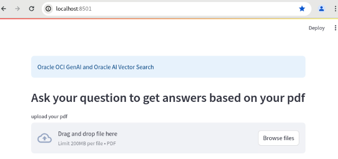

# Lab 2: Run the same RAG Application interactively

## Introduction

Estimated Time: 5 min

### Objectives

In this lab you will run the RAG application interactively using a simple user interface. You can select and load from several PDF documents, and ask your own question in the prompt.  This is the same application with the 7 essential RAG steps as the previous lab but demonstrates use through a user interface.

### Prerequisites

* VM environment running Oracle Database 23ai


## Task 1: Run application

1.  From the terminal, go to directory 

    ```
    $ cd /home/oracle/aidemo
    ```

2.  Run the RAG application
    ```
    $ streamlit run genai.py
    ```

3. A browser will launch. If not, open a browser from the Activities menu and select Firefox or Chrome.

4. Enter **localhost:8501** for the URL in the browser.
   
Your application will now be running.  Simply follow the UI.

5. Click on the **Browse files** button and load a PDF document.

After a few seconds the PDF document will be loaded, transformed to text, chunked, and vectorized into Oracle Database 23ai.



A prompt area will now appear for you to ask a question about your PDF.  You can type in your own question or use the suggestions listed below. 

6. Type a question and hit return.

In a few seconds the LLM will answer the question and respond with context stored in Oracle Database 23ai.  

**Suggestions**

 For the Oracle Database 23ai documentation:
- What are the new features in Oracle Database 23ai
- Tell me more about AI Vector Search
- Tell me more about new enhancement to SQL
- Tell me more about JSON Relational Duality
- List 5 new features of Oracle 23ai database

For the Oracle Fiscal Year 2024 Quarter 2 Financial Results document:
- Summarize the Oracle 2024 Quarter 2 financial results
- What did Larry say in the Oracle Fiscal Year 2024 Quarter 2 financial results

**Code for the application**

Now check out the application code using the UI. From a terminal window type:


```
    $ cd /home/oracle/aidemo
    $ more genai.py
```

Note the additional imported libraries and **st** objects for Streamlit.
But essentially the code is the same 7 steps for building a RAG application with Oracle AI Vector Search and LangChain.

### Conclusion

In Lab 2 you ran a RAG application with a UI using the same 7 steps for RAG and Oracle AI Vector Search.  The blueprint is the same.  Now it's your turn.  Experiment with different transformers for different data sources.  It could be video, audio, text and more.  They're all embedded as vectors in Oracle Database 23ai.

By using AI Vector Search in Oracle Database 23ai, you can build RAG applications with important context without having to retrain the LLM.  The context is stored, searched and retrieved from Oracle Database 23ai and passed to the LLM to generate accurate, up to date, and targeted responses to your prompts.  Businesses and enterprises can use RAG with AI Vector Search in Oracle Database 23ai and an LLM to securely respond to important business questions or to generate content for many use cases using private, internal business information.


**Completed. Thanks for running the lab.**

## Acknowledgements
* **Authors** - Vijay Balebail, Milton Wan 
* **Contributors** - Rajeev Rumale
* **Last Updated By/Date** -  Rajeev Rumale, October 2024
