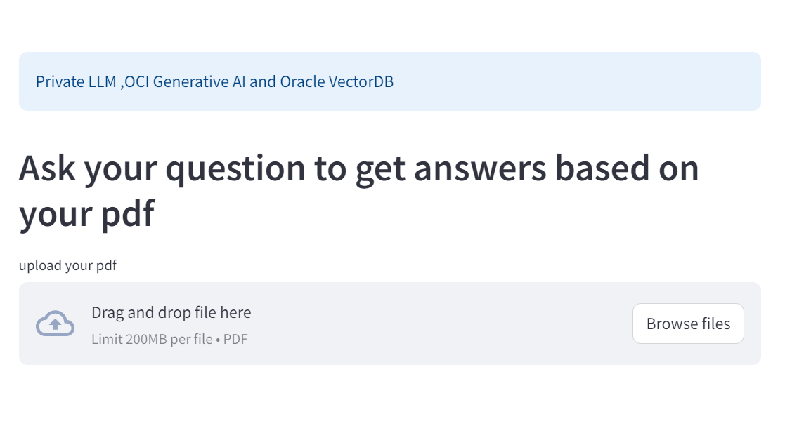

# Lab 2: Run the same RAG Application interactively with the Streamlit User Interface

## Introduction

Estimated Time: 5 min

### Objectives

In this lab you will run the application with a UI using Streamlit, load a PDF document, and ask a question in the prompt.  This is the same RAG application as the previous lab but demonstrates use of a user interface where you can select a PDF document to load.

### Prerequisites

* VM environment running Oracle Database 23ai


## Task 1: Run Streamlit

1.  From the terminal, go to directory 

    ```
    $ cd /home/oracle/AIdemo
    ```

2.  Run the RAG application using Streamlit
    ```
    $ streamlit run genai.py
    ```

3. Launch a browser from this same virtual environment, or open a tab with existing browser.  To launch a browser click on the Activities menu and select Firefox or Chrome.

4. Enter **localhost:8501** for the URL in the browser.
   
Your application will now be running.  Simply follow the UI, load a PDF document, and ask a question of the document.  The LLM will answer the question and respond with context from the document.  This application follows the same 7 essential RAG steps from the previous lab.



A few suggestions for the questions are listed below. You can copy and paste into the question field.

For the Oracle Database 23ai documentation:
- What are the new features in Oracle Database 23ai
- Tell me more about Oracle AI Vector Search

For the Oracle Fiscal Year 2024 Quarter 2 Financial Results document:
- Summarize the Oracle 2024 Quarter 2 financial results
- What did Larry say in the Oracle Fiscal Year 2024 Quarter 2 financial results

LLMs are multi-lingual, for the Korean version of Oracle Fiscal Year 2024 Quarter 2 Financial Results document:
- Oracle 2024년 2분기 재무 결과 요약
- Larry는 Oracle 회계연도 2024년 2분기 재무 결과에서 무엇을 말했나요?

**Code for Streamlit application**

Now check out the application code using the Streamlit UI. From a terminal window type:


```
    $ cd /home/oracle/AIdemo
    $ more genai.py
```

Note the additional libraries and **st** objects for Streamlit.
But essentially the code is the same 7 steps for building a RAG application with Oracle AI Vector Search and LangChain.

**Completed. Thanks for running the lab.**

## Acknowledgements
* **Authors** - Vijay Balebail, Milton Wan, Rajeev Rumale
* **Last Updated By/Date** -  Milton Wan, April 2024
