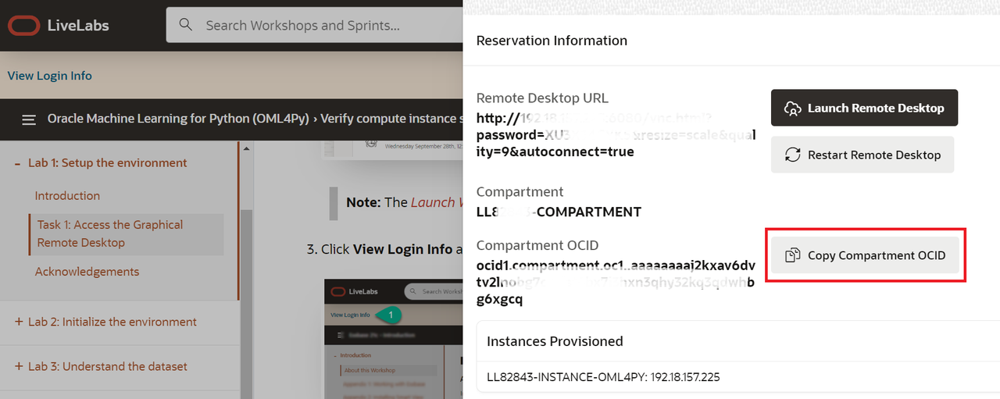
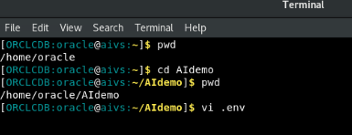
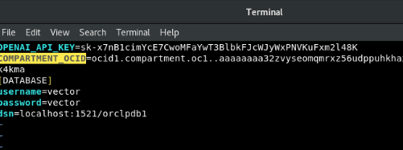

# Lab preparation

## Introduction

This lab requires the OCI Compartment OCID to be set so it can access the OCI GenAI Service LLMs.

### Objectives

In this lab, you will:
* Retrieve the Compartment OCID
* Copy the Compartment OCID to the environment variable file

### Prerequisites

* Access to LiveLab environment running this workshop
* Access to Compartment OCID 

## Task 1: Retrieve the Compartment OCID

1. On LiveLabs before launching remote desktop, copy the Compartment OCID and save it, then Launch Remote Desktop.

 

2. Once your noVNC session has started open the **.env** file from the terminal with vi editor in the /home/oracle/AIdemo directory.

 

3. In vi editor, position the cursor right after the variable COMPARTMENT_OCID=

4. Hit **ESC** key in vi and type the **i** key to go to insert mode.  Insert the OCID you copied to the variable COMPARTMENT_OCID.  If there is already a value there, remove it and add yours as shown.

5. Hit **ESC** key again, and type **:wq** to save the .env file.

 

You may now [proceed to the next lab](#next).

## Acknowledgements
* **Author** - Milton Wan, Rajeev Rumale
* **Last Updated By/Date** -  Milton Wan, April 2024
