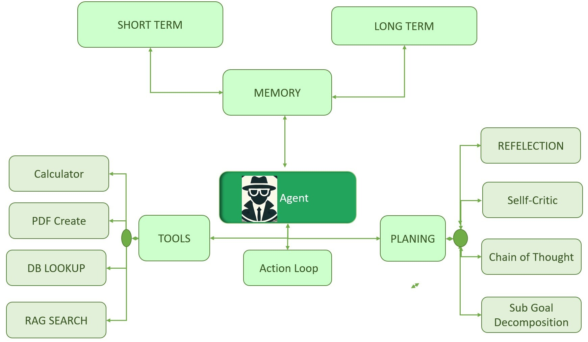

# Building AI Agents with Model Context Protocol (MCP) and Oracle Database 23ai

### **Introduction**

This workshop demonstrates how to build an AI agent application using LangChain, Oracle Database 23ai, and the Model Context Protocol (MCP)—an open standard for AI agent context, memory, and tool interoperability (modelcontextprotocol.io ). You’ll learn how MCP defines agent tasks, interactions, and contextual memory in a consistent, model-agnostic format.

Using LangChain and Oracle Database 23ai's converged features (including AI Vector Search, Graph, and JSON), we'll show how MCP enables seamless communication between the agent, database, and external services. MCP’s standardized API allows your agent to initiate tasks, call tools, manage context/memory, and be portable across LLMs and platforms.

In this hands-on session, you'll see how MCP can be used for AI Vector search, relational queries, PDF generation, and email workflows—with all interactions flowing through MCP’s unified context and task specifications. You’ll design MCP-compatible prompts, create tools, and use standard memory management, illustrating how to build future-proof GenAI applications with agentic frameworks.

By leveraging MCP, you ensure your agent application is interoperable, composable, and ready for rapid advances in AI and data platforms like Oracle Database 23ai.

Estimated Time:  15 min

### Objectives

In this workshop, we'll perform the follow:

* Setting up the environment and dependencies
* Creating custom tools for our AI agent
* Designing effective prompt templates
* Initializing and running the AI agent

Let's get started!

### Prerequisites
* An Oracle LiveLabs Account
* Check out Livelab - Complete RAG Application using PL/SQL in Oracle Database 23ai

## Task: Understanding AI Agents

### **What are AI Agents?**

An AI or LLM Agent is a reasoning framework built around a Large Language Model (LLM) that can interpret user input, reason through it step-by-step, and autonomously use external tools (like vector search, relational query, email, or PDF generators) to accomplish tasks, not just a chatbot that responds, but a system that plans, decides, and acts.

It's like giving the LLM: a brain to reason and remember (via prompts + memory),
eyes and ears to read documents or look up info (via tools),
and hands to take action (e.g., sending emails, generating PDFs).
 

### **Why AI Agents Matter?**
AI agents are transforming industries by automating sophisticated workflows, boosting productivity, and enabling intelligent scalable solutions. Integrated with databases like Oracle Database 23ai, they enhance tasks like enterprise customer support and data analysis, reducing costs and errors. For developers, mastering AI agents unlocks opportunities to build innovative, competitive solutions.

### **Understanding the AI Agent Architecture**

AI Agent system have the following characteristics :

Plan and Reason: Analyze a task and determine the necessary steps
Tools: Execute functions to gather information or perform actions.
Maintain Context: Remember conversation history and previous actions.
Make Decisions: Choose appropriate next steps based on observations.
Reasoning: The agent thinks through the problem
Acting: The agent takes action based on reasoning
Observation: The agent observes the result
Repeat: Until the task is complete """

### **Agent Components**

AI agents rely on the following components for functionality:
Tools: External resources or APIs (e.g., database queries, email services, PDF generation).
Prompts: Instructions guiding the agent’s behavior for accurate outputs.
Model: The AI model (e.g., GPT, LLaMA) powering reasoning and decisions.
Memory: Contextual memory for retaining prior interactions in multi-step tasks.
Planner: Breaks down tasks into steps, selecting tools and actions.
Environment: Data sources like Oracle Database 23ai for processing information.

 

### Learn More

See below for more information on Oracle Database 23ai and Oracle AI Vector Search

* [Oracle AI Agentics Blog ](https://docs.oracle.com/en/database/oracle/oracle-database/)
* [Oracle AI Vector Search User's Guide](https://docs.oracle.com/en/database/oracle/oracle-database/23/vecse/index.html)
* [Oracle AI Vector Search Blog](https://blogs.oracle.com/database/post/oracle-announces-general-availability-of-ai-vector-search-in-oracle-database-23ai)

You may now [proceed to the next lab](#next).

## Acknowledgements
* **Authors** - Vijay Balebail, Rajeev Rumale
* **Contributors** - Milton Wan, Doug Hood
* **Last Updated By/Date** -  Rajeev Rumale, June 2025
