# Clean up (optional)

## Introduction

In this lab we will cleanup the infrastructure that we used to run this workshop.

The main three elements that we will cleanup are the **Autonomous JSON Database** where you stored the JSON documents that we ingested our Python apps with, **Compute instance** using an image from the marketplace including the libraries need to execute the scripts needed to create and execute applications in Python. And finally the **Virtual Cloud Network** which you used to define your own data center network topology inside the Oracle Cloud by defining some of the following components (Subnets, Route Tables, Security Lists, Gateways, etc.).

Estimated Time: 5 minutes

Watch the video below for a quick walk-through of the lab.
[Clean up Content](videohub:1_pgtct6n7)

### Objectives

In this lab, you will:

* Terminate Oracle Autonomous JSON Database (AJD)
* Terminate Compute Node for development
* Terminate Virtual Cloud Network (VCN)

### Prerequisites

* An Oracle Cloud Infrastructure (OCI) account


## Task 1: Terminate the Oracle Autonomous JSON Database (AJD)

1. **Click** on main menu ≡, then Oracle Database > **Autonomous JSON Database**.

    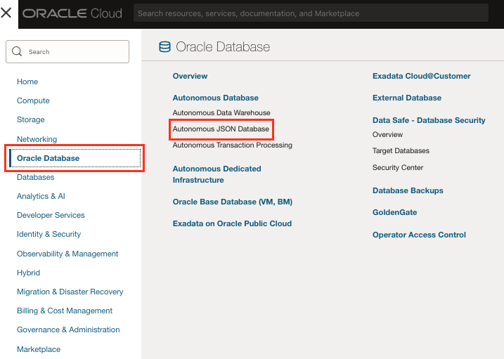

2. Click your **AJDEV** Autonomous JSON Database instance.

    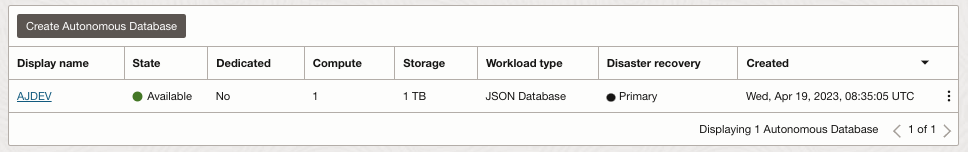

3. Click **More Actions** > **Terminate**.

    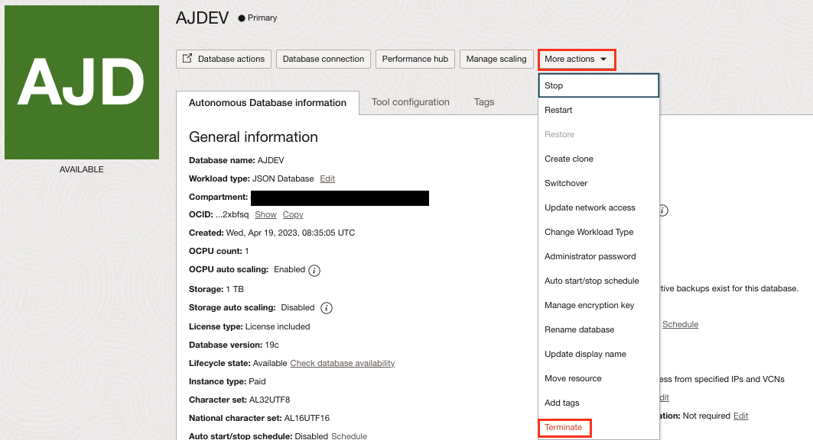

4. To confirm, enter the name of the database that you want to terminate:

    ```
    <copy>AJDEV</copy>
    ```

5. Click **Terminate Autonomous Database**.

    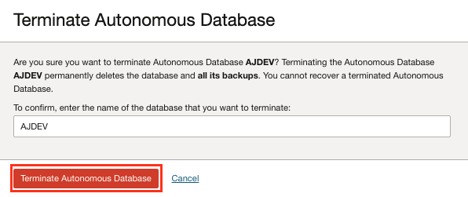


## Task 2: Terminate the Compute Node for development

1. Click on main menu ≡, then Compute > **Instances**.

    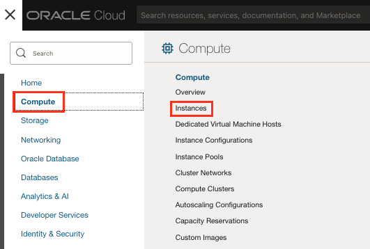

2. Click your **DEVM** compute instance.

    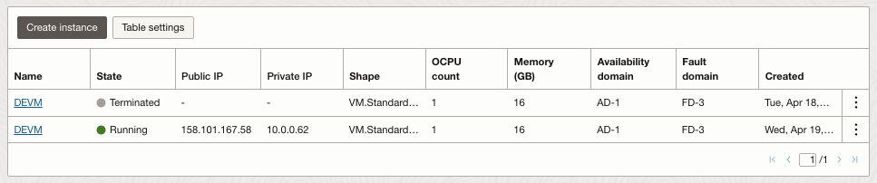

3. ClickTask2 **Terminate**.

    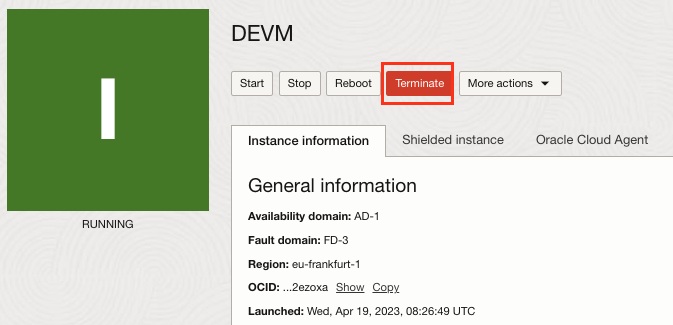

4. Check **Permanently delete the attached boot volume** check-box.

5. Click **Terminate instance** button.

    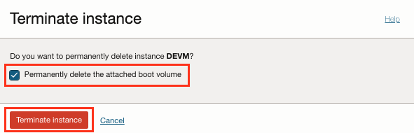


## Task 3: Terminate the Virtual Cloud Network (VCN)

1. Click on main menu ≡, then Networking > **Virtual Cloud Networks**. Select your Region and Compartment assigned by the instructor.

    >**Note**: Use **Root** Compartment, oci-tenant(root), to create all resources for this workshop.

    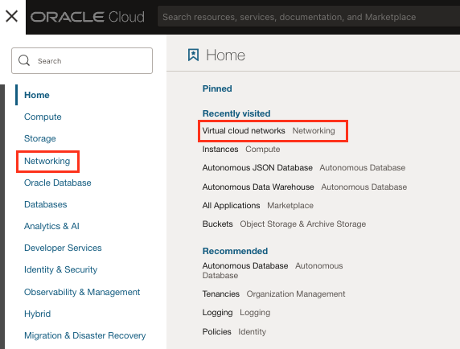

2. Click your **DEVCN** Virtual Cloud Network.

    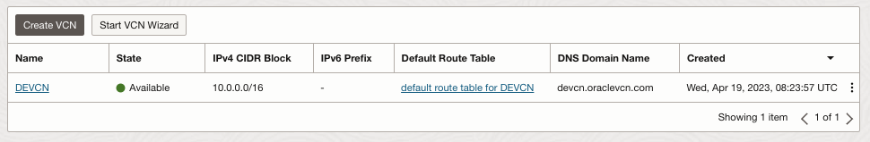

3. Click **Delete**.

    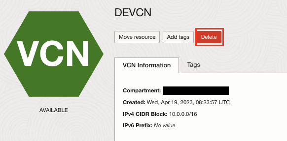

4. Select the **Specific compartments** where the instaltion was done. **Root** was the recommended one and click **Scan**.

    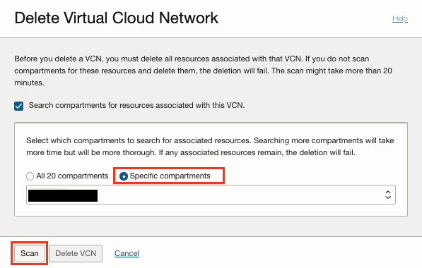

5. Wait for Associated Resources list to populate on Terminate Virtual Cloud Network dialog. When all resources are displayed, click **Delete All** button. And finally **Close** the window.

    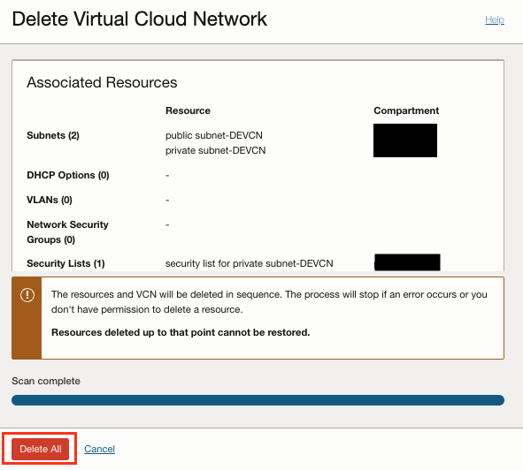

**Congratulations! Well done!**

## Acknowledgements
* **Author** - Valentin Leonard Tabacaru, Database Product Management and Priscila Iruela, Technology Product Strategy Director
* **Contributors** - Victor Martin Alvarez, Technology Product Strategy Director
* **Last Updated By/Date** - Priscila Iruela, August 2023