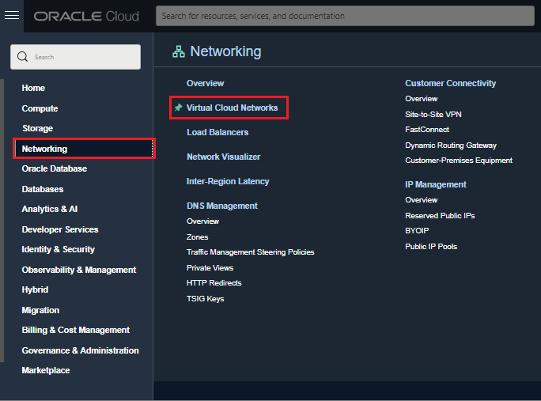
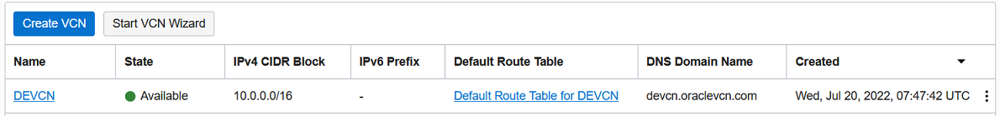
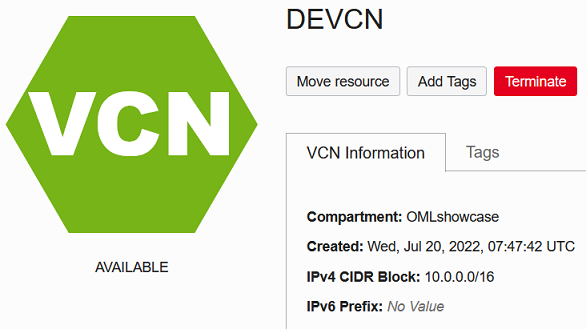
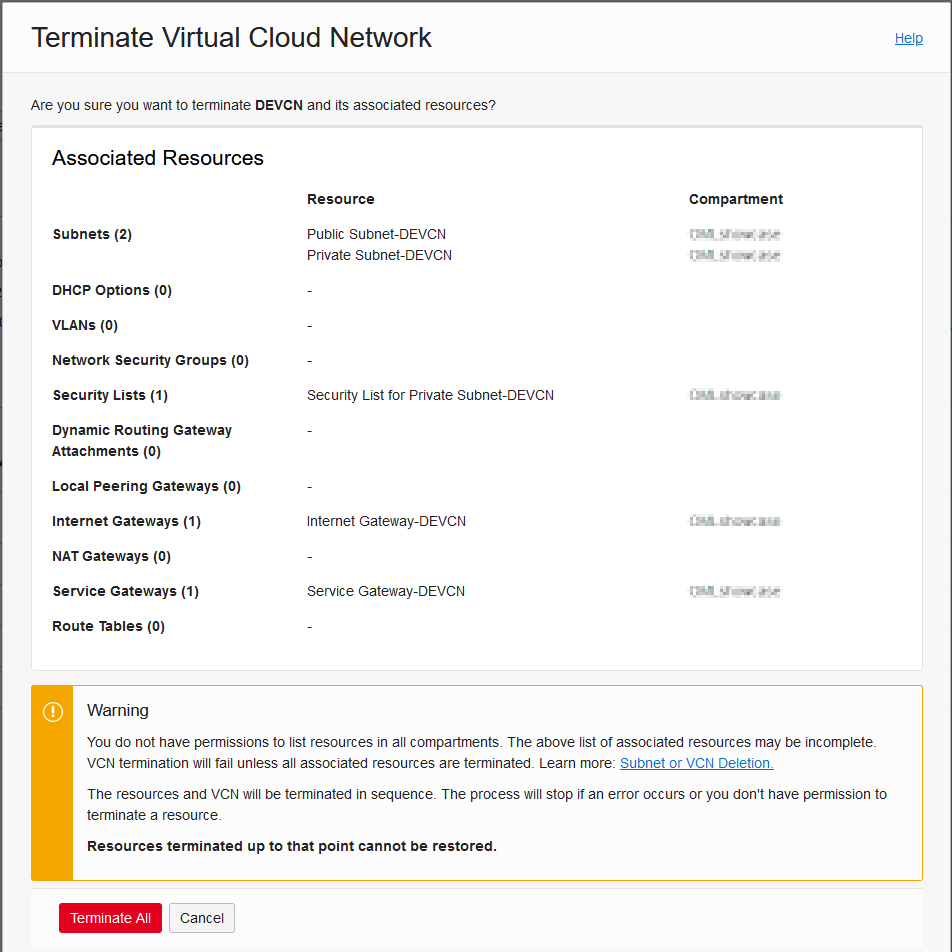

# Clean Up (Optional)

## Introduction

In this lab we will cleanup the infrastructure that we used to run this workshop.

The main three elements that we will cleanup are the **Autonomous JSON Database** where you stored the JSON documents that we ingested our Python apps with, **Compute instance** using an image from the marketplace including the libraries need to execute the scripts needed to create and execute applications in Python. And finally the **Virtual Cloud Network** which you used to define your own data center network topology inside the Oracle Cloud by defining some of the following components (Subnets, Route Tables, Security Lists, Gateways, etc.).

**Estimated Lab Time: 5 minutes.**

### Objectives

In this lab, you will:

* Terminate Oracle Autonomous JSON Database (AJD)
* Terminate Compute Node for development
* Terminate Virtual Cloud Network (VCN)

### Prerequisites

* An Oracle Free Tier, Always Free, or Paid Oracle Cloud Account


## Task 1: Terminate the Oracle Autonomous JSON Database (AJD)

1. **Click** on main menu ≡, then Oracle Database > **Autonomous JSON Database**.

    

2. Click your **AJDEV** Autonomous JSON Database instance.

    

3. Click **More Actions** > **Terminate**.

    

4. To confirm, enter the name of the database that you want to terminate:

    ```
    <copy>AJDEV</copy>
    ```

5. Click **Terminate Autonomous Database**.

    


## Task 2: Terminate the Compute Node for development

1. Click on main menu ≡, then Compute > **Instances**.

    

2. Click your **DEVM** compute instance.

    

3. Click **More Actions** > **Terminate**.

    

4. Check **Permanently delete the attached boot volume** check-box.

5. Click **Terminate instance** button.

    


## Task 3: Terminate the Virtual Cloud Network (VCN)

1. Click on main menu ≡, then Networking > **Virtual Cloud Networks**. Select your Region and Compartment assigned by the instructor.

    >**Note**: Use **Root** Compartment, oci-tenant(root), to create all resources for this workshop.

    

2. Click your **DEVCN** Virtual Cloud Network.

    

3. Click **Terminate**.

    

4. Wait for Associated Resources list to populate on Terminate Virtual Cloud Network dialog.

5. When all resources are displayed, click **Terminate All** button.

    


*Congratulations! Well done!*

## Acknowledgements
* **Author** - Valentin Leonard Tabacaru, Database Product Management and Priscila Iruela, Technology Product Strategy Director
* **Contributors** - Victor Martin Alvarez, Technology Product Strategy Director
* **Last Updated By/Date** - Priscila Iruela, July 2022

## Need Help?
Please submit feedback or ask for help using our [LiveLabs Support Forum](https://community.oracle.com/tech/developers/categories/livelabsdiscussions). Please click the **Log In** button and login using your Oracle Account. Click the **Ask A Question** button to the left to start a *New Discussion* or *Ask a Question*.  Please include your workshop name and lab name.  You can also include screenshots and attach files.  Engage directly with the author of the workshop.

If you do not have an Oracle Account, click [here](https://profile.oracle.com/myprofile/account/create-account.jspx) to create one.
