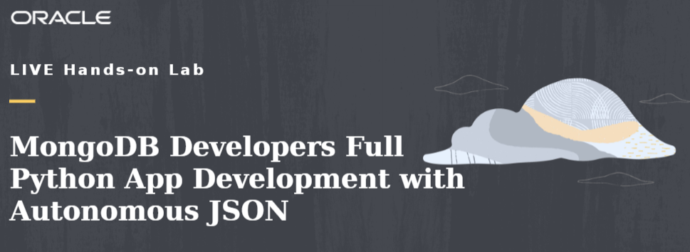

# Full Python App Development with Autonomous JSON for MongoDB Developers

## Introduction

This workshop has three parts:

- Infrastructure Configuration
- Python SODA micro-service with Autonomous Database for JSON
- Python micro-service with the new MongoAPI capability

**Estimated Workshop Time: 90 minutes.**

## Objectives

During this workshop you will:

* Create development environment on Oracle Cloud Infrastructure
* Deploy a document store with one collection on Oracle Autonomous Database for JSON
* Develop a simple Python web service to manage JSON documents via REST calls
* Use APEX to visualize document store in a fast application development fashion
* Compare and understand the differences between Oracle SODA and Oracle MongoAPI capability
* Use MongoAPI capability for micro-service Python application

## Prerequisites

* An Oracle Free Tier, Always Free, Paid or LiveLabs Cloud Account - You can check Getting Started section for more information.
* Or Oracle LiveLabs sandbox environment

Here is a video to help with the Oracle Trial Sign Up Process:

**At this point, you are ready to start learning! Please proceed.**

## Acknowledgements
* **Author** - Valentin Leonard Tabacaru, Database Product Management and Priscila Iruela, Technology Product Strategy Director
* **Contributors** - Victor Martin Alvarez, Technology Product Strategy Director
* **Last Updated By/Date** - Priscila Iruela, June 2022
