# Python SODA micro-service with Autonomous Database for JSON

## Introduction

SODA for Python is a Python API that implements Simple Oracle Document Access (SODA). It is part of the Oracle Python driver, cx_Oracle — no additional installation is needed.

You can use SODA for Python to perform create, read (retrieve), update, and delete (CRUD) operations on documents of any kind, and you can use it to query JSON documents.

SODA is a set of NoSQL-style APIs that let you create and store collections of documents (in particular JSON) in Oracle Database, retrieve them, and query them, without needing to know Structured Query Language (SQL) or how the documents are stored in the database.

Estimated Time: 40 minutes

Watch the video below for a quick walk-through of the lab.
[Simple app Content](videohub:1_jruevt6y)

### Objectives

In this lab, you will:

* Develop a simple Python web service to manage JSON documents via REST calls
* Visualize the data using APEX

### Prerequisites

* Lab 1 - Infrastructure Configuration of this content completed


## Task 1: Develop micro-service with SODA for Python

Use SODA for Python on Oracle Autonomous JSON Database to develop a micro-service application that will allow you to insert and retrieve JSON documents using REST calls.

1. Access to **cloud shell** again. If you are not connected to **opc@devm**, **run** again the **ssh connections** using the **Public IP.** Replace <Public_IP> with your own one, removing < and > too. We copied the Public IP when we provisioned the compute instance few tasks back. Execute the following commands:

    ````bash
    <copy>
    ssh -i <private-key-file-name>.key opc@<Public_IP>
    </copy>
    ````

    

2. If you had to re-connect via SSH to your Compute instance, you need to **export** the **paths** using the following commands:

    ````bash
    <copy>
    export TNS_ADMIN=/home/opc/Wallet_AJDEV
    export LD_LIBRARY_PATH=/usr/lib/oracle/21/client64/lib
    export PATH=$PATH:/usr/lib/oracle/21/client64/bin/
    </copy>
    ````

    > **Note**: Press Enter at the end of the last command to be sure, all of them have being executed.

3. Download the files that we will use for next steps in this bit.ly running this command:

    ````bash
    <copy>
    wget -O python-simple-project.zip http://bit.ly/41qLoNq
    </copy>
    ````

    

4. **Unzip** the **python-simple-project.zip** using the following command:

    ````bash
    <copy>
    unzip python-simple-project.zip
    </copy>
    ````

    

5. **Access** to python-simple-project folder. **Create** a Python virtual environment for development, and **activate** it. Run the following commands:

    ````bash
    <copy>
    cd python-simple-project
    pip3 install --user virtualenv
    virtualenv .
    . bin/activate
    </copy>
    ````

    > **Note**: Press Enter at the end of the last command to be sure, all of them have being executed.

    

6. Lets have a look at **requirements.pip**. In this file, we have the libraries that we need for the micro-service application. Run the following command to see the code:

    ````bash
    <copy>
    cat requirements.pip
    </copy>
    ````

    

7. Use **pip package installer** for Python 3 to **install** the required libraries specified in the requirements.pip file.

    ````bash
    <copy>
    pip3 install -r requirements.pip
    </copy>
    ````

    

8. Lets have a look at **simple-app.py**. In this file, we have the Python application code. Run the following command to see the code:

    ````bash
    <copy>
    cat simple-app.py
    </copy>
    ````

    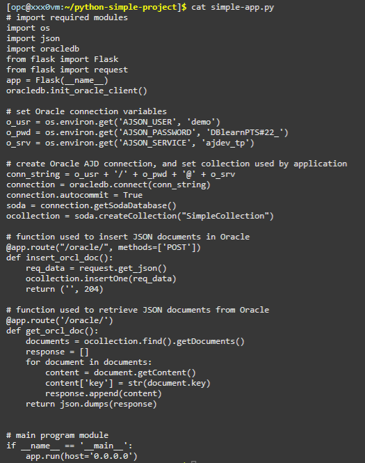

9. **Verify** all connection **variables are correct**. We are using **demo** **user** for Autonomous JSON database and the strong **password** that we have recommended.

    > **Note**: If you have change the user name and password to a different value, please run this commands providing the user and password.

    ````bash
    <copy>
    export AJSON_USER="demo"
    export AJSON_PASSWORD="DBlearnPTS#22_"
    export AJSON_SERVICE="ajdev_tp"
    </copy>
    ````

10. **After checking if all variables are correct**. **Run** simple-app application using the following command:

    ````bash
    <copy>
    nohup python3 simple-app.py > simple-app.log 2>&1 & echo $! > simple.pid
    </copy>
    ````

    We are executing the simple-app.py with **nohup function** for keep using the terminal for the following steps.

    At the same time, with this command, we are **creating a simple-app.log** where you can check how the python app is behaving.

    Additionally we are **creating a file, simple.pid,** to be capable of killing the python app to keep creating the second application for today’s content.

    

11. Lets see what **simple-app.py is doing**, use the following command:

    ````bash
    <copy>
    cat simple-app.log
    </copy>
    ````

    

    If you followed the steps correctly, you should see this output in the cloud shell terminal.

    **Your micro-service simple-app.py is being executed** so we can start inserting the documents.

12. **Copy** the following commands to perform **POST request with CURL client**. Make sure you press **Enter** after each one. First POST:

    ````bash
    <copy>
    curl --request POST \
            --url http://localhost:5000/oracle/ \
            --header 'content-type: application/json' \
            --data '{
        "company":"Company One",
        "address": {
            "street": "22 Rue du Grenier Saint-Lazare",
            "city": "Paris",
            "country": "France"
        },
        "industry":"Financial Services",
        "employees":54234
    }'
    </copy>
    ````

    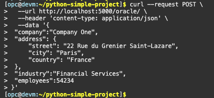

13. **Copy** the following commands to perform **POST request with CURL client**. Make sure you press **Enter** after each one. Second POST:

    ````bash
    <copy>
    curl --request POST \
            --url http://localhost:5000/oracle/ \
            --header 'content-type: application/json' \
            --data '{
        "company":"Company Two",
        "address": {
            "street": "Calle Extramuros 74",
            "city": "Madrid",
            "country": "Spain"
        },
        "industry":"Retail",
        "employees":12345
    }'
    </copy>
    ````

    

14. **Copy** the following commands to perform **POST request with CURL client**. Make sure you press **Enter** after each one. Third and Fourth POST:

    ````bash
    <copy>
    curl --request POST \
            --url http://localhost:5000/oracle/ \
            --header 'content-type: application/json' \
            --data '{
        "company":"Company Three",
        "address": {
            "street": "3A Evergreen St, Ballyphehane",
            "city": "Cork",
            "country": "Ireland"
        },
        "industry":"Manufacturing",
        "employees":98765
    }'
    curl --request POST \
            --url http://localhost:5000/oracle/ \
            --header 'content-type: application/json' \
            --data '{
        "company":"Company Four",
        "address": {
            "street": "aleje Mikołaja Kopernika 32",
            "city": "Piotrków Trybunalski",
            "country": "Poland"
        },
        "industry":"Manufacturing",
        "employees":44444
    }'
    </copy>
    ````

    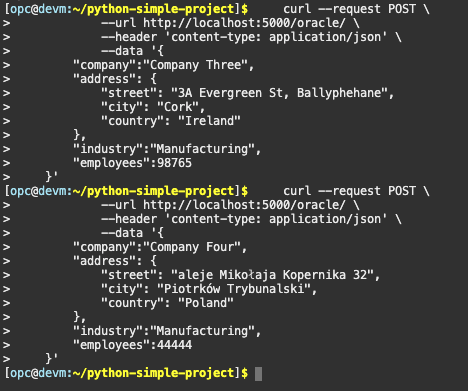


15. Use the **web browser** on your laptop to navigate to your micro-service to list JSON documents inserted into Oracle Autonomous Database.

    http://[DEVM public-ip address]:5000/oracle/

    

16. Go to **cloud shell terminal.** We will **stop simple-app.py** running the following command.

    ````bash
    <copy>
    kill $(cat simple.pid)
    </copy>
    ````

    


## Task 2: The Advantage of APEX and SQL Knowledge

1. Use the **web browser** tab where Oracle Application Express (APEX) is opened, or open Apex from AJDEV using the browser on your laptop. If you need to **Sign In** again use the following credentials:

     - Workspace Name: **demo**
    ```
    <copy>demo</copy>
    ```
    - Database User: **demows**
    ```
    <copy>demows</copy>
    ```
    - Password: **DBlearnPTS#22_**

    > **Note**: The password specified in this lab guide is just an example. Always use strong passwords.

    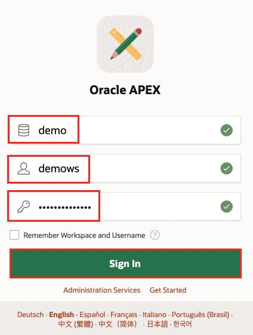

2. Click **SQL Workshop** > **SQL Commands**.

    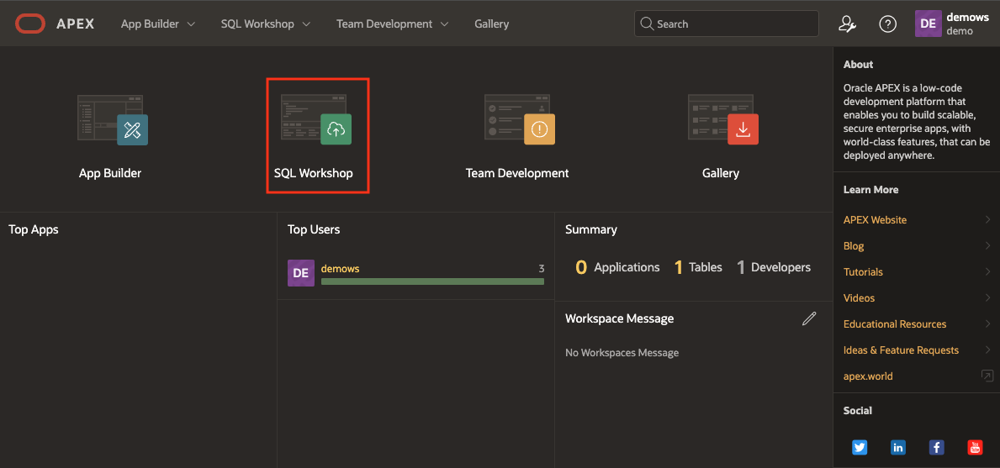
    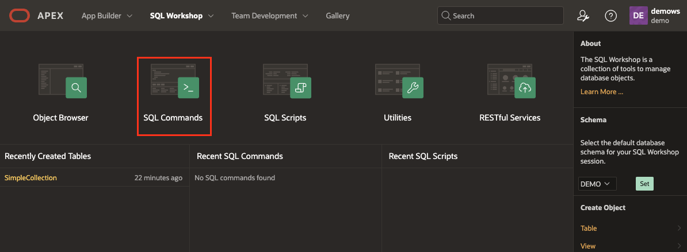

3. **Run** this SQL query:

    ````sql
    <copy>
    select TABLE_NAME from USER_TABLES;
    </copy>
    ````

    

4. **Describe** the table that holds JSON documents data in the collection. The name of the column that stores JSON documents is JSON_DOCUMENT.

    ````sql
    <copy>
    desc "SimpleCollection"
    </copy>
    ````

    

5. SQL dot-notation syntax is designed for easy queries to return JSON values from tables. **Run** a JSON dot-notation query.

    ````sql
    <copy>
    SELECT co.JSON_DOCUMENT.company,
           co.JSON_DOCUMENT.address.country Country,
           co.JSON_DOCUMENT.address.city City,
           co.JSON_DOCUMENT.industry,
           co.JSON_DOCUMENT.employees
        FROM "SimpleCollection" co;
    </copy>
    ````

    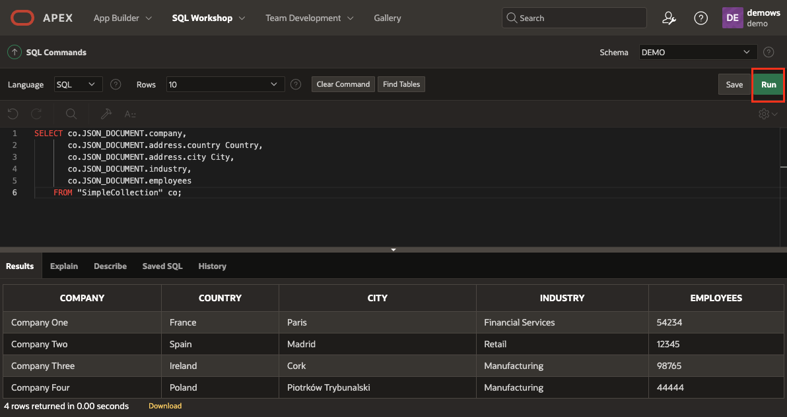

6. JSON data can be accessed via SQL from your applications. Click **App Builder** > **Create**.

    

7. Click **New Application**.

    

8. Provide the following information:

    - Name: **Companies**
    ```
    <copy>Companies</copy>
    ```
    - Click **Add Page**

    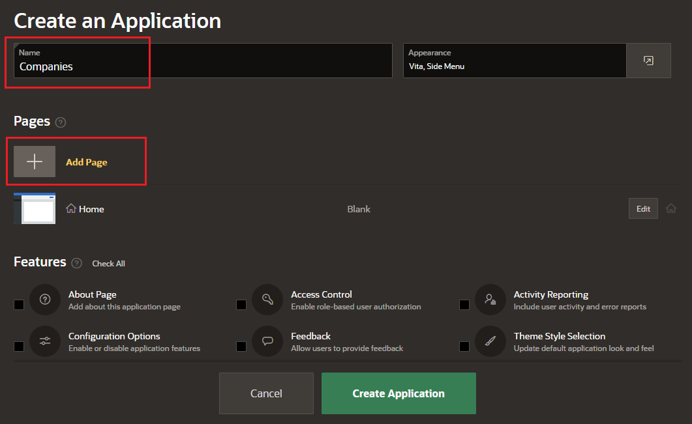

    -  **Interactive Report**

    

    > Note: Be sure you select **Interactive Report** and not **Interactive Grid**, otherwise, you will face an error.

    - Page Name: **Report**
    ```
    <copy>Report</copy>
    ```
    - SQL Query:

    ````sql
    <copy>
    SELECT co.JSON_DOCUMENT.company,
           co.JSON_DOCUMENT.address.country Country,
           co.JSON_DOCUMENT.address.city City,
           co.JSON_DOCUMENT.industry,
           co.JSON_DOCUMENT.employees
        FROM "SimpleCollection" co;
    </copy>
    ````
    - Click **Add Page**

    

    - Click **Create Application**

    

    The application will be create immediately.

    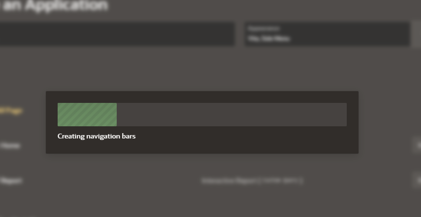

8. Click **Run Application**.

    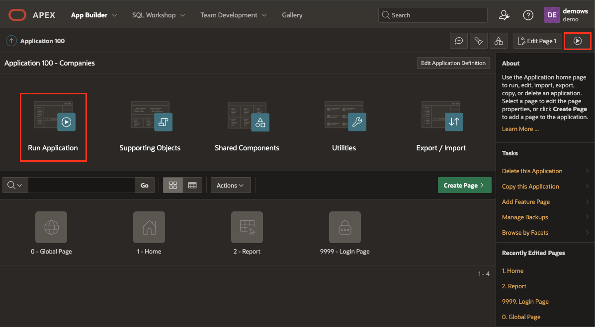

9. **Log In** to Companies using the following credentials:

    - Username: **demows**
    ```
    <copy>demows</copy>
    ```
    - Password: **DBlearnPTS#22_**

    > **Note**: The password specified in this lab guide is just an example. Always use strong passwords.

    

10. Click **Report**.

    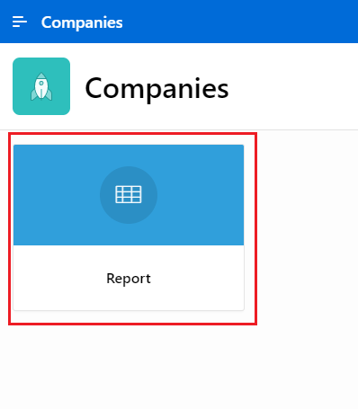

    You can see the Four Companies that we have inserted on the previous Task.

    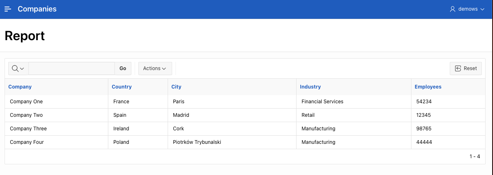

    With Oracle Autonomous Database as a document store, JSON data is valued in the same way as relational data.

You may now **proceed to the next lab**.

## Acknowledgements
* **Author** - Valentin Leonard Tabacaru, Database Product Management and Priscila Iruela, Technology Product Strategy Director
* **Contributors** - Victor Martin Alvarez, Technology Product Strategy Director
* **Last Updated By/Date** - Priscila Iruela, August 2023