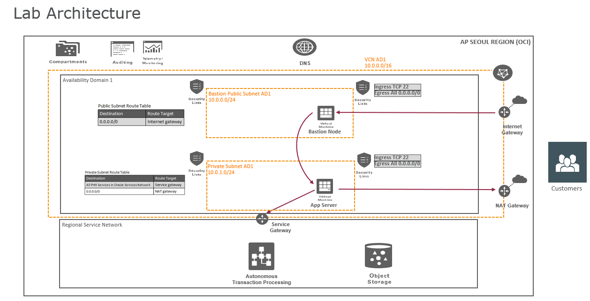
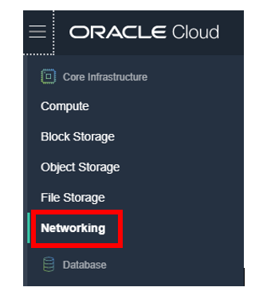
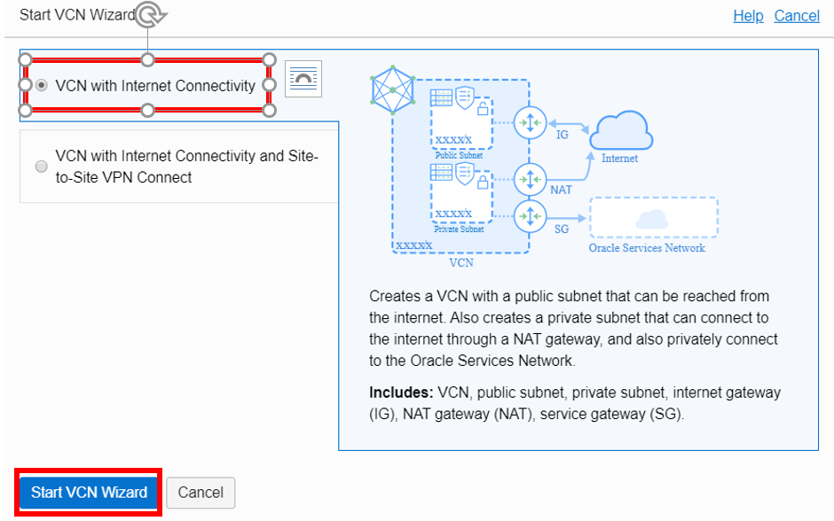
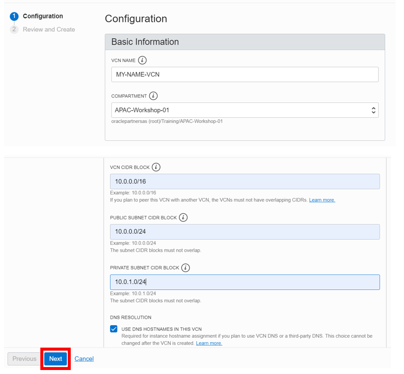
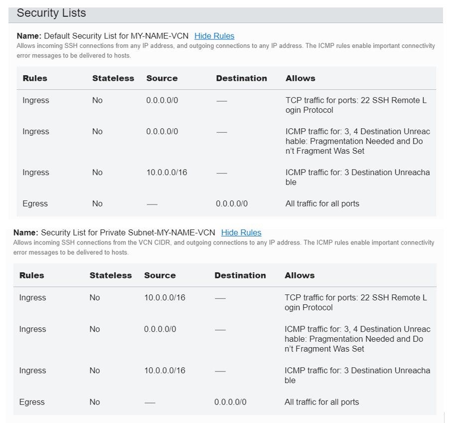
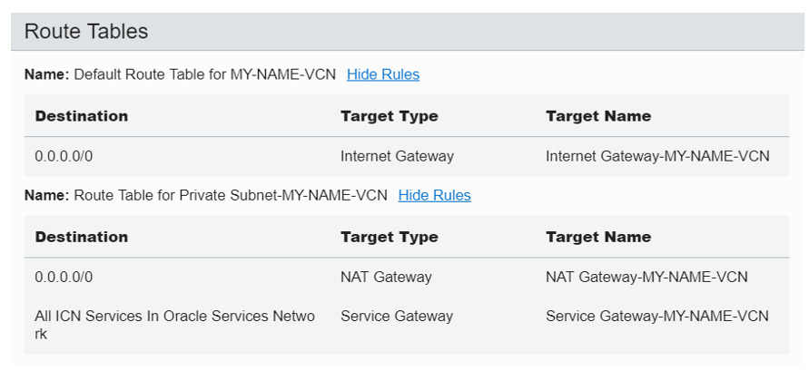
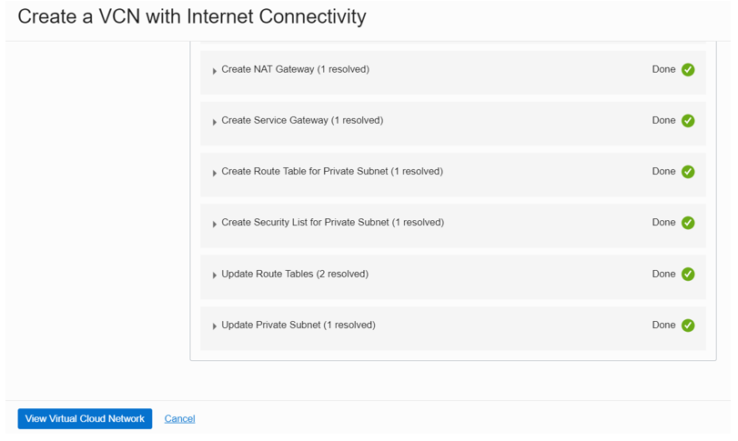
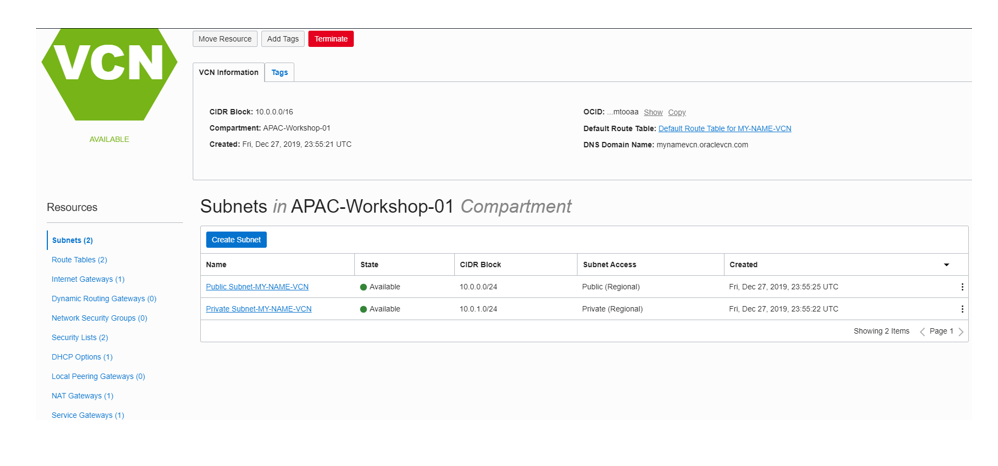
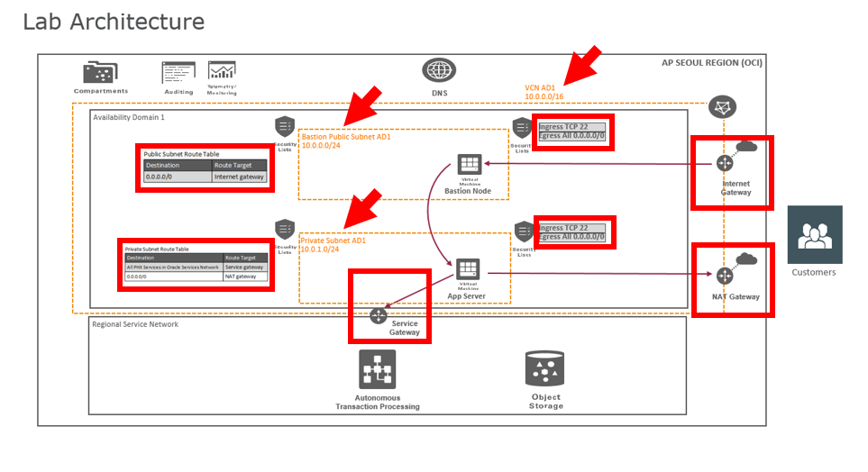

# Create the Virtual Cloud Network #

## Introduction

In this lab you will create a Virtual Cloud Network (VCN) and related network resources. A VCN is similar to your own on premise enterprise network.  In the Oracle Cloud, the network is software defined and virtual. This makes for very fast creation, but still providing high performance, and complete security. The architecture of your lab design follows.

Estimated Time: 10 minutes

### Objective

* Create virtual cloud network

### Prerequisites

* Laptop or desktop computer

* Web browser

* Account access to Oracle Cloud Infrastructure

* You will need an account that allows you to create a VCN, up to two cores of compute, and up to
  three cores of Autonomous Database.

* Always ensure you are in your correct Region and Compartment.

## Task 1: Select your Cloud Region ##

In this step you will create a VCN with the quick start wizard. This will create all the related network resources including a public subnet, private subnet, internet gateway, NAT gateway, Service gateway, default security lists, and default route rules and table.

We are taking the quick option, but there is also a custom option to create resources individually.

1. Select your Region on the upper right of the OCI console

2. Select the cloud services hamburger menu on the top left corner and select Networking

    

3. Select Virtual Cloud Networks

4. Select your Compartment

5. Click Start VCN Wizard

  

## Task 2: Create the Network  ##

1. Select VCN and Internet Connectivity

2. Click Start VCN Wizard

    

3. Enter a unique name for your VCN

4. Select your assigned compartment

5. Enter a VCN CIDR block of 10.0.0.0/16.  Note: The CIDR Block is the range of IP addresses that can be used.

6. Enter the public subnet CIDR block of 10.0.0.0/24

7. Enter the private subnet CIDR block of 10.0.1.0/24. Note: A private subnet is not visible to the
   internet and is accessible from inside the VCN only.

8. Select use DNS hostnames

9. Click Next

  

  A summary is displayed.

  You can view the default security and route rules that will be created.

10.  Scroll to Security List and click Show Rules

   

   

11. Click Create.

    The VCN is created instantaneously with all the default network resources.

   
12. Click View Virtual Cloud Network to see the details and what has been created.

   

    You will see a number of resources created including public, private subnets, default security list, default route table, and the gateways.

    

    Below is a diagram of what has been created by the Networking Quickstart.  All these resources were created in seconds.

    

You may now proceed to the next lab.

## Acknowledgements ##

- **Author** - Milton Wan, Satyabrata Mishra - Database Product Management, April 2020
