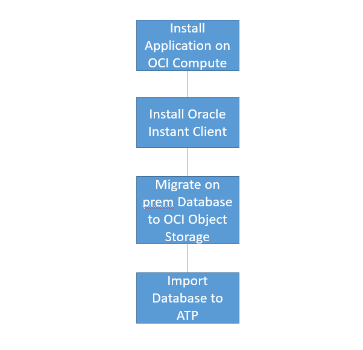
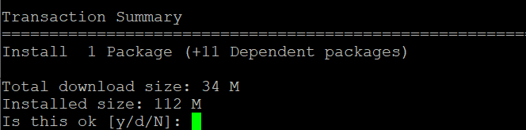
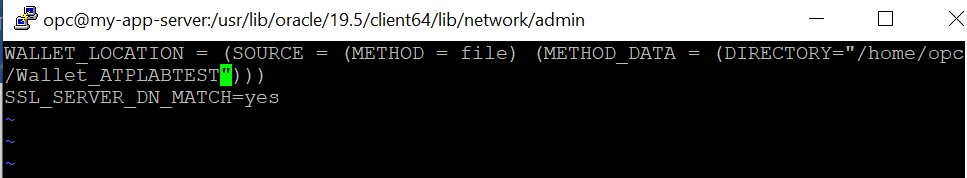
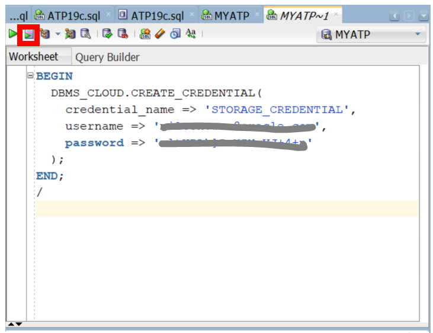
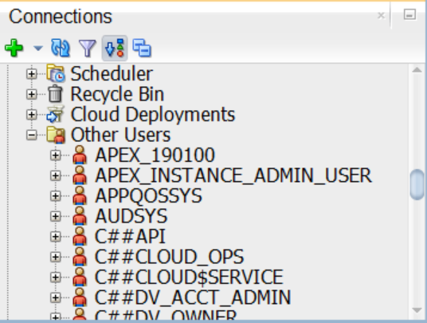

# Install the Application and Migrate the Database #

## Introduction

This lab will demonstrate the move and improve process to OCI and ATP. We assume that the original application and database were running on premise.  We will now install the application on the App Server and migrate the on premise Oracle database to ATP. We will then run the application workload against the ATP database, scale the workload, and see why ATP’s capability is an improvement over an on premise database.

The sample application we will use is Swingbench with an associated database to store the data for Swingbench, but imagine this is your own application. This is the flow of the move and improve process.



Estimated Time: 2 hours

### Objectives

* install the Swingbench application on App Server.
* install oracle client and configure the software.
* Migrate the Data to Autonomous Database.


### Prerequisites

* Web Browser
* SSH public and private keys
* PuTTY or equivalent
* SQL Developer 19.1 or higher
* Soedump18C_1G.dmp file (provided by Instructor if instructor-led class)
* OCI Auth Token password (provided by Instructor if instructor-led class)

## Task 1: Install Swingbench on the App Server ##

   Swingbench is a popular application that can be set up to drive a workload against the Oracle database. We will configure it to drive many OLTP transactions so it saturates the database CPU cores to near 100% utilization.

   Install and configure the Swingbench application on the App Server.

1. SSH to your App Server. Replace with your SSH key and private IP address.

    ```
    $ <copy>ssh -i privatekey opc@10.0.1.2</copy>
    ```

    By default, Java is not installed on the compute VM so we will need to install it via yum.
    We’ll need to update yum first.

2.  From your App Server session execute the following.

     ```
     $ <copy>sudo yum makecache fast</copy>
     ```

3. Then install Java and its dependencies

    ```
    $ <copy>sudo yum install java-1.8.0-openjdk-headless.x86_64</copy>
    ```

      Type **y**  
                                               

4. Let’s check the version and make sure that java works correctly.

    ```
    $ <copy>java -version</copy>
    ```

5. We can now pull the Swingbench code from the website

    ```
    $ <copy>curl 'https://www.dominicgiles.com/swingbench/swingbenchlatest.zip' -H 'User-Agent: Mozilla/5.0' -H 'Referer: https://www.dominicgiles.com/downloads.html' -o swingbench.zip</copy>
    ```

6. Unzip it and check the files

    ```
    $ <copy>unzip swingbench.zip</copy>
    $ <copy>cd swingbench/bin</copy>
    $ <copy>ls</copy>
    ```

The application is now installed. You should see the Swingbench application files.

Now we will install the Oracle Instant Client software which has tools to help us move the on premise database to the Oracle Cloud.   

## Task 2: Install the Oracle Instant Client

   To prepare for moving the Swingbench database to ATP, we need the Data Pump import tool. It’s in the Oracle Instant Client software. We will install the Oracle Instant Client software packages from the yum server.

1. Connect to your App Server.

2. Get the latest repository version from the closest region yum server

    Make sure you get the end quote for the export.

    ```
    $ <copy>cd /etc/yum.repos.d</copy>

    $ <copy>export REGION=`curl http://169.254.169.254/opc/v1/instance/ -s | jq -r '.region'| cut -d '-' -f 2`</copy>

    $ <copy>echo $REGION</copy>

    $ <copy>sudo -E wget http://yum-$REGION.oracle.com/yum-$REGION-ol7.repo</copy>
    ```

3. Enable the Instant Client repository

    ```
    $ <copy>sudo yum-config-manager --enable ol7_oracle_instantclient</copy>
    ```

4. List the packages

    ```
    $ <copy>sudo yum list oracle-instantclient*</copy>
    ```

5. Install the version 18.5 Instant Client Basic, SQL Plus, Tools RPM packages.

    ```
    $ <copy>sudo yum install -y oracle-instantclient18.5-basic oracle-instantclient18.5-sqlplus oracle- instantclient18.5-tools</copy>
    ```


## Task 3: Configure the Instant Client software

 1.  Locate the ATP wallet and unzip it to a wallet folder. Note the extracted files cwallet.sso,
     sqlnet.ora and  tnsnames.ora.

     Replace the names below with your own files.  ie: replace the sample Wallet_ATPLABTEST with your own wallet.

     ```
     $ <copy>cd /home/opc</copy>

     $ <copy>mkdir Wallet_ATPLABTEST</copy>

     $ <copy>mv Wallet_ATPLABTEST.zip Wallet_ATPLABTEST</copy>

     $ <copy>cd Wallet_ATPLABTEST</copy>

     $ <copy>unzip Wallet_ATPLABTEST.zip</copy>

     $ <copy>ls</copy>
     ```

2. Copy sqlnet.ora and tnsnames.ora to /usr/lib/oracle/18.5/client64/lib/network/admin directory

    ```
    $ <copy>ls /usr/lib/oracle/18.5/client64/lib/network/admin</copy>
    $ <copy>sudo cp sqlnet.ora /usr/lib/oracle/18.5/client64/lib/network/admin/sqlnet.ora</copy>
    $ <copy>sudo cp tnsnames.ora /usr/lib/oracle/18.5/client64/lib/network/admin/tnsnames.ora</copy>
    $ <copy>cd /usr/lib/oracle/18.5/client64/lib/network/admin</copy>
    ```

3. Edit the sqlnet.ora

    ```
    $ <copy>sudo vi sqlnet.ora</copy>
    ```

4. Set the WALLET_LOCATION parameter to point to the wallet directory containing
   the cwallet.sso file as shown by the example below

    

4. Exit and save the file                               

5. View your tnsnames.ora and note your five services; high, medium, low, tp, tpurgent
6. Export the bin path
7. Test the Instant Client with SQLPlus, the username is admin, but enter your password and service name

    ```
    $ <copy>more tnsnames.ora</copy>

    $ <copy>export PATH=/usr/lib/oracle/18.5/client64/bin:$PATH</copy>

    $ <copy>export LD_LIBRARY_PATH=/usr/lib/oracle/18.5/client64/lib</copy>

    $ <copy>sqlplus admin/<password>@<service_tp></copy>
    ```

### Move the On Premise Database to Oracle Cloud ###

There are a number of ways to move or migrate your existing on premise Oracle database to the Oracle Cloud. In this lab the instructor has already used Data Pump to export the on premise database to a .dmp file and uploaded the .dmp file to the Oracle Object Storage. It's now a matter of importing the .dmp file to Autonomous Database from the Object Storage.   

The .dmp file has been copied to the Object Storage.  You will use this in a later step.

AShburn, US East:
```
<copy>
https://c4u04.objectstorage.us-ashburn-1.oci.customer-oci.com/p/EcTjWk2IuZPZeNnD_fYMcgUhdNDIDA6rt9gaFj_WZMiL7VvxPBNMY60837hu5hga/n/c4u04/b/livelabsfiles/o/developer-library/soedump18C_1G.dmp
</copy>
```

Note: You can use the Data Pump procedure for your own database and migration projects.

## Task 4: Set Credential for ATP to access the Object Store

   In order for ATP to access the Oracle Object Storage we need to create a credential and then set the credential in the ATP database.

1. Connect to your ATP from SQL Developer

   From the SQL Developer worksheet create a credential for ATP to access the object store. You will need to run the DBMS\_CLOUD.CREATE\_CREDENTIAL package below from your ATP session. Replace the names with your own names.

2. Give the credential a name

3. Provide your OCI login username

4. Provide the OCI Auth Token password to access the Object Storage.
   You should have created this in the earlier lab.  
   For the instructor-led class this password will be provided to you.

    ```
    <copy>
    BEGIN
    DBMS_CLOUD.CREATE_CREDENTIAL(
    credential_name => '<credential name>',
    username => '<your oci login username>',
    password => '<auth token password>'
    );
    END;

    /</copy>
    ```

5. Run the script
      

  While we are in SQL Developer check to see if you have the SOE schema in the Other Users folder. You should not see it.  We will import this Swingbench database schema later.

      


## Task 5: Import the Dump File to the Autonomous Database

Once you have the database dump file in the Object Storage you can import it into ATP. To run the Data Pump Import you will log in to the App Server compute with the Instant Client software and the wallet to your ATP.

Execute the impdb statement below from your compute with Instant Client software.

1. Enter your admin password, and connect to your ATP with **high** service.  
   The high service will give us parallelism during the import.
2. Enter the credential name you created in the previous step.
3. Your dumpfile will point to the object store uri with the soedump18C_1G.dmp file.
4. Set parallel import to 2 since we can use 2 the OCPU cores in ATP.

    ```
    $ <copy>impdp admin/<password>@<My_ATP_high> directory=data_pump_dir credential=<credential name> schemas=soe dumpfile=https://c4u04.objectstorage.us-ashburn-1.oci.customer-oci.com/p/EcTjWk2IuZPZeNnD_fYMcgUhdNDIDA6rt9gaFj_WZMiL7VvxPBNMY60837hu5hga/n/c4u04/b/livelabsfiles/o/developer-library/soedump18C_1G.dmp logfile=import.log parallel=2</copy>
    ```

  It should take about 15-25 minutes to import.  If successful, you will see a similar output like the following:

    ```
    Import: Release 18.0.0.0.0 - Production on Tue Dec 24 19:21:02 2019

    Version 18.5.0.0.0


    Copyright (c) 1982, 2019, Oracle and/or its affiliates. All rights reserved.


    Connected to: Oracle Database 18c Enterprise Edition Release 18.0.0.0.0 - Production


    Master table "ADMIN"."SYS_IMPORT_SCHEMA_01" successfully loaded/unloaded

    Starting "ADMIN"."SYS_IMPORT_SCHEMA_01": admin/********@atp18c_high directory=data_pump_dir credential=STORAGE_CREDENTIAL schemas=soe dumpfile=https://c4u04.objectstorage.us-ashburn-1.oci.customer-oci.com/p/EcTjWk2IuZPZeNnD_fYMcgUhdNDIDA6rt9gaFj_WZMiL7VvxPBNMY60837hu5hga/n/c4u04/b/livelabsfiles/o/labfiles/soedump18C_1G.dmp logfile=import.log parallel=2

    Processing object type SCHEMA_EXPORT/USER

    Processing object type SCHEMA_EXPORT/SYSTEM_GRANT

    Processing object type SCHEMA_EXPORT/ROLE_GRANT

    Processing object type SCHEMA_EXPORT/DEFAULT_ROLE

    Processing object type SCHEMA_EXPORT/TABLESPACE_QUOTA

    Processing object type SCHEMA_EXPORT/PASSWORD_HISTORY

    Processing object type SCHEMA_EXPORT/PRE_SCHEMA/PROCACT_SCHEMA

    Processing object type SCHEMA_EXPORT/SEQUENCE/SEQUENCE

    Processing object type SCHEMA_EXPORT/TABLE/TABLE

    Processing object type SCHEMA_EXPORT/TABLE/TABLE_DATA

    . . imported "SOE"."PRODUCT_INFORMATION"         187.1 KB  1000 rows

    . . imported "SOE"."LOGON"                57.91 MB 2686349 rows

    . . imported "SOE"."ADDRESSES"              116.5 MB 1585588 rows

    . . imported "SOE"."CARD_DETAILS"            67.87 MB 1585457 rows

    . . imported "SOE"."ORDERS"               149.4 MB 1657624 rows

    . . imported "SOE"."WAREHOUSES"             35.34 KB  1000 rows

    . . imported "SOE"."INVENTORIES"             15.18 MB 896376 rows

    . . imported "SOE"."PRODUCT_DESCRIPTIONS"        220.0 KB  1000 rows

    . . imported "SOE"."CUSTOMERS"              117.5 MB 1085457 rows

    . . imported "SOE"."ORDERENTRY_METADATA"         5.617 KB    4 rows

    . . imported "SOE"."ORDER_ITEMS"             258.0 MB 4991509 rows

    Processing object type SCHEMA_EXPORT/PACKAGE/PACKAGE_SPEC

    Processing object type SCHEMA_EXPORT/PACKAGE/COMPILE_PACKAGE/PACKAGE_SPEC/ALTER_PACKAGE_SPEC

    Processing object type SCHEMA_EXPORT/VIEW/VIEW

    Processing object type SCHEMA_EXPORT/PACKAGE/PACKAGE_BODY

    Processing object type SCHEMA_EXPORT/TABLE/INDEX/INDEX

    Processing object type SCHEMA_EXPORT/TABLE/CONSTRAINT/CONSTRAINT

    Processing object type SCHEMA_EXPORT/TABLE/INDEX/STATISTICS/INDEX_STATISTICS

    Processing object type SCHEMA_EXPORT/TABLE/STATISTICS/TABLE_STATISTICS

    Processing object type SCHEMA_EXPORT/STATISTICS/MARKER

    Processing object type SCHEMA_EXPORT/POST_SCHEMA/PROCACT_SCHEMA

    ORA-39082: Object type PACKAGE BODY:"SOE"."ORDERENTRY" created with compilation warnings


    Job "ADMIN"."SYS_IMPORT_SCHEMA_01" completed with 1 error(s) at Tue Dec 24 19:25:42 2019 elapsed 0 00:04:36
    ```


  In SQL Developer check to see if you have the SOE schema in the Other Users folder now. You should see that it has been imported.

  Upon import, there was a compilation issue. To fix the issue, the following SQLs grant the missing privilege and recompile the ORDERENTRY package.
     ```
     SQL><copy>GRANT EXECUTE ON DBMS_LOCK TO SOE;</copy>
     SQL><copy>ALTER PACKAGE SOE.ORDERENTRY COMPILE;</copy>
     ```


  (Optional) To view the import.log you must put it into an Oracle Object Store bucket and then download it to your laptop and view with a text editor.  An example of putting the file in the Object Store bucket is shown below.  

      ```
      <copy>
      BEGIN
      DBMS_CLOUD.PUT_OBJECT(
      credential_name=>'STORAGE_CREDENTIAL_NAME',
      object_uri=>'https://objectstorage.ap-seoul-1.oraclecloud.com/n/oraclepartnersas/b/bucket_name/o/import.log', directory_name=>'DATA_PUMP_DIR',
      file_name=>'import.log');
      END;

      /
      </copy>
      ```


  Now that we have both the application installed on the App Server and the database imported to ATP we are ready to run the workload.

 You may now proceed to the next lab.


## Acknowledgements ##

- **Author** - Milton Wan, Satyabrata Mishra - Database Product Management, August 2021
