# Managing Storage Volumes and Images #

## Introduction

Volumes are important to the move and improve process to OCI. In this section we are going to look at some of the Boot and Block Volume features.  Handling volumes will give you a better understanding of how to move applications and data.

A Block Volume can be detached from an instance and moved to a different instance without the loss of data. This data persistence enables you to migrate data between instances and ensures that your data is safely stored, even when it is not connected to an instance. Any data remains intact until you reformat or delete the volume.

A Custom Image can be created from an existing Boot Volume. You can then use this custom image to launch additional instances. i.e. for test, development, or production environments.

Estimated Time: 1 hour 30 minutes

### Objectives

* Managing Storage Volumes and Images.
* Create instance from custom Image.
* Clone Autonomous Database.

### Prerequisites

* Web browser
* Public and private keys
* WinSCP or equivalent
* PuTTY or equivalent
* SQL Developer 19.1 or higher

## Task 1: Create a Custom Image ##

1. Click on your App Server compute details. Note: you can’t create an image of the Bastion because
   it is already an Oracle image, ie: the Cloud Developer image.
2. Select the Actions dropdown menu
3. Select Create Custom Image
4. Select your compartment
5. Give your custom image a name
6. Click Create Custom Image

    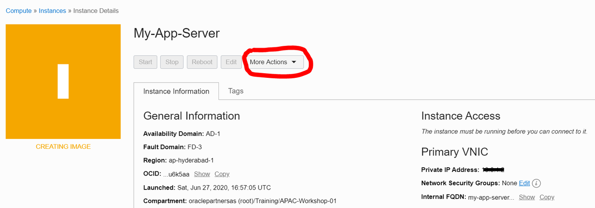

    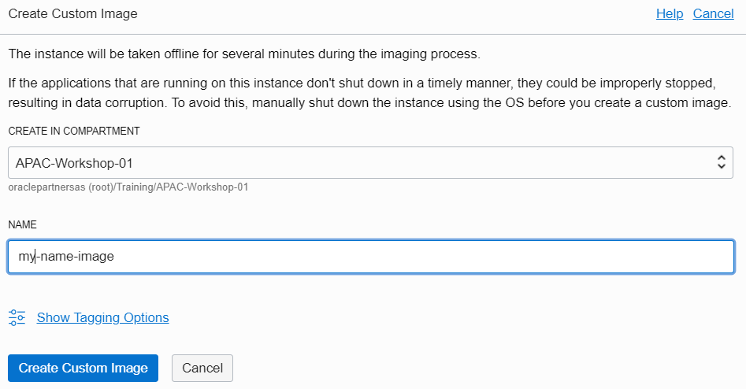

  When your custom image is created you should see the Work Requests as below. Work Requests are located on the left side Resources menu.

    

7. Select Compute then Custom Images menu and you should see your custom image created.

    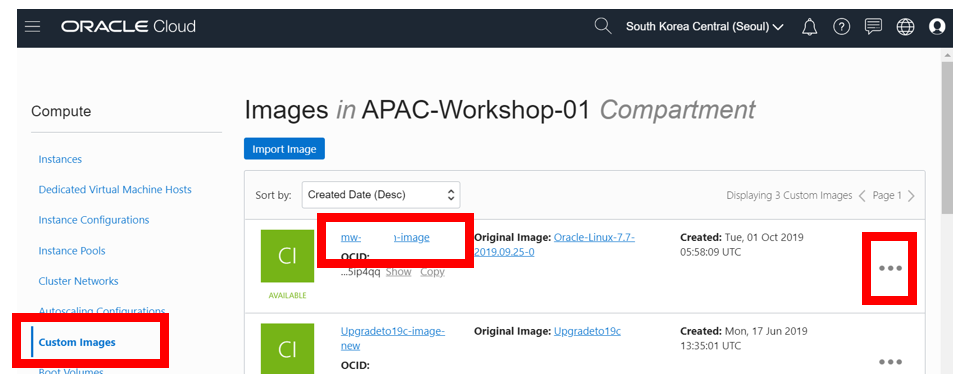


   You can now use this image to launch another instance by selecting the 3 dots action … menu. You can also export this image to the OCI Object Storage for use by others.

## Task 2: Create a New Instance from Custom Image ##

1. Click on the Custom Image 3 dots action menu … on the right
2. Select Create Instance
3. Create the Instance in your compartment and VCN and this time let’s put it in the public subnet
4. Make sure to select assign public IP address
5. Enter your public key

  Your new instance will be created in a few minutes with the App Server and Swingbench application already imaged.
   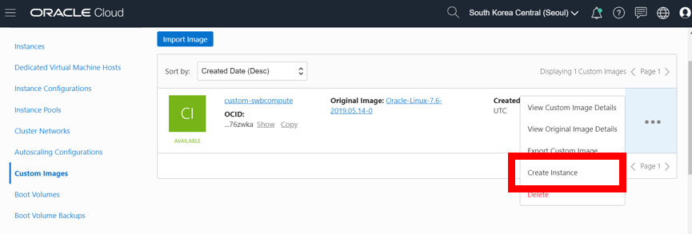

6. SSH into your new compute with the public IP address and the private key.

7. Check your image and it’s contents. Is your ATP wallet there? Is your Swingbench workload software there?

8. Ping 8.8.8.8 to check network access to internet, then run the workload again.

   We just did a lift and shift to another compute instance with the same Swingbench workload software!
      ```
      $<copy>ls</copy>
      $<copy>ping 8.8.8.8</copy>
      $<copy>cd swingbench/bin</copy>
      ```

   Replace the script below with your wallet and service name.

      ```
      $<copy>./charbench -c ../configs/SOE_Server_Side_V2.xml \
      -cf ~/Wallet_ATPLABTEST/Wallet_ATPLABTEST.zip \
      -cs atplabtest_tp \
      -u soe \
      -p Welcome#2018 \
      -v users,tpm,tps \
      -intermin 0 \
      -intermax 0 \
      -min 0 \
      -max 0 \
      -uc 128 \
      -di SQ,WQ,WA \
      -rt 0:30.00</copy>
      ```

 Your workload should run as before with your new compute instance.

## Task 3: Clone ATP

  Let’s now clone the ATP service and run the workload against it. Cloning allows you to clone a complete copy of the database or just the metadata.  We will clone a complete copy.

1. Navigate to your ATP service

2. Select Create Clone from the Actions menu

3. Create a Full Clone from database instance, which will clone data and metadata
    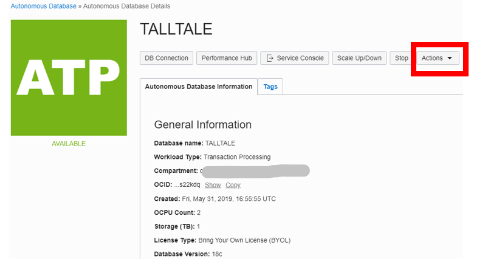

    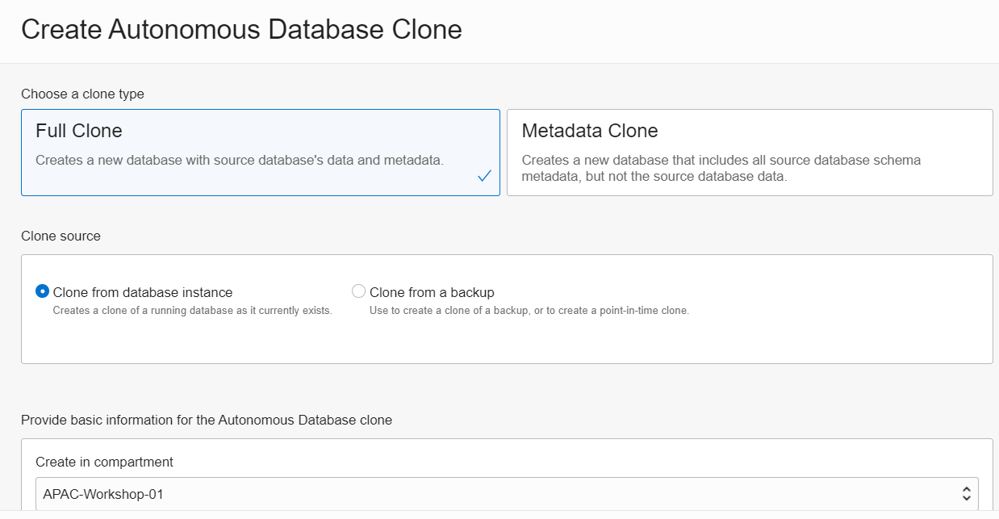


4. Select database version 19c, 2 cores, 1 TB

5. Enable Auto Scaling

6. Enter a database password

7. Select BYOL

8. Create Autonomous Database Clone
   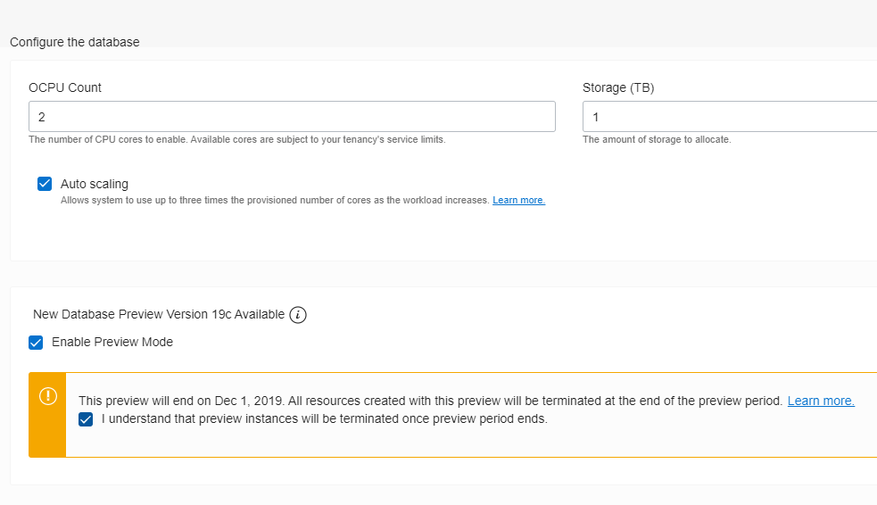


The Clone will be created in 15-20 minutes.  It will have a new Wallet.  Notice the source database is still running.

9. Download the new Wallet

10. Run the workload again from your new client, but remember to:

   * Copy the new wallet to your new client.

   * Unzip the wallet

   * Add the new database services to tnsnames.ora

   * Edit the sqlnet.ora to point to the new wallet

   * and change the Wallet and Connection Service name in the script below

   *  Troubleshooting: Test the connection with SQLPlus.

      ```
      $ <copy>export PATH=/usr/lib/oracle/18.5/client64/bin:$PATH</copy>

      $ <copy>export LD_LIBRARY_PATH=/usr/lib/oracle/18.5/client64/lib</copy>

      $ <copy>sqlplus admin/<password>@<service_tp></copy>
      ```

     ```
     $<copy>./charbench -c ../configs/SOE_Server_Side_V2.xml \
     -cf ~/Wallet_ATPLABTEST/Wallet_ATPLABTEST.zip \
     -cs atplabtest_tp \
     -u soe \
     -p Welcome#2018 \
     -v users,tpm,tps \
     -intermin 0 \
     -intermax 0 \
     -min 0 \
     -max 0 \
     -uc 128 \
     -di SQ,WQ,WA \
     -rt 0:30.00</copy>
     ```

Your workload will now run against the cloned ATP.   

## Task 4: Managing Boot Volumes

   Let's now terminate the newly created compute instance from the custom image, but keep the Boot Volume

1. Select terminate from the compute action menu

2. Do not check the box, just click on Terminate Instance

   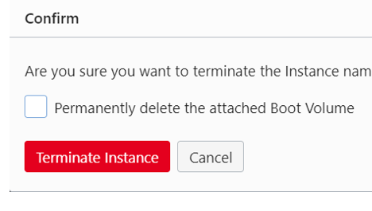

 3. Once the instance is terminated the boot volume can be found in storage ->block storage-> boot volume
    and your volume is still available to be attached to any new instance

   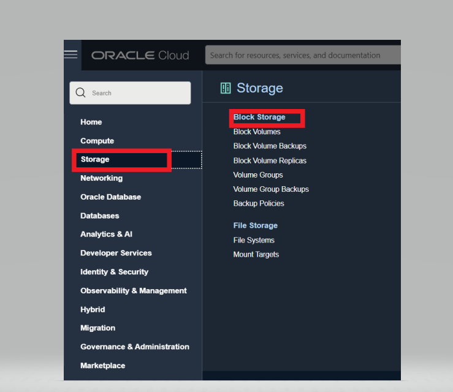

   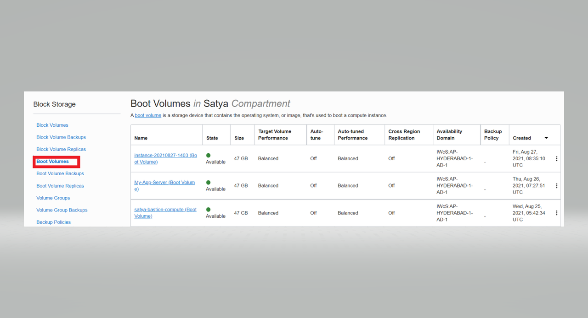


## Task 5: Export the Custom Image to the Object Storage

    Now let’s export your custom image to the Oracle Object Store so it can be used by others.

 1. From the Custom Images action menu, select Export

       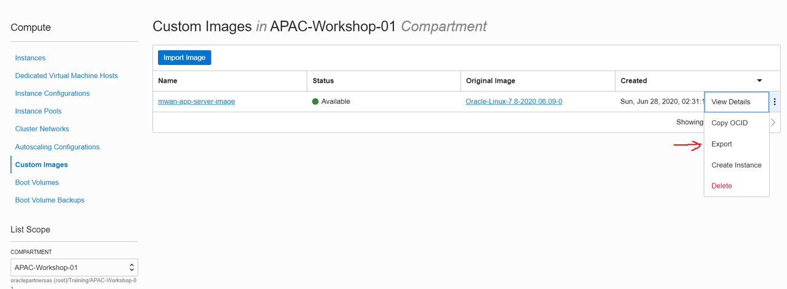


  2. Select the bucket you want to export the image. If you don’t have a bucket, you can create
     one in the Object Storage.

  3. Give it a name

      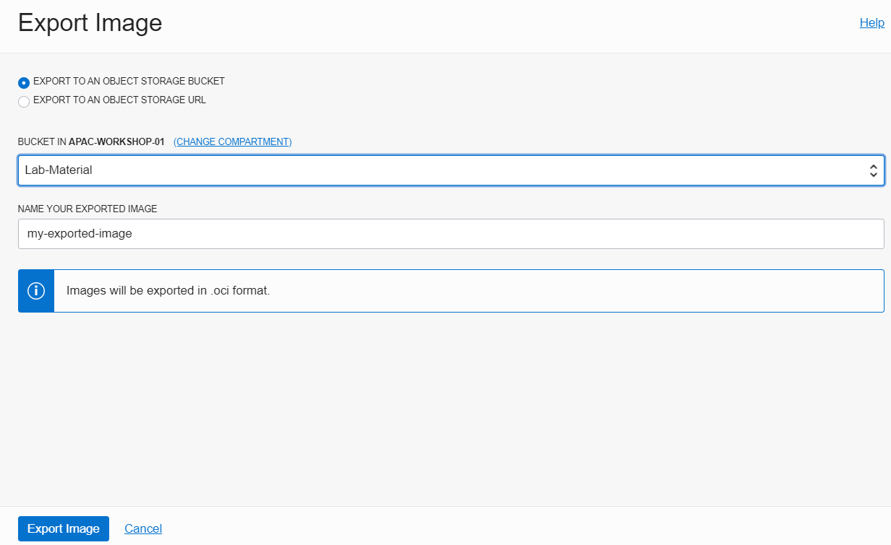


    Once the image is available in the Object Store, you can download it, or even retrieve it to other cloud regions.


## Task 6: Importing your own Image (Optional)

   To begin your move and improve projects from on premise to the Oracle Cloud you can import images to the Object Store, and then attach them to compute instances in the cloud. Your images must first conform to the following virtual machine disk formats: VMDK, QCOW2 (KVM), or OCI. The image must have been uploaded from your on premise to the Object Store for the import.

  There are tools you can use on premise to create the virtual machine disk formats.

  Example for QCOW2.

  qemu-img create -f qcow2 ~/images/disk1.img 10G

  Also for converting between formats.

  qemu-img convert –f raw –O qcow2 image.img image.qcow2

  The following example process describes how to lift a disk image from on prem to the Object Store. Then import the image from the Object Store so it can be used to create an instance.

1. Create an image of your on prem disk to one of the formats: VMDK, QCOW2 (KVM)
2. Upload the image to your object store bucket
3. Navigate to Compute Custom Images and Import the image
4. Select a compartment to import
5. Give your image a name
6. Select the operating system
7. Select the bucket and image object name
8. Select the image type
9. Select the launch mode

  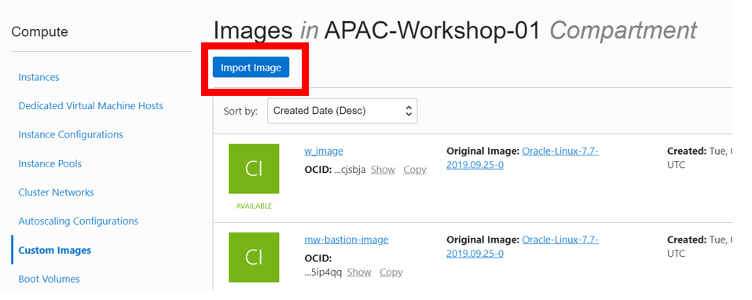

  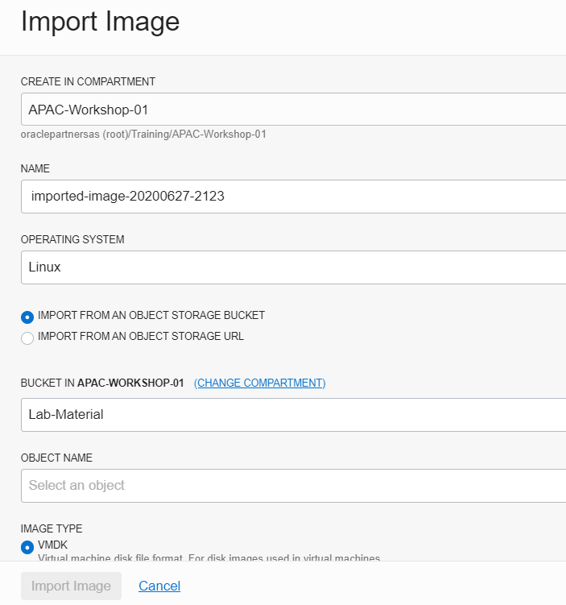


## Task 7: Create New Block Volume

   Let’s add a non bootable block volume.  Block volumes are useful for expanding your block storage for more data or installing additional applications.

1. Navigate to Block Storage and Block Volumes

2. Enter a name of the volume

3. Select your compartment

4. Select your Availability Domain

5. Select the default volume size and performance.  In custom, you can create volumes for low cost to
   high performance.

6. Set a Backup Policy like Bronze

   Gold - The gold policy includes daily incremental backups. These backups are retained for seven days. This policy also includes weekly incremental backups that run on Sunday and are retained for four weeks. Also includes monthly incremental backups, run on the first day of the month, retained for twelve months, and a full backup, run yearly on January 1st. Full backups are retained for five years.

   Silver - The silver policy includes weekly incremental backups that run on Sunday. These backups are retained for four weeks. This policy also includes monthly incremental backups, run on the first day of the month and are retained for twelve months. Also includes a full backup, run yearly on January 1st. Full backups are retained for five years.

   Bronze - The bronze policy includes monthly incremental backups, run on the first day of the month. These backups are retained for twelve months. This policy also includes a full backup, run yearly on January 1st. Full backups are retained for five years.

7. Encrypt using Oracle Managed Keys.  You can also provide your own encryption keys.

8. Create

  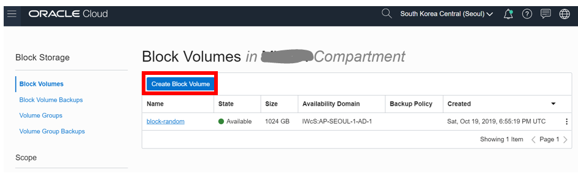

  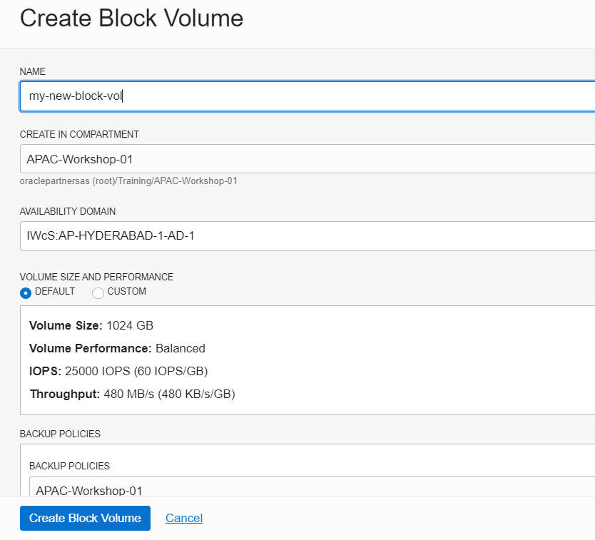

  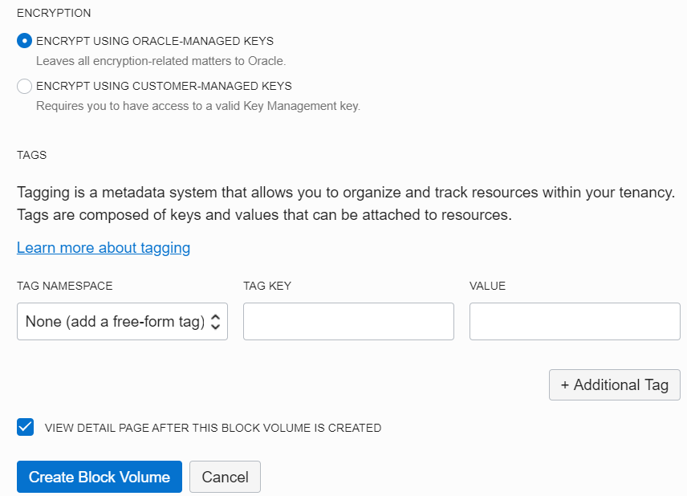


  You now have a block volume that you can attach to your instance.

## Task 8: Copying Block Volumes Across Regions

   Block volumes can be backed up manually outside of the auto backup policy. Once backed up it can even be copied across regions.

1. Navigate to Block Volumes
2. Select the 3 dot menu and select Create Manual Backup
3. Provide your manual backup a name
4. Indicate full or incremental backup

   You can see the status in Block Volume Backups

   Once you have created a manual backup, you can  Copy to Another Region.  This is useful if your application is deployed in more than one region.
   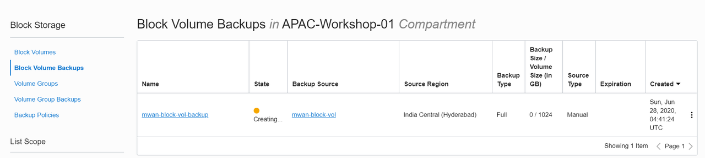

   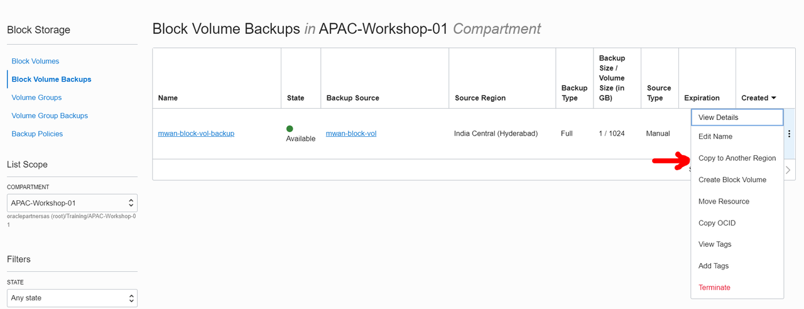


 Congrats you finished the workshop.

## Acknowledgements ##

- **Author** - Milton Wan, Satyabrata Mishra - Database Product Management, August 2021
