# Application Containers #

## Introduction
This is a series of 12 hands-on labs designed to familiarize you with the Application Container functionality of Oracle Multitenant. In these labs, we follow the journey of a notional company, Walt’s Malts, as their business expands from a single store to a global powerhouse – “from startup to starship”.

*Estimated Workshop Time*: 1 hour

[](youtube:ZPOjjF3kCvo)

### Prerequisites
This lab assumes you have:
- A Free Tier, Paid or LiveLabs Oracle Cloud account
- SSH Private Key to access the host via SSH
- You have completed:
    - Lab: Generate SSH Keys (*Free-tier* and *Paid Tenants* only)
    - Lab: Prepare Setup (*Free-tier* and *Paid Tenants* only)
    - Lab: Environment Setup
    - Lab: Clone, Plug and Drop

## Task 1: Connect to Your Instance and Login

This Lab assumes that you have already Initialized your environment as instructed in "*Lab: Clone, Plug and Drop*". If you haven't please return to that lab and execute "*Step 0*" at the minimum.

1. If you've disconnected from the session you established while running the previous lab, please reconnect to your instance as user "*opc*"

    ```
    ssh -i ~/.ssh/<sshkeyname> opc@<Your Compute Instance Public IP Address>
    ```

2. Then, login using the following commands:
    ```
    <copy>
    sudo su - oracle
    cd /home/oracle/labs/multitenant
    </copy>
    ```

    ```
    <copy>. oraenv</copy>
    CDB1
    ```

    ```
    <copy>
    sqlplus /nolog
    </copy>
    ```

    ```
    <copy>connect sys/oracle@localhost:1523/cdb1 as sysdba</copy>
    ```

## Task 2: Instant SaaS
This section shows how Multitenant with Application Containers provides an instant SaaS architecture for an application formerly architected for standalone deployment.

The tasks you will accomplish in this step are:
- Setup Application Root - wmStore_Master
- Install v1 of Application wmStore in Application Root
- Create and sync Application Seed and provision Application PDBs for four franchises: Tulsa, California, Tahoe, NYC
- Populate Application Tenant PDBs with demo data.

1. Connect to **CDB1**.

    ```
    <copy>sqlplus /nolog</copy>
    ```

    ```
    <copy>connect sys/oracle@localhost:1523/cdb1 as sysdba</copy>
    ```

    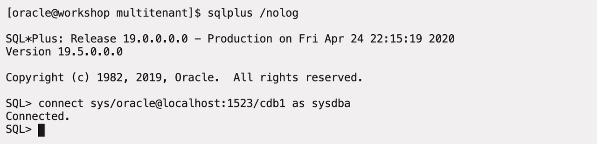

2. Create and open the master application root.

    ```
    <copy>conn system/oracle@localhost:1523/cdb1;</copy>
    ```

    ```
    <copy>create pluggable database wmStore_Master as application container
    admin user wm_admin identified by oracle;</copy>
    ```

    ```
    <copy>alter pluggable database wmStore_Master open;</copy>
    ```

    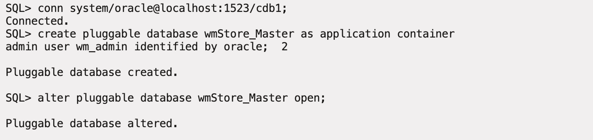

3. Define the application master.

    ```
    <copy>conn system/oracle@localhost:1523/wmStore_Master;</copy>
    ```

    ```
    <copy>alter pluggable database application wmStore begin install '1.0';</copy>
    ```

    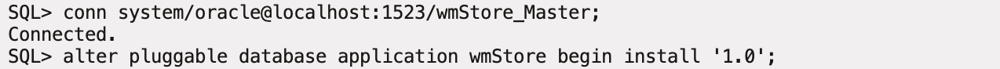

    ```
    <copy>create tablespace wmStore_TBS datafile size 100M autoextend on next 10M maxsize 200M;</copy>
    ```

    ```
    <copy>create user wmStore_Admin identified by oracle container=all;</copy>
    ```

    ```
    <copy>grant create session, dba to wmStore_Admin;</copy>
    ```

    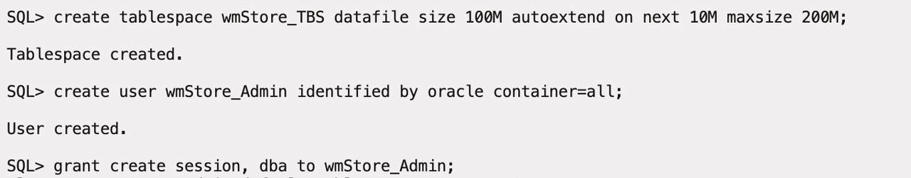

    ```
    <copy>alter user wmStore_Admin default tablespace wmStore_TBS;</copy>
    ```

    ```
    <copy>connect wmStore_Admin/oracle@localhost:1523/wmStore_Master;</copy>
    ```

    ```
    <copy>
    create table wm_Campaigns
    -- sharing = data
    (Row_GUID         raw(16)           default Sys_GUID()                      primary key
    ,Name             varchar2(30)                                    not null  unique
    )
    ;
    </copy>
    ```

    ```
    <copy>
    create table wm_Products
    -- sharing = extended data
    (Row_GUID         raw(16)           default Sys_GUID()                      primary key
    ,Name             varchar2(30)                                    not null  unique
    )
    ;
    </copy>
    ```

    ```
    <copy>
    create table wm_Orders
    -- sharing = metadata
    (Row_GUID         raw(16)           default Sys_GUID()                      primary key
    ,Order_Number     number(16,0)      generated always as identity  not null  unique
    ,Order_Date       date              default   current_date        not null
    ,Campaign_ID      raw(16)           
    )
    ;
    </copy>
    ```

    ```
    <copy>
    alter table wm_Orders add constraint wm_Orders_F1
    foreign key (Campaign_ID)
    references wm_Campaigns(Row_GUID)
    disable
    ;
    </copy>
    ```

    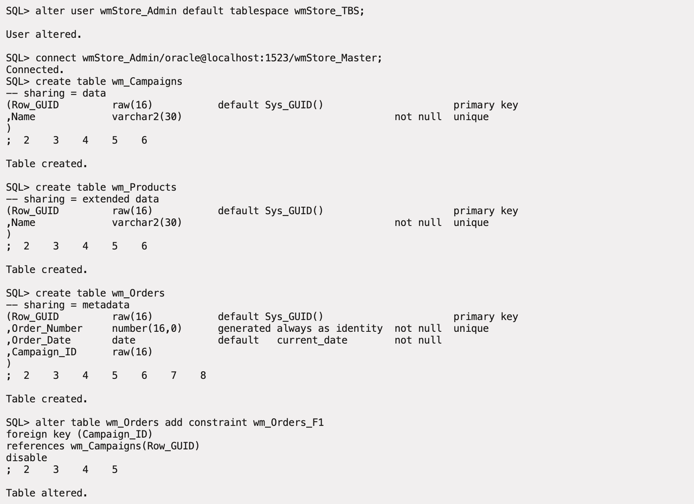

    ```
    <copy>
    create table wm_Order_Items
    -- sharing = metadata
    (Row_GUID         raw(16)                    default Sys_GUID()           primary key
    ,Order_ID         raw(16)           not null
    ,Item_Num         number(16,0)      not null
    ,Product_ID       raw(16)           not null
    ,Order_Qty        number(16,0)      not null
    )
    ;
    </copy>
    ```

    ```
    <copy>
    alter table wm_Order_Items add constraint wm_Order_Items_F1
    foreign key (Order_ID)
    references wm_Orders(Row_GUID)
    disable
    ;
    </copy>
    ```

    ```
    <copy>
    alter table wm_Order_Items add constraint wm_Order_Items_F2
    foreign key (Product_ID)
    references wm_Products(Row_GUID)
    disable
    ;
    </copy>
    ```

    ```
    <copy>
    create or replace view wm_Order_Details
    -- sharing = metadata
    (Order_Number
    ,Campaign_Name
    ,Item_Num
    ,Product_Name
    ,Order_Qty
    ) as
    select o.Order_Number
    ,      c.Name
    ,      i.Item_Num
    ,      p.Name
    ,      i.Order_Qty
    from wm_Orders o
    join wm_Order_Items i
    on  i.Order_ID = o.Row_GUID
    join wm_Products p
    on   i.Product_ID = p.Row_GUID
    left outer join wm_Campaigns c
    on  o.Campaign_ID = c.Row_GUID
    ;
    </copy>
    ```

    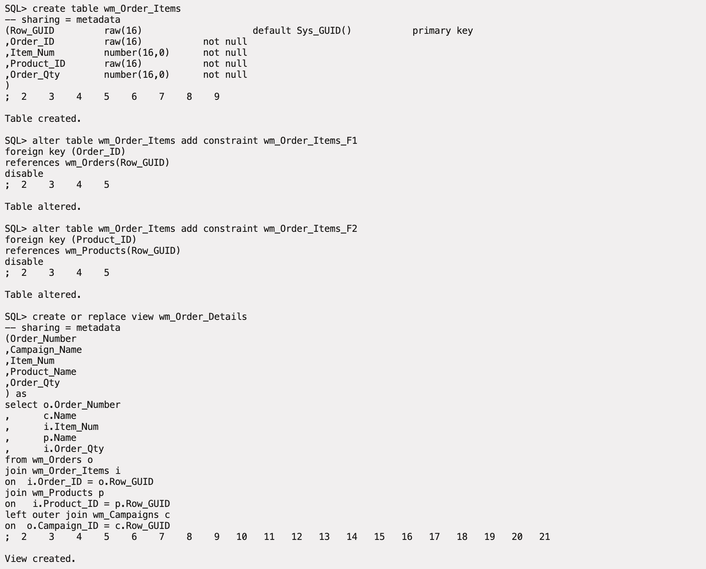

    ```
    <copy>
    insert into wm_Campaigns (Row_GUID, Name) values ('01', 'Locals vs Yokels');

    insert into wm_Campaigns (Row_GUID, Name) values ('02', 'Black Friday 2016');

    insert into wm_Campaigns (Row_GUID, Name) values ('03', 'Christmas 2016');

    insert into wm_Products (Row_GUID, Name) values ('01', 'Tornado Twisted');

    insert into wm_Products (Row_GUID, Name) values ('02', 'Muskogee Magic');

    insert into wm_Products (Row_GUID, Name) values ('03', 'Root 66 Beer Float');

    insert into wm_Products (Row_GUID, Name) values ('04', 'Yokie Dokie Okie Eggnog');
    </copy>
    ```

    ```
    <copy>commit;</copy>
    ```

    ```
    <copy>alter pluggable database application wmStore end install '1.0';</copy>
    ```

    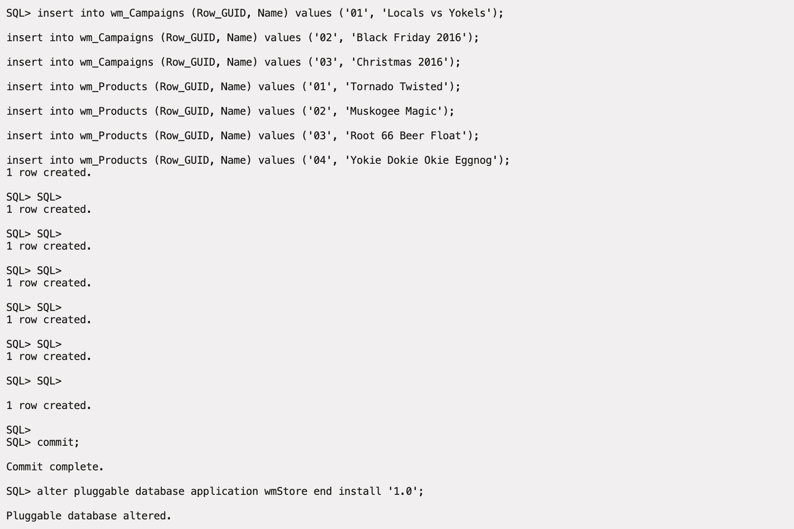

4. Create the application seed.

    ```
    <copy>conn system/oracle@localhost:1523/wmStore_Master;</copy>
    ```

    ```
    <copy>create pluggable database as seed
    admin user wm_admin identified by oracle;</copy>
    ```

    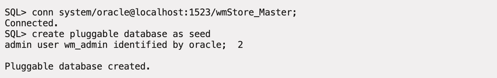

5. Open the application seed.

    ```
    <copy>connect sys/oracle@localhost:1523/wmStore_Master as SysDBA</copy>
    ```

    ```
    <copy>alter pluggable database wmStore_Master$Seed open;</copy>
    ```

    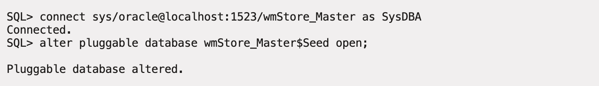

6. Sync the seed with the application wmStore.

    ```
    <copy>conn system/oracle@localhost:1523/wmStore_Master$Seed;</copy>
    ```

    ```
    <copy>alter pluggable database application wmStore sync;</copy>
    ```

    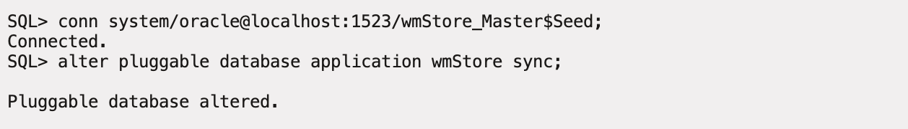

7.  Provision the application databases for the 4 stores.

    ```
    <copy>conn system/oracle@localhost:1523/wmStore_Master;</copy>
    ```

    ```
    <copy>create pluggable database Tulsa
    admin user wm_admin identified by oracle;</copy>
    ```

    ```
    <copy>create pluggable database California
    admin user wm_admin identified by oracle;</copy>
    ```

    ```
    <copy>create pluggable database Tahoe
    admin user wm_admin identified by oracle;</copy>
    ```

    ```
    <copy>create pluggable database NYC
    admin user wm_admin identified by oracle;</copy>
    ```

    ```
    <copy>alter pluggable database all open;</copy>
    ```

    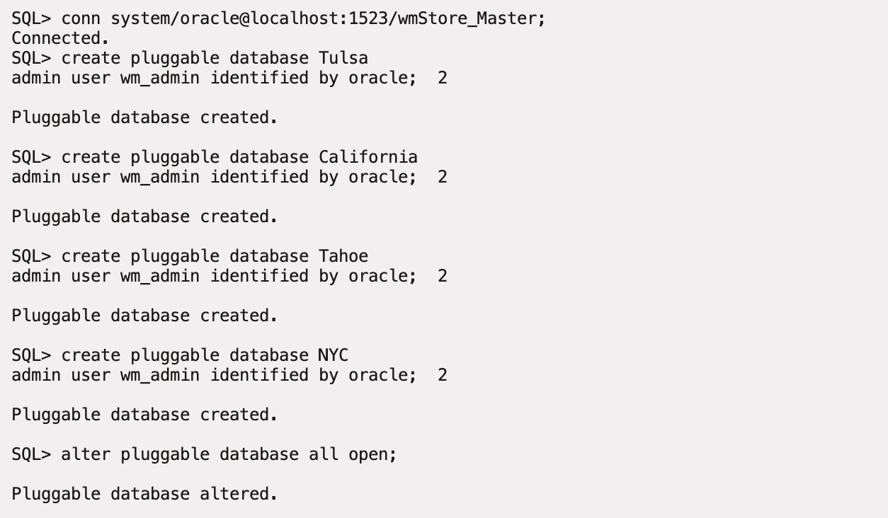

8. Create franchise specific data.

    ```
    <copy>conn system/oracle@localhost:1523/wmStore_Master;</copy>
    ```

    ```
    <copy>@Franchise_Data_Lab1</copy>
    ```

    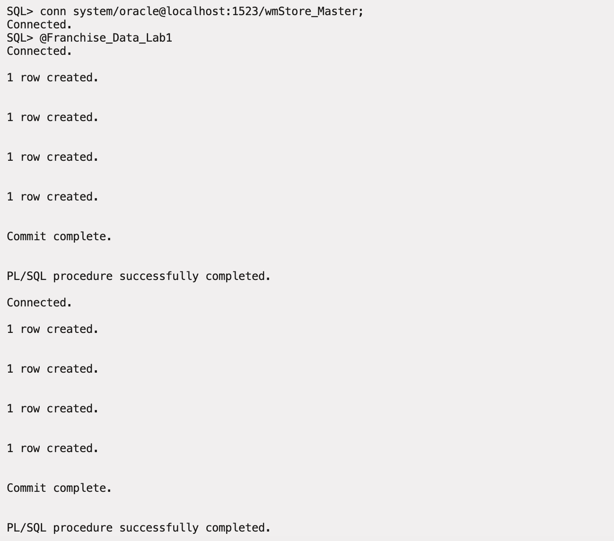

    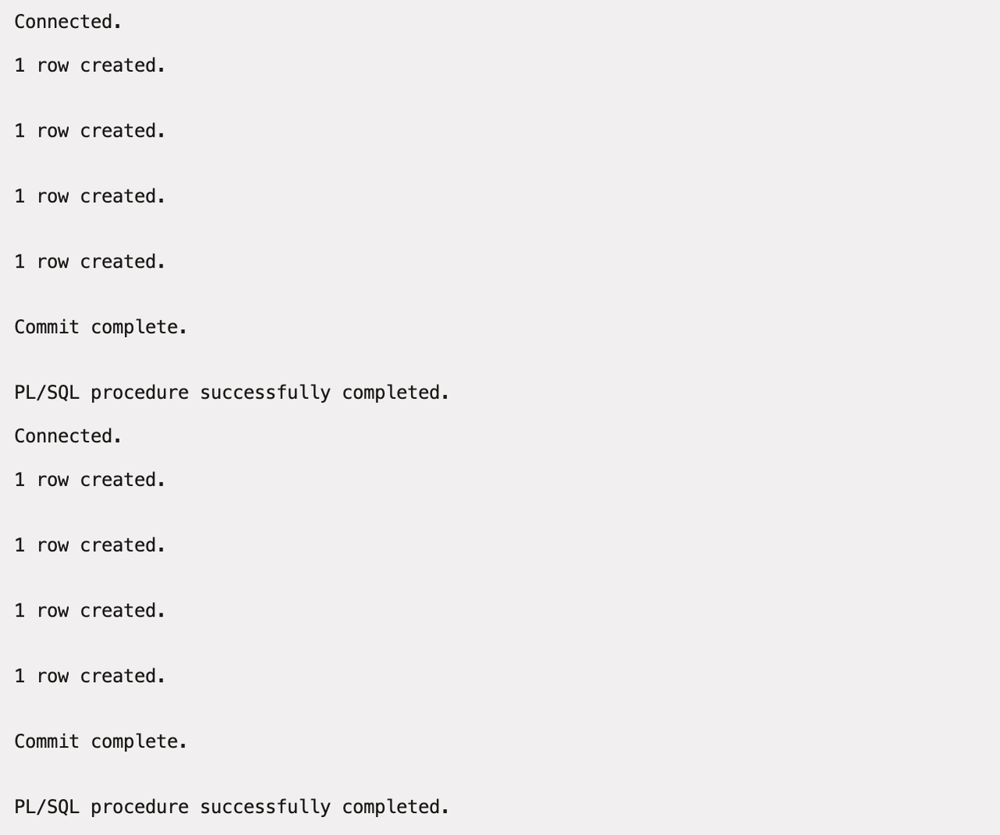

## Task 3: PDB Exploration
This section will take a brief tour of the newly created SaaS estate.

The tasks you will accomplish in this step are:
- Look at the PDBs that have been created so far
- Experiment with different classes of User
- Perform queries against different franchises

1. Connect to **CDB1**.

    ```
    <copy>connect system/oracle@localhost:1523/cdb1</copy>
    ```

2. Show PDBs created so far.

    ```
    <copy>
    set linesize 180

    column c0  noprint new_value            CDB_Name
    column c1  heading "Con ID"             format 99
    column c2  heading "PDB Name"           format a30
    column c3  heading "Con UID"            format 99999999999
    column c4  heading "Restricted?"        format a11
    column c5  heading "Open Mode"          format a10
    column c6  heading "Root?"              format a5
    column c7  heading "App PDB?"           format a8
    column c8  heading "Seed?"              format a5
    column c9  heading "Root Clone?"        format a11
    column c10 heading "Proxy?"             format a6
    column c11 heading "App Container Name" format a30

    set termout off

    select Sys_Context('Userenv', 'CDB_Name') c0
    from dual
    ;
    </copy>
    ```

    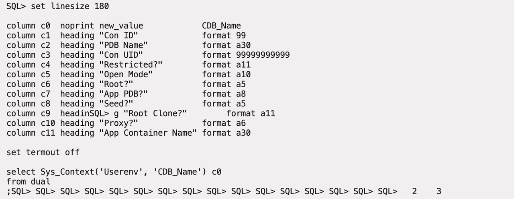

    ```
    <copy>
    ttitle "PDBs in CDB &CDB_Name"

    set termout on

    select P.Con_ID                 c1
    ,      P.Name                   c2
    ,      P.CON_UID                c3
    ,      P.Restricted             c4
    ,      P.Open_Mode              c5
    ,      P.Application_Root       c6
    ,      P.Application_PDB        c7
    ,      P.Application_Seed       c8
    ,      P.Application_Root_Clone c9
    ,      P.Proxy_PDB              c10
    ,      AC.Name                  c11
    from v$PDBs P
    left outer join v$PDBs AC
    on AC.Con_ID = P.Application_Root_Con_ID
    order by P.Name
    ,        nvl(AC.Name,P.Name)
    ,        P.Application_Root desc
    ,        P.Application_Seed desc
    ,        P.Name
    ;
    </copy>
    ```

    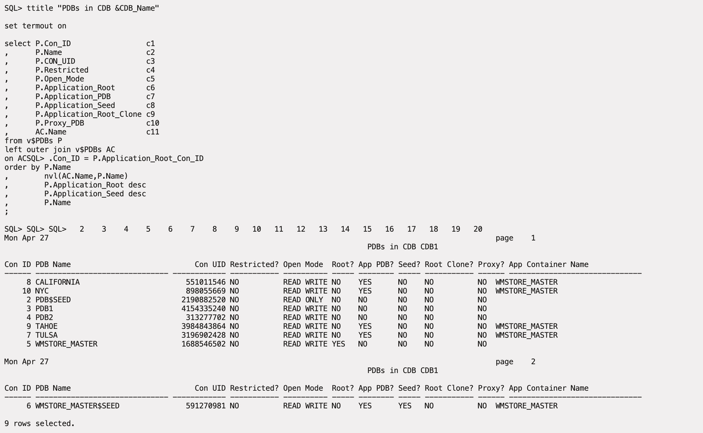

3. You should be able to set your container to Tulsa because weStore_Admin is an Application Common user but it should fail if you try to set it to CDB$Root since that container is outside of the application container.

    ```
    <copy>show user</copy>
    ```

    ```
    <copy>alter session set container=wmStore_Master;</copy>
    ```

    ```
    <copy>connect wmStore_Admin/oracle@localhost:1523/wmStore_Master;</copy>
    ```

    ```
    <copy>alter session set container = Tulsa;</copy>
    ```

    ```
    <copy>alter session set container = CDB$Root;</copy>
    ```

    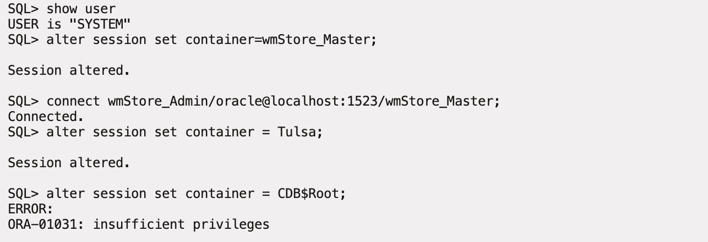

4. You can connect directly as the various local users. Keep in mind these are local users, it just happens to be that they have the same password. Notice that the local user for Califorina cannot use the Tulsa container because it is local to the Califorina container.

    ```
    <copy>connect wm_admin/oracle@localhost:1523/Tulsa;</copy>
    ```

    ```
    <copy>alter session set container = Tulsa;</copy>
    ```

    ```
    <copy>connect wm_admin/oracle@localhost:1523/California;</copy>
    ```

    ```
    <copy>alter session set container = Tulsa;</copy>
    ```

    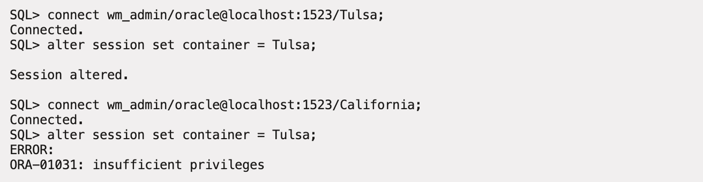

5. When prompted give one of the PDBs that was created (Tulsa, California, NYC, or Tahoe). You can rerun this script giving a different store if you want to view the data.

    ```
    <copy>@Lab2_Queries.sql</copy>
    ```

    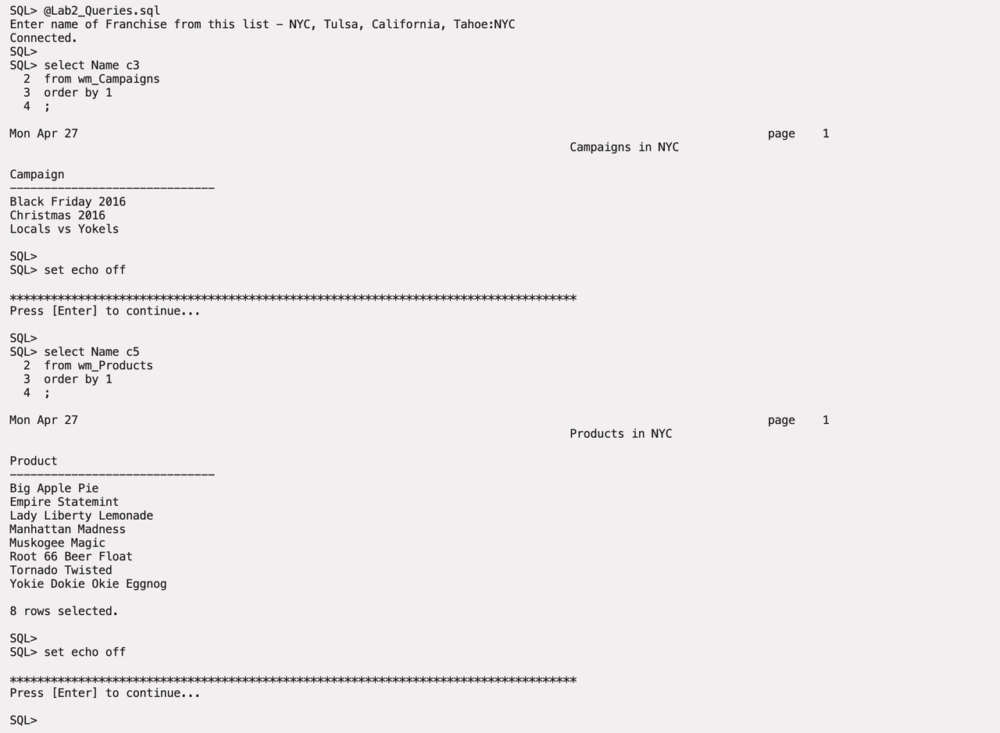

    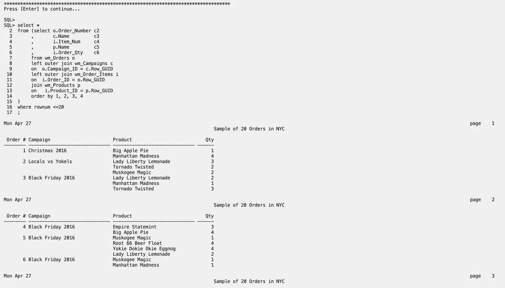

    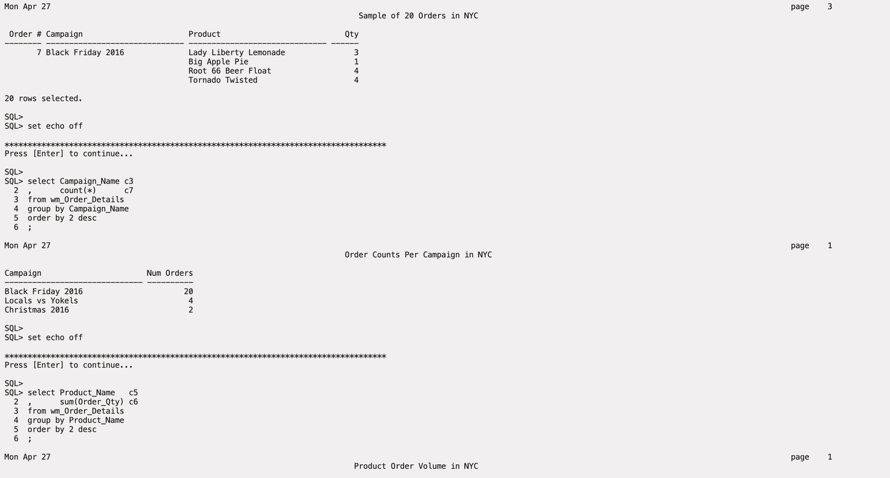

    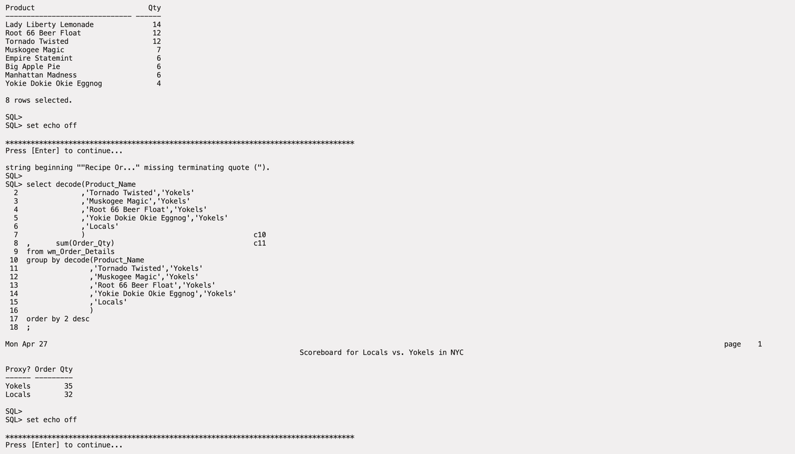

## Task 4: Upgrade from v1 to v2
This section we upgrade Application wmStore from v1 to v2. Despite each franchise having a separate tenant PDB, there is only one master application definition to be upgraded – in Application Root. We run the upgrade script only once, against the Application Root. It is then simply a matter of synchronizing the tenant PDBs for each franchise for them to be upgraded to the new version. Note that this model allows for granular (per tenant/franchise) upgrade schedules.

The tasks you will accomplish in this step are:
- Upgrade application wmStore to v2
- Synchronize three of four Application Tenant PDBs

1. Create the upgrade of the pluggable databases.

    ```
    <copy>conn system/oracle@localhost:1523/wmStore_Master;</copy>
    ```

    ```
    <copy>alter pluggable database application wmStore begin upgrade '1.0' to '2.0';</copy>
    ```

    ```
    <copy>connect wmStore_Admin/oracle@localhost:1523/wmStore_Master</copy>
    ```

    ```
    <copy>
    alter table wm_Products add
    (Local_Product_YN char(1)           default 'Y'                   not null
    )
    ;
    </copy>
    ```

    ```
    <copy>
    alter table wm_Products add constraint Local_Product_Bool
    check (Local_Product_YN in ('Y','N'))
    ;
    </copy>
    ```

    ```
    <copy>
    create or replace view wm_Order_Details
    -- sharing = metadata
    (Order_Number
    ,Campaign_Name
    ,Item_Num
    ,Product_Name
    ,Local_Product_YN
    ,Order_Qty
    ) as
    select o.Order_Number
    ,      c.Name
    ,      i.Item_Num
    ,      p.Name
    ,      p.Local_Product_YN
    ,      i.Order_Qty
    from wm_Orders o
    join wm_Order_Items i
    on  i.Order_ID = o.Row_GUID
    join wm_Products p
    on   i.Product_ID = p.Row_GUID
    left outer join wm_Campaigns c
    on  o.Campaign_ID = c.Row_GUID
    ;
    </copy>
    ```

    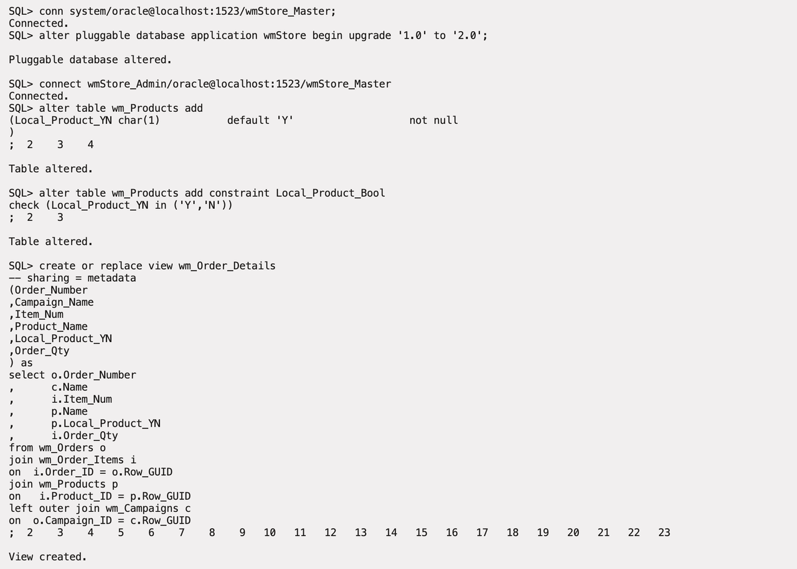

    ```
    <copy>
    update wm_Products
    set Local_Product_YN = 'N'
    where Name in
    ('Tornado Twisted'
    ,'Muskogee Magic'
    ,'Root 66 Beer Float'
    ,'Yokie Dokie Okie Eggnog'
    )
    ;
    </copy>
    ```

    ```
    <copy>commit;</copy>
    ```

    ```
    <copy>alter pluggable database application wmStore end upgrade;</copy>
    ```

    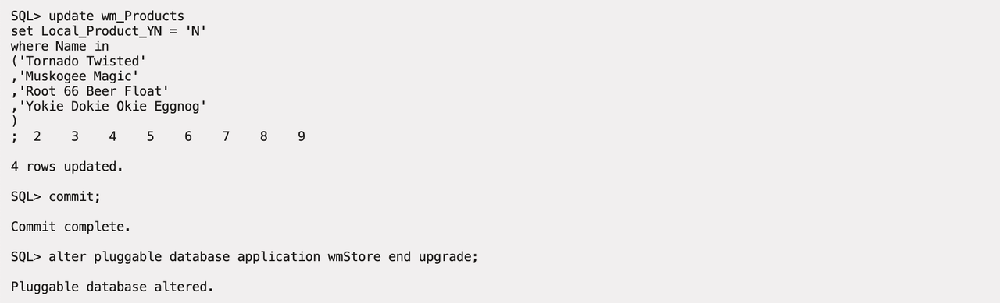

2. Apply the upgrade to Tulsa.

    ```
    <copy>connect system/oracle@localhost:1523/Tulsa</copy>
    ```

    ```
    <copy>alter pluggable database application wmStore sync;</copy>
    ```

    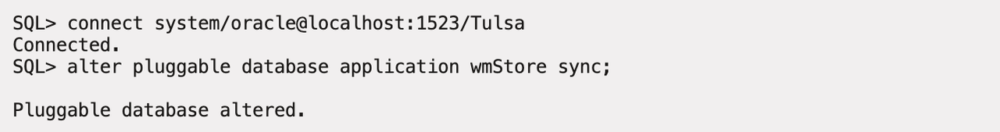

3. Apply the upgrade to California.

    ```
    <copy>connect system/oracle@localhost:1523/California</copy>
    ```

    ```
    <copy>alter pluggable database application wmStore sync;</copy>
    ```

    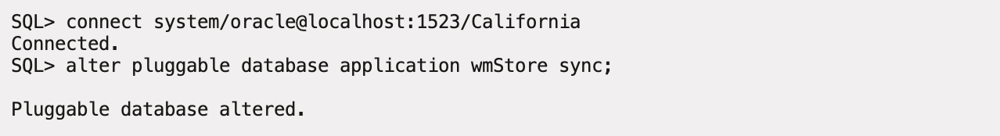

4. Apply the upgrade to Tahoe.

    ```
    <copy>connect system/oracle@localhost:1523/Tahoe</copy>
    ```

    ```
    <copy>alter pluggable database application wmStore sync;</copy>
    ```

    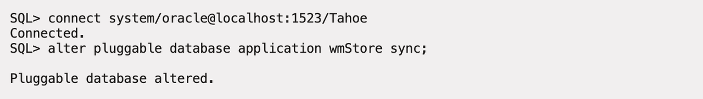

5. Take a look at a pluggable the upgrade was applied to.

    ```
    <copy>
    column Row_GUID noprint
    column Name             format a30 heading "Product Name"
    column Local_Product_YN format a14 heading "Local Product?"
    </copy>
    ```

    ```
    <copy>define Franchise = "Tulsa"</copy>
    ```

    ```
    <copy>ttitle "Products in Franchise &Franchise"</copy>
    ```

    ```
    <copy>set echo on</copy>
    ```

    ```
    <copy>connect wmStore_Admin/oracle@localhost:1523/Tulsa</copy>
    ```

    ```
    <copy>desc wm_Products</copy>
    ```

    ```
    <copy>
    select *
    from wm_Products
    ;
    </copy>
    ```

    ```
    <copy>set echo off</copy>
    ```

    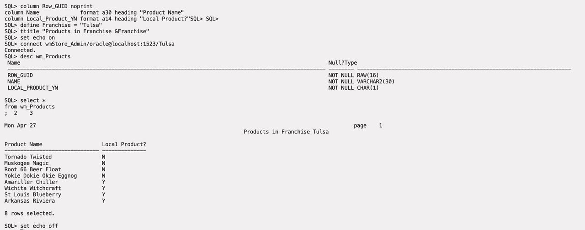

6. Look at a pluggable that the upgrade was not applied to and look at the table definitions and data compared to one that was upgraded.

    ```
    <copy>define Franchise = "NYC"</copy>
    ```

    ```
    <copy>ttitle "Products in Franchise &Franchise"</copy>
    ```

    ```
    <copy>set echo on</copy>
    ```

    ```
    <copy>connect wmStore_Admin/oracle@localhost:1523/NYC</copy>
    ```

    ```
    <copy>desc wm_Products</copy>
    ```

    ```
    <copy>
    select *
    from wm_Products
    ;
    </copy>
    ```

    ```
    <copy>set echo off</copy>
    ```

    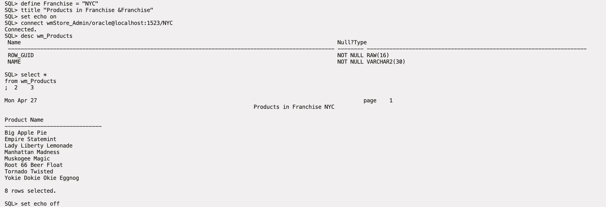

## Task 5: Containers Queries
This section we introduce a very powerful cross-container aggregation capability – containers() queries. Containers() queries allow an application administrator to connect to Application Root and aggregate data with a single query across multiple Application Tenants (Franchises) – or across all of them. This is another example of how Multitenant, with Application Containers, allows you to manage many Application Tenants as one, when needed. Notice values in column Franchise come from Con$Name. Remember that containers() queries are executed in Root and all containers plugged into it.

The tasks you will accomplish in this step are:
- Run Queries across containers

1. Connect to ``CDB1``.

    ```
    <copy>connect wmStore_Admin/oracle@localhost:1523/wmStore_Master</copy>
    ```

2. Products in Tulsa and NYC.

    ```
    <copy>
    column c1 format a30       heading "Franchise"
    column c2 format 9999999   heading "Order #"
    column c3 format a30       heading "Campaign"
    column c4 format 999999    heading "Item #"
    column c5 format a30       heading "Product"
    column c6 format 9,999     heading "Qty"
    column c7 format 9,999,999 heading "Num Orders"
    </copy>
    ```

    ```
    <copy>break on c1 on c3 on c5</copy>
    ```

    ```
    <copy>column c4 noprint</copy>
    ```

    ```
    <copy>ttitle "Products (in Tulsa and NYC)"</copy>
    ```

    ```
    <copy>set echo on</copy>
    ```

    ```
    <copy>
    select con$name c1
    ,      Name     c5
    from containers(wm_Products)
    where con$name in ('TULSA','NYC')
    order by 1
    ,        2
    ;
    </copy>
    ```

    ```
    <copy>set echo off</copy>
    ```

    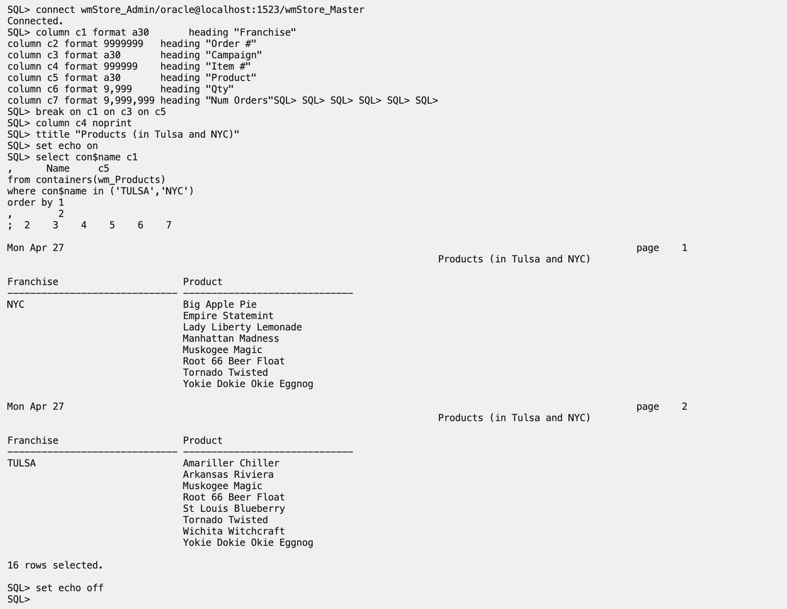

3. Order Counts Per Campaign.

    ```
    <copy>ttitle "Order Counts Per Campaign (Across All Franchises)"</copy>
    ```

    ```
    <copy>set echo on</copy>
    ```

    ```
    <copy>
    select con$name      c1
    ,      Campaign_Name c3
    ,      count(*)      c7
    from containers(wm_Order_Details)
    group by con$name
    ,        Campaign_Name
    order by 1
    ,        3 desc
    ,        2
    ;
    </copy>
    ```

    ```
    <copy>set echo off</copy>
    ```

    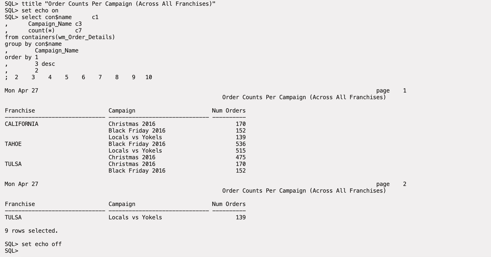

4. Order Volume Per Product.

    ```
    <copy>ttitle "Order Volume Per Product (Across All Franchises)"</copy>
    ```

    ```
    <copy>set echo on</copy>
    ```

    ```
    <copy>
    select con$name      c1
    ,      Product_Name  c5
    ,      count(*)      c7
    from containers(wm_Order_Details)
    group by con$name
    ,        Product_Name
    order by 1
    ,        3 desc
    ,        2
    ;
    </copy>
    ```

    ```
    <copy>set echo off</copy>
    ```

    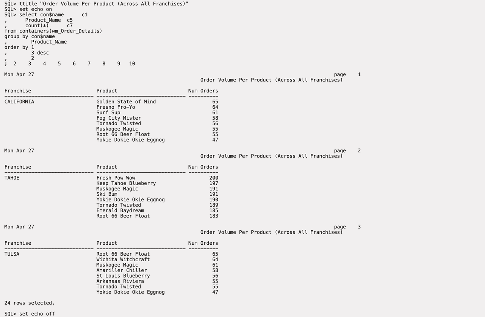

## Task 6: Application Root Clones and Compatibility
This section will explore the PDBs, users and data within the various pluggable databses created in the earlier section.

The tasks you will accomplish in this step are:
- Create a pluggable database ``OE`` in the container database ``CDB1``
- Create a load against the pluggable database ``OE``
- Create a hot clone ``OE_DEV`` in the container database ``CDB2`` from the pluggable database ``OE``

1. Connect to ``CDB1``.

    ```
    <copy>sqlplus /nolog</copy>
    ```

    ```
    <copy>connect system/oracle@localhost:1523/cdb1</copy>
    ```

2. Review the pluggable databases in the container database.

    ```
    <copy>set linesize 180</copy>
    ```

    ```
    <copy>
    column c0  noprint new_value            CDB_Name
    column c1  heading "Con ID"             format 99
    column c2  heading "PDB Name"           format a30
    column c3  heading "Con UID"            format 99999999999
    column c4  heading "Restricted?"        format a11
    column c5  heading "Open Mode"          format a10
    column c6  heading "Root?"              format a5
    column c7  heading "App PDB?"           format a8
    column c8  heading "Seed?"              format a5
    column c9  heading "Root Clone?"        format a11
    column c10 heading "Proxy?"             format a6
    column c11 heading "App Container Name" format a30
    </copy>
    ```

    ```
    <copy>set termout off</copy>
    ```

    ```
    <copy>
    select Sys_Context('Userenv', 'CDB_Name') c0
    from dual
    ;
    </copy>
    ```

    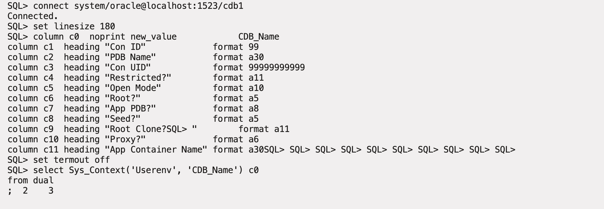

    ```
    <copy>ttitle "PDBs in CDB &CDB_Name"</copy>
    ```

    ```
    <copy>set termout on</copy>
    ```

    ```
    <copy>
    select P.Con_ID                 c1
    ,      P.Name                   c2
    ,      P.CON_UID                c3
    ,      P.Restricted             c4
    ,      P.Open_Mode              c5
    ,      P.Application_Root       c6
    ,      P.Application_PDB        c7
    ,      P.Application_Seed       c8
    ,      P.Application_Root_Clone c9
    ,      P.Proxy_PDB              c10
    ,      AC.Name                  c11
    from v$PDBs P
    left outer join v$PDBs AC
    on AC.Con_ID = P.Application_Root_Con_ID
    order by P.Name
    ,        nvl(AC.Name,P.Name)
    ,        P.Application_Root desc
    ,        P.Application_Seed desc
    ,        P.Name
    ;
    </copy>
    ```

    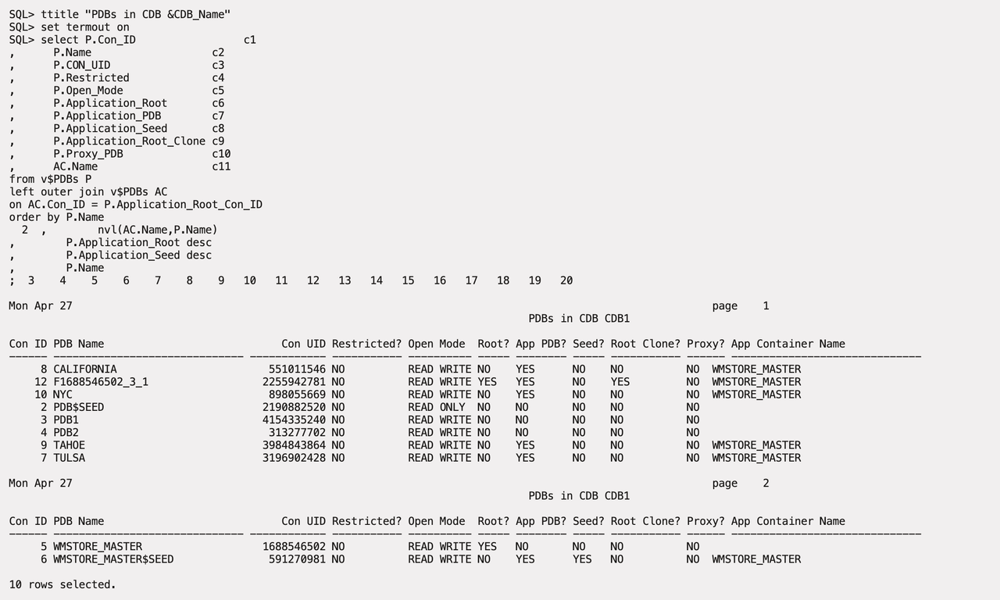

3. Connect to the master database and set the compatibility to 2.0. Notice you will get an error because one of the databases is not currently at that version.

    ```
    <copy>conn system/oracle@localhost:1523/wmStore_Master;</copy>
    ```

    ```
    <copy>alter pluggable database application wmStore set compatibility version '2.0';</copy>
    ```

    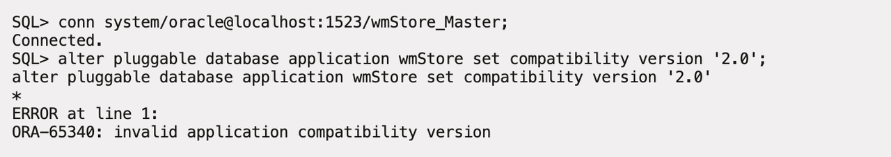

4. Run the query below and notice that there are applications that are not at the current version. If you look at the output from the first query you can see that the NYC and wmStore_Master$Seed are still at 1.0.

    ```
    <copy>
    column CON_UID               heading "Con UID"          format 999999999999
    column APP_NAME              heading "Application Name" format a20          truncate
    column APP_ID                heading "App ID"           format 99999
    column APP_VERSION           heading "Version"          format a7
    column APP_STATUS            heading "Status"           format a12  
    column APP_ID                noprint
    </copy>
    ```

    ```
    <copy>select * from DBA_App_PDB_Status;</copy>
    ```

    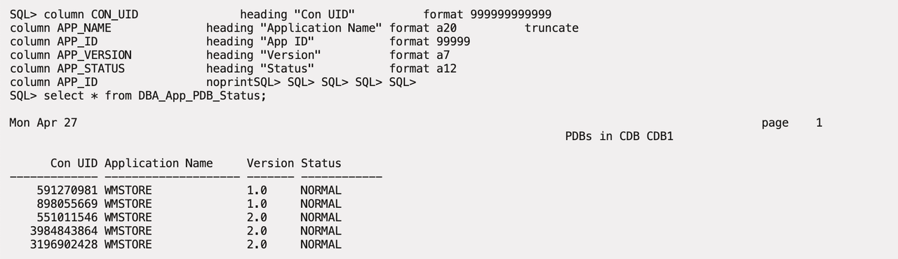

5. Connect to NYC and bring that up to the current version.

    ```
    <copy>conn system/oracle@localhost:1523/NYC;</copy>
    ```

    ```
    <copy>alter pluggable database application wmStore sync;</copy>
    ```

    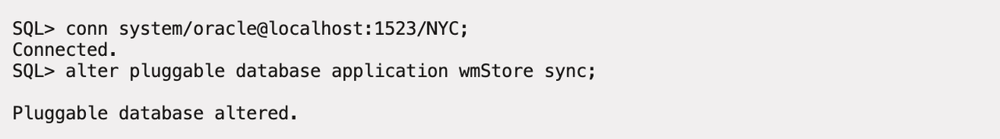

6. Connect to wmStore_Master$Seed and bring that up to the current version.

    ```
    <copy>conn system/oracle@localhost:1523/wmStore_Master$Seed</copy>
    ```

    ```
    <copy>alter pluggable database application wmStore sync;</copy>
    ```

    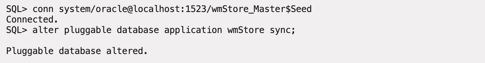

7. Connect back to wmStore_Master and set the compatibility to 2.0. This time it should work.

    ```
    <copy>conn system/oracle@localhost:1523/wmStore_Master</copy>
    ```

    ```
    <copy>alter pluggable database application wmStore set compatibility version '2.0';</copy>
    ```

    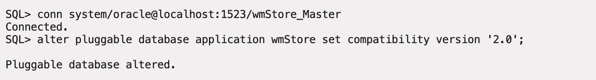

8. Look back at the list of PDBs now that the upgrades are complete.

    ```
    <copy>conn system/oracle@localhost:1523/cdb1</copy>
    ```

    ```
    <copy>set linesize 180</copy>
    ```

    ```
    <copy>
    column c0  noprint new_value            CDB_Name
    column c1  heading "Con ID"             format 99
    column c2  heading "PDB Name"           format a30
    column c3  heading "Con UID"            format 99999999999
    column c4  heading "Restricted?"        format a11
    column c5  heading "Open Mode"          format a10
    column c6  heading "Root?"              format a5
    column c7  heading "App PDB?"           format a8
    column c8  heading "Seed?"              format a5
    column c9  heading "Root Clone?"        format a11
    column c10 heading "Proxy?"             format a6
    column c11 heading "App Container Name" format a30
    </copy>
    ```

    ```
    <copy>set termout off</copy>
    ```

    ```
    <copy>
    select Sys_Context('Userenv', 'CDB_Name') c0
    from dual
    ;
    </copy>
    ```

    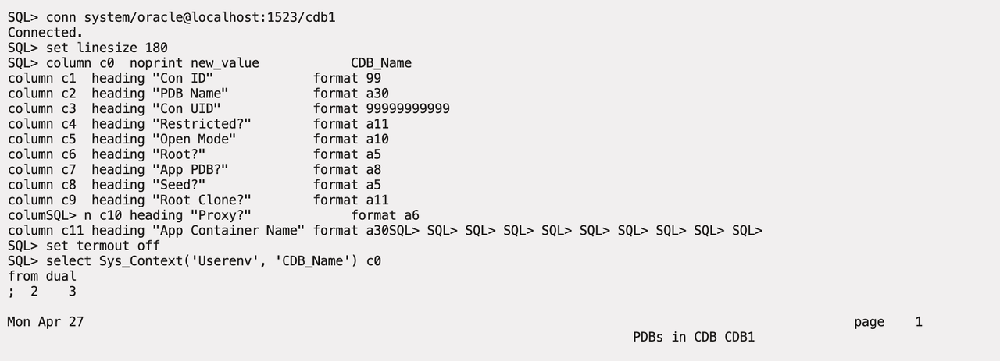

    ```
    <copy>ttitle "PDBs in CDB &CDB_Name"</copy>
    ```

    ```
    <copy>set termout on</copy>
    ```

    ```
    <copy>
    select P.Con_ID                 c1
    ,      P.Name                   c2
    ,      P.CON_UID                c3
    ,      P.Restricted             c4
    ,      P.Open_Mode              c5
    ,      P.Application_Root       c6
    ,      P.Application_PDB        c7
    ,      P.Application_Seed       c8
    ,      P.Application_Root_Clone c9
    ,      P.Proxy_PDB              c10
    ,      AC.Name                  c11
    from v$PDBs P
    left outer join v$PDBs AC
    on AC.Con_ID = P.Application_Root_Con_ID
    order by P.Name
    ,        nvl(AC.Name,P.Name)
    ,        P.Application_Root desc
    ,        P.Application_Seed desc
    ,        P.Name
    ;
    </copy>
    ```

    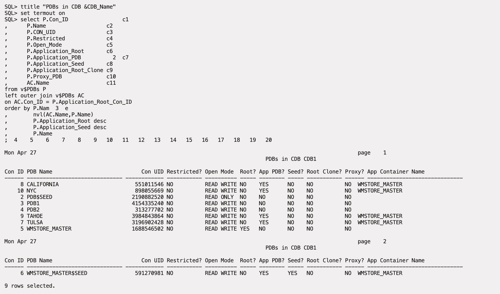

## Task 7: Expansion Beyond Single CDB and Application Root Replicas
This section we follow the global expansion of Walt's Malts. In order to comply with requirements of data sovereignty and latency Walt's Malts has had to expand into a second CDB, CDB2. (In reality this would be in a separate server.) It is very important to note that we still only have a single master application definition, despite the application now being deployed across multiple CDBs.

The tasks you will accomplish in this step are:
- Create and Open Application Root Replicas (ARRs): wmStore_International, wmStore_West
- Create Proxy PDBs for the ARRs
- Synchronize the ARRs via their proxies
- Create App Seeds for the ARRs
- Provision the App PDBs for five new franchises
- Add franchise-specific products for new franchises

1. Connect to **CDB2**.

    ```
    <copy>sqlplus /nolog</copy>
    ```

    ```
    <copy>connect system/oracle@localhost:1524/cdb2</copy>
    ```

2. Create a datbase link to CDB1 to pull the data across.

    ```
    <copy>
    create public database link CDB1_DBLink
    connect to system identified by oracle
    using 'localhost:1523/cdb1';
    </copy>
    ```

    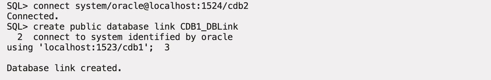

3. Create and open the Application Root Replicas (ARRs).

    ```
    <copy>create pluggable database wmStore_International as application container
    from wmStore_Master@CDB1_DBLink;</copy>
    ```

    ```
    <copy>create pluggable database wmStore_West as application container
    from wmStore_Master@CDB1_DBLink;</copy>
    ```

    ```
    <copy>alter pluggable database all open;</copy>
    ```

    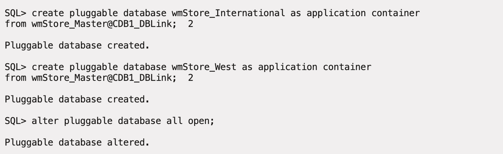

4. Create the CDB$Root-level DB Link to CDB2.

    ```
    <copy>connect system/oracle@localhost:1523/cdb1</copy>
    ```

    ```
    <copy>
    create public database link CDB2_DBLink
    connect to System identified by oracle
    using 'localhost:1524/cdb2';
    </copy>
    ```

    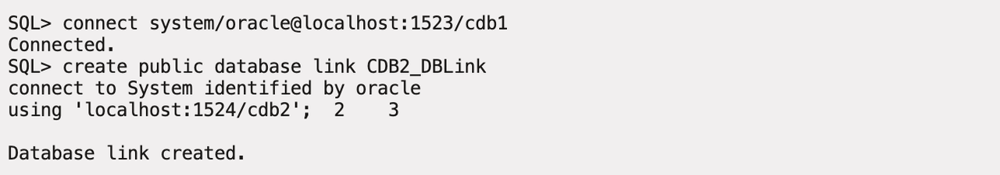

5. Create the Application-Root-level DB Links to CDB2.

    ```
    <copy>conn system/oracle@localhost:1523/wmStore_Master</copy>
    ```

    ```
    <copy>
    create public database link CDB2_DBLink
    connect to system identified by oracle
    using 'localhost:1524/cdb2';
    </copy>
    ```

    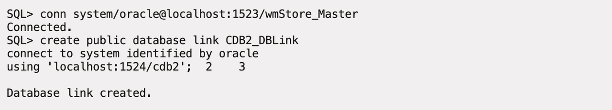

6. Create and open Proxy PDBs for the Application Root Replicas.

    ```
    <copy>create pluggable database wmStore_International_Proxy
    as proxy from wmStore_International@CDB2_DBLink;</copy>
    ```

    ```
    <copy>create pluggable database wmStore_West_Proxy
    as proxy from wmStore_West@CDB2_DBLink;</copy>
    ```

    ```
    <copy>alter pluggable database all open;</copy>
    ```

    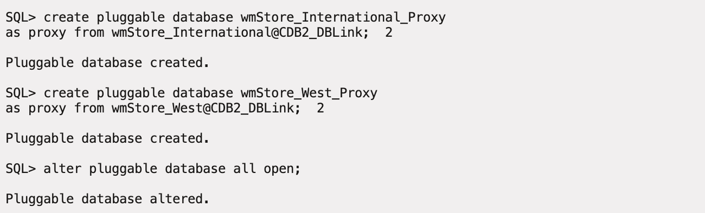

7. Synchronize the ARRs via their proxies. Notice you need to connect as sys to do this.

    ```
    <copy>conn sys/oracle@localhost:1523/wmStore_International_Proxy as sysdba</copy>
    ```

    ```
    <copy>alter pluggable database application wmStore sync;</copy>
    ```

    ```
    <copy>conn sys/oracle@localhost:1523/wmStore_West_Proxy as sysdba</copy>
    ```

    ```
    <copy>alter pluggable database application wmStore sync;</copy>
    ```

    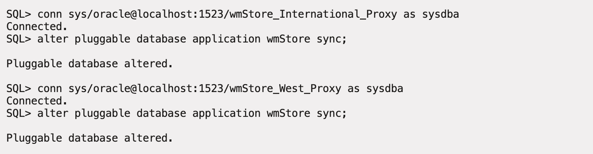

8. Create and open the Application Seed PDBs for wmStore_International and sync it with Application wmStore.

    ```
    <copy>conn system/oracle@localhost:1524/wmStore_International</copy>
    ```

    ```
    <copy>create pluggable database as seed
    admin user wm_admin identified by oracle;</copy>
    ```

    ```
    <copy>conn sys/oracle@localhost:1524/wmStore_International as SysDBA</copy>
    ```

    ```
    <copy>alter pluggable database wmStore_International$Seed open;</copy>
    ```

    ```
    <copy>connect system/oracle@localhost:1524/wmStore_International$Seed</copy>
    ```

    ```
    <copy>alter pluggable database application wmStore sync;</copy>
    ```

    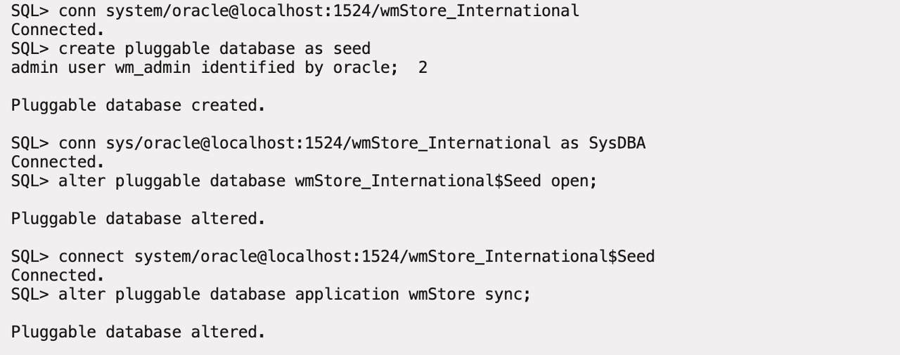

9. Create and open the Application Seed PDBs for wmStore_West and sync it with Application wmStore.

    ```
    <copy>conn system/oracle@localhost:1524/wmStore_West</copy>
    ```

    ```
    <copy>create pluggable database as seed
    admin user wm_admin identified by oracle;</copy>
    ```

    ```
    <copy>conn sys/oracle@localhost:1524/wmStore_West as SysDBA</copy>
    ```

    ```
    <copy>alter pluggable database wmStore_West$Seed open;</copy>
    ```

    ```
    <copy>connect system/oracle@localhost:1524/wmStore_West$Seed</copy>
    ```

    ```
    <copy>alter pluggable database application wmStore sync;</copy>
    ```

    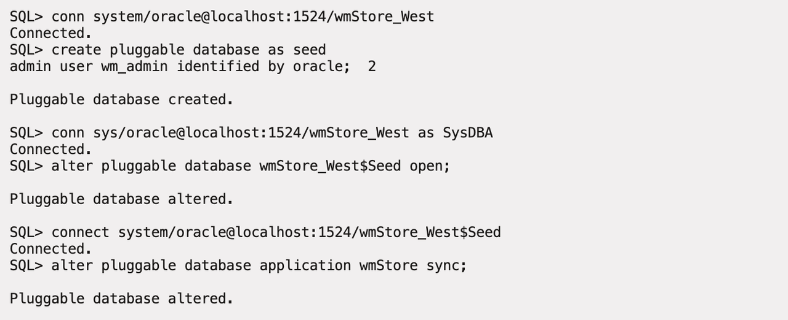

10. Connect to the wmStore_International Application Root Replica (ARR) and create a database link from that ARR to the CDB of the Master Root.

    ```
    <copy>connect system/oracle@localhost:1524/wmStore_International</copy>
    ```

    ```
    <copy>
    create public database link CDB1_DBLink
    connect to system identified by oracle
    using 'localhost:1523/cdb1';
    </copy>
    ```

    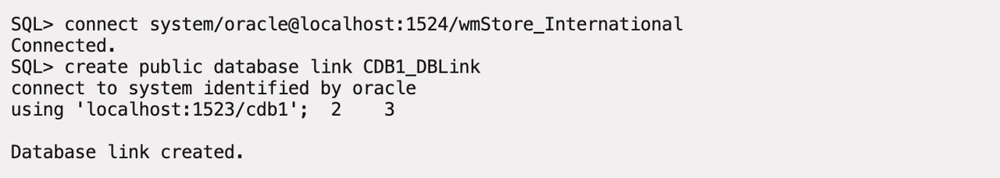

11. Provision Application PDBs for the UK, Denmark and France franchises.

    ```
    <copy>create pluggable database UK
    admin user wm_admin identified by oracle;</copy>
    ```

    ```
    <copy>create pluggable database Denmark
    admin user wm_admin identified by oracle;</copy>
    ```

    ```
    <copy>create pluggable database France
    admin user wm_admin identified by oracle;</copy>
    ```

    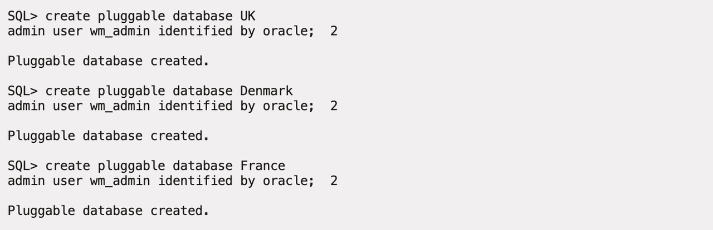

12. Connect to the wmStore_West Application Root Replica (ARR) and create a database link from that ARR to the CDB of the Master Root.

    ```
    <copy>connect system/oracle@localhost:1524/wmStore_West</copy>
    ```

    ```
    <copy>
    create public database link CDB1_DBLink
    connect to system identified by oracle
    using 'localhost:1523/cdb1';
    </copy>
    ```

    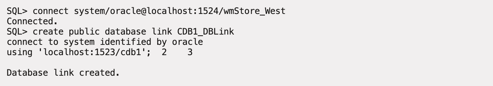

13. Provision Application PDBs for the Sant Monica and Japan franchises.

    ```
    <copy>create pluggable database Santa_Monica
    admin user wm_admin identified by oracle;</copy>
    ```

    ```
    <copy>create pluggable database Japan
    admin user wm_admin identified by oracle;</copy>
    ```

    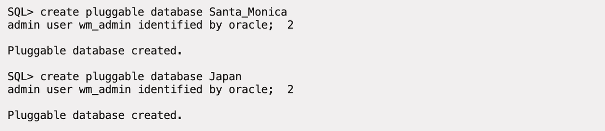

14. Switch to the container root and open all of the pluggable databases.

    ```
    <copy>alter session set container=CDB$Root;</copy>
    ```

    ```
    <copy>alter pluggable database all open;</copy>
    ```

    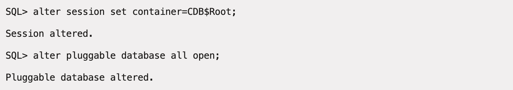

15. Create franchise-specific data.

    ```
    <copy>@Franchise_Data_Lab6</copy>
    ```

    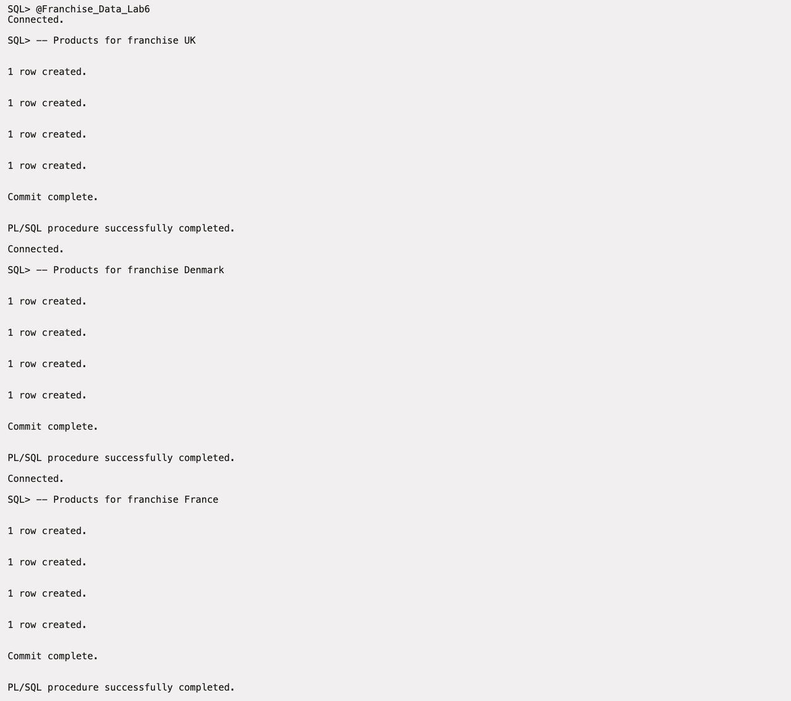

    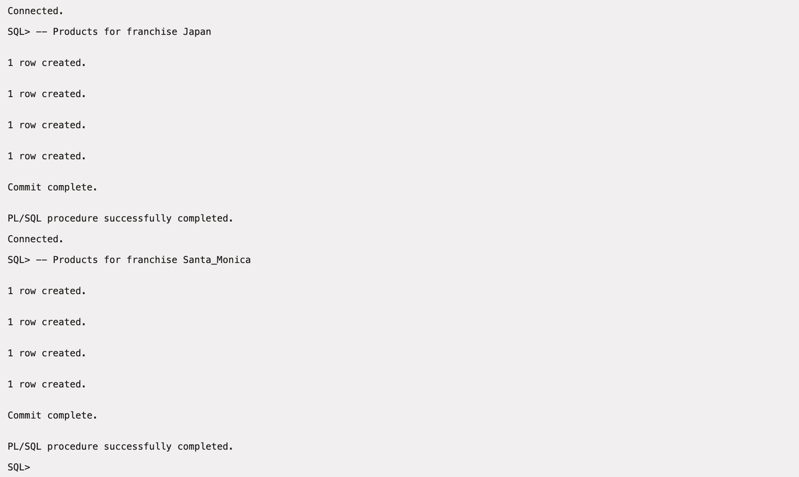

## Task 8: Durable Location Transparency
This section demonstrates "durable location transparency". In the previous section we saw how Proxy PDBs can provide location transparency. The Proxy PDBs for the Application Root Replicas (ARRs) provided local context (in the master Application Root) for the ARRs, which are physically located in a different CDB. This is a good example of location transparency. In this section, we see how these ARR Proxies can provide "durable location transparency". That is, location transparency that survives the physical reconfiguration of the Application Estate – specifically by relocating an Application PDB for a particular franchise from one CDB to another.

The tasks you will accomplish in this step are:
- Run a report against wmStore_Master
- Relocate Tahoe to wmStore_West
- Run the report again

1. Connect and run a report against wmStore_Master.

    ```
    <copy>sqlplus /nolog</copy>
    ```

    ```
    <copy>connect wmStore_Admin/oracle@localhost:1523/wmStore_Master</copy>
    ```

    ```
    <copy>set verify off</copy>
    ```

    ```
    <copy>define Campaign = "Locals vs Yokels"</copy>
    ```

    ```
    <copy>
    column c1 format a30       heading "Franchise"
    column c2 format a10       heading "CDB"
    column c3 format 9,999,999 heading "Num Orders"
    </copy>
    ```

    ```
    <copy>ttitle "Business-Wide Count of Orders for Campaign &Campaign"</copy>
    ```

    ```
    <copy>
    select con$name c1
    ,      cdb$name c2
    ,      count(*) c3
    from containers(wm_Orders) o
    ,    wm_Campaigns c
    where o.Campaign_id = c.row_guid
    and   c.Name = '&Campaign'
    group by con$name
    ,        cdb$name
    order by 3 desc
    ,        1
    ;
    </copy>
    ```

    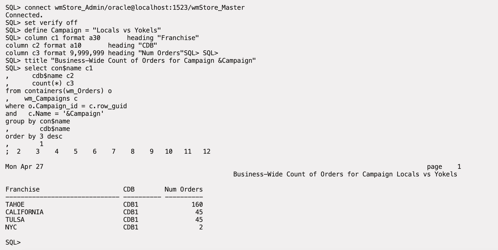

2. Relocate Tahoe to wmStore_West.

    ```
    <copy>connect system/oracle@localhost:1524/wmStore_West</copy>
    ```

    ```
    <copy>create pluggable database Tahoe from Tahoe@CDB1_DBLink
    relocate availability max;</copy>
    ```

    ```
    <copy>connect sys/oracle@localhost:1524/cdb2 as SysDBA</copy>
    ```

    ```
    <copy>alter pluggable database Tahoe open;</copy>
    ```

    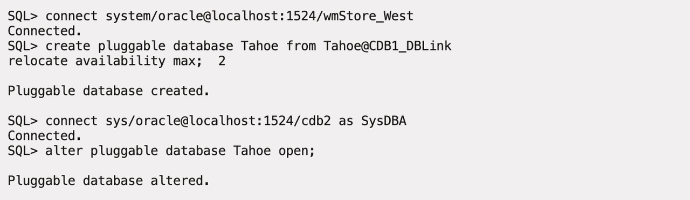

3. Rerun the report and take note of the changes in data based on the relocation.

    ```
    <copy>connect wmStore_Admin/oracle@localhost:1523/wmStore_Master</copy>
    ```

    ```
    <copy>set verify off</copy>
    ```

    ```
    <copy>define Campaign = "Locals vs Yokels"</copy>
    ```

    ```
    <copy>
    column c1 format a30       heading "Franchise"
    column c2 format a10       heading "CDB"
    column c3 format 9,999,999 heading "Num Orders"
    </copy>
    ```

    ```
    <copy>ttitle "Business-Wide Count of Orders for Campaign &Campaign"</copy>
    ```

    ```
    <copy>
    select con$name c1
    ,      cdb$name c2
    ,      count(*) c3
    from containers(wm_Orders) o
    ,    wm_Campaigns c
    where o.Campaign_id = c.row_guid
    and   c.Name = '&Campaign'
    group by con$name
    ,        cdb$name
    order by 3 desc
    ,        1
    ;
    </copy>
    ```

    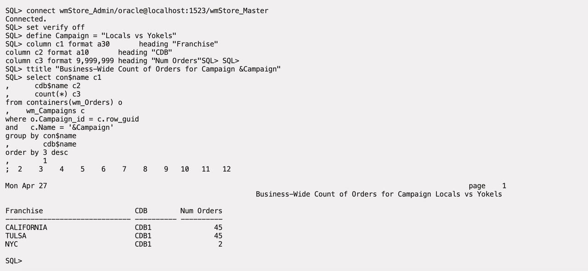

## Task 9: Data Sharing
This section we introduce the advanced concept of data sharing. We have already seen how Multitenant, with Application Containers, can provide an instant SaaS architecture for an application previously architected for standalone deployment. Technically this is done by installing a master application definition in an Application Root. Application PDBs for each tenant / franchise are plugged into this Application Root and the metadata for the database components of the Application definition is served from the Application root. However, so far all data, including data which may be considered part of the application definition ("seed data") has been local. In other words, there's a replica of this seed data in every Application PDB. In this lab we'll see how, in addition to metadata, common data may also be shared from Application Root. To do this we'll upgrade application wmStore to v3.0 and introduce various powerful data sharing capabilities.

The tasks you will accomplish in this step are:
- Upgrade Application wmStore to v3.0
- Propagate the Upgrade to all franchises
- Query the wm_Products table in a franchise PDB to see the sources of data

1. Create the v3.0 upgrade in wmStore_Master.

    ```
    <copy>connect system/oracle@localhost:1523/wmStore_Master</copy>
    ```

    ```
    <copy>alter pluggable database application wmStore begin upgrade '2.0' to '3.0';</copy>
    ```

    ```
    <copy>connect wmStore_Admin/oracle@localhost:1523/wmStore_Master</copy>
    ```

    ```
    <copy>
    create table wm_List_Of_Values
    -- sharing = metadata -- the default
    sharing = data
    -- sharing = extended data
    (Row_GUID    raw(16)        default Sys_GUID() primary key
    ,Type_Code   varchar2(30)   not null
    ,Value_Code  varchar2(30)   not null
    )
    ;
    </copy>
    ```

    ```
    <copy>
    alter table wm_List_Of_Values  add constraint wm_List_Of_Values_U1
    unique (Type_Code, Value_Code)
    ;
    </copy>
    ```

    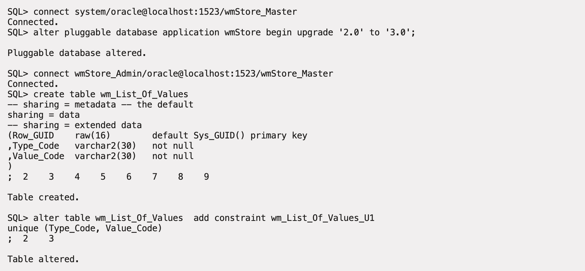

    ```
    <copy>
    insert into wm_List_Of_Values (Type_Code, Value_Code) values ('Type', 'Currency');

    insert into wm_List_Of_Values (Type_Code, Value_Code) values ('Currency', 'USD');

    insert into wm_List_Of_Values (Type_Code, Value_Code) values ('Currency', 'GBP');

    insert into wm_List_Of_Values (Type_Code, Value_Code) values ('Currency', 'DKK');

    insert into wm_List_Of_Values (Type_Code, Value_Code) values ('Currency', 'EUR');

    insert into wm_List_Of_Values (Type_Code, Value_Code) values ('Currency', 'JPY');

    insert into wm_List_Of_Values (Type_Code, Value_Code) values ('Type', 'Country');

    insert into wm_List_Of_Values (Type_Code, Value_Code) values ('Country', 'USA');

    insert into wm_List_Of_Values (Type_Code, Value_Code) values ('Country', 'UK');

    insert into wm_List_Of_Values (Type_Code, Value_Code) values ('Country', 'Denmark');

    insert into wm_List_Of_Values (Type_Code, Value_Code) values ('Country', 'France');

    insert into wm_List_Of_Values (Type_Code, Value_Code) values ('Country', 'Japan');
    </copy>
    ```

    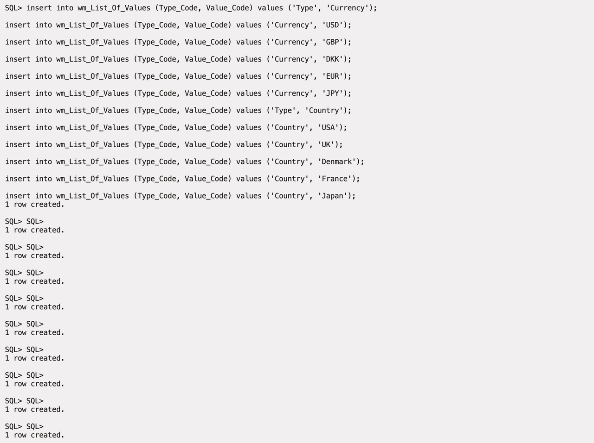

    ```
    <copy>commit;</copy>
    ```

    ```
    <copy>alter table wm_Orders disable constraint wm_Orders_F1;</copy>
    ```

    ```
    <copy>alter table wm_Order_Items disable constraint wm_Order_Items_F2;</copy>
    ```

    ```
    <copy>delete from wm_Campaigns where Row_GUID in ('01','02','03');</copy>
    ```

    ```
    <copy>delete from wm_Products  where Row_GUID in ('01','02','03','04');</copy>
    ```

    ```
    <copy>
    insert into wm_Campaigns (Row_GUID, Name) values ('01', 'Locals vs Yokels');

    insert into wm_Campaigns (Row_GUID, Name) values ('02', 'Black Friday 2016');

    insert into wm_Campaigns (Row_GUID, Name) values ('03', 'Christmas 2016');

    insert into wm_Products (Row_GUID, Name) values ('01', 'Tornado Twisted');

    insert into wm_Products (Row_GUID, Name) values ('02', 'Muskogee Magic');

    insert into wm_Products (Row_GUID, Name) values ('03', 'Root 66 Beer Float');

    insert into wm_Products (Row_GUID, Name) values ('04', 'Yokie Dokie Okie Eggnog');
    </copy>
    ```

    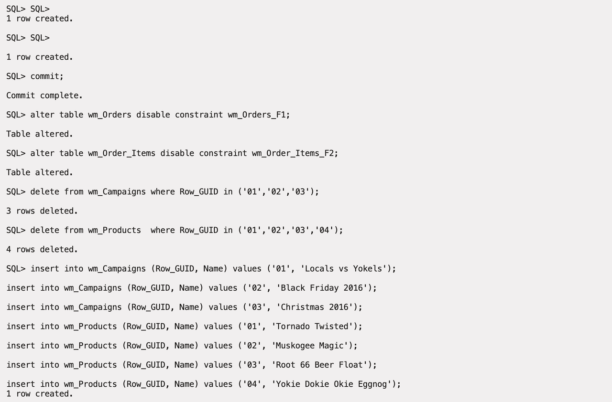

    ```
    <copy>commit;</copy>
    ```

    ```
    <copy>alter pluggable database application wmStore end upgrade;</copy>
    ```

    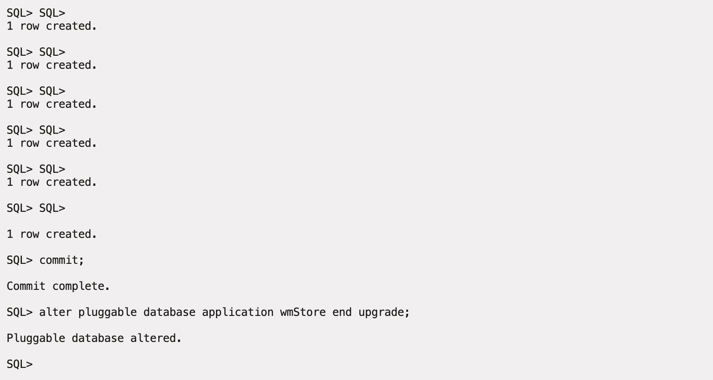

2. Sync some of the pluggable databases.

    ```
    <copy>connect system/oracle@localhost:1523/WMSTORE_MASTER$SEED</copy>
    ```

    ```
    <copy>alter pluggable database application wmStore sync;</copy>
    ```

    ```
    <copy>connect system/oracle@localhost:1523/CALIFORNIA</copy>
    ```

    ```
    <copy>alter pluggable database application wmStore sync;</copy>
    ```

    ```
    <copy>connect system/oracle@localhost:1523/NYC</copy>
    ```

    ```
    <copy>alter pluggable database application wmStore sync;</copy>
    ```

    ```
    <copy>connect system/oracle@localhost:1523/TULSA</copy>
    ```

    ```
    <copy>alter pluggable database application wmStore sync;</copy>
    ```

    ```
    <copy>connect system/oracle@localhost:1524/WMSTORE_INTERNATIONAL$SEED</copy>
    ```

    ```
    <copy>alter pluggable database application wmStore sync;</copy>
    ```

    ```
    <copy>connect system/oracle@localhost:1524/DENMARK</copy>
    ```

    ```
    <copy>alter pluggable database application wmStore sync;</copy>
    ```

    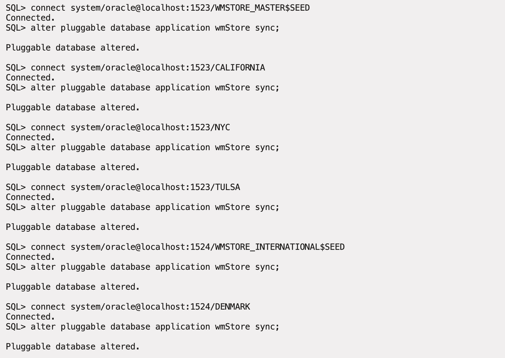

    ```
    <copy>connect system/oracle@localhost:1524/FRANCE</copy>
    ```

    ```
    <copy>alter pluggable database application wmStore sync;</copy>
    ```

    ```
    <copy>connect system/oracle@localhost:1524/UK</copy>
    ```

    ```
    <copy>alter pluggable database application wmStore sync;</copy>
    ```

    ```
    <copy>connect system/oracle@localhost:1524/WMSTORE_WEST$SEED</copy>
    ```

    ```
    <copy>alter pluggable database application wmStore sync;</copy>
    ```

    ```
    <copy>connect system/oracle@localhost:1524/JAPAN</copy>
    ```

    ```
    <copy>alter pluggable database application wmStore sync;</copy>
    ```

    ```
    <copy>connect system/oracle@localhost:1524/SANTA_MONICA</copy>
    ```

    ```
    <copy>alter pluggable database application wmStore sync;</copy>
    ```

    ```
    <copy>connect system/oracle@localhost:1524/TAHOE</copy>
    ```

    ```
    <copy>alter pluggable database application wmStore sync;</copy>
    ```

    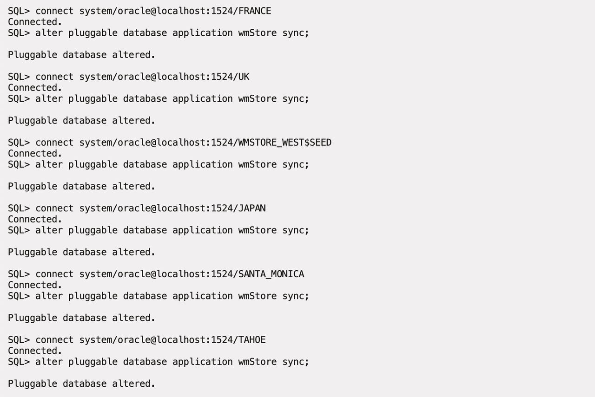

3. Queries against container CDB1.

    ```
    <copy>connect system/oracle@localhost:1523/cdb1</copy>
    ```


    ```
    <copy>column c01 format 999999 heading "Con_ID"
    column c02 format a30    heading "Container"</copy>
    ```


    ```
    <copy>ttitle "Containers"</copy>
    ```


    ```
    <copy>
    select Con_ID c01
    ,      Name   c02
    from v$containers
    order by 1;
    </copy>
    ```

    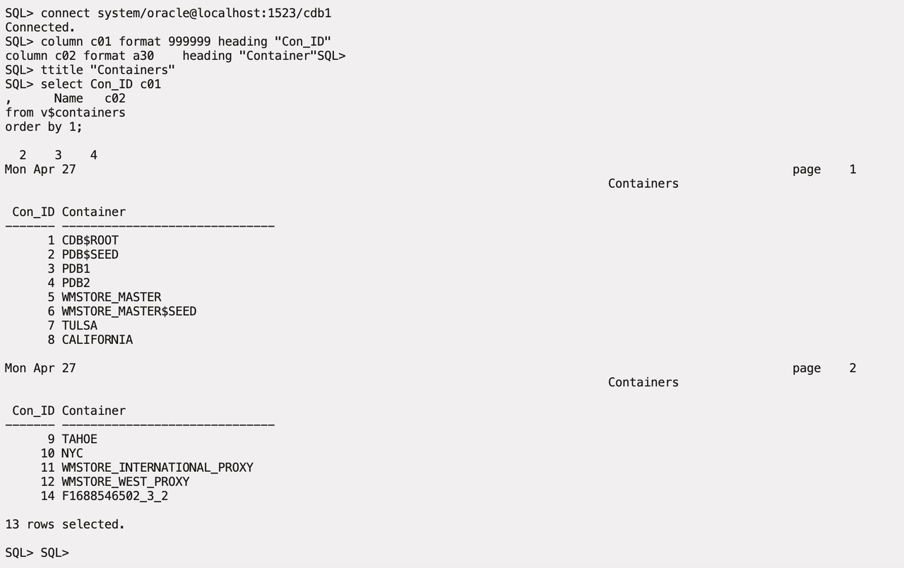

4. Queries against container wmStore_Master.

    ```
    <copy>connect wmStore_Admin/oracle@localhost:1523/wmStore_Master</copy>
    ```


    ```
    <copy>column c03 format a30    heading "Table Name"
    column c04 format a20    heading "Sharing Type"</copy>
    ```


    ```
    <copy>ttitle "Sharing Modes for Campaigns, Products and Orders"</copy>
    ```

    ```
    <copy>
    select Object_Name c03
    ,      Sharing     c04
    from DBA_Objects
    where Owner = User
    and   Object_Name in ('WM_CAMPAIGNS','WM_PRODUCTS','WM_ORDERS')
    order by Object_Name
    ;
    </copy>
    ```

    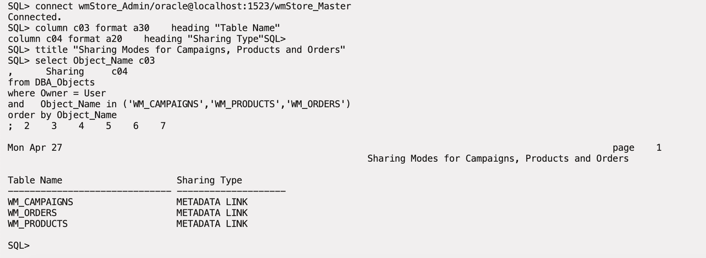

5. Queries against container Tulsa.

    ```
    <copy>connect wmStore_Admin/oracle@localhost:1523/Tulsa</copy>
    ```


    ```
    <copy>column c1 format a20 heading "Origin Con_ID"
    column c2 format a30            heading "Product"</copy>
    ```


    ```
    <copy>ttitle "Products Visible in Franchise Tulsa"</copy>
    ```


    ```
    <copy>
    select Row_GUID c1
    ,      Name          c2
    from wm_Products
    ;
    </copy>
    ```

    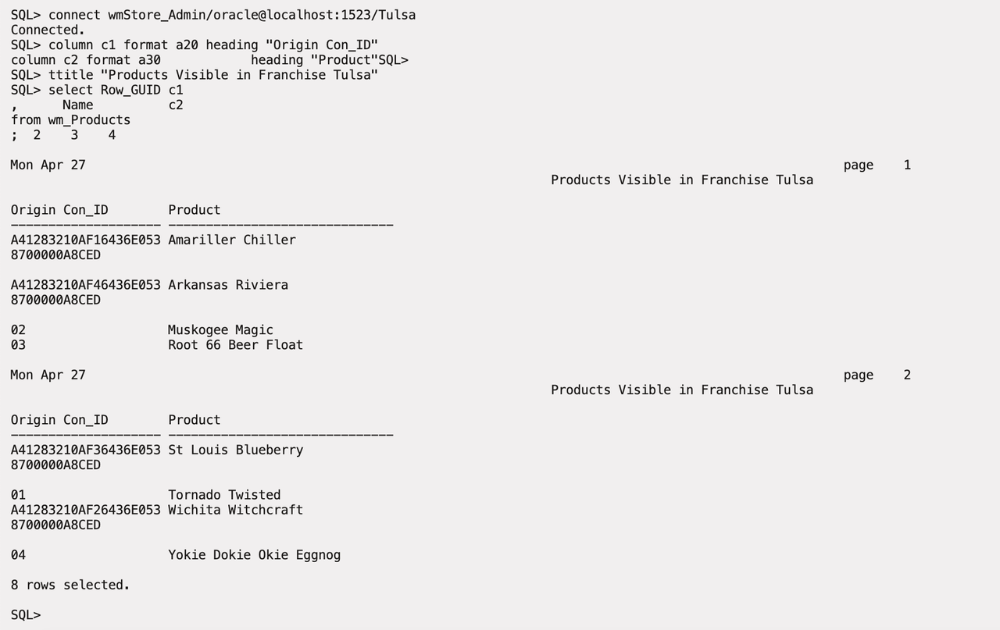

## Task 10: Application Patches
This section we define an application patch. Patches are comparable to the application upgrades that we've seen in previous labs, but there are three important differences.
- The types of operation that are allowed in a patch are more limited. Essentially operations which are destructive are not allowed, including:
    - Drop a table, column, index, trigger...
    - create or replace view, package, procedure...
- Patches do not involve creation of Application Root Clones.
- Patches are not version-specific. This means that a single patch may be applied to multiple application versions.

The tasks you will accomplish in this step are:
- Define patch 301 for application wmStore
- Propagate the patch to the Application Root Replicas. Then apply it to three franchises (but not to all)

1. Create patch 301.

    ```
    <copy>connect wmStore_Admin/oracle@localhost:1523/wmStore_Master</copy>
    ```

    ```
    <copy>alter pluggable database application wmStore begin patch 301;</copy>
    ```

    ```
    <copy>
    alter table wm_Orders add
    (Financial_Quarter_Code varchar2(30) default 'Q4,FY2017' not null
    )
    ;
    </copy>
    ```

    ```
    <copy>create index wm_Orders_M1 on wm_Orders(Order_Date);</copy>
    ```

    ```
    <copy>
    insert into wm_List_Of_Values (Type_Code, Value_Code) values ('Type', 'Financial Quarter');

    insert into wm_List_Of_Values (Type_Code, Value_Code) values ('Financial Quarter', 'Q1,FY2016');

    insert into wm_List_Of_Values (Type_Code, Value_Code) values ('Financial Quarter', 'Q2,FY2016');

    insert into wm_List_Of_Values (Type_Code, Value_Code) values ('Financial Quarter', 'Q3,FY2016');

    insert into wm_List_Of_Values (Type_Code, Value_Code) values ('Financial Quarter', 'Q4,FY2016');

    insert into wm_List_Of_Values (Type_Code, Value_Code) values ('Financial Quarter', 'Q1,FY2017');

    insert into wm_List_Of_Values (Type_Code, Value_Code) values ('Financial Quarter', 'Q2,FY2017');

    insert into wm_List_Of_Values (Type_Code, Value_Code) values ('Financial Quarter', 'Q3,FY2017');

    insert into wm_List_Of_Values (Type_Code, Value_Code) values ('Financial Quarter', 'Q4,FY2017');
    </copy>
    ```


    ```
    <copy>commit;</copy>
    ```

    ```
    <copy>
    update wm_Orders
    set Financial_Quarter_Code = 'Q1,FY2016'
    where Order_Date >= '01-JAN-16'
    and   Order_Date <  '01-APR-16'
    ;
    </copy>
    ```

    ```
    <copy>
    update wm_Orders
    set Financial_Quarter_Code = 'Q2,FY2016'
    where Order_Date >= '01-APR-16'
    and   Order_Date <  '01-JUL-16'
    ;
    </copy>
    ```

    ```
    <copy>
    update wm_Orders
    set Financial_Quarter_Code = 'Q3,FY2016'
    where Order_Date >= '01-JUL-16'
    and   Order_Date <  '01-OCT-16'
    ;
    </copy>
    ```

    ```
    <copy>
    update wm_Orders
    set Financial_Quarter_Code = 'Q4,FY2016'
    where Order_Date >= '01-OCT-16'
    and   Order_Date <  '01-JAN-17'
    ;
    </copy>
    ```

    ```
    <copy>
    update wm_Orders
    set Financial_Quarter_Code = 'Q1,FY2017'
    where Order_Date >= '01-JAN-17'
    and   Order_Date <  '01-APR-17'
    ;
    </copy>
    ```

    ```
    <copy>
    update wm_Orders
    set Financial_Quarter_Code = 'Q2,FY2017'
    where Order_Date >= '01-APR-17'
    and   Order_Date <  '01-JUL-17'
    ;
    </copy>
    ```

    ```
    <copy>
    update wm_Orders
    set Financial_Quarter_Code = 'Q3,FY2017'
    where Order_Date >= '01-JUL-17'
    and   Order_Date <  '01-OCT-17'
    ;
    </copy>
    ```

    ```
    <copy>
    update wm_Orders
    set Financial_Quarter_Code = 'Q4,FY2017'
    where Order_Date >= '01-OCT-17'
    and   Order_Date <  '01-JAN-18'
    ;
    </copy>
    ```


    ```
    <copy>commit;</copy>
    ```


    ```
    <copy>alter pluggable database application wmStore end patch;</copy>
    ```

    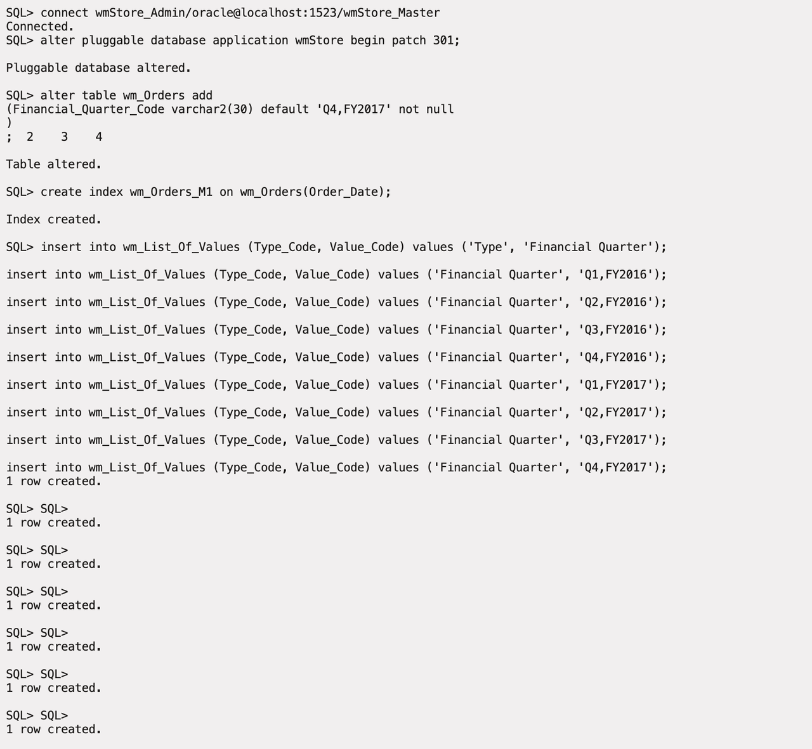

2. Apply the patch to some but not all of the databases.

    ```
    <copy>connect system/oracle@localhost:1523/Tulsa</copy>
    ```

    ```
    <copy>alter pluggable database application wmStore sync to patch 301;</copy>
    ```

    ```
    <copy>connect system/oracle@localhost:1523/California</copy>
    ```

    ```
    <copy>alter pluggable database application wmStore sync to patch 301;</copy>
    ```

    ```
    <copy>connect system/oracle@localhost:1523/NYC</copy>
    ```

    ```
    <copy>alter pluggable database application wmStore sync to patch 301;</copy>
    ```

## Task 11: DBA Views
This section we introduce some of the DBA Views which are relevant to Application Containers.

The tasks you will accomplish in this step are:
- Explore various DBA Views

1. DBA_PDBs

    ```
    <copy>connect system/oracle@localhost:1523/cdb1</copy>
    ```

    ```
    <copy>ttitle off</copy>
    ```

    ```
    <copy>set linesize 180</copy>
    ```

    ```
    <copy>
    column c1  heading "Con ID"             format 9999
    column c2  heading "PDB Name"           format a30
    column c3  heading "PDB ID"             format a10
    column c3  noprint
    column c4  heading "Con UID"            format a12
    column c5  heading "Status"             format a10
    column c6  heading "Root?"              format a5
    column c7  heading "App PDB?"           format a8
    column c8  heading "Seed?"              format a5
    column c9  heading "Root Clone?"        format a11
    column c10 heading "Proxy?"             format a6
    column c11 heading "App Container Name" format a30
    </copy>
    ```


    ```
    <copy>set echo on</copy>
    ```

    ```
    <copy>desc DBA_PDBs</copy>
    ```

    ```
    <copy>set echo off</copy>
    ```

    ```
    <copy>set echo on</copy>
    ```

    ```
    <copy>
    select P.Con_ID             c1
    ,      P.PDB_Name           c2
    ,      P.PDB_ID             c3
    ,      P.CON_UID            c4
    ,      P.Status             c5
    ,      P.Application_Root   c6
    ,      P.Application_PDB    c7
    ,      P.Application_Seed   c8
    ,      P.Application_Clone  c9
    ,      P.Is_Proxy_PDB       c10
    ,      AC.PDB_Name          c11
    from DBA_PDBs P
    left outer join DBA_PDBs AC
    on AC.Con_ID = P.Application_Root_Con_ID
    order by 6 desc
    ,        9
    ,        8 desc
    ,        10 desc
    ,        7 desc
    ,        2
    ,        8
    ;
    </copy>
    ```

    ```
    <copy>set echo off</copy>
    ```

    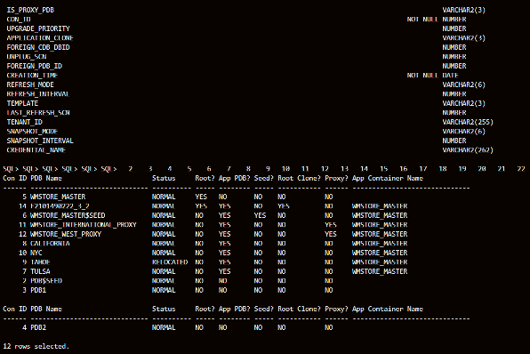

2. DBA_APPLICATIONS

    ```
    <copy>connect system/oracle@localhost:1523/wmStore_Master</copy>
    ```

    ```
    <copy>
    column CON_UID               heading "Con UID"          format 9999999999
    column APP_NAME              heading "Application Name" format a20          truncate
    column APP_ID                heading "App ID"           format 99999
    column APP_VERSION           heading "Version"          format a7
    column APP_VERSION_COMMENT   heading "Comment"          format a50
    column APP_STATUS            heading "Status"           format a12  
    column APP_IMPLICIT          heading "Implicit"         format a8
    column APP_CAPTURE_SERVICE   heading "Capture Svc"      format a30
    column APP_CAPTURE_MODULE    heading "Capture Mod"      format a15
    column PATCH_NUMBER          heading "Patch #"          format 999999
    column PATCH_MIN_VERSION     heading "Min Vers"         format a8
    column PATCH_STATUS          heading "Status"           format a10  
    column PATCH_COMMENT         heading "Comment"          format a50
    column ORIGIN_CON_ID         heading "Origin_Con_ID"    format 999999999999        
    column STATEMENT_ID          heading "Stmt ID"          format 999999
    column CAPTURE_TIME          heading "Capture TS"       format a9          
    column APP_STATEMENT         heading "SQL Statement"    format a50          truncate    
    column ERRORNUM              heading "Error #"          format 999999         
    column ERRORMSG              heading "Error Message"    format a50          truncate
    column SYNC_TIME             heading "Sync TS"          format a9
    </copy>
    ```

    ```
    <copy>set echo on</copy>
    ```

    ```
    <copy>desc DBA_Applications</copy>
    ```

    ```
    <copy>select * from DBA_Applications;</copy>
    ```

    ```
    <copy>set echo off</copy>
    ```

    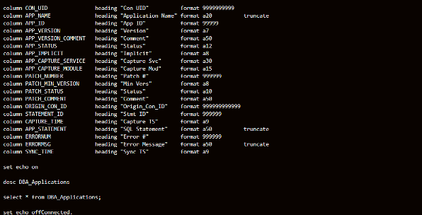

    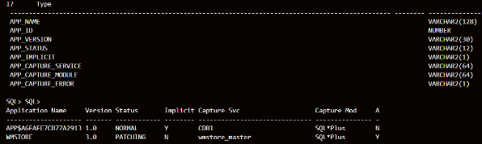

3. DBA_APP_VERSIONS

    ```
    <copy>set echo on</copy>
    ```

    ```
    <copy>desc DBA_App_Versions</copy>
    ```

    ```
    <copy>select * from DBA_App_Versions;</copy>
    ```

    ```
    <copy>set echo off</copy>
    ```

    

4. DBA_APP_PATCHES

    ```
    <copy>set echo on</copy>
    ```

    ```
    <copy>desc DBA_App_Patches</copy>
    ```

    ```
    <copy>select * from DBA_App_Patches;</copy>
    ```

    ```
    <copy>set echo off</copy>
    ```

    

5. DBA_APP_PDB_STATUS

    ```
    <copy>set echo on</copy>
    ```

    ```
    <copy>desc DBA_App_PDB_Status</copy>
    ```

    ```
    <copy>select * from DBA_App_PDB_Status;</copy>
    ```

    ```
    <copy>set echo off</copy>
    ```

    

6. DBA_APP_STATEMENTS

    ```
    <copy>set echo on</copy>
    ```

    ```
    <copy>desc DBA_App_Statements</copy>
    ```

    ```
    <copy>select * from DBA_App_Statements;</copy>
    ```

    ```
    <copy>set echo off</copy>
    ```

    

    

    

    

7. DBA_APP_ERRORS

    ```
    <copy>set echo on</copy>
    ```

    ```
    <copy>connect system/oracle@localhost:1523/NYC</copy>
    ```

    ```
    <copy>desc DBA_App_Errors</copy>
    ```

    ```
    <copy>select * from DBA_App_Errors;</copy>
    ```

    ```
    <copy>set echo off</copy>
    ```

    

## Task 12: Diagnosing, Correcting Problems, and Restarting Sync
This section we explore the restartability of the patching process.

The tasks you will accomplish in this step are:
- Deliberately make a manual change to NYC that will conflict with applying patch 301
- Attempt to sync NYC to apply the patch – anticipating a failure
- Query relevant DBA views to identify the problem
- Resolve the problem and re-start the sync, which should now succeed

1. Create an index that will break the sync.

    ```
    <copy>connect wmStore_Admin/oracle@localhost:1523/NYC
    create index wm_Orders_M1 on wm_Orders(Order_Date);</copy>
    ```

    

2. Try the sync and have it fail.

    ```
    <copy>connect system/oracle@localhost:1523/NYC
    alter pluggable database application wmStore sync;</copy>
    ```

    

3. Check for errors.

    ```
    <copy>
    set linesize 180

    column APP_NAME              heading "Application Name" format a20          truncate
    column APP_STATEMENT         heading "SQL Statement"    format a50          truncate    
    column ERRORNUM              heading "Error #"          format 999999         
    column ERRORMSG              heading "Error Message"    format a50          truncate
    column SYNC_TIME             heading "Sync TS"          format a9

    select * from DBA_App_Errors;
    </copy>
    ```

    

4. Correct the issue and try the sync again.

    ```
    <copy>
    connect wmStore_Admin/oracle@localhost:1523/NYC

    drop index wm_Orders_M1;

    connect system/oracle@localhost:1523/NYC

    alter pluggable database application wmStore sync;
    </copy>
    ```

    

## Task 13: Container Map
This section we explore another location transparency technology: Container Map. Here we follow the expansion of Walt's Malts through the acquisition of a formerly independent distributor of Walt's Malts products. This company is named Terminally Chill, and their niche was selling Walt's Malts produce through a number of small kiosks in various airports globally. The Terminally Chill application has a different design from the original wmStore application. Whereas wmStore was originally designed for standalone deployment, Terminally Chill used a single database to manage data for all kiosks in all airports. The application server tiers are designed to connect directly to a single database, with query predicates to retrieve data for the right airport and kiosk. In this lab, we'll see how Container Map can help accommodate applications of this design.

The tasks you will accomplish in this step are:
- Setup Application PDBs for new Airport franchises
- Install v1 of Application "Terminal"
- Sync Application PDBs
- Create franchise-specific demonstration data
- Perform various queries to see how Container Map can deliver location transparency

1. Create the application root.

    ```
    <copy>
    connect system/oracle@localhost:1523/cdb1

    create pluggable database Terminal_Master as application container
    admin user tc_admin identified by oracle;

    alter pluggable database Terminal_Master open;
    </copy>
    ```

    

2. Create the Application PDBs.

    ```
    <copy>
    connect system/oracle@localhost:1523/Terminal_Master

    create pluggable database LHR
    admin user tc_admin identified by oracle;

    create pluggable database SFO
    admin user tc_admin identified by oracle;

    create pluggable database JFK
    admin user tc_admin identified by oracle;

    create pluggable database LAX
    admin user tc_admin identified by oracle;

    alter session set container=CDB$Root;
    alter pluggable database all open;
    </copy>
    ```

    

3. Create the 1.0 Terminal Install.

    ```
    <copy>
    connect system/oracle@localhost:1523/Terminal_Master

    alter pluggable database application Terminal begin install '1.0';

    connect system/oracle@localhost:1523/Terminal_Master

    create table tc_Kiosk_Map
    (Kiosk varchar2(30) not null
    )
    partition by list (Kiosk)
    (partition LHR values ('LHR T1','LHR T4','LHR T5')
    ,partition SFO values ('SFO INTL','SFO T2')
    ,partition JFK values ('JFK T1','JFK T2','JFK T3')
    ,partition LAX values ('LAX INTL','LAX 7/8')
    )
    ;

    alter database set Container_Map = 'SYSTEM.tc_Kiosk_Map';

    create tablespace Terminal_TBS datafile size 100M autoextend on next 10M maxsize 200M;
    create user Terminal_Admin identified by oracle container=all;
    grant create session, dba to Terminal_Admin;
    alter user Terminal_Admin default tablespace Terminal_TBS;

    connect Terminal_Admin/oracle@localhost:1523/Terminal_Master

    create table tc_Products
    sharing = extended data
    (Row_GUID         raw(16)           default Sys_GUID()                      primary key
    ,Name             varchar2(30)                                    not null  unique
    ,Local_Product_YN char(1)           default 'Y'                   not null
    )
    ;

    alter table tc_Products add constraint Local_Product_Bool
    check (Local_Product_YN in ('Y','N'))
    ;

    create table tc_Coupons
    sharing = data
    (Row_GUID         raw(16)           default Sys_GUID()                      primary key
    ,Coupon_Number    number(16,0)      generated always as identity  not null  unique
    ,Campaign_Code    varchar2(30)
    ,Expiration_Date  date              default current_date+14
    )
    ;
    </copy>
    ```

    

    ```
    <copy>
    create table tc_Orders
    sharing = metadata
    (Row_GUID         raw(16)           default Sys_GUID()                      primary key
    ,Order_Number     number(16,0)      generated always as identity  not null  unique
    ,Order_Date       date              default   current_date        not null
    ,Kiosk_Code       varchar2(30)      not null
    ,Coupon_ID        raw(16)
    ,Campaign_Code    varchar2(30)      null
    )
    ;

    alter table tc_Orders add constraint tc_Orders_F1
    foreign key (Coupon_ID)
    references tc_Coupons(Row_GUID)
    disable
    ;

    create table tc_Order_Items
    sharing = metadata
    (Row_GUID         raw(16)                    default Sys_GUID()           primary key
    ,Order_ID         raw(16)           not null
    ,Item_Num         number(16,0)      not null
    ,Product_ID       raw(16)           not null
    ,Order_Qty        number(16,0)      not null
    )
    ;

    alter table tc_Order_Items add constraint tc_Order_Items_F1
    foreign key (Order_ID)
    references tc_Orders(Row_GUID)
    disable
    ;
    alter table tc_Order_Items add constraint tc_Order_Items_F2
    foreign key (Product_ID)
    references tc_Products(Row_GUID)
    disable
    ;

    create table tc_List_Of_Values
    sharing = data
    (Row_GUID    raw(16)        default Sys_GUID() primary key
    ,Type_Code   varchar2(30)   not null
    ,Value_Code  varchar2(30)   not null
    )
    ;
    </copy>
    ```

    

    ```
    <copy>
    alter table tc_List_Of_Values  add constraint tc_List_Of_Values_U1
    unique (Type_Code, Value_Code)
    ;

    insert into tc_List_Of_Values (Type_Code, Value_Code) values ('Type', 'Airport');
    insert into tc_List_Of_Values (Type_Code, Value_Code) values ('Airport','LHR');
    insert into tc_List_Of_Values (Type_Code, Value_Code) values ('Airport','SFO');
    insert into tc_List_Of_Values (Type_Code, Value_Code) values ('Airport','JFK');
    insert into tc_List_Of_Values (Type_Code, Value_Code) values ('Airport','LAX');

    insert into tc_List_Of_Values (Type_Code, Value_Code) values ('Type', 'Kiosk');
    insert into tc_List_Of_Values (Type_Code, Value_Code) values ('Kiosk','LHR T1');
    insert into tc_List_Of_Values (Type_Code, Value_Code) values ('Kiosk','LHR T4');
    insert into tc_List_Of_Values (Type_Code, Value_Code) values ('Kiosk','LHR T5');
    insert into tc_List_Of_Values (Type_Code, Value_Code) values ('Kiosk','SFO INTL');
    insert into tc_List_Of_Values (Type_Code, Value_Code) values ('Kiosk','SFO T2');
    insert into tc_List_Of_Values (Type_Code, Value_Code) values ('Kiosk','JFK T1');
    insert into tc_List_Of_Values (Type_Code, Value_Code) values ('Kiosk','JFK T2');
    insert into tc_List_Of_Values (Type_Code, Value_Code) values ('Kiosk','JFK T3');
    insert into tc_List_Of_Values (Type_Code, Value_Code) values ('Kiosk','LAX INTL');
    insert into tc_List_Of_Values (Type_Code, Value_Code) values ('Kiosk','LAX 7/8');

    insert into tc_List_Of_Values (Type_Code, Value_Code) values ('Type', 'Campaign');
    insert into tc_List_Of_Values (Type_Code, Value_Code) values ('Campaign','Foreign Getaway');
    insert into tc_List_Of_Values (Type_Code, Value_Code) values ('Campaign','Lost Weekend');
    insert into tc_List_Of_Values (Type_Code, Value_Code) values ('Campaign','Road Warrior');
    insert into tc_List_Of_Values (Type_Code, Value_Code) values ('Campaign','World Citizen');
    </copy>
    ```

    

    ```
    <copy>
    insert into tc_List_Of_Values (Type_Code, Value_Code) values ('Type', 'Financial Quarter');
    insert into tc_List_Of_Values (Type_Code, Value_Code) values ('Financial Quarter', 'Q1,FY2016');
    insert into tc_List_Of_Values (Type_Code, Value_Code) values ('Financial Quarter', 'Q2,FY2016');
    insert into tc_List_Of_Values (Type_Code, Value_Code) values ('Financial Quarter', 'Q3,FY2016');
    insert into tc_List_Of_Values (Type_Code, Value_Code) values ('Financial Quarter', 'Q4,FY2016');
    insert into tc_List_Of_Values (Type_Code, Value_Code) values ('Financial Quarter', 'Q1,FY2017');
    insert into tc_List_Of_Values (Type_Code, Value_Code) values ('Financial Quarter', 'Q2,FY2017');
    insert into tc_List_Of_Values (Type_Code, Value_Code) values ('Financial Quarter', 'Q3,FY2017');
    insert into tc_List_Of_Values (Type_Code, Value_Code) values ('Financial Quarter', 'Q4,FY2017');

    commit;

    insert into tc_Products (Row_GUID, Name, Local_Product_YN) values ('01', 'Tornado Twisted', 'N');
    insert into tc_Products (Row_GUID, Name, Local_Product_YN) values ('02', 'Muskogee Magic', 'N');
    insert into tc_Products (Row_GUID, Name, Local_Product_YN) values ('03', 'Root 66 Beer Float', 'N');
    insert into tc_Products (Row_GUID, Name, Local_Product_YN) values ('04', 'Yokie Dokie Okie Eggnog', 'N');

    commit;
    </copy>
    ```

    

    ```
    <copy>
    alter table tc_Orders enable containers_default;

    alter table tc_Orders enable container_map;

    alter pluggable database application Terminal end install '1.0';
    </copy>
    ```

    

    

4. Sync the Application databases to install 1.0.

    ```
    <copy>
    connect system/oracle@localhost:1523/LHR

    alter pluggable database application Terminal sync to '1.0';

    connect system/oracle@localhost:1523/SFO

    alter pluggable database application Terminal sync to '1.0';

    connect system/oracle@localhost:1523/JFK

    alter pluggable database application Terminal sync to '1.0';

    connect system/oracle@localhost:1523/LAX

    alter pluggable database application Terminal sync to '1.0';
    </copy>
    ```

    

5. Load the Terminal Data.

    ```
    <copy>@Terminal_Data_Lab12</copy>
    ```

    

    

    

6. Review the Container Map.

    ```
    <copy>
    connect Terminal_Admin/oracle@localhost:1523/Terminal_Master
    column c1 format a30     heading "Airport"
    column c2 format a30     heading "Kiosk"
    column c3 format 999,999 heading "Num Orders"

    define Kiosk = "LAX INTL"
    ttitle "Order Count in Kiosk &Kiosk in Past Year"

    select count(*)
    from tc_Orders
    where Order_Date > current_date-365
    and   Kiosk_Code = '&Kiosk'
    ;

    ttitle "Order Count in Subset of Kiosks in Past Year"

    select o.Kiosk_Code c2
    ,      count(*)     c3
    from tc_Orders o
    where o.Kiosk_Code in ('SFO INTL','LHR T5')
    and   o.Campaign_Code = 'Foreign Getaway'
    and   o.Order_Date > current_date-365
    group by o.Kiosk_Code
    ;
    </copy>
    ```

    

**Congratulations! You have completed this workshop!**

## Acknowledgements

- **Author** - Patrick Wheeler, VP, Multitenant Product Management
- **Adapted to Cloud by** -  David Start, OSPA
- **Contributors** -  David Start, Anoosha Pilli, Rene Fontcha
- **Last Updated By/Date** - Rene Fontcha, LiveLabs Platform Lead, NA Technology, April 2021
