# Clone, Plug and Drop

## Introduction
Oracle Multitenant enables an Oracle Database to function as a container database (CDB). A CDB consolidates multiple pluggable databases (PDB), a portable collection of schemas, schema objects, and non-schema objects. Whether deployed on-premises or in the cloud, with Oracle Multitenant, applications run unchanged in self-contained PDBs, improving resource utilization, management, and overall security.

[](youtube:kzTQGs75IjA)

*Estimated Workshop Time*: 2 hour

### Objectives

In this lab, you will:
* Explore rapid cloning and provisioning
* Explore local clones and remote clones
* Save database administrators time by provisioning pluggable databases as clones locally or from across the network without disrupting the source
* Explore refreshable PDBs
* Maintain up-to-date copies of production databases by periodically topping them up with incremental transactions.


## Task 1: Login to CDB1 Database

In this lab, we have two CDBs (CDB1 & CDB2) created, and listening on different port using listeners LISTCDB1 on 1523 & LISTCDB2 on 1524)

1. All scripts for this lab are stored in the `labs/multitenant` folder and are run as the oracle user. Let's navigate to the path now.

    ```
    <copy>
    cd /home/oracle/labs/multitenant
    </copy>
    ```

2.  Login to Database

    set environment for CDB1    
    ```
    <copy>. oraenv</copy>
    CDB1
    ```

    Connect to CDB1 instance
    ```
    <copy>
    sqlplus  sys/oracle@localhost:1523/cdb1 as sysdba
    </copy>
    ```
    Note: SYS and SYSTEM username/password are common across all CDBs and PDBs. If you need a customized Global user across CDBs and PDBs we can create user having username starting with "C##" at the CDB level. i.e., "C##<username>" or C##vijay

## Task 2:  Create PDB
This section looks at how to create a new PDB. You will create a pluggable database **PDB2** in the container database **CDB1**

1. Check to see who you are connected as. At any point in the lab you can run this script to see who or where you are connected.

    ```
    <copy>
    select
      'DB Name: '  ||Sys_Context('Userenv', 'DB_Name')||
      ' / CDB?: '     ||case
        when Sys_Context('Userenv', 'CDB_Name') is not null then 'YES'
          else  'NO'
          end||
      ' / Auth-ID: '   ||Sys_Context('Userenv', 'Authenticated_Identity')||
      ' / Sessn-User: '||Sys_Context('Userenv', 'Session_User')||
      ' / Container: ' ||Nvl(Sys_Context('Userenv', 'Con_Name'), 'n/a')
      "Who am I?"
      from Dual
      /
    </copy>
    ```

    

2. Create a pluggable database **PDB2**.

    ```
    <copy>show  pdbs;</copy>
    ```
    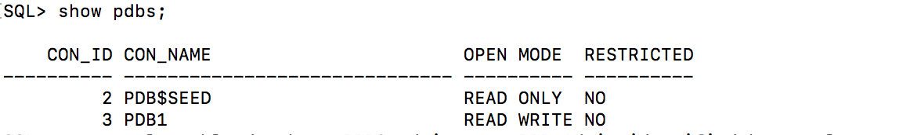
    ```
    <copy>
    create pluggable database PDB2 admin user PDB_Admin identified by oracle;

    alter pluggable database PDB2 open;

    show pdbs;
    </copy>
    ```


    

    

3. Change the session to point to **PDB2**.

    ```
    <copy>alter session set container = PDB2;</copy>
    ```

    

4. Grant **PDB_ADMIN** the necessary privileges and create the **USERS** tablespace for **PDB2**.

    ```
    <copy>
    grant sysdba to pdb_admin;
    create tablespace users datafile size 20M autoextend on next 1M maxsize unlimited segment space management auto;
    alter database default tablespace Users;
    grant create table, unlimited tablespace to pdb_admin;

    </copy>
    ````

   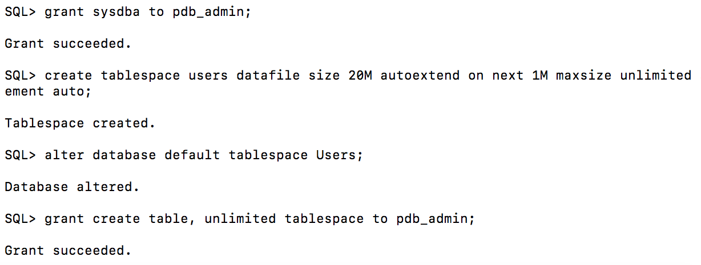

5. Connect as **PDB_ADMIN** to **PDB2**.

    ```
    <copy>connect pdb_admin/oracle@localhost:1523/pdb2</copy>
    ```

6. Create a table **MY_TAB** in **PDB2**.

    ```
    <copy>
    create table my_tab(my_col number);
    insert into my_tab values (1);
    commit;
    </copy>
    ```

   

7. Change back to **SYS** in the container database **CDB1** and show the tablespaces and datafiles created.

    ```
    <copy>
    connect sys/oracle@localhost:1523/cdb1 as sysdba

    COLUMN "Con_Name" FORMAT A10
    COLUMN "T'space_Name" FORMAT A12
    COLUMN "File_Name" FORMAT A120
    SET LINESIZE 220
    SET PAGES 9999

    with Containers as (
      select PDB_ID Con_ID, PDB_Name Con_Name from DBA_PDBs
      union
      select 1 Con_ID, 'CDB$ROOT' Con_Name from Dual)
    select
      Con_ID,
      Con_Name "Con_Name",
      Tablespace_Name "T'space_Name",
      File_Name "File_Name"
    from CDB_Data_Files inner join Containers using (Con_ID)
    union
    select
      Con_ID,
      Con_Name "Con_Name",
      Tablespace_Name "T'space_Name",
      File_Name "File_Name"
    from CDB_Temp_Files inner join Containers using (Con_ID)
    order by 1, 3
    /
    </copy>
    ```

    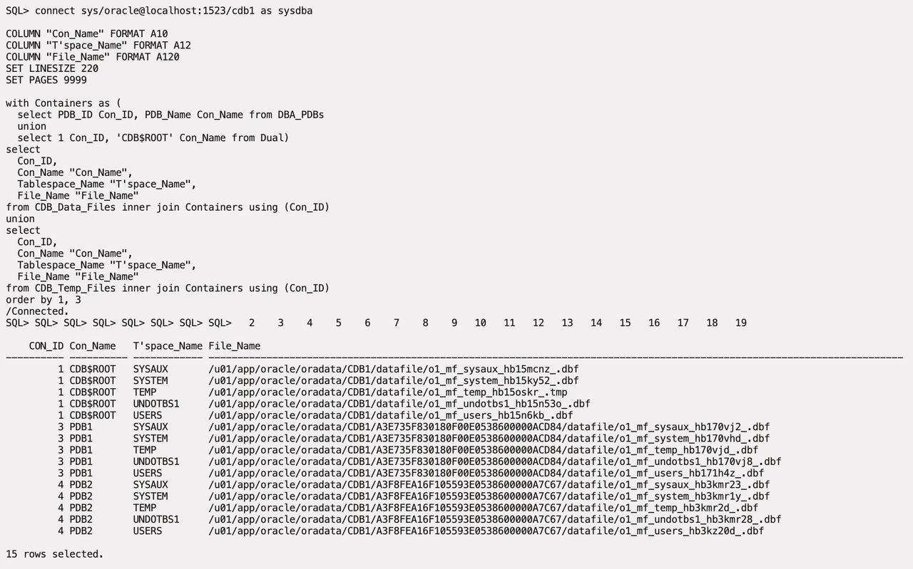

## Task 3: Hot Clone PDB
This section looks at how to clone a PDB. In Oracle 12.1 when Multitenant feature was introduced, we had to change source PDB to READ ONLY mode to clone. However, since 12.2, we can clone a PDB  when the source is open in READ WRITE mode. This feature is also called HOT clone. Hot Clone relies on reading the online Redolog files and Archivelog files. -- If all the changes are available in the online Redolog files, then Hot cloneing will successed even in NOARCHIVELOG mode.

The tasks you will accomplish in this step are:
- Clone a pluggable database **PDB2** into **PDB3**

1. Connect to the container **CDB1**.

    ```
    <copy>connect sys/oracle@localhost:1523/cdb1 as sysdba</copy>
    ```
2. check the status of archive log mode.
    ```
    <copy>archive log list</copy>
    SQL> archive log list
    Database log mode	         No Archive Mode
    Automatic archival	       Disabled
    Archive destination	       /u01/app/oracle/product/19c/dbhome_1/dbs/arch
    Oldest online log sequence     83
    Current log sequence	         85

    ```

2. Create a pluggable database **PDB3** from  **PDB2**.

    ```
    <copy>create pluggable database PDB3 from PDB2;
    alter pluggable database PDB3 open force;

    </copy>
    ```

    ```
    <copy>show pdbs</copy>
    ```
    ```
    SQL> show pdbs

    CON_ID      CON_NAME		OPEN MODE  RESTRICTED
    ---------- ----------- ---------- ----------
        	 2   PDB$SEED			READ ONLY  NO
        	 3   PDB1 			  READ WRITE NO
        	 4   PDB2 			  READ WRITE NO
        	 5   PDB3 			  READ WRITE NO

    ```

4. Connect to **PDB2** and show the table **MY_TAB**.

    ```
    <copy>connect pdb_admin/oracle@localhost:1523/pdb2</copy>
    ```

    ```
    <copy>select * from my_tab;</copy>
    ```

   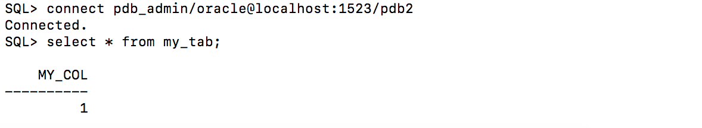

5. Connect to **PDB3** and show the table **MY_TAB**.

    ```
    <copy>connect pdb_admin/oracle@localhost:1523/pdb3</copy>
    ```

    ```
    <copy>select * from my_tab;</copy>
    ```

   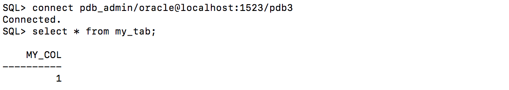

## Task 4: Unplug a PDB
This section looks at how to unplug a PDB.

The tasks you will accomplish in this step are:
- Unplug **PDB3** from **CDB1**

1. Start SQLPLUS if you aren't already in a SQLPLUS session.

    ```
    <copy>sqlplus /nolog </copy>
    ```
1. Connect to the container **CDB1**.

    ```
    <copy>connect sys/oracle@localhost:1523/cdb1 as sysdba</copy>
    ```

2. Unplug **PDB3** from **CDB1**.

    ```
    <copy>show pdbs</copy>
    ```

    ```
    <copy>alter pluggable database PDB3 close immediate;</copy>
    ```

    ```
    <copy>
    alter pluggable database PDB3
    unplug into
    '/u01/app/oracle/oradata/CDB1/pdb3.xml';
    </copy>
    ```

    ```
    <copy>show pdbs</copy>
    ```

   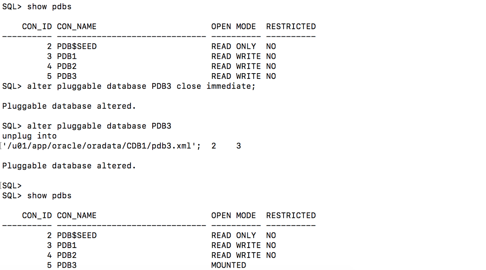

3. Remove **PDB3** from **CDB1**.

    ```
    <copy>drop pluggable database PDB3 keep datafiles;</copy>
    ```

    ```
    <copy>show pdbs</copy>
    ```

   

4. Show the datafiles in **CDB1**.

    ```
    <copy>
    COLUMN "Con_Name" FORMAT A10
    COLUMN "T'space_Name" FORMAT A12
    COLUMN "File_Name" FORMAT A120
    SET LINESIZE 220
    SET PAGES 9999

    with Containers as (
      select PDB_ID Con_ID, PDB_Name Con_Name from DBA_PDBs
      union
      select 1 Con_ID, 'CDB$ROOT' Con_Name from Dual)
    select
      Con_ID,
      Con_Name "Con_Name",
      Tablespace_Name "T'space_Name",
      File_Name "File_Name"
    from CDB_Data_Files inner join Containers using (Con_ID)
    union
    select
      Con_ID,
      Con_Name "Con_Name",
      Tablespace_Name "T'space_Name",
      File_Name "File_Name"
    from CDB_Temp_Files inner join Containers using (Con_ID)
    order by 1, 3
    /
    </copy>
    ```

    

5. Look at the XML file for the pluggable database **PDB3**.

    ```
    <copy>host cat /u01/app/oracle/oradata/CDB1/pdb3.xml</copy>
    ```

    

## Task 5: Plug in a PDB
This section looks at how to plug in a PDB.

The tasks you will accomplish in this step are:
- Plug **PDB3** into **CDB2**

1. Start SQLPLUS if you aren't already in a SQLPLUS session.

    ```
    <copy>sqlplus /nolog </copy>
    ```
1. Connect to the container **CDB2**.
    ```
    <copy>connect sys/oracle@localhost:1524/cdb2 as sysdba</copy>
    ```

    ```
    <copy>
    COLUMN "Who am I?" FORMAT A120
    select
      'DB Name: '  ||Sys_Context('Userenv', 'DB_Name')||
      ' / CDB?: '     ||case
        when Sys_Context('Userenv', 'CDB_Name') is not null then 'YES'
        else 'NO'
        end||
      ' / Auth-ID: '   ||Sys_Context('Userenv', 'Authenticated_Identity')||
      ' / Sessn-User: '||Sys_Context('Userenv', 'Session_User')||
      ' / Container: ' ||Nvl(Sys_Context('Userenv', 'Con_Name'), 'n/a')
      "Who am I?"
    from Dual
    /
    </copy>
    ```

    ```
    <copy>show pdbs</copy>
    ```

    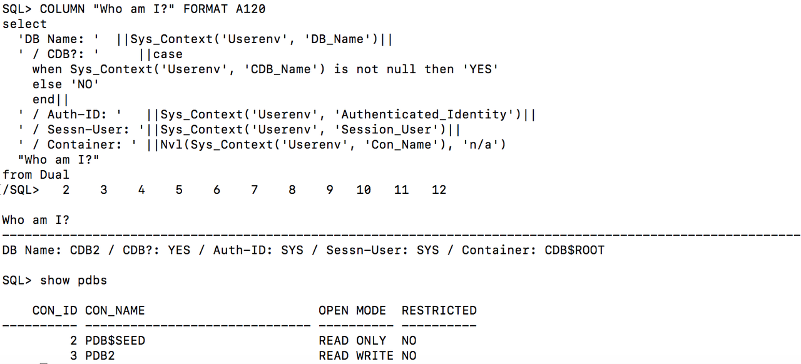

2. Check the compatibility of **PDB3** with **CDB2**.

    ```
    <copy>
    begin
      if not
        Sys.DBMS_PDB.Check_Plug_Compatibility
        ('/u01/app/oracle/oradata/CDB1/pdb3.xml')
      then
        Raise_Application_Error(-20000, 'Incompatible');
      end if;
    end;
    /
    </copy>
    ```

    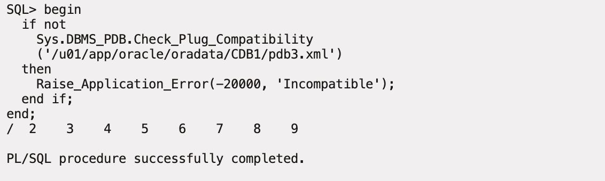

3. Plug **PDB3** into **CDB2**.

    ```
    <copy>
    create pluggable database PDB3
    using '/u01/app/oracle/oradata/CDB1/pdb3.xml'
    move;
    </copy>
    ```

    ```
    <copy>show pdbs</copy>
    ```

    ```
    <copy>alter pluggable database PDB3 open;</copy>
    ```

    ```
    <copy>show pdbs</copy>
    ```

    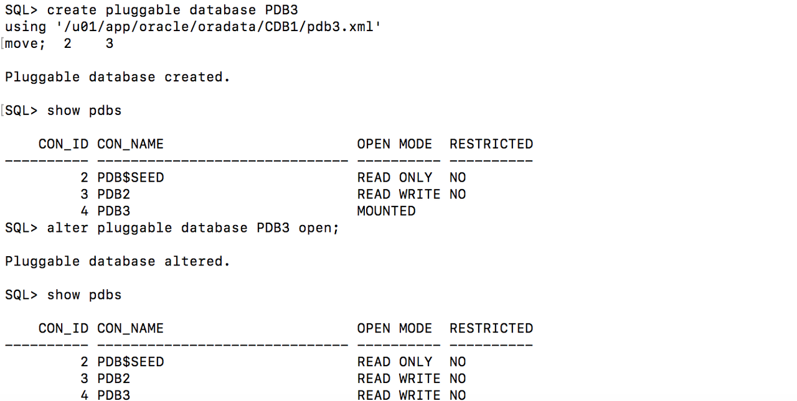

4. Review the datafiles in **CDB2**.

    ```
    <copy>
    COLUMN "Con_Name" FORMAT A10
    COLUMN "T'space_Name" FORMAT A12
    COLUMN "File_Name" FORMAT A120
    SET LINESIZE 220
    SET PAGES 9999


    with Containers as (
      select PDB_ID Con_ID, PDB_Name Con_Name from DBA_PDBs
      union
      select 1 Con_ID, 'CDB$ROOT' Con_Name from Dual)
    select
      Con_ID,
      Con_Name "Con_Name",
      Tablespace_Name "T'space_Name",
      File_Name "File_Name"
    from CDB_Data_Files inner join Containers using (Con_ID)
    union
    select
      Con_ID,
      Con_Name "Con_Name",
      Tablespace_Name "T'space_Name",
      File_Name "File_Name"
    from CDB_Temp_Files inner join Containers using (Con_ID)
    order by 1, 3
    /
    </copy>
    ```

    

5. Connect as **PDB\_ADMIN** to **PDB3** and look at **MY\_TAB**.

    ```
    <copy>connect pdb_admin/oracle@localhost:1524/pdb3</copy>
    ```

    ```
    <copy>select * from my_tab;</copy>
    ```

    

## Task 6: Drop a PDB
This section looks at how to drop a pluggable database.

The tasks you will accomplish in this step are:
- Drop **PDB3** from **CDB2**

1. Start SQLPLUS if you aren't already in a SQLPLUS session.

    ```
    <copy>sqlplus /nolog </copy>
    ```
1. Connect to the container **CDB2**.

    ```
    <copy>connect sys/oracle@localhost:1524/cdb2 as sysdba</copy>
    ```

2. Drop **PDB3** from **CDB2**.

    ```
    <copy>show pdbs</copy>
    ```

    ```
    <copy>alter pluggable database PDB3 close immediate;</copy>
    ```

    ```
    <copy>drop pluggable database PDB3 including datafiles;</copy>
    ```

    ```
    <copy>show pdbs</copy>
    ```

    


## Task 7: Clone an Unplugged PDB
This section looks at how to create a gold copy of a PDB and clone it into another container.

The tasks you will accomplish in this step are:
- Create a gold copy of **PDB2** in **CDB1** as **GOLDPDB**
- Clone **GOLDPDB** into **COPYPDB1** and **COPYPDB2** in **CDB2**

1. Start SQLPLUS if you aren't already in a SQLPLUS session.

    ```
    <copy>sqlplus /nolog </copy>
    ```
1. Connect to the container **CDB1**.
    ```
    <copy>connect sys/oracle@localhost:1523/cdb1 as sysdba</copy>
    ```

2. Create a pluggable database **GOLDPDB** from the read only database **PDB2**.

    ```
    <copy>create pluggable database GOLDPDB from PDB2;</copy>
    ```

    ```
    <copy>alter pluggable database GOLDPDB open force;</copy>
    ```

    ```
    <copy>show pdbs</copy>
    ```

    ```
    SQL> create pluggable database GOLDPDB from PDB2;

    Pluggable database created.

    SQL> alter pluggable database GOLDPDB open force;

    Pluggable database altered.

    SQL> show pdbs

        CON_ID CON_NAME			  OPEN MODE  RESTRICTED
    ---------- -------------- ---------- ----------
    	 2       PDB$SEED			   READ ONLY  NO
    	 3       PDB1 			     READ WRITE NO
    	 5       PDB2 			     READ WRITE NO
    	 6       GOLDPDB			   READ WRITE NO
    ```

5. Unplug **GOLDPDB** from **CDB1**.

    ```
    <copy>show pdbs</copy>
    ```

    ```
    <copy>alter pluggable database GOLDPDB close immediate;</copy>
    ```

    ```
    <copy>alter pluggable database GOLDPDB
    unplug into '/u01/app/oracle/oradata/CDB1/goldpdb.xml';</copy>
    ```

    ```
    <copy>show pdbs</copy>
    ```

    

6. Remove **GOLDPDB** from **CDB1**.

    ```
    <copy>drop pluggable database GOLDPDB keep datafiles;</copy>
    ```

    ```
    <copy>show pdbs</copy>
    ```

    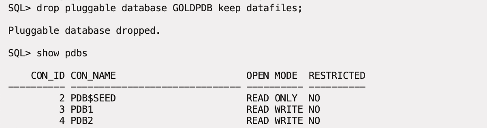

7. Connect to **CDB2**.

    ```
    <copy>connect sys/oracle@localhost:1524/cdb2 as sysdba</copy>
    ```

8. Validate **GOLDPDB** is compatibile with **CDB2**.

    ```
    <copy>
    begin
      if not
        Sys.DBMS_PDB.Check_Plug_Compatibility
    ('/u01/app/oracle/oradata/CDB1/goldpdb.xml')
      then
        Raise_Application_Error(-20000, 'Incompatible');
      end if;
    end;
    /
    </copy>
    ```

    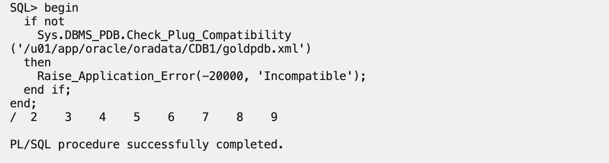

9. Create a clone of **GOLDPDB** as **COPYPDB1**.

    ```
    <copy>
    create pluggable database COPYPDB1 as clone
    using '/u01/app/oracle/oradata/CDB1/goldpdb.xml'
    storage (maxsize unlimited max_shared_temp_size unlimited)
    copy;
    </copy>
    ```

    ```
    <copy>show pdbs</copy>
    ```

    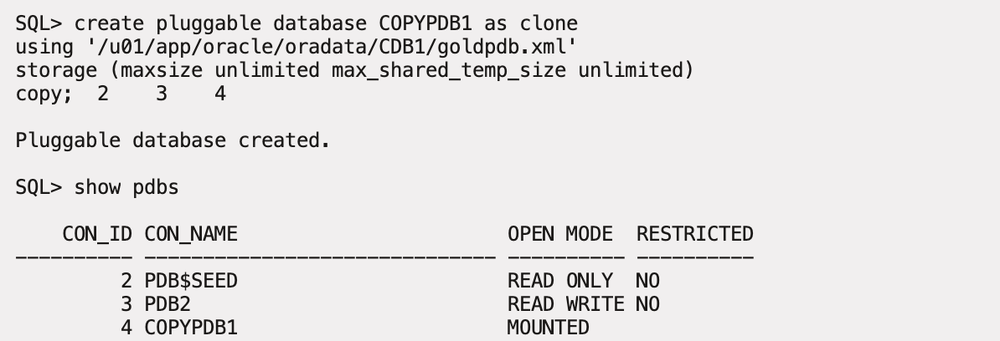

10. Create another clone of **GOLDPDB** as **COPYPDB2**.

    ```
    <copy>
    create pluggable database COPYPDB2 as clone
    using '/u01/app/oracle/oradata/CDB1/goldpdb.xml'
    storage (maxsize unlimited max_shared_temp_size unlimited)
    copy;
    </copy>
    ```

    ```
    <copy>show pdbs</copy>
    ```

    

11. Open all of the pluggable databases.

    ```
    <copy>alter pluggable database all open;</copy>
    ```

    ```
    <copy>show pdbs</copy>
    ```

    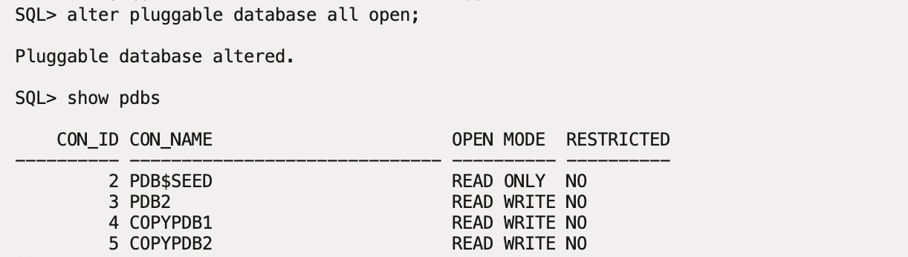

12. Look at the GUID for the two cloned databases.

    ```
    <copy>
    COLUMN "PDB Name" FORMAT A20
    select PDB_Name "PDB Name", GUID
    from DBA_PDBs
    order by Creation_Scn
    /
    </copy>
    ```

    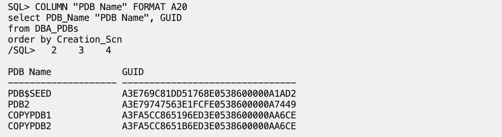

## Task 8: Remote Clone
This section looks at how to hot clone a pluggable database.

The tasks you will accomplish in this step are:
- Create a pluggable database **OE** in the container database **CDB1**
- Create a load against the pluggable database **OE**
- Create a remote clone **OE_DEV** in the container database **CDB2** from the pluggable database **OE**
- Create a snapshot clone from **OE_DEV**. Open the snapshot clone and do DML operations.

[](youtube:djp-ogM71oE)


1. Connect to the container **CDB1**.
    ```
    <copy>connect sys/oracle@localhost:1523/cdb1 as sysdba</copy>
    ```

2. Create a pluggable database **OE** with an admin user of **SOE**.

    ```
    <copy>create pluggable database oe admin user soe identified by soe roles=(dba);</copy>
    ```

    ```
    <copy>alter pluggable database oe open;</copy>
    ```

    ```
    <copy>alter session set container = oe;</copy>
    ```

    ```
    <copy>grant create session, create table to soe;
          alter user soe quota unlimited on system;</copy>
    ```

    

3. Connect as **SOE** and create the **sale_orders** table.

    ```
    <copy>connect soe/soe@localhost:1523/oe</copy>
    ```

    ```
    <copy>
    CREATE TABLE sale_orders
    (ORDER_ID      number,
    ORDER_DATE    date,
    CUSTOMER_ID   number);
    </copy>
    ```

    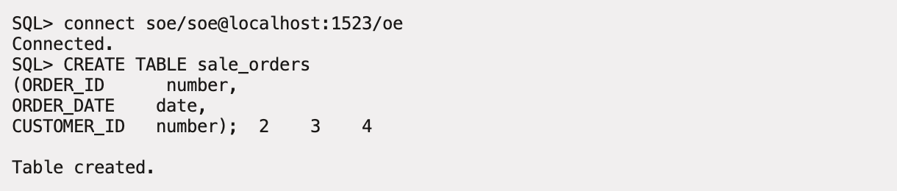

 4. Open a new terminal window, login into your instance, sudo to the oracle user, and execute write-load.sh. Leave this window open and running throughout for the rest of this lab.


    ```
    <copy>cd /home/oracle/labs/multitenant</copy>
    ```

    ```
    <copy>./write-load.sh</copy>
    ```


    Leave this window open and running for the next few steps in this lab.

5. Go back to your original terminal window.  Connect to **CDB2** and create the **REMOTE CLONE**  **OE\_DEV** from the database link **oe@cdb1\_link**.

    ```
    <copy>connect sys/oracle@localhost:1524/cdb2 as sysdba</copy>
    ```

    ```
    <copy>create pluggable database oe_dev from oe@cdb1_link;</copy>
    ```

    ```
    <copy>alter pluggable database oe_dev open;</copy>
    ```


    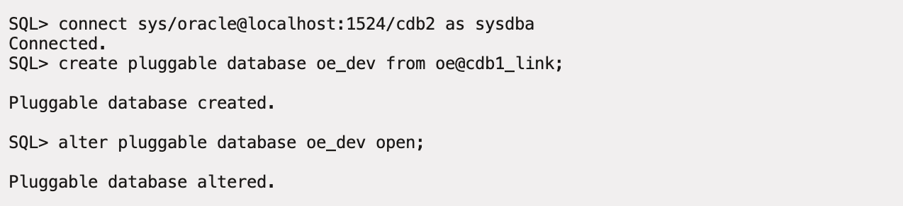

6. Verify the remote DB link is pointing to CDB1.

       ```
       <copy>
       set linesize 180
       set pages 100
       column owner format A13
       column db_link format A13
       select owner,db_link,host from dba_db_links;
       </copy>
       set linesize 180

        OWNER	      DB_LINK         
        ------------- -------------
        HOST
        --------------------------------------------------------------------------------
        SYS	      CDB1_LINK
        (DESCRIPTION = (ADDRESS = (PROTOCOL = TCP)(HOST = localhost)(PORT = 1523)) (CONN
        ECT_DATA = (SERVER = DEDICATED) (SERVICE_NAME = cdb1)))
       ```
6. Connect as **SOE** to **OE\_DEV** and check the number of records in the **sale\_orders** table.

    ```
    <copy>connect soe/soe@localhost:1524/oe_dev</copy>
    ```

    ```
    <copy>select count(*) from sale_orders;</copy>
    ```

    

7. Connect as **SOE** to **OE** and check the number of records in the **sale_orders** table.

    ```
    <copy>connect soe/soe@localhost:1523/oe</copy>
    ```

    ```
    <copy>select count(*) from sale_orders;</copy>
    ```

    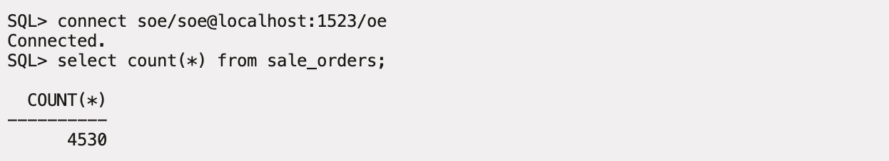

     While DML operations are going on in source PDB, We could create a remote clone.

## Task 9: Snanshot Clone
  You can create a snapshot copy PDB by executing a CREATE PLUGGABLE DATABASE ... FROM ... **SNAPSHOT COPY** statement.

  A snapshot copy reduces the time required to create the clone because it does not include a complete copy of the source data files. Furthermore, the snapshot copy PDB occupies a fraction of the space of the source PDB.

  A snapshot copy reduces the time required to create the clone because it does not include a complete copy of the source data files. Furthermore, the snapshot copy PDB occupies a fraction of the space of the source PDB. Snapshot copy works in all the Unix

  You need CLONEDB=true and source PDB is open in read-only mode. Oracle Database creates a snapshot copy PDB using copy-on-write technology. The snapshot copy PDB contains sparse files, not full copies.
  All UNIX systems meet the requirements to create snapshot copy including Oracle ACFS and ZFS.

1. Open **OE_DEV** pluggable database in READ ONLY mode and create a snapshot.

    ```
    <copy>connect sys/oracle@localhost:1524/cdb2 as sysdba</copy>
    ```

    ```
    <copy>alter pluggable database oe_dev open read only force;</copy>
    ```

    ```
    <copy>create pluggable database oe_snap from OE_DEV snapshot copy;
          alter pluggable database oe_snap open;  </copy>
    ```

2. Connect to SOE user in the **OE_SNAP** pdb and perform DML operations.

    ```
    <copy>connect soe/soe@localhost:1524/oe_snap</copy>
    ```

    ```
    <copy>select count(*) from sale_orders;
          insert into sale_orders select * from sale_orders;
          commit;
          select count(*) from sale_orders;</copy>
    ```
    You can refer to the [documentation](https://docs.oracle.com/en/database/oracle/oracle-database/19/multi/cloning-a-pdb.html#GUID-E4EAE488-5371-4B8A-A839-2ADFA7507705) for more information.
    PDB Snapshot Copy is a good way to create test and Dev environments from a production. You can drop the snapshots once the testing is done. You can take a snapshot copy of a refreshable PDB from production to ensure you get the latest dataset to run tests. In the next task, we will learn about refreshable PDBs.


## Task 10: PDB Refresh
This section looks at how to hot clone a pluggable database, open it for read only and then refresh the database.

[](youtube:L9l7v6dH-e8)

The tasks you will accomplish in this step are:
- Leverage the **OE** pluggable database from the previous step with the load still running against it.
- Create a hot clone **OE_REFRESH**` in the container database **CDB2** from the pluggable database **OE**
- Refresh the **OE_REFRESH**` pluggable database.


1. Leave the **OE** pluggable database open with the load running against it for the rest of the steps in this lab. If the scripts is done running, you can restart the load by executing ./write-load.sh


1. Connect to the container **CDB2**.
    ```
    <copy>connect sys/oracle@localhost:1524/cdb2 as sysdba</copy>
    ```

2. Create a pluggable database **OE\_REFRESH** with manual refresh mode from the database link **oe@cdb1\_link**.

    ```
    <copy>create pluggable database oe_refresh from oe@cdb1_link refresh mode manual;</copy>
    ```

    ```
    <copy>alter pluggable database oe_refresh open read only;</copy>
    ```

    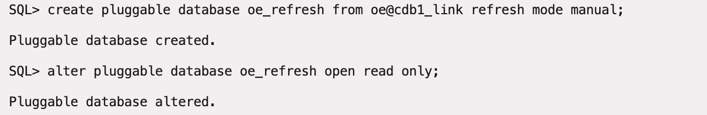

    The **OE\_REFRESH** PDB can be refreshed as long as its not open in READ-WRITE mode.

3. Connect as **SOE** to the pluggable database **OE\_REFRESH** and count the number of records in the **sale\_orders** table.

    ```
    <copy>conn soe/soe@localhost:1524/oe_refresh</copy>
    ```

    ```
    <copy>select count(*) from sale_orders;</copy>
    ```

    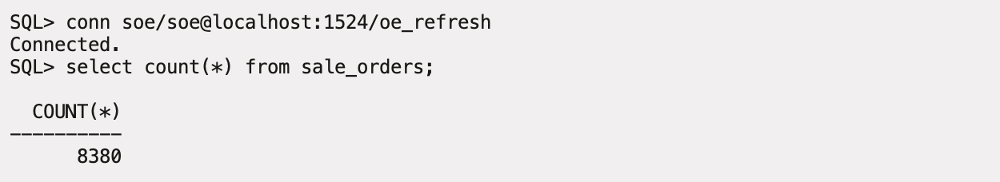

4. Close the pluggable database **OE_REFRESH** to refresh it from the **OE** pluggable database.

    ```
    <copy>conn sys/oracle@localhost:1524/oe_refresh as sysdba</copy>
    ```

    ```
    <copy>alter pluggable database oe_refresh close;</copy>
    ```

    ```
    <copy>alter session set container=oe_refresh;</copy>
    ```

    ```
    <copy>alter pluggable database oe_refresh refresh;</copy>
    ```

    ```
    <copy>alter pluggable database oe_refresh open read only;</copy>
    ```

    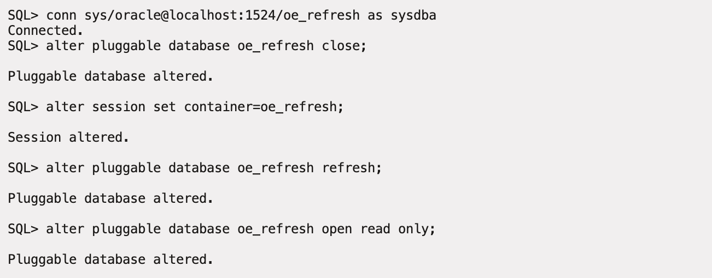

5. Connect as **SOE** to the pluggable database **OE\_REFRESH** and count the number of records in the **sale\_orders** table. You should see the number of records change.

    ```
    <copy>conn soe/soe@localhost:1524/oe_refresh</copy>
    ```

    ```
    <copy>select count(*) from sale_orders;</copy>
    ```

    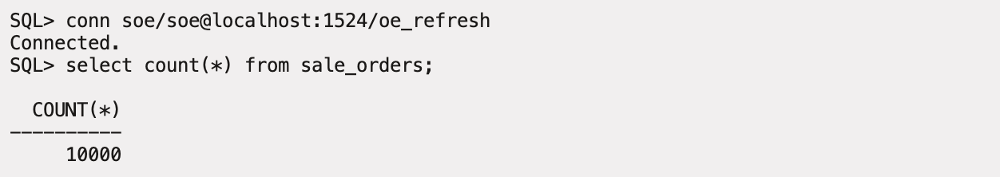

6. Close and remove the **OE_DEV** pluggable database.

    ```
    <copy>conn sys/oracle@localhost:1524/cdb2 as sysdba</copy>
    ```

    ```
    <copy>alter pluggable database oe_refresh close;</copy>
    ```

    ```
    <copy>drop pluggable database oe_refresh including datafiles;</copy>
    ```

    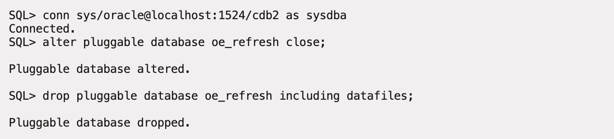

7. Leave the **OE** pluggable database open with the load running against it for the rest of this lab.

## Task 11: PDB Relocation

This section looks at how to relocate a pluggable database from one container database to another. One important note, If both container databases are on the same host, then we need to be using the same listener, then we only change LOCAL_LISTENER. If the the container databases are on two seperate servers, then we need to configure REMOTE_LISTENER.
For this lab we will change REMOTE_LISTENER for **CDB1** and **CDB2** to point at the other container.

The tasks you will accomplish in this step are:
- Change REMOTE_LISTER parameter for **CDB1** and  **CDB1**
- Relocate the pluggable database **OE** from **CDB1** to **CDB2** with the load still running
- Once **OE** is open the load should continue working.

1. Start SQLPLUS if you aren't already in a SQLPLUS session.

    ```
    <copy>sqlplus /nolog </copy>
    ```
1. Connect to the container **CDB2**.
    ```
    <copy>conn sys/oracle@localhost:1523/cdb1 as sysdba;</copy>
    ```

    ```
    <copy>alter system set REMOTE_LISTENER = "(ADDRESS=(PROTOCOL=tcp)(HOST=localhost)(PORT=1524))" scope=both;</copy>
    ```


2. Connect to **CDB2**, set REMOTE_LISTENER and relocate **OE** using the database link **oe@cdb1_link**.

    ```
    <copy>
    conn sys/oracle@localhost:1523/cdb2 as sysdba;
    alter system set REMOTE_LISTENER = "(ADDRESS=(PROTOCOL=tcp)(HOST=localhost)(PORT=1523))" scope=both;
    </copy>
    ```

    ```
    <copy>create pluggable database oe from oe@cdb1_link relocate availability max;
    alter pluggable database oe open;
    show pdbs</copy>
    ```

    

3. Connect to **CDB1** and see what pluggable databases exist there.

    ```
    <copy>conn sys/oracle@localhost:1523/cdb1 as sysdba</copy>
    ```

    ```
    <copy>show pdbs</copy>
    ```

    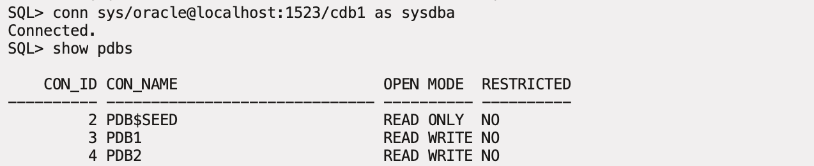

  Observer that the write load is still running, but the PDB OE has been relocated from CDB1 to CDB2.
    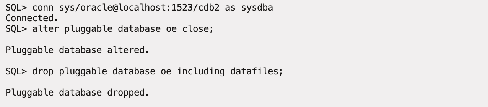

5. The load program isn't needed anymore and that window can be closed.

## Lab Cleanup

1. Exit from the SQL command prompt and reset the container databases back to their original ports. If any errors about dropping databases appear they can be ignored.

    ```
    <copy>exit</copy>
    ```

    ```
    <copy>./resetCDB.sh</copy>
    ```

    

    

Now you've had a chance to try out the Multitenant option. You were able to create, clone, plug and unplug a pluggable database. You were then able to accomplish some advanced tasks that you could leverage when maintaining a large multitenant environment.

You may now [proceed to the next lab](#next).

## Acknowledgements

- **Author** - Patrick Wheeler, Vijay Balebail
- **Contributors** -  David Start, Anoosha Pilli, Brian McGraw, Quintin Hill, Rene Fontcha
- **Last Updated By/Date** - Rene Fontcha, LiveLabs Platform Lead, NA Technology, April 2021
