# Clone, Plug and Drop

## Introduction
Oracle Multitenant enables an Oracle Database to function as a container database (CDB). A CDB consolidates multiple pluggable databases (PDB), a portable collection of schemas, schema objects, and non-schema objects. Whether deployed on-premises or in the cloud, with Oracle Multitenant, applications run unchanged in self-contained PDBs, improving resource utilization, management, and overall security.

[](youtube:kzTQGs75IjA)

*Estimated Workshop Time*: 2 hour

### Objectives

In this lab, you will:
* Explore rapid cloning and provisioning
* Explore local clones and remote clones
* Save database administrators time by provisioning pluggable databases as clones locally or from across the network without disrupting the source
* Explore refreshable PDBs
* Maintain up-to-date copies of production databases by periodically topping them up with incremental transactions.


### Prerequisites

This lab assumes you have:
* A Free Tier, Paid or LiveLabs Oracle Cloud account
* SSH Private Key to access the host via SSH
* You have completed:
    - Lab: Generate SSH Keys (*Free Tier* and *Paid Tenancies* only)
    - Lab: Prepare Setup (*Free Tier* and *Paid Tenancies* only)
    - Lab: Environment Setup


## Task 1: Initialize Environment
Proceed as indicated below to Initialize your workshop instance prior to executing any subsequent step or lab.

Refer to *Lab Environment Setup* for the detailed instructions relevant to your SSH client type (e.g. Putty on Windows or Native such as terminal on Mac OS):
  - Authentication OS User - “*opc*”
  - Authentication method - *SSH RSA Key*

1. First login as “*opc*” using your SSH Private Key

2.  Download and execute pre-labs init scripts.

    ```
    <copy>
    cd /tmp/
    wget https://c4u02.objectstorage.us-ashburn-1.oci.customer-oci.com/p/tfC_fKB7HB5Wo1pvpYu1fHifVw-E7MZruSx9l5J6ebjhGZOwsFawUiJlJhzgR7Hy/n/c4u02/b/hosted_workshops/o/stacks/db-multitenant-prelab-init.zip
    unzip db-multitenant-prelab-init.zip -d bootstrap
    cd bootstrap; chmod +x *.sh
    sudo ./db19-prelab-init.sh
    </copy>
    ```

3.  Sudo to “*oracle*” user, start the listeners and restart the two container databases.

    ```
    <copy>
    sudo su - oracle
    cd /tmp/bootstrap
    lsnrctl start LISTCDB1
    lsnrctl start LISTCDB2
    ./stop_all.sh
    ./start_all.sh
    lsnrctl status LISTCDB1
    lsnrctl status LISTCDB2
    cd

    </copy>
    ```

## Task 2: Login and Create PDB
This section looks at how to login and create a new PDB. You will create a pluggable database **PDB2** in the container database **CDB1**

1. All scripts for this lab are stored in the `labs/multitenant` folder and are run as the oracle user. Let's navigate to the path now.

    ```
    <copy>
    cd /home/oracle/labs/multitenant
    </copy>
    ```

2.  Set your oracle environment and connect to **CDB1**.

    ```
    <copy>. oraenv</copy>
    CDB1
    ```

    ```
    <copy>
    sqlplus /nolog
    </copy>
    ```

    ```
    <copy>
    connect sys/oracle@localhost:1523/cdb1 as sysdba
    </copy>
    ```

    

    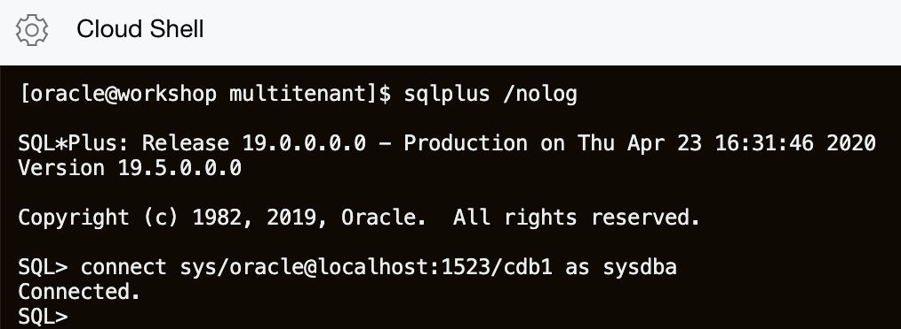

3. Check to see who you are connected as. At any point in the lab you can run this script to see who or where you are connected.

    ```
    <copy>
    select
      'DB Name: '  ||Sys_Context('Userenv', 'DB_Name')||
      ' / CDB?: '     ||case
        when Sys_Context('Userenv', 'CDB_Name') is not null then 'YES'
          else  'NO'
          end||
      ' / Auth-ID: '   ||Sys_Context('Userenv', 'Authenticated_Identity')||
      ' / Sessn-User: '||Sys_Context('Userenv', 'Session_User')||
      ' / Container: ' ||Nvl(Sys_Context('Userenv', 'Con_Name'), 'n/a')
      "Who am I?"
      from Dual
      /
    </copy>
    ```

    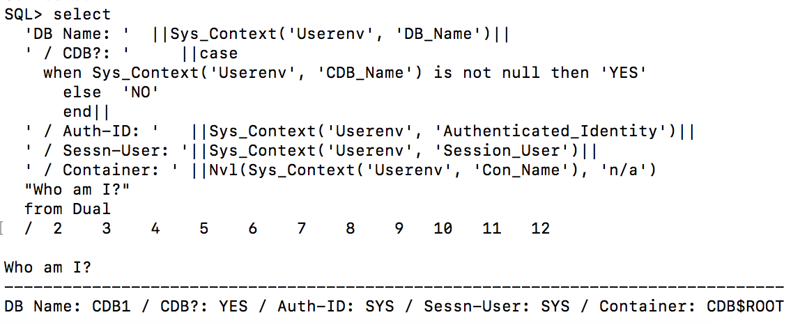

4. Create a pluggable database **PDB2**.

    ```
    <copy>show  pdbs;</copy>
    ```

    ```
    <copy>
    create pluggable database PDB2 admin user PDB_Admin identified by oracle;

    alter pluggable database PDB2 open;

    show pdbs;
    </copy>
    ```

    

    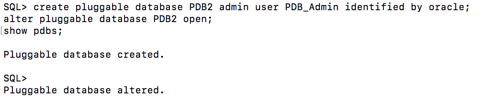

    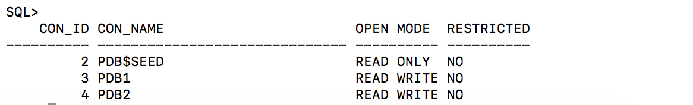

5. Change the session to point to **PDB2**.

    ```
    <copy>alter session set container = PDB2;</copy>
    ```

    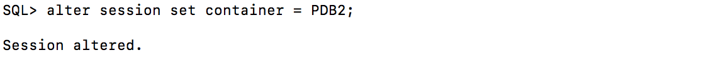

6. Grant **PDB_ADMIN** the necessary privileges and create the **USERS** tablespace for **PDB2**.

    ```
    <copy>
    grant sysdba to pdb_admin;
    create tablespace users datafile size 20M autoextend on next 1M maxsize unlimited segment space management auto;
    alter database default tablespace Users;
    grant create table, unlimited tablespace to pdb_admin;

    </copy>
    ````

   

7. Connect as **PDB_ADMIN** to **PDB2**.

    ```
    <copy>connect pdb_admin/oracle@localhost:1523/pdb2</copy>
    ```

8. Create a table **MY_TAB** in **PDB2**.

    ```
    <copy>
    create table my_tab(my_col number);
    insert into my_tab values (1);
    commit;
    </copy>
    ```

   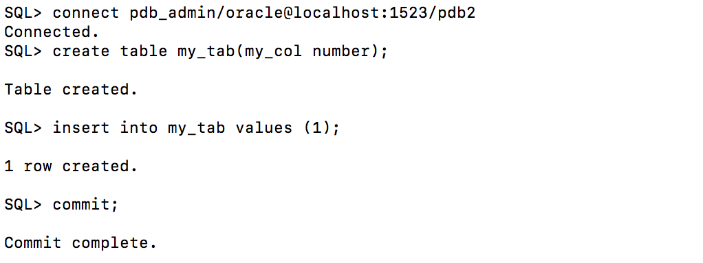

9. Change back to **SYS** in the container database **CDB1** and show the tablespaces and datafiles created.

    ```
    <copy>
    connect sys/oracle@localhost:1523/cdb1 as sysdba

    COLUMN "Con_Name" FORMAT A10
    COLUMN "T'space_Name" FORMAT A12
    COLUMN "File_Name" FORMAT A120
    SET LINESIZE 220
    SET PAGES 9999

    with Containers as (
      select PDB_ID Con_ID, PDB_Name Con_Name from DBA_PDBs
      union
      select 1 Con_ID, 'CDB$ROOT' Con_Name from Dual)
    select
      Con_ID,
      Con_Name "Con_Name",
      Tablespace_Name "T'space_Name",
      File_Name "File_Name"
    from CDB_Data_Files inner join Containers using (Con_ID)
    union
    select
      Con_ID,
      Con_Name "Con_Name",
      Tablespace_Name "T'space_Name",
      File_Name "File_Name"
    from CDB_Temp_Files inner join Containers using (Con_ID)
    order by 1, 3
    /
    </copy>
    ```

    

## Task 3: Clone a PDB
This section looks at how to clone a PDB.

The tasks you will accomplish in this step are:
- Clone a pluggable database **PDB2** into **PDB3**

1. Start SQLPLUS if you aren't already in a SQLPLUS session.

    ```
    <copy>sqlplus /nolog </copy>
    ```
1. Connect to the container **CDB1**.

    ```
    <copy>connect sys/oracle@localhost:1523/cdb1 as sysdba</copy>
    ```

2. Change the pluggable database **PDB2** to read only.

    ```
    <copy>alter pluggable database PDB2 open read only force;
    show pdbs</copy>
    ```

   

   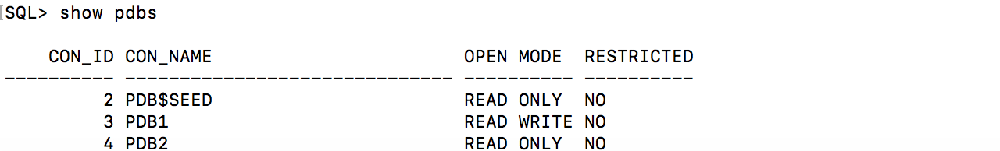

3. Create a pluggable database **PDB3** from the read only database **PDB2**.

    ```
    <copy>create pluggable database PDB3 from PDB2;
    alter pluggable database PDB3 open force;

    </copy>
    ```

    ```
    <copy>show pdbs</copy>
    ```

   

4. Change **PDB2** back to read write.

    ```
    <copy>alter pluggable database PDB2 open read write force;</copy>
    ```

    ```
    <copy>show pdbs</copy>
    ```

   

5. Connect to **PDB2** and show the table **MY_TAB**.

    ```
    <copy>connect pdb_admin/oracle@localhost:1523/pdb2</copy>
    ```

    ```
    <copy>select * from my_tab;</copy>
    ```

   

6. Connect to **PDB3** and show the table **MY_TAB**.

    ```
    <copy>connect pdb_admin/oracle@localhost:1523/pdb3</copy>
    ```

    ```
    <copy>select * from my_tab;</copy>
    ```

   

## Task 4: Unplug a PDB
This section looks at how to unplug a PDB.

The tasks you will accomplish in this step are:
- Unplug **PDB3** from **CDB1**

1. Start SQLPLUS if you aren't already in a SQLPLUS session.

    ```
    <copy>sqlplus /nolog </copy>
    ```
1. Connect to the container **CDB1**.

    ```
    <copy>connect sys/oracle@localhost:1523/cdb1 as sysdba</copy>
    ```

2. Unplug **PDB3** from **CDB1**.

    ```
    <copy>show pdbs</copy>
    ```

    ```
    <copy>alter pluggable database PDB3 close immediate;</copy>
    ```

    ```
    <copy>
    alter pluggable database PDB3
    unplug into
    '/u01/app/oracle/oradata/CDB1/pdb3.xml';
    </copy>
    ```

    ```
    <copy>show pdbs</copy>
    ```

   

3. Remove **PDB3** from **CDB1**.

    ```
    <copy>drop pluggable database PDB3 keep datafiles;</copy>
    ```

    ```
    <copy>show pdbs</copy>
    ```

   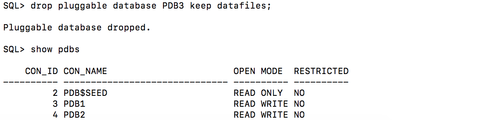

4. Show the datafiles in **CDB1**.

    ```
    <copy>
    COLUMN "Con_Name" FORMAT A10
    COLUMN "T'space_Name" FORMAT A12
    COLUMN "File_Name" FORMAT A120
    SET LINESIZE 220
    SET PAGES 9999

    with Containers as (
      select PDB_ID Con_ID, PDB_Name Con_Name from DBA_PDBs
      union
      select 1 Con_ID, 'CDB$ROOT' Con_Name from Dual)
    select
      Con_ID,
      Con_Name "Con_Name",
      Tablespace_Name "T'space_Name",
      File_Name "File_Name"
    from CDB_Data_Files inner join Containers using (Con_ID)
    union
    select
      Con_ID,
      Con_Name "Con_Name",
      Tablespace_Name "T'space_Name",
      File_Name "File_Name"
    from CDB_Temp_Files inner join Containers using (Con_ID)
    order by 1, 3
    /
    </copy>
    ```

    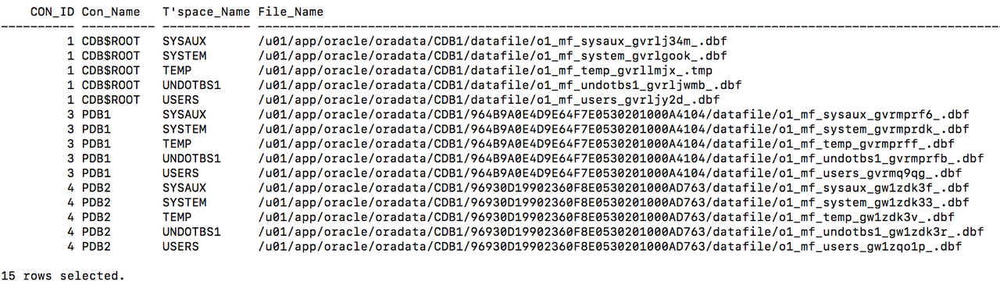

5. Look at the XML file for the pluggable database **PDB3**.

    ```
    <copy>host cat /u01/app/oracle/oradata/CDB1/pdb3.xml</copy>
    ```

    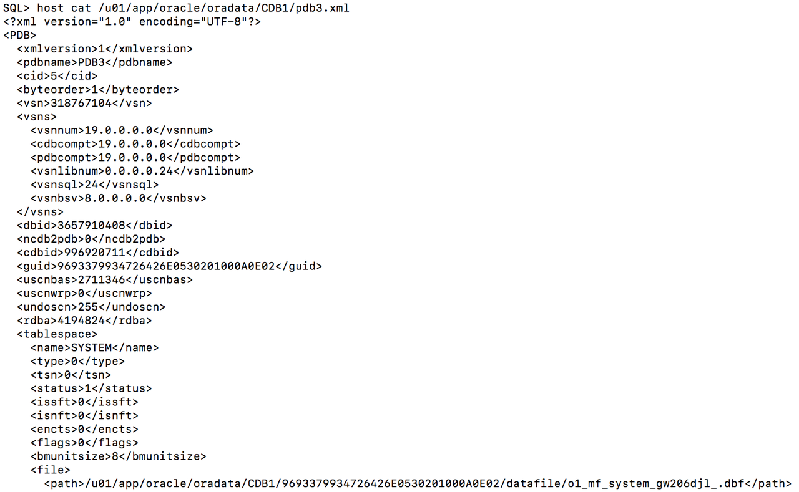

## Task 5: Plug in a PDB
This section looks at how to plug in a PDB.

The tasks you will accomplish in this step are:
- Plug **PDB3** into **CDB2**

1. Start SQLPLUS if you aren't already in a SQLPLUS session.

    ```
    <copy>sqlplus /nolog </copy>
    ```
1. Connect to the container **CDB2**.
    ```
    <copy>connect sys/oracle@localhost:1524/cdb2 as sysdba</copy>
    ```

    ```
    <copy>
    COLUMN "Who am I?" FORMAT A120
    select
      'DB Name: '  ||Sys_Context('Userenv', 'DB_Name')||
      ' / CDB?: '     ||case
        when Sys_Context('Userenv', 'CDB_Name') is not null then 'YES'
        else 'NO'
        end||
      ' / Auth-ID: '   ||Sys_Context('Userenv', 'Authenticated_Identity')||
      ' / Sessn-User: '||Sys_Context('Userenv', 'Session_User')||
      ' / Container: ' ||Nvl(Sys_Context('Userenv', 'Con_Name'), 'n/a')
      "Who am I?"
    from Dual
    /
    </copy>
    ```

    ```
    <copy>show pdbs</copy>
    ```

    

2. Check the compatibility of **PDB3** with **CDB2**.

    ```
    <copy>
    begin
      if not
        Sys.DBMS_PDB.Check_Plug_Compatibility
        ('/u01/app/oracle/oradata/CDB1/pdb3.xml')
      then
        Raise_Application_Error(-20000, 'Incompatible');
      end if;
    end;
    /
    </copy>
    ```

    

3. Plug **PDB3** into **CDB2**.

    ```
    <copy>
    create pluggable database PDB3
    using '/u01/app/oracle/oradata/CDB1/pdb3.xml'
    move;
    </copy>
    ```

    ```
    <copy>show pdbs</copy>
    ```

    ```
    <copy>alter pluggable database PDB3 open;</copy>
    ```

    ```
    <copy>show pdbs</copy>
    ```

    

4. Review the datafiles in **CDB2**.

    ```
    <copy>
    COLUMN "Con_Name" FORMAT A10
    COLUMN "T'space_Name" FORMAT A12
    COLUMN "File_Name" FORMAT A120
    SET LINESIZE 220
    SET PAGES 9999


    with Containers as (
      select PDB_ID Con_ID, PDB_Name Con_Name from DBA_PDBs
      union
      select 1 Con_ID, 'CDB$ROOT' Con_Name from Dual)
    select
      Con_ID,
      Con_Name "Con_Name",
      Tablespace_Name "T'space_Name",
      File_Name "File_Name"
    from CDB_Data_Files inner join Containers using (Con_ID)
    union
    select
      Con_ID,
      Con_Name "Con_Name",
      Tablespace_Name "T'space_Name",
      File_Name "File_Name"
    from CDB_Temp_Files inner join Containers using (Con_ID)
    order by 1, 3
    /
    </copy>
    ```

    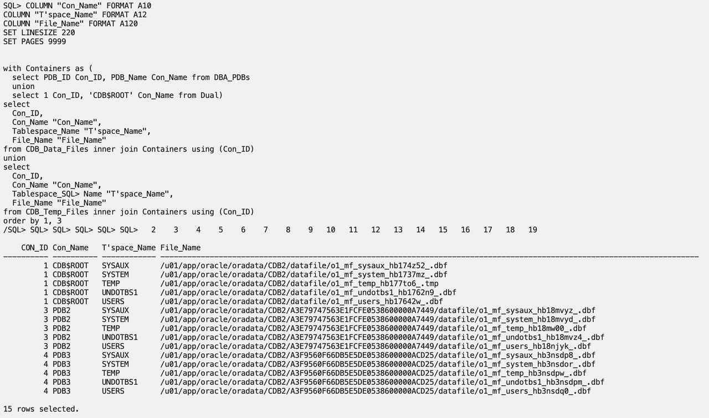

5. Connect as **PDB\_ADMIN** to **PDB3** and look at **MY\_TAB**.

    ```
    <copy>connect pdb_admin/oracle@localhost:1524/pdb3</copy>
    ```

    ```
    <copy>select * from my_tab;</copy>
    ```

    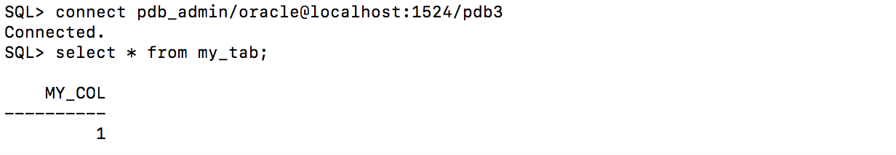

## Task 6: Drop a PDB
This section looks at how to drop a pluggable database.

The tasks you will accomplish in this step are:
- Drop **PDB3** from **CDB2**

1. Start SQLPLUS if you aren't already in a SQLPLUS session.

    ```
    <copy>sqlplus /nolog </copy>
    ```
1. Connect to the container **CDB2**.

    ```
    <copy>connect sys/oracle@localhost:1524/cdb2 as sysdba</copy>
    ```

2. Drop **PDB3** from **CDB2**.

    ```
    <copy>show pdbs</copy>
    ```

    ```
    <copy>alter pluggable database PDB3 close immediate;</copy>
    ```

    ```
    <copy>drop pluggable database PDB3 including datafiles;</copy>
    ```

    ```
    <copy>show pdbs</copy>
    ```

    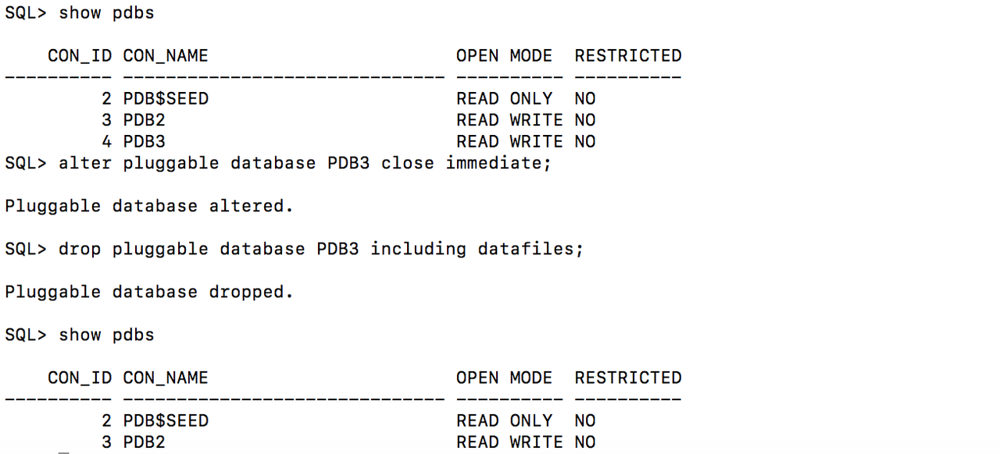


## Task 7: Clone an Unplugged PDB
This section looks at how to create a gold copy of a PDB and clone it into another container.

The tasks you will accomplish in this step are:
- Create a gold copy of **PDB2** in **CDB1** as **GOLDPDB**
- Clone **GOLDPDB** into **COPYPDB1** and **COPYPDB2** in **CDB2**

1. Start SQLPLUS if you aren't already in a SQLPLUS session.

    ```
    <copy>sqlplus /nolog </copy>
    ```
1. Connect to the container **CDB1**.
    ```
    <copy>connect sys/oracle@localhost:1523/cdb1 as sysdba</copy>
    ```

2. Change **PDB2** to read only.

    ```
    <copy>alter pluggable database PDB2 open read only force;</copy>
    ```

    ```
    <copy>show pdbs</copy>
    ```

    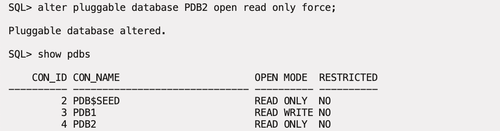

3. Create a pluggable database **GOLDPDB** from the read only database **PDB2**.

    ```
    <copy>create pluggable database GOLDPDB from PDB2;</copy>
    ```

    ```
    <copy>alter pluggable database GOLDPDB open force;</copy>
    ```

    ```
    <copy>show pdbs</copy>
    ```

    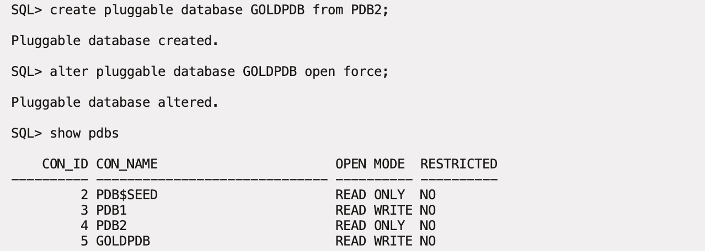

4. Change **PDB2** back to read write.

    ```
    <copy>alter pluggable database PDB2 open read write force;</copy>
    ```

    ```
    <copy>show pdbs</copy>
    ```

    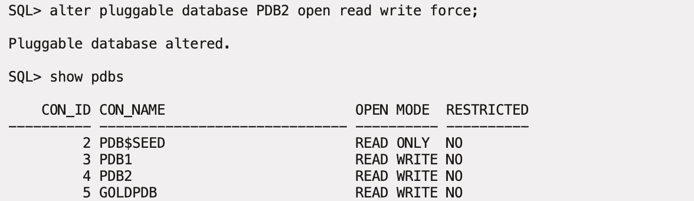

5. Unplug **GOLDPDB** from **CDB1**.

    ```
    <copy>show pdbs</copy>
    ```

    ```
    <copy>alter pluggable database GOLDPDB close immediate;</copy>
    ```

    ```
    <copy>alter pluggable database GOLDPDB
    unplug into '/u01/app/oracle/oradata/CDB1/goldpdb.xml';</copy>
    ```

    ```
    <copy>show pdbs</copy>
    ```

    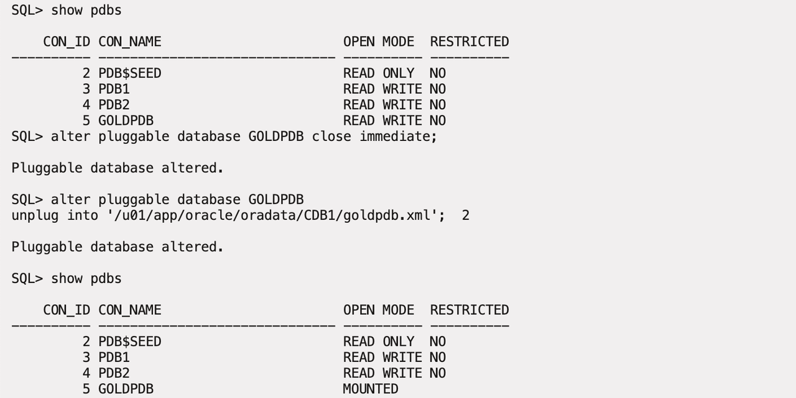

6. Remove **GOLDPDB** from **CDB1**.

    ```
    <copy>drop pluggable database GOLDPDB keep datafiles;</copy>
    ```

    ```
    <copy>show pdbs</copy>
    ```

    

7. Connect to **CDB2**.

    ```
    <copy>connect sys/oracle@localhost:1524/cdb2 as sysdba</copy>
    ```

8. Validate **GOLDPDB** is compatibile with **CDB2**.

    ```
    <copy>
    begin
      if not
        Sys.DBMS_PDB.Check_Plug_Compatibility
    ('/u01/app/oracle/oradata/CDB1/goldpdb.xml')
      then
        Raise_Application_Error(-20000, 'Incompatible');
      end if;
    end;
    /
    </copy>
    ```

    

9. Create a clone of **GOLDPDB** as **COPYPDB1**.

    ```
    <copy>
    create pluggable database COPYPDB1 as clone
    using '/u01/app/oracle/oradata/CDB1/goldpdb.xml'
    storage (maxsize unlimited max_shared_temp_size unlimited)
    copy;
    </copy>
    ```

    ```
    <copy>show pdbs</copy>
    ```

    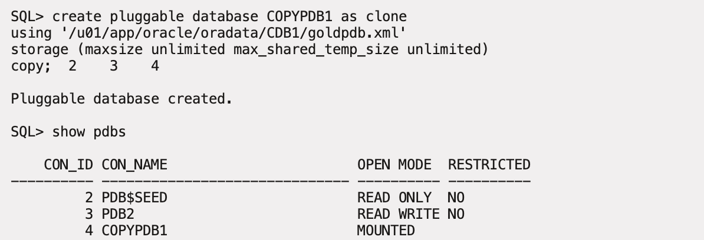

10. Create another clone of **GOLDPDB** as **COPYPDB2**.

    ```
    <copy>
    create pluggable database COPYPDB2 as clone
    using '/u01/app/oracle/oradata/CDB1/goldpdb.xml'
    storage (maxsize unlimited max_shared_temp_size unlimited)
    copy;
    </copy>
    ```

    ```
    <copy>show pdbs</copy>
    ```

    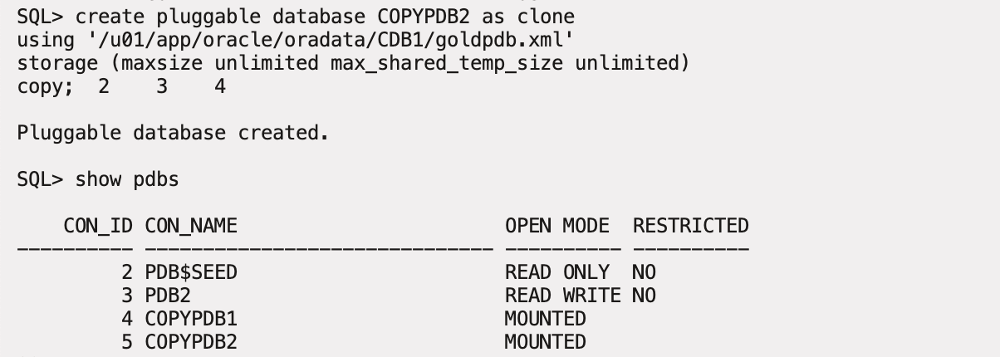

11. Open all of the pluggable databases.

    ```
    <copy>alter pluggable database all open;</copy>
    ```

    ```
    <copy>show pdbs</copy>
    ```

    

12. Look at the GUID for the two cloned databases.

    ```
    <copy>
    COLUMN "PDB Name" FORMAT A20
    select PDB_Name "PDB Name", GUID
    from DBA_PDBs
    order by Creation_Scn
    /
    </copy>
    ```

    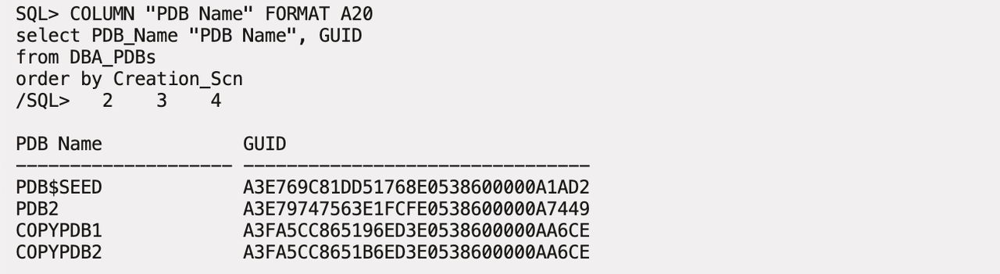

## Task 8: PDB Hot Clones
This section looks at how to hot clone a pluggable database.

The tasks you will accomplish in this step are:
- Create a pluggable database **OE** in the container database **CDB1**
- Create a load against the pluggable database **OE**
- Create a hot clone **OE_DEV** in the container database **CDB2** from the pluggable database **OE**

[](youtube:djp-ogM71oE)

1. Start SQLPLUS if you aren't already in a SQLPLUS session.

    ```
    <copy>sqlplus /nolog </copy>
    ```
1. Connect to the container **CDB1**.
    ```
    <copy>connect sys/oracle@localhost:1523/cdb1 as sysdba</copy>
    ```

2. Create a pluggable database **OE** with an admin user of **SOE**.

    ```
    <copy>create pluggable database oe admin user soe identified by soe roles=(dba);</copy>
    ```

    ```
    <copy>alter pluggable database oe open;</copy>
    ```

    ```
    <copy>alter session set container = oe;</copy>
    ```

    ```
    <copy>grant create session, create table to soe;</copy>
    ```

    ```
    <copy>alter user soe quota unlimited on system;</copy>
    ```

    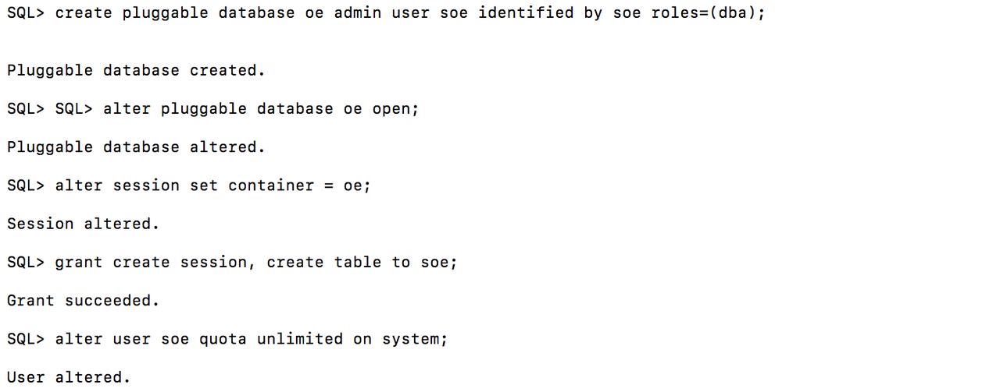

3. Connect as **SOE** and create the **sale_orders** table.

    ```
    <copy>connect soe/soe@localhost:1523/oe</copy>
    ```

    ```
    <copy>
    CREATE TABLE sale_orders
    (ORDER_ID      number,
    ORDER_DATE    date,
    CUSTOMER_ID   number);
    </copy>
    ```

    

 4. Open a new terminal window, login into your instance, sudo to the oracle user, and execute write-load.sh. Leave this window open and running throughout for the rest of this lab.

    ```
    <copy>cd .ssh</copy>
    ```

    ```
    <copy>ssh -i ~/.ssh/sshkeyname opc@Your Compute Instance Public IP Address</copy>
    ```

    ```
    <copy>sudo su - oracle</copy>
    ```

    ```
    <copy>cd /home/oracle/labs/multitenant</copy>
    ```

    ```
    <copy>./write-load.sh</copy>
    ```

    

    Leave this window open and running for the next few steps in this lab.

5. Go back to your original terminal window.  Connect to **CDB2** and create the pluggable **OE\_DEV** from the database link **oe@cdb1\_link**.

    ```
    <copy>connect sys/oracle@localhost:1524/cdb2 as sysdba</copy>
    ```

    ```
    <copy>create pluggable database oe_dev from oe@cdb1_link;</copy>
    ```

    ```
    <copy>alter pluggable database oe_dev open;</copy>
    ```

    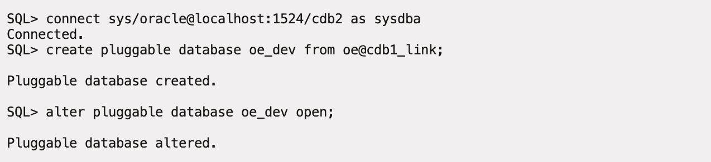

6. Connect as **SOE** to **OE\_DEV** and check the number of records in the **sale\_orders** table.

    ```
    <copy>connect soe/soe@localhost:1524/oe_dev</copy>
    ```

    ```
    <copy>select count(*) from sale_orders;</copy>
    ```

    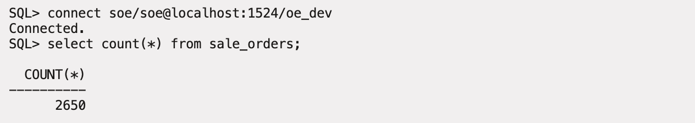

7. Connect as **SOE** to **OE** and check the number of records in the **sale_orders** table.

    ```
    <copy>connect soe/soe@localhost:1523/oe</copy>
    ```

    ```
    <copy>select count(*) from sale_orders;</copy>
    ```

    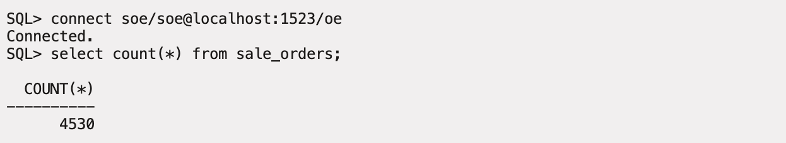

8. Close and remove the **OE_DEV** pluggable database.

    ```
    <copy>connect sys/oracle@localhost:1524/cdb2 as sysdba</copy>
    ```

    ```
    <copy>alter pluggable database oe_dev close;</copy>
    ```

    ```
    <copy>drop pluggable database oe_dev including datafiles;</copy>
    ```

    

9. Leave the **OE** pluggable database open with the load running against it for the rest of the steps in this lab.

You can see that the clone of the pluggable database worked without having to stop the load on the source database. In the next step, you will look at how to refresh a clone.

## Task 9: PDB Refresh
This section looks at how to hot clone a pluggable database, open it for read only and then refresh the database.

[](youtube:L9l7v6dH-e8)

The tasks you will accomplish in this step are:
- Leverage the **OE** pluggable database from the previous step with the load still running against it.
- Create a hot clone **OE_REFRESH**` in the container database **CDB2** from the pluggable database **OE**
- Refresh the **OE_REFRESH**` pluggable database.

1. Start SQLPLUS if you aren't already in a SQLPLUS session.

    ```
    <copy>sqlplus /nolog </copy>
    ```
1. Connect to the container **CDB2**.
    ```
    <copy>connect sys/oracle@localhost:1524/cdb2 as sysdba</copy>
    ```

2. Create a pluggable database **OE\_REFRESH** with manual refresh mode from the database link **oe@cdb1\_link**.

    ```
    <copy>create pluggable database oe_refresh from oe@cdb1_link refresh mode manual;</copy>
    ```

    ```
    <copy>alter pluggable database oe_refresh open read only;</copy>
    ```

    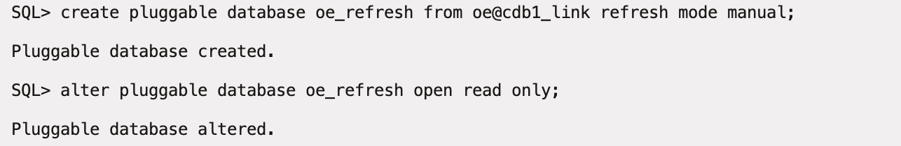

3. Connect as **SOE** to the pluggable database **OE\_REFRESH** and count the number of records in the **sale\_orders** table.

    ```
    <copy>conn soe/soe@localhost:1524/oe_refresh</copy>
    ```

    ```
    <copy>select count(*) from sale_orders;</copy>
    ```

    

4. Close the pluggable database **OE_REFRESH** and refresh it from the **OE** pluggable database.

    ```
    <copy>conn sys/oracle@localhost:1524/oe_refresh as sysdba</copy>
    ```

    ```
    <copy>alter pluggable database oe_refresh close;</copy>
    ```

    ```
    <copy>alter session set container=oe_refresh;</copy>
    ```

    ```
    <copy>alter pluggable database oe_refresh refresh;</copy>
    ```

    ```
    <copy>alter pluggable database oe_refresh open read only;</copy>
    ```

    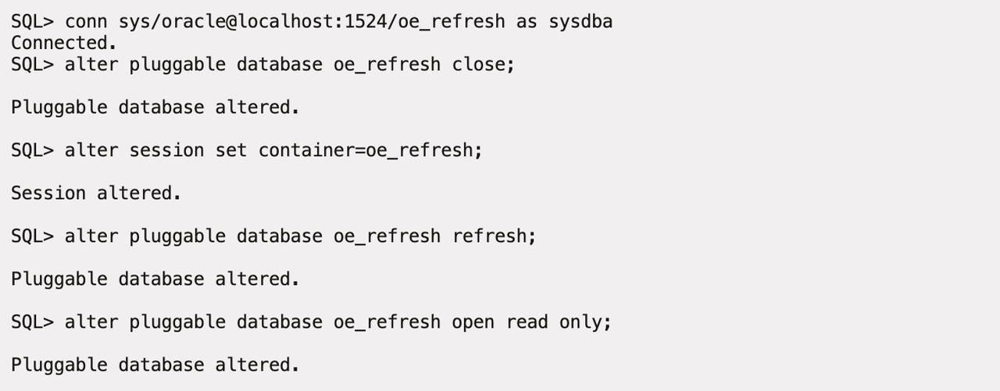

5. Connect as **SOE** to the pluggable database **OE\_REFRESH** and count the number of records in the **sale\_orders** table. You should see the number of records change.

    ```
    <copy>conn soe/soe@localhost:1524/oe_refresh</copy>
    ```

    ```
    <copy>select count(*) from sale_orders;</copy>
    ```

    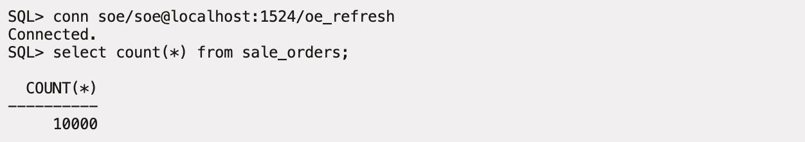

6. Close and remove the **OE_DEV** pluggable database.

    ```
    <copy>conn sys/oracle@localhost:1524/cdb2 as sysdba</copy>
    ```

    ```
    <copy>alter pluggable database oe_refresh close;</copy>
    ```

    ```
    <copy>drop pluggable database oe_refresh including datafiles;</copy>
    ```

    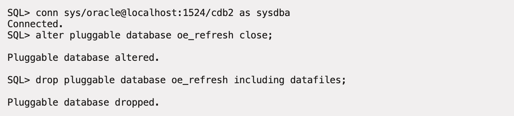

7. Leave the **OE** pluggable database open with the load running against it for the rest of this lab.

## Task 10: PDB Relocation

This section looks at how to relocate a pluggable database from one container database to another. One important note, either both container databases need to be using the same listener in order for sessions to keep connecting or local and remote listeners need to be setup correctly. For this lab we will change **CDB2** to use the same listener as **CDB1**.

The tasks you will accomplish in this step are:
- Change **CDB2** to use the same listener as **CDB1**
- Relocate the pluggable database **OE** from **CDB1** to **CDB2** with the load still running
- Once **OE** is open the load should continue working.

1. Start SQLPLUS if you aren't already in a SQLPLUS session.

    ```
    <copy>sqlplus /nolog </copy>
    ```
1. Connect to the container **CDB2**.
    ```
    <copy>conn sys/oracle@localhost:1524/cdb2 as sysdba;</copy>
    ```

    ```
    <copy>alter system set local_listener='LISTCDB1' scope=both;</copy>
    ```

    

2. Connect to **CDB2** and relocate **OE** using the database link **oe@cdb1_link**.

    ```
    <copy>conn sys/oracle@localhost:1523/cdb2 as sysdba;</copy>
    ```

    ```
    <copy>create pluggable database oe from oe@cdb1_link relocate availability max;
    alter pluggable database oe open;
    show pdbs</copy>
    ```

    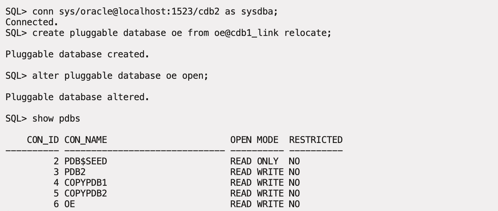

3. Connect to **CDB1** and see what pluggable databases exist there.

    ```
    <copy>conn sys/oracle@localhost:1523/cdb1 as sysdba</copy>
    ```

    ```
    <copy>show pdbs</copy>
    ```

    

4. Close and remove the **OE** pluggable database.

    ```
    <copy>conn sys/oracle@localhost:1523/cdb2 as sysdba</copy>
    ```

    ```
    <copy>alter pluggable database oe close;</copy>
    ```

    ```
    <copy>drop pluggable database oe including datafiles;</copy>
    ```

    

5. The load program isn't needed anymore and that window can be closed.

6. If you are going to continue to use this environment you will need to change **CDB2** back to use **LISTCDB2**.

    ```
    <copy>sqlplus /nolog</copy>
    ```

    ```
    <copy>conn sys/oracle@localhost:1523/cdb2 as sysdba;</copy>
    ```

    ```
    <copy>alter system set local_listener='LISTCDB2' scope=both;</copy>
    ```

    

## Lab Cleanup

1. Exit from the SQL command prompt and reset the container databases back to their original ports. If any errors about dropping databases appear they can be ignored.

    ```
    <copy>exit</copy>
    ```

    ```
    <copy>./resetCDB.sh</copy>
    ```

    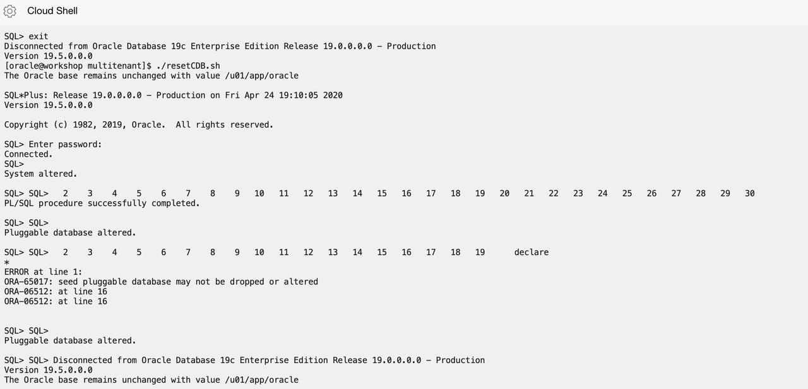

    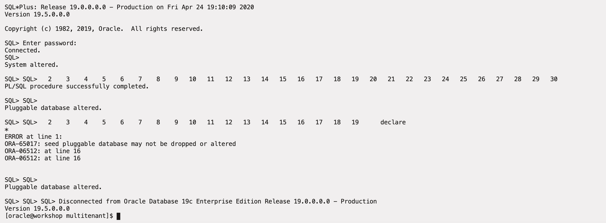

Now you've had a chance to try out the Multitenant option. You were able to create, clone, plug and unplug a pluggable database. You were then able to accomplish some advanced tasks that you could leverage when maintaining a large multitenant environment.

You may now [proceed to the next lab](#next).

## Acknowledgements

- **Author** - Patrick Wheeler, Vijay Balebail
- **Contributors** -  David Start, Anoosha Pilli, Brian McGraw, Quintin Hill, Rene Fontcha
- **Last Updated By/Date** - Rene Fontcha, LiveLabs Platform Lead, NA Technology, April 2021
