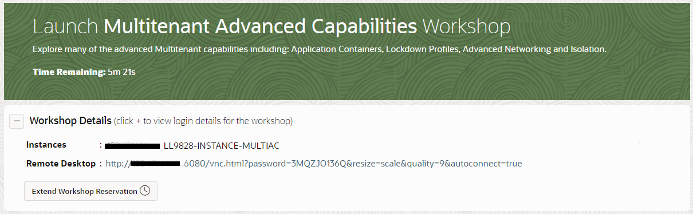
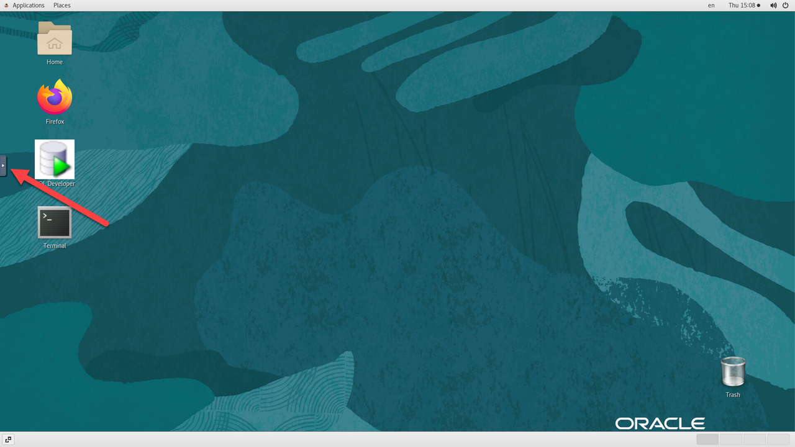
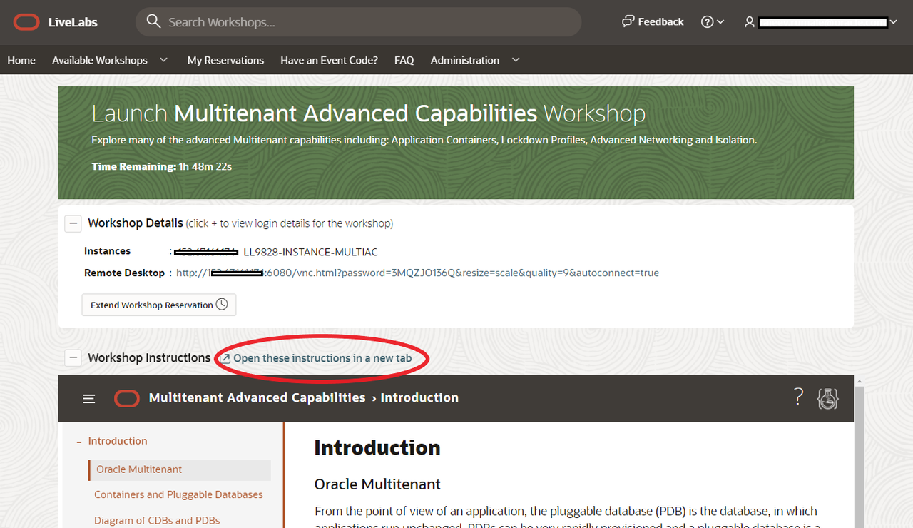

# Initialize Environment

## Introduction
This lab will show you how to access the Lab environment and validate successful initialization

### Objectives
- Access remote desktop
- Enable remote clipboard  
- Start workshops from within remote desktop

### Prerequisites
This lab assumes you have:
- A Livelabs hosted workshop in Oracle Cloud.
- You have a desktop and a browser

## Task 1: Access the Graphical Remote Desktop (Preferred)
For ease of execution of this workshop, your VM instance has been pre-configured with a remote graphical desktop accessible using any modern browser on your laptop or workstation. Proceed as detailed below to login.

1. Open the workshop URL shown.

    


2. Click on the *Firefox* browser icon from the remote desktop to launch it

    

## Task 2: Enable Copy/Paste from Local to Remote Desktop (noVNC clipboard)
During the execution of your labs you may need to copy text from your local PC/Mac to the remote desktop, such as commands from the lab guide. While such direct copy/paste isn't supported as you will realize, you may proceed as indicated below to enable an alternative local-to-remote clipboard with Input Text Field.

1. From your remote desktop session, click on the small gray tab on the middle-left side of your screen to open the control bar

    

2. Select the *clipboard* icon, Copy the sample text below and paste into the clipboard widget, then finally open up the desired application and paste accordingly using *mouse controls*

    ```
		 <copy>echo "This text was copied from my local computer"</copy> 
    ```

    

    *Note:* Please make sure you initialize your clipboard with steps *[1-3]* shown above before opening the target application in which you intend to paste the text. Otherwise will find the *paste* function grayed out in step 4 when attempting to paste.

## Task 3: Open Workshop Guide in the Remote Desktop
LiveLabs workshop guides make an extensive use of *Click-to-Copy* function, providing convenient and effective way to quickly copy a predefined text or block of text without the need to first highlight it. This also help avoid mistakes that may occur when doing it manually such as copying extra or fewer characters than intended.

As a result, launching your workshop guide from the remote desktop will further enhance your experience. It will greatly help speed up your labs execution by removing the need to constantly switch between the guide from your local computer and the remote desktop, and minimize the need for the 3-steps *copy/paste/paste* described in *Task 2* above.

1. From the browser , click to open URL in a new tab.

    

2. Copy the workshop URL into you workshop clipboard and paste the URL into the Firefox browser within the workshop.

    

    You may now [proceed to the next lab](#next).

## Acknowledgements
- **Author** - Vijay Balebail
- **Contributors** - Rajeev Rumale
* **Last Updated By/Date** - Rajeev Rumale
