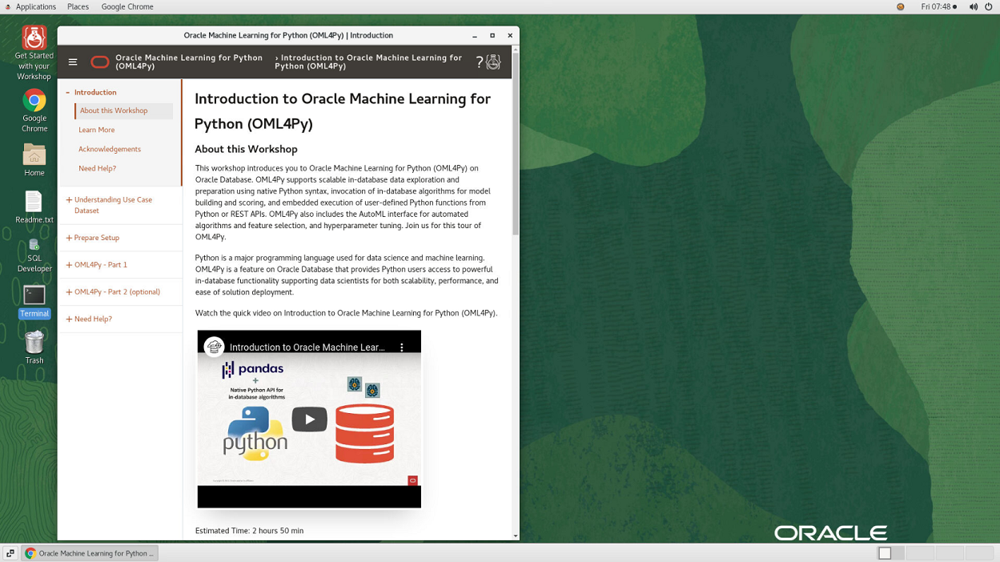
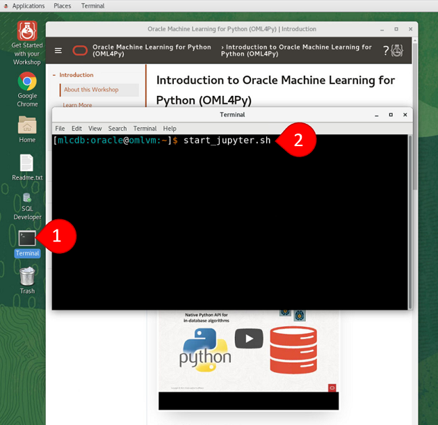
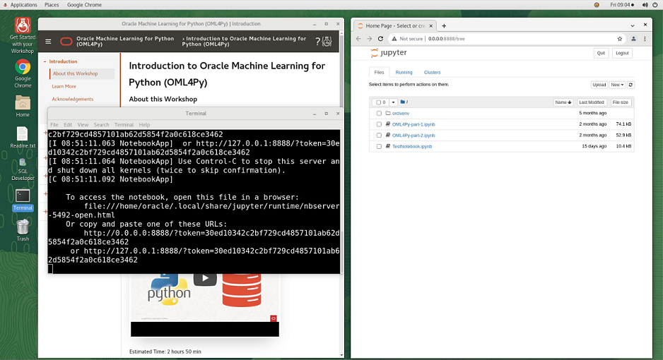

# Initialize Environment

## Introduction
This lab will show you how launch Jupyter Notebooks in your NoVNC instance.

*Estimated Lab Time*: 30 minutes

Watch the video below for a quick walk through of the lab.

[](youtube:HI9iczwKwJ4)

### Objectives
* Get familiar with the lab Instance
* Launch Jupyter Notebooks

### Prerequisites
This lab assumes you have:
- You have completed reservation process and able to login to Remote Desktop connection

## Task 1: Check the Lab setup
1. The remote desktop instance has pre-configured all the software and environment needed for this workshop. This includes a 21c Databases & Jupyter Notebooks. All services would start automatically.  The lab guide is available in a browser session, this would allow you to access the lab guide and Jupter Notebooks side by side.

    

## Task 2: Start Jupyter Notebook
1. To start Jupyter Notebook session, open a new terminal window and execute the command **start_jupyter.sh**.  This will set the required environment and activate the jupyter session.  By default the new browser would open in full screen size, just resize the window so that you can see lab guide and Jupyter Notebooks session together.

    ```
    <copy>~/bin/start_jupyter.sh</copy>
    ```
    

    > **Important** Leave the terminal window open as closing this would close the Jupyter notebooks, you can leave the terminal open in background and switch to browser by clicking on browser.

2. A new browser window would open with Jupyter notebook session. Notice there are two notebooks already present, for ease of use the notebooks are already prepared with all the steps we need for this labs.      

    

3. Click on the notebook **OML4Py-part-1.ipynb**. This would open the notebook in new tab.

    


You may now [proceed to the next lab](#next).


## Acknowledgements
* **Author** - Rajeev Rumale, Valentin Leonard Tabacaru, Milton Wan
* **Last Updated By/Date** -  Rajeev Rumale, November 2021
