## About this workshop

Oracle Machine Learning for R (OML4R) enables you to use R (a leading statistical programming language) for statistical analysis, data exploration, machine learning, and graphical analysis of data stored in an Oracle database. Using OML4R allows you to benefit from the simplicity of R and the power of Oracle Database without the need to deal with the complexities of sourcing, moving, and securing data. OML4R was formerly known as Oracle R Enterprise (ORE).

In this introductory workshop, you will use a dataset representing about 15,000 customers of an insurance company. This dataset is contained in a database table (named CUST\_INSUR\_LTV). Each customer record in the dataset has 31 attributes. Your goal is to train machine learning models to predict a given customer's lifetime value (or LTV) and a four-level category representation of their LTV (i.e., the LTV\_BIN that the customer belongs to). You will use a regression algorithm to predict LTV, and a classification algorithm to predict customers’ LTV\_BIN assignments (LOW, MEDIUM, HIGH, or VERY HIGH).

Note: In marketing, a customer's lifetime value (LTV) is an estimate of the net profit attributed to a given customer relationship over the customer lifetime.

### Estimated Lab Time: 2 Hours


### Objectives

In this lab, you will:

* Establish a connection from RStudio Web to your Oracle Database instance.
* Explore, visualize, and prepare data for analysis and machine learning.
* Use R for exploratory data analysis, data visualization, data organization (e.g., splitting data in train and test sets),
* Use Attribute Importance and Principal Component Analysis
* Use the OML4R in-database regression algorithm for building a machine learning model for estimating customer life-time value (LTV)
* Use the OML4R in-database classification algorithm for building a machine learning model for predicting LTV\_BIN
* Assess model quality using RMSE (Root Mean Squared Error), and assess classification model quality using a confusion matrix

### Note:

1. AutoML is not available for OML4R. AutoML is a feature of OML4Py and is available with Autonomous Database through the OML AutoML UI.
2. We will not be using Autonomous Database as OML4R is currently not available for Autonomous Database.

### Pre-requisites

* Oracle Database 21c, 19c, or 18c installed on-premises (or in a VM in Cloud)
* R, RStudio Server, and required libraries

## Task 1: Connect to RStudio Client and Establish Database Connection

RStudio provides an IDE (Integrated Development Environment) for R with a GUI (Graphical User Interface) and BUI (Browser User Interface). Note that an Oracle database and RStudio Server is already installed and pre-configured on VM provided for the lab.

You will be running all the lab steps in the RStudio R Script window, as shown below.

1. Point the browser to RStudio Web. You should have the window open in the NoVNC terminal. If not, open a new browser session and enter the URL mentioned in the code block below.

    ```
    <copy>http://localhost:8787</copy>
    ```

  Alternatively, you can use RStudio Desktop as your IDE, if you prefer.

2. Provide Username & Password.
   Use the provided username and password to connect to the database schema.

    ```
    Username: omluser
    Password: MLlearnPTS#21_
    ```

    

    The RStudio interface looks as follows. Notice the multiple windows marked for their function.

    

    The RStudio Graphical User Interface (GUI) provides four panels: Console, Scripts, Environments, and Plots. Instead of working ad-hoc, writing scripts makes the code and workflow reproducible.

3. Install packages

    ```
    <copy>
    if (!require("ORE")) install.packages("ORE")
    if (!require("dplyr")) install.packages("dplyr")
    if (!require("OREdplyr")) install.packages("OREdplyr")
    if (!require("caret")) install.packages("caret")
    </copy>
    ```

    The above code checks the existence of the given package in the R-Studio installation. It only installs the package if it is not already installed, thus eliminating the redundant installation of packages.

4. Load Libraries

    The library() function call installs and attaches the given library in memory and makes the included functions available. You get an error if a call to a function is made and the corresponding library is not already attached.

    ```
    <copy>
    library(ORE)
    library(dplyr)
    library(OREdplyr)
    library(caret)
    </copy>
    ```

    ORE - The ORE libraries are a set of packages that contains many useful R functions.

    dplyr - The standard dplyr R package provides grammar of data manipulation, which gives a consistent set of verbs that help you solve the most common data manipulation challenges

    OREdplyr - The OREdplyr package is an overloaded package that provides much of the dplyr functionality. It extends the ORE transparency layer for in-database execution of dplyr function calls.

    OREdplyr allows users to avoid costly movement of data while scaling to larger data volumes. Further, using the transparency layer operations are not constrained by R client memory, the latency of data movement, or single-threaded execution.

5. Set Global Options to Disable Unnecessary Warning Messages

    Turn off warnings.

    ```
    <copy>
    options(ore.warn.order=FALSE)
    </copy>
    ```

    For more details on this refer to the documentation.

6. Connect to the Database

    An Oracle 21c database instance (named MLPDB1) is already provisioned for you on the VM to run this lab. Connect to the provided database using the ore.connect() function as follows:

    ```
    ore.connect(user="oml_user",
                conn_string="MLPDB1",
                host=<hostname>,
                password=<password>,
                all=TRUE)
    ```

    It will establish a database connection is to the database schema (oml_user) where the data resides. The connection port defaults to 1521.

    By specifying "all = TRUE" in the connection specifications, proxy objects are automatically loaded for all tables and views in the target schema to which you are connecting.

    Example:

    ```
    <copy>
    ore.connect(user="oml_user",
                conn_string="MLPDB1",
                host="omlvm.livelabs.oraclevcn.com",
                password="MLlearnPTS#21_",
                all=TRUE)
    </copy>
    ```

7. Check Database Connection

    ```
    <copy>
    ore.is.connected()
    </copy>
    ```

    If needed, you can use ore.disconnect() call to disconnect the database session explicitly. As we will discuss later, if you do this, then any temporary table, view, or model proxy objects will be automatically deleted

8. List Database Objects

    The ore.ls() function returns all OML4R proxy objects. Use the ore.ls() function call to list tables and views in the database schema, which appear as ore frames in your OML4R session. The conversion is transparent, and the OML4R transparency layer enables it.

    ```
    <copy>
    ore.ls()
    </copy>
    ```

    


## Task 2: Explore Data Using R - Statistical Functions

Exploratory Data Analysis is the process of visualizing and analyzing data to develop a better understanding of the data and gain insight into the data.


1. Check ‘class’ of Object

    ```
    <copy>
    class(CUST_INSUR_LTV)
    </copy>
    ```

    The database table appears as an "ore.frame". An ore.frame is a proxy object - the R object representation - of the CUST\_INSUR\_LTV table in the database.

    There are 6 types of objects in R Programming. They are Vector, List, Matrix, Array, Factor, and Data frame. An ore.frame object represents a relational (SQL) query to an Oracle Database instance.

    The class ore.frame inherits from data.frame and overloads many data.frame functions.

2. Get List of Column Names (‘colnames’)

    ```
    <copy>
    colnames(CUST_INSUR_LTV)
    </copy>
    ```

    The column names appear in an ordered list and can be referenced based on this order.


3. Check Object or Frame Dimensions

    ```
    <copy>
    dim(CUST_INSUR_LTV)
    </copy>
    ```

    The dimensions represents the number of rows (i.e., records or observations) and number of columns (or variable, or attributes) in the given frame (table).

    Your result should be: 15342 31, which means there are 15342 records or observations (rows) in the table and each record has 31 attributes (columns).

    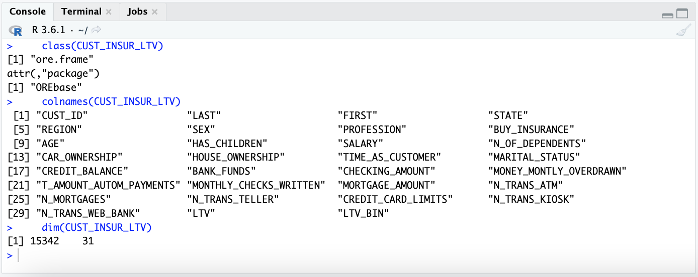            

4. Summary (Categorical and Numerical Variables)

    The summary() function is a built-in R function that can help you get a quick survey of the distribution of your variables in the dataset. The output returns descriptive statistics such as the minimum, the 1st quantile, the median, the mean, the 3rd quantile, and the maximum value of our input data.

    The summary function output may be seen as what is commonly known as the five-number summary plus mean.

    ```
    <copy>
    summary(CUST_INSUR_LTV[,1:31])
    </copy>
    ```

    You can also specify one, multiple, or a range of columns to see the summary statistics of those columns.

    

    The summary() call summarizes the specified attributes, along with statistics for frequency counts, minimum values, maximum values, etc. Notice the reference to the set of table columns (attributes) using the order numbers for the columns. You can also see a summary of individual attributes by specifying a specific column by name or number.

5. Statistical Functions (min, max, mean, mode, median, range, unique, quantile)

    You can also use simple statistical functions on your dataset or data elements as desired. For example,

    ```
    <copy>
    min(CUST_INSUR_LTV$SALARY)

    max(CUST_INSUR_LTV$AGE)
    </copy>
    ```

    Note: Mean is the statistical average.

    ```
    <copy>
    mean(CUST_INSUR_LTV$SALARY)

    mean(CUST_INSUR_LTV$LTV)
    </copy>
    ```

    Note: Mode is the most frequently occurring observation or attribute.

    ```
    <copy>
    names(table(CUST_INSUR_LTV$N_OF_DEPENDENTS))[table(CUST_INSUR_LTV$N_OF_DEPENDENTS)==max(table(CUST_INSUR_LTV$N_OF_DEPENDENTS))]
    </copy>
    ```

    Note: Median represents the middle value.

    ```
    <copy>
    median(CUST_INSUR_LTV$AGE)
    </copy>
    ```

    Range provides end-to-end range of numeric values.

    ```
    <copy>
    range(CUST_INSUR_LTV$SALARY)
    </copy>
    ```

    Unique provides the set of unique or distinct values in the data set for a given attribute or variable.

    ```
    <copy>
    unique(CUST_INSUR_LTV$REGION)
    </copy>
    ```

    In some cases, quantiles may be useful to identify outlier limits. The generic function 'quantile()' produces sample quantiles corresponding to the specified probabilities. The smallest observation corresponds to a probability of 0 and the largest to a probability of 1.

    ```
    <copy>
    quantile(CUST_INSUR_LTV$SALARY, 0.025)

    quantile(CUST_INSUR_LTV$SALARY, 0.975)
    </copy>
    ```

    Your results should show the following outputs.

    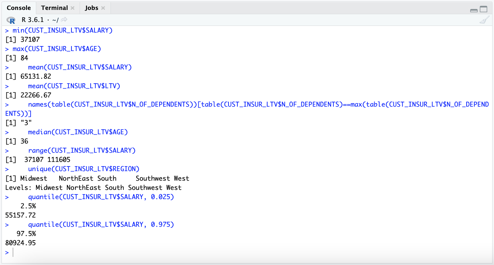


## Task 3: Explore Data Using R - Data Visualization

Exploratory Data Analysis includes the process of visualizing data for a better understanding of the data and for developing insight.

Since a number of standard data visualization functions require a data.frame object, let us first convert the ore.frame object into a data.frame object and also create an ordered frame.

```
<copy>
CIL <- ore.pull(CUST_INSUR_LTV)
row.names(CIL) <- CIL$CUST_ID
</copy>
```

1. Simple Plot

    Draw a simple and quick plot of customer salary.

    This basic plot illustrates the overall distribution of salary and the range within which it falls. You clearly see a dense band where most customers fall between about $50K to about $80K.

    ```
    <copy>
    plot(CIL$SALARY/1000, xlab = "Customer", ylab = "Salary in K$", col = "darkblue", main = "Customer Salary Plot")
    </copy>
    ```

    Your plot should look as follows.

    

    Optionally, plot other attributes. For example,

    ```
    <copy>
    plot(CIL$LTV/1000, xlab = "Customer", ylab = "LTV in K$", col = "darkblue", main = "Customer LTV Plot")
    </copy>
    ```

2. Boxplot

    Plot the age attribute using a simple boxplot.

    A simple boxplot can help you quickly see the concentration of customers in specific bands.

    ```
    <copy>
    y <- CIL$AGE
    boxplot(y, xlab = "Boxplot (AGE)", col = "darkred", horizontal=TRUE)
    text(x=fivenum(y), labels = fivenum(y), y=1.35)
    mtext(paste("Outliers: ", paste(unique(y), collapse = ", ")))
    </copy>
    ```

    Your output should look as follows.

    

    A boxplot displays the distribution of data based on a 5-number summary ("minimum," first quartile (Q1), median, third quartile (Q3), and "maximum"). A boxplot makes it easy to see outliers and what their values are. It can also indicate whether the data is symmetrical, the general grouping of data, and data skew.

    The above boxplot illustrates the distribution of data with a smallest (not minimum) value of 0, a highest (not maximum) value of 74, and an interquartile range from 27 to 46, with a median right in the center of these two (at 36) as depicted by the solid line. Values ranging from 75 to 84 are shown as outliers.

    Did you notice the parallel between the summary() function output and the box plot?

3. Histogram

    Plot a histogram for customer salary data.

    Histograms help see a distribution of data in range bands. Note that the hist() function uses the Sturges method by default to identify appropriate breaks.

    ```
    <copy>
    hist(CIL$SALARY/1000,
          main="Customer Salary Data",
          xlab="Salary($K)",
          xlim=c(20,100),
          col="darkgreen",
          freq=TRUE)
    </copy>
    ```

    Your output should look as follows.

    

4. Pie Chart

    Generate a pie chart for the distribution of customers by region. Note that CLOCKWISE signifies to use alphabetical order.

    ```
    <copy>
    pie(table(CIL$REGION), main = "Customer Distribution by Region", clockwise = TRUE)  
    </copy>
    ```

    Your output should look as follows.

    

    Optionally, plot other attributes. For example,

    ```
    <copy>
    pie(table(CIL$MARITAL_STATUS), main = "Customer Marital Status", clockwise = TRUE)  
    </copy>
    ```

5. ggplot2

    Use the package ggplot2 to generate a plot for visualizing LTV for various regions.

    When using third-party packages, the data needs to be loaded into R memory, from the database. For this we use the ore.pull() function. Note that CUST\_INSUR\_LTV is an ore.frame and once that frame is transformed using the ore.pull function, it is translated to an R data.frame. Users must take into account the size of a table before attempting to load it into memory.

    ```
    <copy>
    CIL %>% ggplot(aes(x=REGION,y=LTV,color=REGION)) + geom_boxplot()
    </copy>
    ```

    Your output should look as follows.

    

    Optionally, plot other attributes.

    ```
    <copy>
    CIL %>% ggplot(aes(x=MARITAL_STATUS,y=LTV,color=MARITAL_STATUS)) + geom_boxplot()
    </copy>
    ```

    Let’s look at another plot using ggplot2 for marital status.

    ```
    <copy>
    CIL %>% ggplot(aes(x=MARITAL_STATUS)) + geom_histogram(stat="count", color = "darkred", fill = "#69b3a2")  
    </copy>
    ```

    Your output should look as follows.

    

    Optionally, plot other attributes. For example,

    ```
    <copy>
    CIL %>% ggplot(aes(x=REGION)) + geom_histogram(stat="count", color = "darkred", fill = "#69b3a2")  
    </copy>
    ```

    You clearly see that you have most customers in the NORTHEAST and your penetration in the SOUTH and SOUTHEAST markets is relatively pretty low.

    Let’s also look at the age distribution in the customer base.

    ```
    <copy>
    print(CIL %>% ggplot(aes(x=AGE)) + geom_density(stat="count", , color = "darkred", fill = "#69b3a2"))
    </copy>
    ```

    Your output should look as follows.

    

    Optionally, look at the distribution of other attributes in the dataset.

    ```
    <copy>
    print(CIL %>% ggplot(aes(x=SALARY/1000)) + geom_density(stat="count", , color = "darkred", fill = "#69b3a2"))
    </copy>
    ```

    ```
    <copy>
    print(CIL %>% ggplot(aes(x=N_OF_DEPENDENTS)) + geom_density(stat="count", , color = "darkred", fill = "#69b3a2"))
    </copy>
    ```

    ```
    <copy>
    print(CIL %>% ggplot(aes(x=TIME_AS_CUSTOMER)) + geom_density(stat="count", , color = "darkred", fill = "#69b3a2"))
    </copy>
    ```

## Task 4: Explore Data Using R - Targeted Data Exploration

Exploratory Data Analysis may also include the process of ad-hoc data analysis, typically based on intuition or existing insights.

Let us first create an alias for the CUST\_INSUR\_LTV ore.frame for easier usage throughout this task. Also, lets order the ore.frame to avoid unnecessary warnings and errors.

CIL <- CUST\_INSUR\_LTV
row.names(CIL) <- CIL$CUST\_ID


```
<copy>
CIL <- CUST_INSUR_LTV row.names(CIL) <- CIL$CUST_ID
</copy>
```
1. Filtering Data and Aggregate Data View

    Use the filter() function to filter data based on given criteria.

    ```
    <copy>
    nrow(CIL)

    nrow(filter(CIL, REGION == "NorthEast"))

    nrow(filter(CIL, SALARY > 110000))

    nrow(CIL %>% filter(SALARY > mean(SALARY, na.rm = TRUE)))
    </copy>
    ```

    Note that the 'na.rm' specification directs treatment of missing values. 'na.rm = TRUE' removes missing values from the dataset if they are coded as NA.

    Use the aggregate() function to group data based on a given column or set of columns. Let us look at the data from different angles.

    ```
    <copy>
    aggregate(CIL$LTV_BIN, by = list(LTV_BIN = CIL$LTV_BIN), FUN = length)
    aggregate(CIL$REGION, by = list(REGION = CIL$REGION),FUN = length)

    cust_male_northeast <- (CIL %>% filter(REGION == "NorthEast", na.rm = TRUE) %>% filter(SEX == "M"))
    aggregate(cust_male_northeast$BUY_INSURANCE, by = list(BUY_INSURANCE = cust_male_northeast$BUY_INSURANCE),FUN = length)
    </copy>
    ```

    You should see output as follows.

    

    You observe you have most customers in the NORTHEAST and your penetration in the SOUTH and SOUTHEAST markets is relatively pretty low.

    Optionally, explore different attributes using the aggregate() function.

    ```
    <copy>
    aggregate(CIL$REGION, by = list(REGION = CUST_INSUR_LTV$REGION),FUN = length)

    aggregate(CIL$MARITAL_STATUS, by = list(MARITAL_STATUS = CUST_INSUR_LTV$MARITAL_STATUS),FUN = length)

    aggregate(CIL$SEX, by = list(SEX = CUST_INSUR_LTV$SEX),FUN = length)

    aggregate(CIL$N_MORTGAGES, by = list(N_MORTGAGES = CUST_INSUR_LTV$N_MORTGAGES),FUN = length)

    aggregate(CIL$N_MORTGAGES, by = list(N_MORTGAGES = CUST_INSUR_LTV$N_MORTGAGES),FUN = length)

    aggregate(CIL$HAS_CHILDREN, by = list(HAS_CHILDREN = CUST_INSUR_LTV$HAS_CHILDREN),FUN = length)

    aggregate(CIL$HOUSE_OWNERSHIP, by = list(HOUSE_OWNERSHIP = CUST_INSUR_LTV$HOUSE_OWNERSHIP), FUN = length)

    aggregate(CIL$BUY_INSURANCE, by = list(BUY_INSURANCE = CUST_INSUR_LTV$BUY_INSURANCE), FUN = length)
    </copy>
    ```

    You can slice and dice data as you wish. For example, to understand the distribution of male customers in the northeast region who do or do not currently buy insurance -

    ```
    <copy>
    cust_male_northeast <- (CIL %>% filter(REGION == "NorthEast", na.rm = TRUE) %>% filter(SEX == "M"))

    aggregate(cust_male_northeast$BUY_INSURANCE, by = list(BUY_INSURANCE = cust_male_northeast$BUY_INSURANCE),FUN = length)
    </copy>
    ```

2. Missing and Zero Values

    Check the number of observations (records) where the customer age is specified less than 1.

    ```
    <copy>
    nrow(CIL %>% filter(AGE < 1, na.rm = TRUE))
    </copy>
    ```

    Surprisingly, the number of observations where customer LTV is 0 is also the same count.

    ```
    <copy>
    nrow(CIL %>% filter(LTV < 1, na.rm = TRUE))
    </copy>
    ```

    What might you be curious about next?


3. Removing & Adding Variables (Columns)

    ```
    <copy>
    dim(CUST_INSUR_LTV)
    CUST_INSUR_LTV <- subset(CUST_INSUR_LTV, select = -c(LTV_BIN))
    dim(CUST_INSUR_LTV)
    CUST_INSUR_LTV$LTV_BIN_PRED <- ""
    dim(CUST_INSUR_LTV)
    colnames(CUST_INSUR_LTV)
    remove(CUST_INSUR_LTV)
    colnames(CUST_INSUR_LTV)
    </copy>
    ```

    You should see output as follows.

    

4. Fine Tuning the Given Dataset

    Check for the existence of duplicate data in the dataset.

    ```
    <copy>
    if (!require("janitor")) install.packages("janitor")
    library(janitor)
    CXL <- ore.pull(CUST_INSUR_LTV)
    class(CXL)
    nrow(CXL %>% get_dupes(CUST_ID))
    ??get_dupes
    nrow(CXL %>% get_dupes(CUST_ID))
    remove(CXL)
    </copy>
    ```

    Remove data from the frame where customer age is zero or not specified.

    ```
    <copy>
    dim(CUST_INSUR_LTV)
    CUST_INSUR_LTV <- CUST_INSUR_LTV %>% filter(AGE > 1)
    dim(CUST_INSUR_LTV)
    remove(CUST_INSUR_LTV)
    </copy>
    ```

    You should see output as follows.

    


5. Assess Attribute Importance For LTV\_BIN Prediction

    Use Attribute Importance to identify attributes of high relevance in predicting target dependent variable.

    The ore.odmAI() function can be used to run Attribute Importance on the given dataset. This helps identify attributes in the given dataset that are important in predicting the given dependent attribute (LTV\_BIN in this case). 

    In order to use the ore.odmAI() function effectively, you should first exclude the most significant dependent attributes from the data frame. For example, exclude LTV attribute when predicting LTV\_BIN and exclude LTV\_BIN when predicting LTV, since LTV\_BIN was derived from LTV.

    ```
    <copy>
    CIL <- CUST_INSUR_LTV
    dim(CIL)
    CIL$LTV <- NULL
    dim(CIL)
    class(CIL)
    </copy>
    ```

    Your output should look as follows.

    

    You could also exclude a column using the R Formula itself. For example use (LTV\_BIN ~ . - CUST\_ID) to remove the CUST\_ID column from the dataset.

    Notice the dimensions now show (15342 30), and not (15342 31) as was originally the case. Now, run the ore.odmAI() function to identify ordered importance of attribute for target variable LTV\_BIN. Note that CIL is an ore.frame object.

    ```
    <copy>
    ltvbinai <- ore.odmAI(LTV_BIN ~ ., CIL)
    class(ltvbinai)
    print(ltvbinai)
    </copy>
    ```

    Assess the output as it lists all the important attributes and their relative influence on the target attribute (LTV\_BIN).

    Your result should look like the ranking below with House Ownership as the highest importance for determine LTV\_BIN, and Customer ID as the least important.

    Your output should look as follows.

    

    Save the generated model in datastore.

    ```
    <copy>
    ore.save(ltvbinai, name = "ltvbinai", overwrite = TRUE)
    ore.datastore()
    </copy>
    ```

    Notice that if the datastore already exists by a given name, an error is flagged. You may overwrite the object, if appropriate, or save it with a different (unique) name.

    Your output should look as follows.

    


6. Assess Attribute Importance for LTV Prediction

    Use Attribute Importance (i.e., the ore.odmAI() function) to identify attributes of relative importance for a LTV prediction with the given dataset.

    ```
    <copy>
    CIL <- CUST_INSUR_LTV
    CIL$LTV_BIN <- NULL
    dim(CIL)

    ltvai <- ore.odmAI(LTV ~ ., CIL)
    </copy>
    ```

    Check the class of the object returned and save it in the datastore.

    ```
    <copy>
    class(ltvai)  
    print(ltvai)

    ore.save(ltvai, name = 'ltvai', overwrite = TRUE)
    ore.datastore()
    </copy>
    ```

    Attribute importance ranks attributes according to their significance in predicting a target. The ore.odmAI() function produces a ranking of attributes and their importance expressed as a fraction.

    As seen below, Attribute Importance (AI) ranks attributes according to their significance in predicting a target. 

    
    

    Do you notice the difference between AI output for LTV and for LTV\_BIN?.

7. Principal Component Analysis

    Principal Component Analysis (PCA) is a technique used for exploratory data analysis and to visualize the existing variation in a dataset that contains several variables. PCA is particularly helpful when dealing with vast datasets (when each record has many attributes). PCA simplifies a dataset by turning the original (many) variables into a smaller number, termed "Principal Components".

    ```
    <copy>
    prc0 <- prcomp(~  HOUSE_OWNERSHIP + N_MORTGAGES + MORTGAGE_AMOUNT + AGE + SALARY + N_OF_DEPENDENTS, data = CUST_INSUR_LTV, scale = TRUE)

    summary(prc0)
    </copy>
    ```

    Note: The prcomp() function is overloaded to build a model on an ore.frame. Setting the argument scale=TRUE, standardizes the input data so that it has zero mean and variance one before doing PCA.

    The output below should illustrate the relative significance of the principal components used from the dataset.

    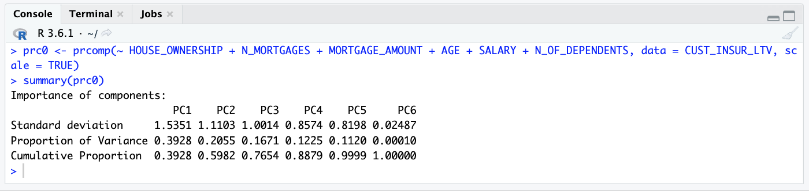

    The summary() function in the result object shows standard deviation, proportion of variance explained by each principal component, and the cumulative proportion of variance.

8. Save the object in a datastore

    ```
    <copy>
    ore.save(prc0, name = "PRC0", overwrite = TRUE)
    ore.datastore()
    ore.datastore(name = "PRC0", type = c("all"))
    </copy>
    ```

    Your output should look as follows.

    


    If you do not want to overwrite but append the object to the datastore, you can use "append = TRUE".


## Task 5: Build Regression Model for LTV Prediction and Evaluate Model

In this task, we are going to build a regression model to predict LTV.

1. Create Ordered ORE Frame

    Most operations in R do not need an ordered frame. Therefore, usually use.keys is set to FALSE. However, for sampling and partitioning etc. ordering of frames is necessary. Since you will be sampling data at this stage, use the primary key of a database table to order an ore.frame object. The primary key of the CUST\_INSUR\_LTV table (CUST\_ID) can be used for this purpose.

    The set.seed() function sets the seed of R‘s random number generator, which is useful for creating simulations or random objects that can be reproduced.

    This example ensures that CUST\_INSUR\_LTV is an ordered ore.frame by assigning the values of the CUST_ID column as the row names of CUST\_INSUR\_LTV.

    ```
    <copy>
    CIL <- CUST_INSUR_LTV
    head(row.names(CIL))

    set.seed(1)
    row.names(CIL) <- CIL$CUST_ID

    head(row.names(CIL))
    </copy>
    ```

    Note, that in the first step above (CIL <- CUST\_INSUR\_LTV) we are simply aliasing the name of the ore.frame to a simpler one.

    The output should show the following.

    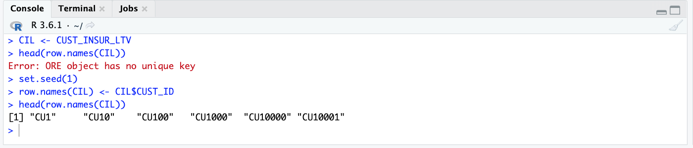

    Note: Using an ordered ore.frame proxy object can result in certain overheads for a large data set. This is because ordering (sorting) of the result set is performed, which can be time consuming. Therefore, although OML4R attempts to create ordered ore.frame objects by default if a primary key is specified, unordered frames can be made ordered and vice-versa by using the row.names() function.

2. Partition Data for Training & Testing

    Split the dataset into two buckets - training data set (~70%), and testing data set (~30%).

    The 'seed' can be set to any value. Setting a 'seed' ensures the same output is reproduced by the R psuedo-number generator, when you rerun your code. This can be helpful for consistency and debugging purposes.

    ```
    <copy>
    set.seed(1)

    sampleSize <- 4500

    ind <- sample(1:nrow(CIL),sampleSize)
    group <- as.integer(1:nrow(CIL) %in% ind)
    CIL.train <- CIL[group==FALSE,]
    CIL.test <- CIL[group==TRUE,]
    </copy>
    ```

    Note that the sample size is specified as 4500, which is about 30% of the dataset volume.

3. Check Class and Dimensions of Training and Test Datasets

    ```
    <copy>
    class(CIL.train)
    dim(CIL.train)
    class(CIL.test)
    dim(CIL.test)
    </copy>
    ```

    Your output should look as follows.

    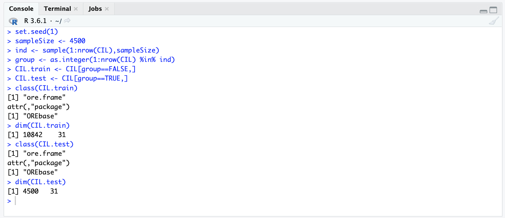

4. Build Model

    Build a REGRESSION MODEL to predict customer LTV using the training data set.

    ```
    <copy>
    ore.fit.glm <- ore.odmGLM(LTV ~ HOUSE_OWNERSHIP + N_MORTGAGES + MORTGAGE_AMOUNT + N_TRANS_WEB_BANK + N_OF_DEPENDENTS, data = CIL.train, ridge=TRUE)

    ore.fit.glm %>% print()
    </copy>
    ```

    Your output should look as follows.

    

5. Check Model Details

    Check details of the REGRESSION MODEL created above.

    ```
    <copy>
    class(ore.fit.glm)

    summary(ore.fit.glm)

    ore.fit.glm$formula

    head(ore.fit.glm$residuals)
    </copy>
    ```

    Your output should look as follows.

    
    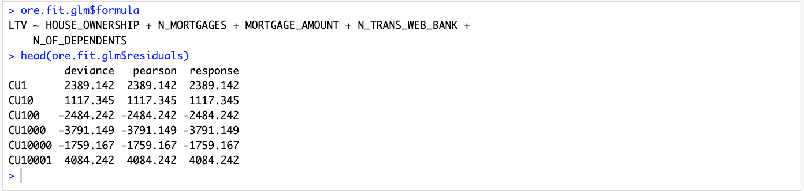

6. Generate Predictions

    Generate LTV predictions using ore.predict.

    The ore.predict function is invoked on a model. For example, the following code generates predictions (ore.fit.glm.pred) by invoking ore.predict() on the ore.fit.glm model produced above and uses CIL.test dataset to score the model.

    ```
    <copy>
    ore.fit.glm.pred = ore.predict(ore.fit.glm, newdata = CIL.test)

    head(ore.fit.glm.pred)
    </copy>
    ```

    Note: Using the ore.predict function to score data in the database allows the use of R-generated models to score in-database data (in an ore.frame object). The ore.predict function maximizes the use of Oracle Database as a compute engine which provides a commercial grade, high performance, scalable scoring engine.

    Your output should look as follows.

    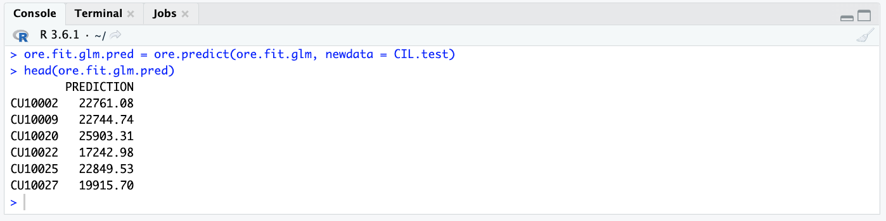


7. Compare Actual and Predicted Values

    ```
    <copy>
    ore.fit.glm.res <- ore.predict(ore.fit.glm, CIL.test, se.fit = TRUE, interval = "prediction")
    CIL <- cbind(CIL, ore.fit.glm.res)
    head(select (CIL, LTV, PREDICTION))
    </copy>
    ```

    Your output should look as follows.

    


8. Compute RMSE

    Check Root Mean Squared Error (RMSE) to assess prediction accuracy as produced by the model.

    Root Mean Square Error (RMSE) is a metric that indicates the average distance between the predicted values from a model and the actual values in the dataset. A lower RMSE is desirable. Lower RMSE indicates a better "fit" of the model for the given dataset.

    ```
    <copy>
    ans <- ore.predict(ore.fit.glm, newdata = CIL.test, supplemental.cols = 'LTV')
    localPredictions <- ore.pull(ans)
    ore.rmse <- function (pred, obs) {
    sqrt(mean(pred-obs)^2)
    }

    ore.rmse(localPredictions$PREDICTION, localPredictions$LTV)
    </copy>
    ```

    Your output should show the following:

    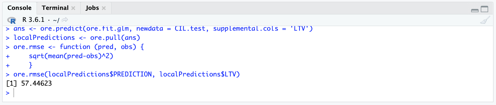

    Recall that the average (mean) LTV as calculated previously was $22266.67. Thus a value of 57.44 is relatively low, suggesting a good model fit.

    Plot the predictions alongside actual LTV value.

    ```
    <copy>
    localPredictions %>% ggplot(aes(x=PREDICTION, y=LTV, color=PREDICTION)) + geom_point()
    </copy>
    ```

    Your output should show the following:

    


    RMSE is a useful way to assess the quality of a regression model. When comparing two regression models, a larger RMSE indicates a larger gap between the predicted and observed values, which means a poorer model fit. In the same way, a smaller RMSE that indicates a better model.  However, there is no ideal value for RMSE as it depends on the magnitude of the measure.

9. Store (Save) Model Proxy Object in Database

    ```
    <copy>
    ore.save(ore.fit.glm, name = "ore.fit.glm", overwrite = TRUE)
    ore.datastore()
    </copy>
    ```

    This saves the model proxy object in the datastore so the model is not automatically deleted when you close the database connection.

    Your output should show the following:

    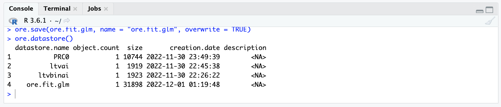


## Task 6: Build Classification Model for LTV_BIN Prediction and Evaluate Model

In this task, we build a classification model for LTV\_BIN prediction and then evaluate it using a confusion matrix. As you will notice, the overall process is similar to predicting LTV. However, here we use a Classification model instead of a regression model. Also, the model is assessed using a confusion matrix instead of the RMSE (Room Mean Square Error) method we used previously.

1. Create Ordered ORE Frame

    ```
    <copy>
    set.seed(1)
    CIL <- CUST_INSUR_LTV
    row.names(CIL) <- CIL$CUST_ID
    head(row.names(CIL))
    </copy>
    ```

2. Partition Data For Training & Testing

    Split the dataset into two buckets - training data set (~70%), and testing data set (~30%).

    ```
    <copy>
    set.seed(1)
    sampleSize <- 4500
    ind <- sample(1:nrow(CIL),sampleSize)
    group <- as.integer(1:nrow(CIL) %in% ind)
    CIL.train <- CIL[group==FALSE,]
    CIL.test <- CIL[group==TRUE,]
    </copy>
    ```


3. Check Class and Dimensions of Training and Test Datasets

    ```
    <copy>
    class(CIL.train)
    dim(CIL.train)
    class(CIL.test)
    dim(CIL.test)
    </copy>
    ```

    Your results should be as follows.

    


4. Build Model

    Build a CLASSIFICATION MODEL using the NAIVE BAYES algorithm and the training data set (CIL.train) for predicting customer LTV\_BIN.

    ```
    <copy>
    ore.fit.nb <- ore.odmNB(LTV_BIN ~ HOUSE_OWNERSHIP + N_MORTGAGES + MORTGAGE_AMOUNT + N_TRANS_WEB_BANK + N_OF_DEPENDENTS, data = CIL.train)

    ore.fit.nb %>% print()
    </copy>
    ```

    Your results should be as follows.

    


5. Check Model Details

    ```
    <copy>
    summary(ore.fit.nb)

    names(ore.fit.nb)

    ore.fit.nb$formula
    </copy>
    ```

    Your results should be as follows.

    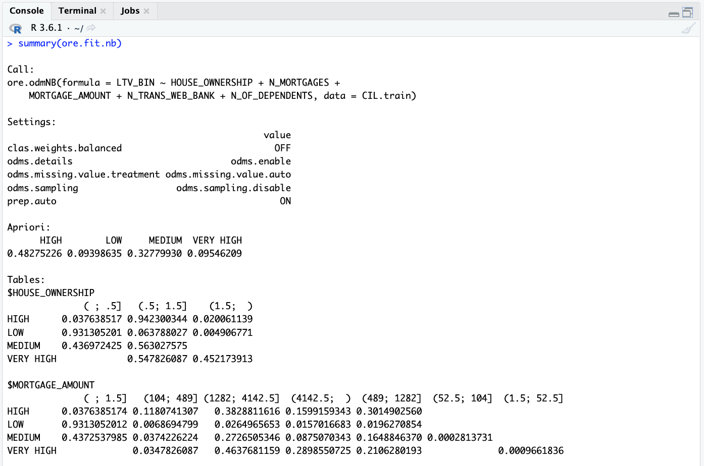

    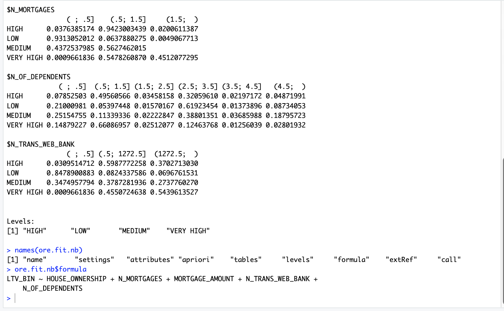

    


6. Generate Predictions for LTV\_BIN

    ```
    <copy>
    ore.fit.nb.res <- ore.predict(ore.fit.nb, newdata = CIL.test)

    head(ore.fit.nb.res,10)
    </copy>
    ```

    Your results should be as follows.

    


7. Compute Confusion Matrix

    Now, let us look at the confusion matrix to compare the aggregate predictions with actual data.

    ```
    <copy>
    with(ore.fit.nb.res, table(CIL.test$LTV_BIN,PREDICTION, dnn = c("Actual","Predicted")))
    </copy>
    ```

    Your results should be as follows.

    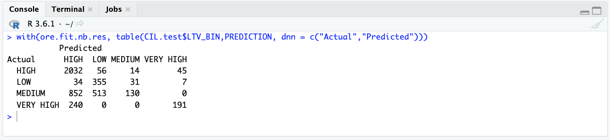


    A confusion matrix is used to describe the performance of a classification model on a test dataset for which the actual or true values are known. It is usually presented in a table format. The confusion matrix depicts TRUE POSITIVES, TRUE NEGATIVES, FALSE POSITIVES, and FALSE NEGATIVES. The accuracy is easy to calculate by computing (TP + TN / TOTAL SAMPLE SIZE).

8. Store (Save) Model In Database

    ```
    <copy>
    ore.save(ore.fit.nb, name = "ore.fit.nb", overwrite = TRUE)
    ore.datastore()
    </copy>
    ```

    Your results should be as follows.

    


9. Optionally, use another algorithm to create a different classification model and compare the results of the two models for their relative accuracy.

    For example, the following creates a classification model using the DECISION TREE algorithm.

    Remove the LTV\_BIN column from the ore.frame.

    ```
    <copy>
    CIL <- CUST_INSUR_LTV
    CIL$LTV_BIN <- NULL
    dim(CIL)
    </copy>
    ```

    Fit the model with training data.

    ```
    <copy>
    ore.fit.dt <- ore.odmDT(LTV_BIN ~ HOUSE_OWNERSHIP + N_MORTGAGES + MORTGAGE_AMOUNT + N_TRANS_WEB_BANK + N_OF_DEPENDENTS, data = CIL.train)

    ore.fit.dt %>% print()

    summary(ore.fit.dt)

    names(ore.fit.dt)

    ore.fit.dt$formula
    </copy>
    ```

    Generate predictions and the confusion matrix.

    ```
    <copy>
    ore.fit.dt.res <- predict (ore.fit.dt, CIL.test, "LTV_BIN")

    head(ore.fit.dt.res,10)

    with(ore.fit.dt.res, table(LTV_BIN,PREDICTION, dnn = c("Actual","Predicted")))
    </copy>
    ```

    You may save this new model in the datastore as follows:

    ```
    <copy>
    ore.save(ore.fit.dt, name = "ore.fit.dt", overwrite = TRUE)
    ore.datastore()
    </copy>
    ```

    How does the confusion matrix compare with the one generated previously?


## Task 7 Conclusion

### Conclusion

OML4R enables you to leverage the power of R, a leading statistical programming language, with Oracle Database, the world’s most advanced and high-performance database. OML4R provides simple, easy-to-use functions to perform exploratory data analysis, including statistical analysis, data visualization, and more advanced and targeted data analysis. OML4R uses overloaded R functions that leverage the powerful Oracle Database to eliminate the need for data movement while utilizing in-database parallel processing.

### Next Steps

a) Sign-up:  Oracle Cloud Infrastructure trial account

Consider signing-up for the Oracle Cloud Infrastructure and use Oracle Machine Learning for R (as well as Oracle Machine Learning for Python and Oracle Machine Learning for SQL) for your development projects. Note that OML4R is currently not supported on Autonomous Database. However, you can use Oracle Database installed in a compute VM and OML4R.

b) Get Certified: Oracle Machine Learning with Oracle Autonomous Database Certification
Consider taking the Oracle Machine Learning with Oracle Autonomous Database Certification offered by Oracle University.


## Acknowledgements
* **Authors** - Ravi Sharma, Rajeev Rumale, Milton Wan
* **Last Updated By/Date** -  Ravi Sharma, April 2022
