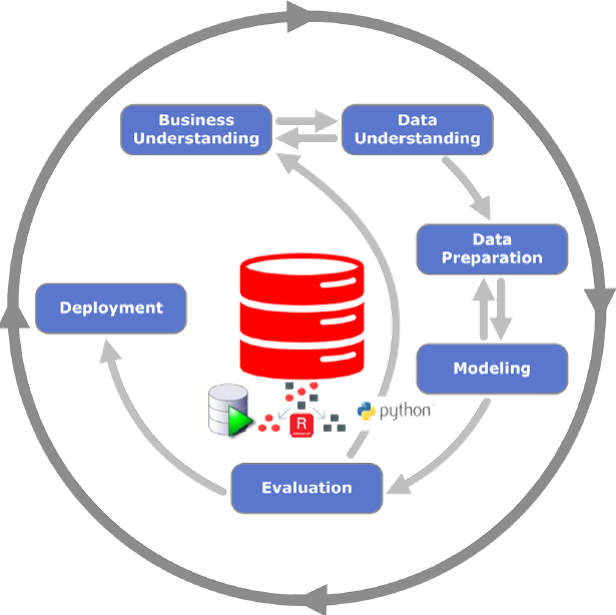

# Detect anomalies with OML4SQL using one-class support vector machine (SVM)

## About this Workshop

This workshop introduces you to Oracle Machine Learning for SQL  (OML4SQL) on Oracle Database. OML4SQL supports scalable in-database data exploration and preparation using native SQL & PLSQL syntax, invocation of in-database machine learning algorithms for model building.

In this workshop, you have a dataset representing 15k customers of an insurance company. Each customer has around 30 attributes, and our goal is to build machine learning models to meet four business objectives that are described in section [OML4SQL Use Case](./../../oml4sql/workshops/livelabs/?lab=oml4sql-use-case).

  1. Find the most atypical members of this customer group.
  2. Discover the common demographic characteristics of the most typical customers with insurance.
  3. Compute the probability of purchase for a new/hypothetical customer, and grant it to sellers to qualify better their potential clients since the first contact.
  4. Identify rows that are most atypical in the input dataset. Consider each type of marital status to be separate, so the most anomalous rows per marital status group should be returned.

Estimated Time: 2 hours.

### Objectives

In this lab, you will learn the lifecycle of machine learning:

1. **Business Understanding**: Understand the problem statement. Examine the customer insurance historical data set and understand the business case.
2. **Data Understanding**: Review the data; does it makes sense?  Understand the meaning of fields.
3. **Data Preparation**: Prepare the data, create new derived attributes or "engineered features".
4. **Modeling**: Training and testing ML models using 60%/40% random samples. First, identify the key attributes that most influence the target attribute.
5. **Evaluation**: Next, test model accuracy, make sure the model makes sense.
6. **Deployment**: Apply the models to predict “Best Customers”, and give this tool to the people in the business who can best take advantage of it.

### Prerequisites

* Oracle Database 21c installed.
* Access the Oracle database containing the customer insurance table and run the scripts to configure the user and prepare data. The virtual machine used for this lab is the same VM that was used in the OML4PY Workshop of the previous lab.
* SSH private key with which you created your VM on OCI.

>**Note:** If you have a Free Trial account, when your Free Trial expires your account will be converted to an **Always Free** account. You will not be able to conduct Free Tier workshops unless the Always Free environment is available. **[Click here for the Free Tier FAQ page.](https://www.oracle.com/cloud/free/faq.html)**

## About Oracle Machine Learning for SQL (OML4SQL)

OML4SQL provides a powerful, state-of-the-art machine learning capability within Oracle Database. You can use OML4SQL to build and deploy predictive and descriptive machine learning applications, to add intelligent capabilities to existing applications, and to generate predictive queries for data exploration.

OML4SQL offers a comprehensive set of in-database algorithms for performing a variety of machine learning tasks, such as classification, regression, anomaly detection, feature extraction, clustering, and market basket analysis. The algorithms can work on standard case data, transactional data, star schemas, and text and other forms of unstructured data. OML4SQL is uniquely suited to the analysis of very large data sets.

**Oracle Machine Learning for SQL is a component of the Oracle Database Enterprise Edition.**

The PL/SQL API and SQL language operators provide direct access to OML4SQL functionality in Oracle Database.

For more information about [Oracle Machine Learning](https://docs.oracle.com/en/database/oracle/machine-learning/index.html)

For more information about [OML4SQL API Guide](https://docs.oracle.com/en/database/oracle/machine-learning/oml4sql/21/dmapi/introduction-to-oml4sql.html#GUID-429CF74D-C4B7-4302-9C33-5292A664E2AD).

You may now **proceed to the next lab**

## Learn More

* [About Oracle Machine Learning for SQL](https://docs.oracle.com/en/database/oracle/machine-learning/oml4sql/21/dmapi/introduction-to-oml4sql.html#GUID-429CF74D-C4B7-4302-9C33-5292A664E2AD).

## Acknowledgements
* **Authors** - Adrian Castillo Mendoza, Milton Wan, Valentin Leonard Tabacaru, Rajeev Rumale.
* **Last Updated By/Date** -  Adrian Castillo Mendoza, March 2022.
