# Detect anomalies with OML4SQL using one-class support vector machine (SVM)

## Introduction

OML4SQL provides a powerful, state-of-the-art machine learning capability within Oracle Database. You can use OML4SQL to build and deploy predictive and descriptive machine learning applications, to add intelligent capabilities to existing applications, and to generate predictive queries for data exploration.

OML4SQL offers a comprehensive set of in-database algorithms for performing a variety of machine learning tasks, such as classification, regression, anomaly detection, feature extraction, clustering, and market basket analysis. The algorithms can work on standard case data, transactional data, star schemas, and text and other forms of unstructured data. OML4SQL is uniquely suited to the analysis of very large data sets.

**Oracle Machine Learning for SQL is a component of the Oracle Database Enterprise Edition.**

The PL/SQL API and SQL language operators provide direct access to OML4SQL functionality in Oracle Database.


In this workshop, you have a dataset representing 15k customers of an insurance company. Each customer has around 30 attributes, and our goal is to train our database to find 4 Business Objectives that describe in [OML4SQL Use Case](./../../oml4sql/workshops/livelabs/?lab=oml4sql-use-case).

For more information about [OML4SQL API Guide](https://docs.oracle.com/en/database/oracle/machine-learning/oml4sql/21/dmapi/introduction-to-oml4sql.html#GUID-429CF74D-C4B7-4302-9C33-5292A664E2AD).

Estimated Time: 2 hours.

### Objectives

In this lab, you will:

* **Business Understanding**: (Be extremely specific in the problem statement) Examine the customer insurance historical data set and understand business.
* **Data Understanding**: (Review the data; does it makes sense?), Understand the meaning of fields.
* **Data Preparation**: (Prepare the data, create new derived attributes or "engineered features") Examine the new customer data set that you needed to start to work.
* **Modeling**: (Training and testing ML models using 60%/40% random samples.) First, identify the key attributes that most influence the target attribute.
* **Evaluation**: Next, test model accuracy, make sure the model makes sense.
* **Deployment**: Apply the Models to Predict “Best Customers”, and give this tool to the people in the business who can best take advantage of it.


### Prerequisites

* Oracle Database 21c installed.
* Access the Oracle database containing the customer insurance table and run the scripts to configure the user and prepare data. The virtual machine used for this lab is the same VM that was used in the OML4PY Workshop of the previous lab.
* SSH private key with which you created your VM on OCI.


## Task 1: Business Understanding

1. Review Business Objectives that describe in next section [Customer Insurance Use Case to OML4SQL Workshop](./../../oml4sql/workshops/livelabs/?lab=oml4sql-use-case).

## Task 2: Data Understanding

* Data information of insurance clients is like this:

  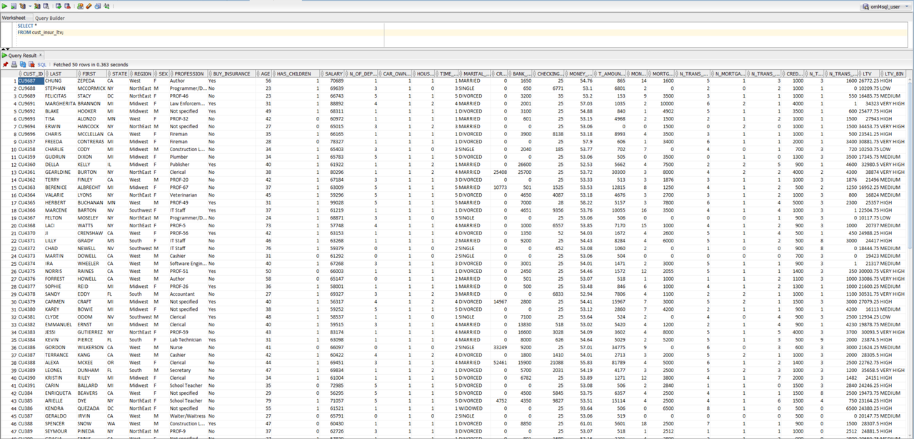

* Sample of single record is like this:

  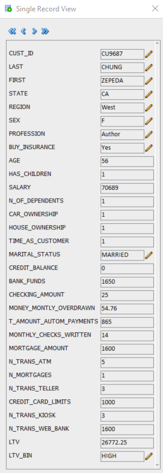

* The most important field in this use case, is BUY_INSURANCE, because businesses need to know who is their buyer persona typical and atypical.

## Task 3: Data Preparation

1. It is recommended to have SQL Developer installed on your host machine so that you can interact with the data in a more friendly way. You need access to remote desktop with novnc link that you copied from of Resource Manager/Stacks/Stack Details/Application Information/Remote Desktop/copy, once you enter in the VM remote, you need open a Linux terminal and execute the command  ". setEnv" and wait for that start database service, If it asks you to replace the scripts in the terminal type A for all questions.
To see the service name, open other Linux Terminal and execute lsnrctl status command.    

   You can download here [SQL Developer Download](https://www.oracle.com/tools/downloads/sqldev-downloads.html).

2. Once installed SQL Developer, you need to configure the remote connection in SSH Hosts of SQL Developer feature, following these instructions:

  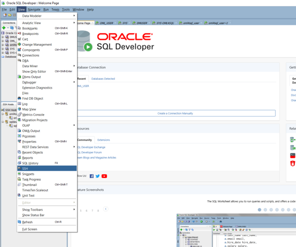

3. Right click on SSH Hosts and then click New SSH Host, write values in each field and then click Ok. The public and private IP can be obtained from OCI, entering Compute/Instances and you will be able to see and copy this data.

  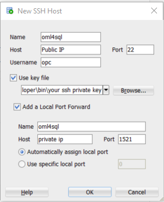

4. Right click on the first oml4sql tab in SSH Hosts an click connect, and then right click in the submenu oml4sql tab an click connect.
Notice how the small padlock closes in both options, which represents that you are already remotely connected to your VM and you are ready to create a connection to your schema from SQL Developer.

  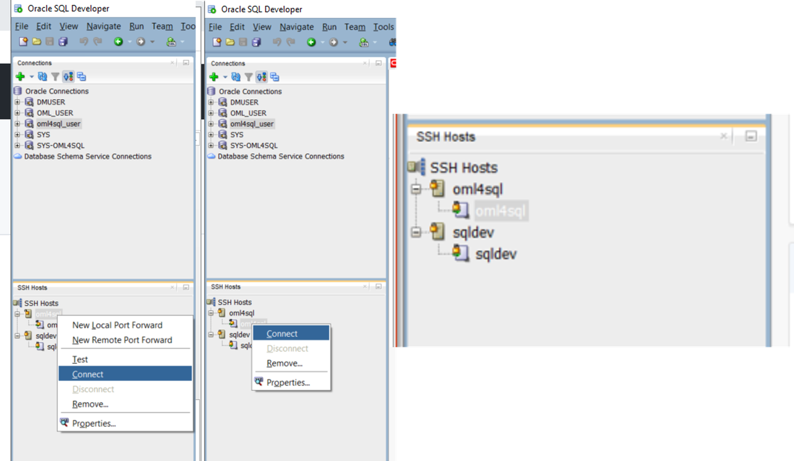

5. Create SQL Developer new database connection with **SYS** user to your Oracle 21c Pluggable Database, and test connectivity with password: **MLlearnPTS#21_** and service name: mlpdb1.livelabs.oraclevcn.com

  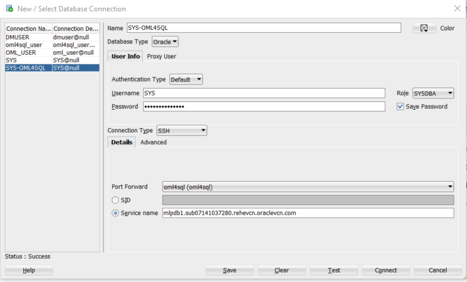

6. Once the database connection is open and SQL Developer Worksheet is ready, execute this script to create the user oml4sqluser and grant privileges to work with OML4SQL API, and generate a copy of table CUST\_INSUR\_LTV.

    ````
    <copy>
    DROP USER oml4sqluser;

	CREATE USER oml4sqluser IDENTIFIED BY oml4sqluser
       DEFAULT TABLESPACE USERS
       TEMPORARY TABLESPACE TEMP
       QUOTA UNLIMITED ON USERS;

	GRANT CREATE SESSION TO oml4sqluser;
	GRANT CREATE TABLE TO oml4sqluser;
	GRANT CREATE VIEW TO oml4sqluser;
	GRANT CREATE MINING MODEL TO oml4sqluser;
	GRANT EXECUTE ON CTXSYS.CTX_DDL TO oml4sqluser;
	GRANT SELECT ANY MINING MODEL TO oml4sqluser;

	GRANT SELECT ON OML_USER.CUST_INSUR_LTV TO oml4sqluser;
	CREATE TABLE oml4sqluser.CUST_INSUR_LTV AS
	SELECT *
	FROM OML_USER.CUST_INSUR_LTV;
    </copy>
    ````

7. Create SQL Developer new database connection with oml4sqluser user to your Oracle 21c Pluggable Database, and test connectivity with password: oml4sqluser.

  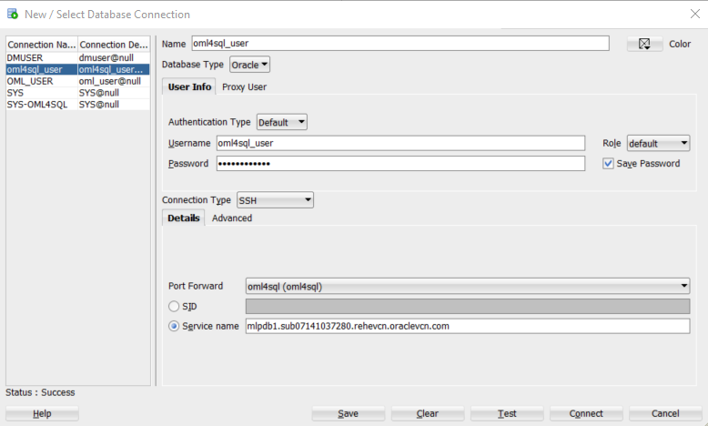

8. Copy and execute this script with oml4sqluser:

    ````
    <copy>
	BEGIN DBMS_DATA_MINING.DROP_MODEL('SVMO_CUST_Class_sample');
	EXCEPTION WHEN OTHERS THEN NULL; END;
	/

	BEGIN
	  EXECUTE IMMEDIATE 'DROP TABLE svmo_cust_sample_settings';
	EXCEPTION WHEN OTHERS THEN
	  NULL;
	END;
	/

	set echo off
	CREATE TABLE svmo_cust_sample_settings (
	  setting_name  VARCHAR2(30),
	  setting_value VARCHAR2(4000));
	set echo on

	BEGIN        
	  INSERT INTO svmo_cust_sample_settings (setting_name, setting_value) VALUES
	  (dbms_data_mining.algo_name, dbms_data_mining.algo_support_vector_machines);  
	  INSERT INTO svmo_cust_sample_settings (setting_name, setting_value) VALUES
	  (dbms_data_mining.prep_auto, dbms_data_mining.prep_auto_on);
	END;
	/

	CREATE OR REPLACE VIEW cust_data_one_class_v AS
	SELECT *
	FROM cust_insur_ltv
	WHERE BUY_INSURANCE = 'Yes';

	CREATE or REPLACE VIEW cust_data_one_class_pv AS SELECT /*+ parallel (4)*/ * FROM cust_data_one_class_v;
    </copy>
    ````

9. Check that there are no errors in the output of the script.

10. Review your settings table:

    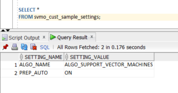


## Task 4: Modeling

1. CREATE A Model with the name: SVMO\_CUST\_Class_sample
  We use One-Class Support Vector Machine, Support Vector Machine (SVM) as a one-class classifier is used for detecting anomalies. Oracle Machine Learning for SQL uses SVM as the one-class classifier for anomaly detection. When SVM is used for anomaly detection, it has the classification machine learning function but no target.

  One-class SVM models, when applied, produce a prediction and a probability for each case in the scoring data. If the prediction is 1, the case is considered typical. If the prediction is 0, the case is considered anomalous. This behavior reflects the fact that the model is trained with normal data.

  Note the NULL specification for target column name.

  For more information about SVM in Oracle, check this link: [Support Vector Machine](https://docs.oracle.com/en/database/oracle/machine-learning/oml4sql/21/dmcon/support-vector-machine.html#GUID-FD5DF1FB-AAAA-4D4E-84A2-8F645F87C344).

    ````
    <copy>
	BEGIN
	  DBMS_DATA_MINING.CREATE_MODEL(
		model_name          => 'SVMO_CUST_Class_sample',
		mining_function     => dbms_data_mining.classification,
		data_table_name     => 'cust_data_one_class_pv',
		case_id_column_name => 'cust_id',
		target_column_name  => NULL,
		settings_table_name => 'svmo_cust_sample_settings');
	END;
	/
    </copy>
    ````

2. DISPLAY MODEL SETTINGS

    ````
    <copy>
	SELECT setting_name, setting_value
	  FROM user_mining_model_settings
	 WHERE model_name = 'SVMO_CUST_CLASS_SAMPLE'
	ORDER BY setting_name;
    </copy>
    ````

    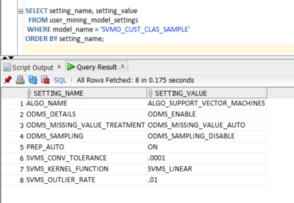

3. Review your model attributes. DISPLAY MODEL SIGNATURE

    ````
    <copy>
	SELECT attribute_name, attribute_type
	  FROM user_mining_model_attributes
	 WHERE model_name = 'SVMO_CUST_CLASS_SAMPLE'
	ORDER BY attribute_name;
    </copy>
    ````

    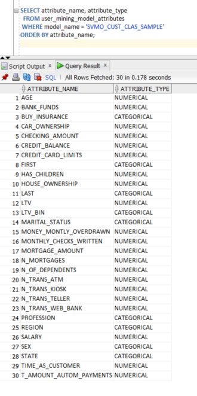

4. Review your model details. Model details are available only for SVM models with linear kernel.

    ````
    <copy>
	WITH
	mod_dtls AS (
	SELECT *
	  FROM TABLE(DBMS_DATA_MINING.GET_MODEL_DETAILS_SVM('SVMO_CUST_CLASS_SAMPLE'))
	),
	model_details AS (
	SELECT D.class, A.attribute_name, A.attribute_value, A.coefficient
	  FROM mod_dtls D,
		   TABLE(D.attribute_set) A
	ORDER BY D.class, ABS(A.coefficient) DESC
	)
	SELECT class, attribute_name aname, attribute_value aval, coefficient coeff
	  FROM model_details
	 WHERE ROWNUM < 50;
    </copy>
    ````

    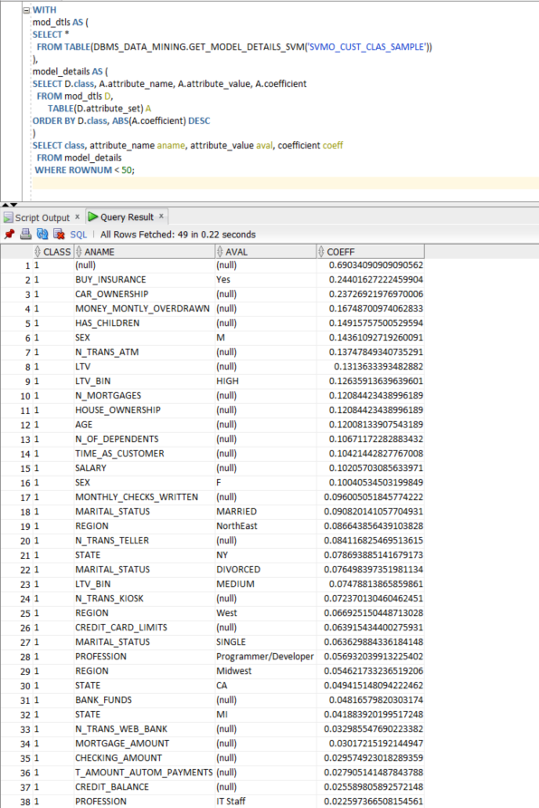

5. Review your model views that are generated.

    ````
    <copy>
	 SELECT view_name, view_type FROM user_mining_model_views
	WHERE model_name='SVMO_CUST_CLASS_SAMPLE'
	ORDER BY view_name;
    </copy>
    ````

    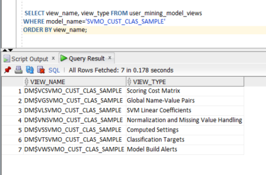

## Task 5: Evaluation

APPLY THE MODEL

* Depending on the business case, the model can be scored against the build data (e.g, business cases 1 and 2) or against new, previously unseen data (e.g., business case 3). New apply data needs to undergo the same transformations as the build data (see business case 3).


BUSINESS CASE 1

* Find the top 5 outliers - customers that differ the most from  the rest of the population. Depending on the application, such  atypical customers can be removed from the data (data cleansing). Explain which attributes cause them to appear different.

    ````
    <copy>
	set long 20000
	col pd format a90
	SELECT cust_id, pd FROM
	(SELECT cust_id,
			PREDICTION_DETAILS(SVMO_CUST_CLASS_SAMPLE, 0 using *) pd,
			rank() over (order by prediction_probability(
						 SVMO_CUST_Class_sample, 0 using *) DESC, cust_id) rnk
	 FROM cust_data_one_class_pv)
	WHERE rnk <= 5
	order by rnk;
    </copy>
    ````


    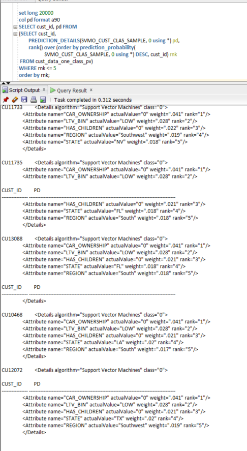

BUSINESS CASE 2

* Find demographic characteristics of the **typical** BUY_INSURANCE=Yes members.
These statistics will not be influenced by outliers and are likely to provide a more truthful picture of the population of interest than statistics computed on the entire group of insurance members. Statistics are computed on the original (non-transformed) data.

    ````
    <copy>
	column SEX format a12
	SELECT SEX, round(avg(age)) age,
		   round(avg(TIME_AS_CUSTOMER)) TIME_AS_CUSTOMER,
		   count(*) cnt
	FROM cust_data_one_class_pv
	WHERE prediction(SVMO_CUST_CLASS_SAMPLE using *) = 1
	GROUP BY SEX
	ORDER BY SEX;
    </copy>
    ````

    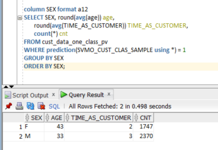

## Task 6: Deployment

BUSINESS CASE 3

* Compute probability of a new/hypothetical customer being a typical BUY_INSURANCE=Yes.
Necessary data preparation on the input attributes is performed automatically during model scoring since the model was build with auto data prep.

    ````
    <copy>
	select ROUND(prob_typical,5)*100||'%' Probability_BUY
	from
	(select
	prediction_probability(SVMO_CUST_CLASS_SAMPLE, 1 using
								 44 AS age,
								 3 AS TIME_AS_CUSTOMER,
								 'Programmer/Developer' AS PROFESSION,
								 'SINGLE' AS MARITAL_STATUS,
								 'NorthEast' AS REGION,
								 'NY' AS STATE,
								 'M' AS SEX,
								 '20442' AS SALARY,
								 '0' AS HOUSE_OWNERSHIP
								 ) prob_typical
	from dual);
    </copy>
    ````

    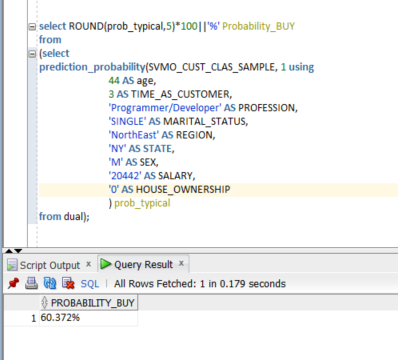


BUSINESS CASE 4

* Identify rows that are most atypical in the input dataset.
Consider each type of marital status to be separate, so the most anomalous rows per married status group should be returned.
Provide the top three attributes leading to the reason for the record being an anomaly.
The partition by clause used in the analytic version of the prediction_probability function will lead to separate models being built and scored for each marital status.

    ````
    <copy>
    col MARITAL_STATUS format a30
    select cust_id, MARITAL_STATUS, rank_anom, anom_det FROM
    (SELECT cust_id, MARITAL_STATUS, anom_det,
    	rank() OVER (PARTITION BY MARITAL_STATUS
    				 ORDER BY ROUND(ANOM_PROB,8) DESC,cust_id) rank_anom FROM
    (SELECT cust_id, MARITAL_STATUS,
    	PREDICTION_PROBABILITY(OF ANOMALY, 0 USING *)
    	  OVER (PARTITION BY MARITAL_STATUS) anom_prob,
    	PREDICTION_DETAILS(OF ANOMALY, 0, 3 USING *)
    	  OVER (PARTITION BY MARITAL_STATUS) anom_det
     FROM cust_data_one_class_pv
    ))
    where rank_anom < 3 order by 2, 3;
    </copy>
    ````

    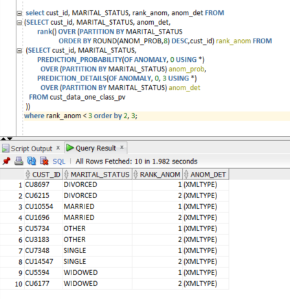

    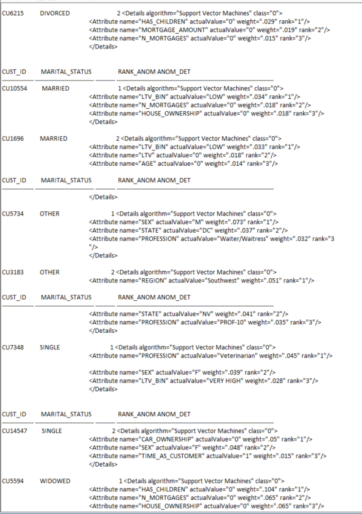

## Conclusion

With this practice, we can conclude that the SVM algorithm is very useful to solve problems of detection of anomalies of atypical cases and at the same time we can take advantage of it to be able to adequately qualify a prospect by calculating the probability of how typical it can become, what which becomes a powerful tool for salespeople and marketing people so they can close more sales and get more income for the company more quickly.


## Acknowledgements
* **Authors** - Adrian Castillo Mendoza, Milton Wan, Valentin Leonard Tabacaru, Rajeev Rumale.
* **Last Updated By/Date** -  Kamryn Vinson, April 2022.
