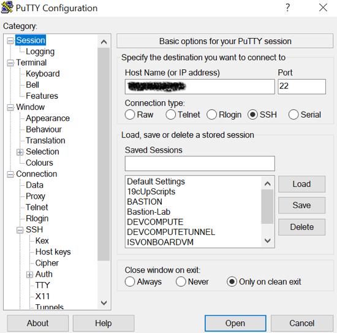
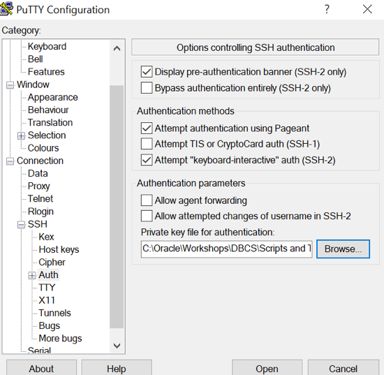
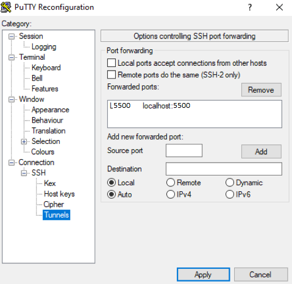
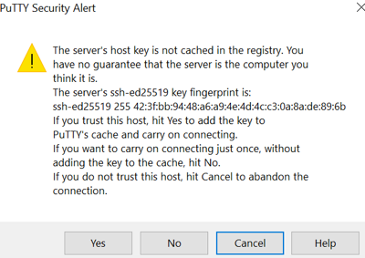

# Provision OCI resources

## Introduction

These labs will give you a basic understanding of the Oracle Base Database Service and many of the capabilities around administration and database development. This lab will walk you through creating a new Oracle Base Database Service instance. You will also connect into a Database image using the SSH private key and familiarize yourself with the image layout.

Estimated Time: 60 minutes

### Objectives

In this lab you will:
* Provision a Database System
* Connect to DB System Node via SSH
* Verify database connection using SQL*Plus

### Prerequisites

This lab assumes you have:
* Access to Oracle Cloud Infrastructure
    * Provided by the instructor for instructor-led workshops
* Access to a laptop or a desktop with
    * Microsoft Remote Desktop software
    * Putty or OpenSSH, PuttyGen, and web browser

## Task 1: Provision Database System

Please take a moment to watch the video below to learn how to perform the Database Lifecycle Task using the OCI Console, and then afterwards, follow the steps shown.

[Create Flex VM DB System] (youtube:_GwZYPRwLV8)

1. Use Copy Password to copy the initial password in your clipboard, and click on Launch Console. Use the same initial password when asked to reset the password, so you don't have to remember it. You are in the Oracle cloud console using the Workshop Details received.

    - Login URL 	
    - Tenancy name
    - Region
    - User name
    - Initial password
    - Compartment

2. Click on main menu **≡**, then **Oracle Database** > **Oracle Base Database**. Click **Create DB System**.

    - Select your compartment (default).
    - Select a shape type: Virtual Machine (default).
    - Name your DB system: **WS-DB**.
    - Select a shape: **VM.Standard.E4.Flex**. Click **Change Shape**. Set **Number of OCPUs per node: 1**.
    - Under Configure storage, click **Change storage**. Select **Logical Volume Manager**, **Storage Volume Performance: Balanced**.
    - Oracle Database software edition: **Enterprise Edition Extreme Performance**.
    - Generate SSH key pair, and save both Private Key and Public Key files on your computer. (optionally select Upload SSH key files to use your own id_rsa.pub public key).
    - Choose a license type: Bring Your Own License (BYOL).

2. Specify the network information.

    - Virtual cloud network: LLXXXXX-VCN
    - Client Subnet: Public Subnet **LLXXXXX-SUBNET-PUBLIC**
    - Hostname prefix: **db-host**

3. Click Next.

    - Database name: **WSDB**
    - Database version: 19c (default).
    - PDB name: **PDB011**.
    - Password: Use a strong password and write it down in your notes.
    - Select workload type: Transaction Processing (default).
    - Configure database backups: **Enable automatic backups**. Leave default values for backup retention and scheduling.

4. Click **Create DB System**.


## Task 2: DB Node SSH Connection

Please take a moment to watch the video below to learn how to perform the Database Lifecycle Task using the OCI Console, and then afterwards, follow the steps shown.

[Connect On-Premises SQL Dev Tool] (youtube:3bJ3JlpGlPo)

1. Wait for DB System to finish provisioning, and have status Available (refresh page).

2. On the DB System Details page, copy **Host Domain Name** in your notes. In the table below, copy **Database Unique Name** in your notes. Click **Nodes** on the left menu, and copy **Public IP Address** and **Private IP Address** in your notes. E.g.
    - Host Domain Name: pub.llXXXXXvcn.oraclevcn.com
    - Database Unique Name: WSDB_xxxxxx
    - Node Public IP Address: XX.XX.XX.XX
    - Node Private IP Address: 10.0.0.XX

3. Verify SSH connection from a Linux client. Change the permissions on the private key file you saved from DB System. Change `ssh-key-XXXX-XX-XX` with the private key file you saved on your computer. (Linux only)

    ````bash
    <copy>
    chmod 400 Downloads/ssh-key-XXXX-XX-XX.key
    </copy>
    ````

4. Connect to the DB Node using SSH. In OpenSSH, local port forwarding is configured using the -L option. Use this option to forward any connection to port 5500 on the local machine to port 5500 on your DB Node.  (Linux only)

    ````bash
    <copy>
    ssh -C -i Downloads/ssh-key-XXXX-XX-XX.key -L 5500:localhost:5500 opc@<DB Node Public IP Address>
    </copy>
    ````

5. Set SSH connection from a Windows client. Use PuttyGen from your computer to convert the private key file you saved on your computer to Putty `.ppk` format. Click on Conversions > **Import Key**. Open the private key. Click on Save Private Key and Yes to save without a passphrase. Use the same name for the new `.ppk` key file, add only the extension `.ppk`. (Windows only)

6. Connect to DB Node Public IP Address port 22. (Windows only)

    

7. Use the `.ppk` private key you converted with PuttyGen. (Windows only)

    

8. Create a SSH tunnel from Source port 5500 to Destination localhost:5500. Click **Add**. (Windows only)

    

9. Go back to Session, give it a name, and save it. When asked if you trust this host, click **Yes**. (Windows only)

    


## Task 3: Verify DB connection using SQL*Plus.

Please take a moment to watch the video below to learn how to perform the Database Lifecycle Task using the OCI Console, and then afterwards, follow the steps shown.

[Connect On-Premises SQL Dev Tool] (youtube:3bJ3JlpGlPo)

1. All Oracle software components are installed with **oracle** OS user. Use the substitute user command to start a session as **oracle** user.

    ````bash
    <copy>
    sudo su - oracle
    </copy>
    ````

2. Try to connect to your DB System database using SQL*Plus.

    ````bash
    <copy>
    sqlplus sys/<Strong Password>@<Database Unique Name> as sysdba
    </copy>
    ````

3. List pluggable databases.

    ````sql
    <copy>
    show pdbs
    </copy>
    ````

4. You will see `PDB011` in the list opened in `READ WRITE` mode. Exit SQL*Plus.

    ````sql
    <copy>
    exit
    </copy>
    ````

5. Connect directly to the pluggable database.

    ````bash
    <copy>
    sqlplus sys/<Strong Password>@db-host:1521/pdb011.<Host Domain Name> as sysdba
    </copy>
    ````

    Or

    ````bash
    <copy>
    sqlplus sys/<Strong Password>@db-host:1521/pdb011.$(domainname -d) as sysdba
    </copy>
    ````

6. Display the current container name.

    ````sql
    <copy>
    show con_name
    </copy>
    ````

7. List all users in PDB011.

    ````sql
    <copy>
    select username from all_users order by 1;
    </copy>
    ````

8. This pluggable database doesn't have Oracle Sample Schemas. Exit SQL*Plus.

    ````sql
    <copy>
    exit
    </copy>
    ````

    You may now **proceed to the next lab**.

## Acknowledgements

- **Author** - Valentin Leonard Tabacaru
- **Last Updated By/Date** - Valentin Leonard Tabacaru, DB Product Management, December 2022
