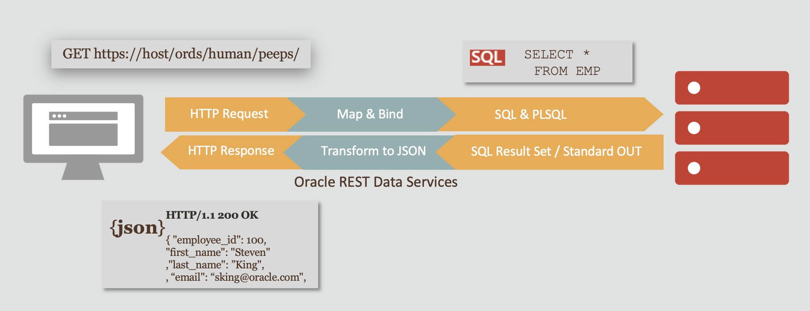

# Develop Mobile Apps using Oracle REST Data Services

## Workshop Overview

This Getting Started guide will get you ready for the Oracle REST Data Services (ORDS) Workshop labs. This workshop and the labs that follow support either Windows clients or Linux clients.

Oracle REST Data Services is a Java Enterprise Edition (Java EE) based data service that provides enhanced security, file caching features, and RESTful Web Services. Oracle REST Data Services also provides increased flexibility by supporting deployments using Oracle WebLogic Server, Apache Tomcat, and a standalone mode.

When you provision an Autonomous Database instance, by default Oracle REST Data Services (ORDS) is preconfigured and available for the instance. With the default ORDS, Oracle performs any required configuration, patching, and maintenance.

Watch the video below to see how Oracle REST Data Services enables mobile developers to benefit from Oracle Autonomous Database converged capabilities.

 >**Note** : Oracle Application Express is not a prerequisite for using Oracle REST Data Services.
If Oracle Application Express is installed and if RESTful services have been configured during the installation, then Oracle REST Data Services supports it, including executing the RESTful services defined in Oracle Application Express.

## Workshop Requirements

* Access to Oracle Cloud Infrastructure
    * Provided by the instructor for instructor-led workshops
* Access to a laptop or a desktop
* No previous knowledge of Oracle REST Data Services (ORDS) is required
* Android/iOS programming language knowledge is required

Our focus is to show how Oracle REST Data Services (ORDS) can be leveraged and used out-of-the-box on Oracle Autonomous Database, running on Oracle Cloud Infrastructure. In this workshop, we are not teaching programming skills to develop mobile applications for iOS and Android.

## Agenda

- **Lab 1 : Provision an Autonomous Database (ADW or ATP)**
- **Lab 2 : Develop Mobile Apps using Oracle REST Data Services**

Estimated Lab Time: 2 hours

## Acknowledgements

- **Author** - Valentin Leonard Tabacaru
- **Last Updated By/Date** - Valentin Leonard Tabacaru, Principal Product Manager, DB Product Management, Sep 2021

## Need Help?

Please submit feedback or ask for help using our [LiveLabs Support Forum](https://community.oracle.com/tech/developers/categories/livelabsdiscussions). Please click the **Log In** button and login using your Oracle Account. Click the **Ask A Question** button to the left to start a *New Discussion* or *Ask a Question*.  Please include your workshop name and lab name.  You can also include screenshots and attach files.  Engage directly with the author of the workshop.

If you do not have an Oracle Account, click [here](https://profile.oracle.com/myprofile/account/create-account.jspx) to create one.
