# Develop mobile apps with Oracle REST Data Services

## Introduction

dbNotify demo mobile application requires Oracle REST Data Services (ORDS) to communicate with your Oracle database. ORDS is preconfigured and available with all Oracle Autonomous Database instances, you just need to enable it. You can use Oracle Application Express (APEX) to enable and manage RESTful Web Services, and probably this is the easiest way. Oracle APEX also comes preconfigured and available with all Oracle Autonomous Database instances.

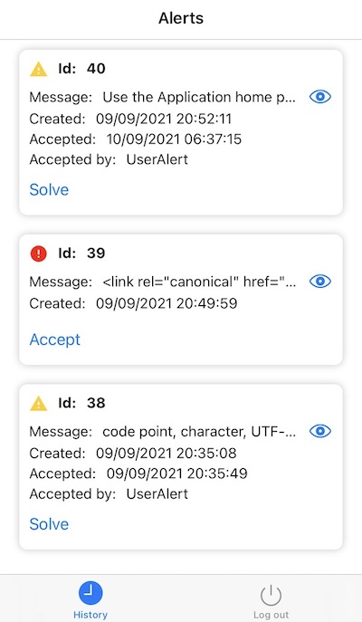

Estimated Time: 90 minutes

### Objectives
In this lab, you will:
* Create an APEX workspace
* Register APEX Schema with ORDS
* Create REST services and database objects
* Use ORDS into iOS and Android mobile applications
* Use APEX applications for backend management

### Prerequisites
* This lab requires completion of the Provision Autonomous Database lab in the Contents menu on the left.

## Task 1: Prepare APEX environment

1. On Autonomous Database Details page, under Tools section. Click **Open APEX**.

   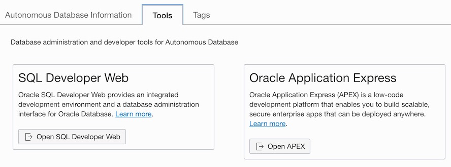

2. If you don't have an existing Workspace created, use the Administration Services link, to access APEX instance management, and the password for the Autonomous Database ADMIN user to login.

   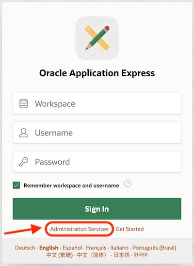

3. For this demo, it is mandatory to create a new Workspace.

   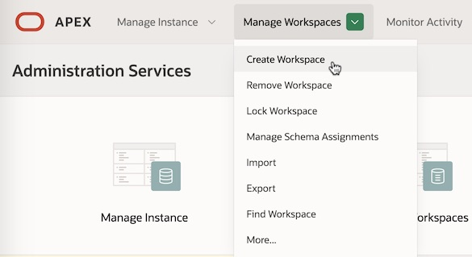

4. This workspace requires a certain Database User name and Workspace Name. Use `DBNOTIFY21` for both Database User name and Workspace Name. When setting the Password, make sure it is a strong one.

   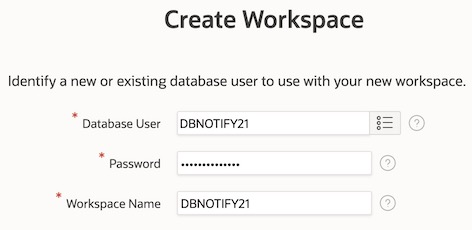

5. Sign out from Administration Services console, and sign into your new DBNOTIFY21 workspace.

   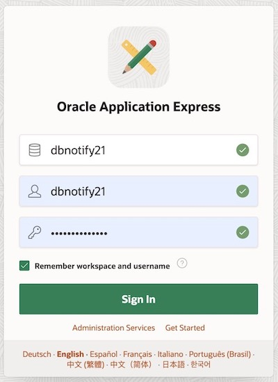

6. Navigate to SQL Workshop > **RESTful Services**. This is the ORDS management console.

   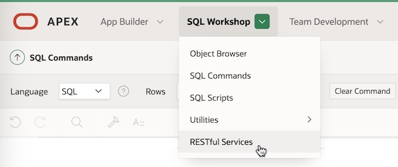

7. You should see a notification message saying `Schema not registered with ORDS`. Click **Register Schema with ORDS** button.

   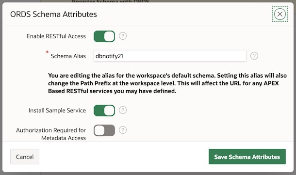

8. These are the default values for ORDS Schema Attributes. They are just fine, you can click **Save Schema Attributes** button.

   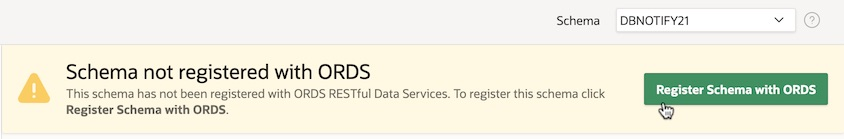

9. If everything is right, you will receive a confirmation message:
`Schema enabled for use with ORDS RESTful Services and sample RESTful Service successfully installed.`

## Task 2: Create database objects

1. Now you can access SQL Workshop > **SQL Commands**, to build the required RESTful Web Services.

   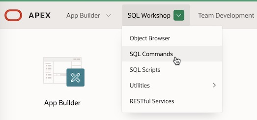

    >**Note** : If you want to speed up this lab, by skipping the steps that explain REST services and database objects, jump to **step 26** and run the SQL script to create them all in one go.

    >**Recommendation** : Read these steps to understand the database objects required by a simple mobile application to communicate with an Oracle Autonomous Database via ORDS, and execute only **step 26** in SQL Commands to create them all.

2. Create a table to store alert messages.

    ````sql
    <copy>
    create table "MOBILE_ALERTS"
        ("ID" NUMBER GENERATED BY DEFAULT ON NULL AS IDENTITY MINVALUE 1 MAXVALUE 9999999999999999999999999999
          INCREMENT BY 1 START WITH 1 CACHE 20 NOT NULL ENABLE,
        "MSG_TEXT" VARCHAR2(4000 CHAR) NOT NULL ENABLE,
        "CREATED" DATE NOT NULL ENABLE,
        "ACCEPTED" DATE,
        "ACCEPTED_BY" VARCHAR2(120 CHAR),
        "SOLVED" DATE,
        "SOLVED_BY" VARCHAR2(120 CHAR),
        CONSTRAINT "MOBILE_ALERTS_ID_PK" PRIMARY KEY ("ID")
      );
    </copy>
    ````

3. Create a trigger to insert date and time values in the messages table.

    ````sql
    <copy>
    create or replace trigger "MOBILE_ALERTS_BIU"
        before insert or update
        on MOBILE_ALERTS
        for each row
      begin
        if inserting then
          :new.created := SYSDATE;
        end if;
        if :old.accepted_by is null and :new.accepted_by is not null then
          :new.accepted := SYSDATE;
        end if;
        if :old.solved_by is null and :new.solved_by is not null then
          :new.solved := SYSDATE;
        end if;
      end;
    /
    </copy>
    ````

4. Create a trigger that will send to the mobile application any new message inserted into your table.

    ````sql
    <copy>
    create or replace TRIGGER "MOBILE_ALERTS_AI"
        after insert
        on MOBILE_ALERTS
        for each row
      declare
        vcRequestBody clob;
        vcTopic varchar2(32);
      begin
        SELECT SUBSTR(sys_context('USERENV','DB_NAME'), 0, INSTR(sys_context('USERENV','DB_NAME'), '_')-1)
          INTO vcTopic FROM dual;
        vcTopic := lower(vcTopic);

        apex_web_service.g_request_headers(1).name := 'Content-Type';
        apex_web_service.g_request_headers(1).value := 'application/json';

        apex_web_service.g_request_headers(2).name := 'Authorization';
        apex_web_service.g_request_headers(2).value := 'key=AAAA271MvR8:APA91bHBR9_ixZYCgoccYnFtQboMXFSqEqLY' ||
                                                       '88GbQvTQ__asZWRPkSrdDaXLa2MW3ogsnMUIytx2BIqgwyt2UxhD' ||
                                                       'IcKyfBEa8oewmkrtLzZQITn0fa7h37VR2Xr_--SZEoe0vN6VtFBb';

        vcRequestBody := apex_web_service.make_rest_request(
            p_url => 'https://fcm.googleapis.com/fcm/send',
            p_http_method => 'POST',
            p_body => '{"to":"/topics/' || vcTopic || '","data":{"data_key":"' || :new.msg_text || '"}}');

        vcRequestBody := apex_web_service.make_rest_request(
            p_url => 'https://fcm.googleapis.com/fcm/send',
            p_http_method => 'POST',
            p_body => '{"to":"/topics/' || vcTopic || '_iOS","content_available":true,"mutable_content":true' ||
                      ',"priority":"high","notification":{"title":"-","body":"-","sound":"default"},"data":{"data_value":"' ||
                      :new.msg_text || '","count_id":' || to_char(:new.id) || '}}');
      end;
    /
    </copy>
    ````

5. Create the RESTful service that returns solved messages from your table.

    ````sql
    <copy>
    begin
      ords.create_service(
          p_module_name => 'alert_web_service',
          p_base_path  => '/alerts/',
          p_pattern =>  'all_alerts/',
          p_items_per_page => 10,
          p_source  =>  'select ID, MSG_TEXT, to_char(CREATED, ''DD/MM/YYYY HH24:MI:SS'') CREATED,
                         to_char(ACCEPTED, ''DD/MM/YYYY HH24:MI:SS'') ACCEPTED, ACCEPTED_BY,
                         to_char(SOLVED, ''DD/MM/YYYY HH24:MI:SS'') SOLVED, SOLVED_BY from MOBILE_ALERTS
                         where SOLVED is not null ORDER BY ID DESC');
    end;
    /
    </copy>
    ````

6. Define a resource template that has a matching pattern based on the message ID.

    ````sql
    <copy>
    begin
      ords.define_template(
          p_module_name => 'alert_web_service',
          p_pattern => 'all_alerts/:id');
    end;
    /
    </copy>
    ````

7. Define a module handler that returns one message by ID.

    ````sql
    <copy>
    begin
      ords.define_handler(
          p_module_name => 'alert_web_service',
          p_pattern => 'all_alerts/:id',
          p_method => 'GET',
          p_items_per_page => 10,
          p_source  =>  'select ID, MSG_TEXT, to_char(CREATED, ''DD/MM/YYYY HH24:MI:SS'') CREATED,
                         to_char(ACCEPTED, ''DD/MM/YYYY HH24:MI:SS'') ACCEPTED, ACCEPTED_BY,
                         to_char(SOLVED, ''DD/MM/YYYY HH24:MI:SS'') SOLVED, SOLVED_BY from MOBILE_ALERTS
                         where ID = :id');
    end;
    /
    </copy>
    ````

8. Define a resource template that will be used to return messages that are not solved.

    ````sql
    <copy>
    begin
      ords.define_template(
          p_module_name => 'alert_web_service',
          p_pattern => 'open_alerts/');
    end;
    /
    </copy>
    ````

9. Define a module handler that returns the messages that are not solved.

    ````sql
    <copy>
    begin
      ords.define_handler(
          p_module_name => 'alert_web_service',
          p_pattern => 'open_alerts/',
          p_method => 'GET',
          p_items_per_page => 10,
          p_source  =>  'select ID, MSG_TEXT, to_char(CREATED, ''DD/MM/YYYY HH24:MI:SS'') CREATED,
                         to_char(ACCEPTED, ''DD/MM/YYYY HH24:MI:SS'') ACCEPTED, ACCEPTED_BY,
                         to_char(SOLVED, ''DD/MM/YYYY HH24:MI:SS'') SOLVED, SOLVED_BY from MOBILE_ALERTS
                         where SOLVED is null ORDER BY ID DESC');
    end;
    /
    </copy>
    ````

10. Create an Oracle REST Data Services role.

    ````sql
    <copy>
    begin
      ords.create_role('alert_web_service-admin');
    end;
    /
    </copy>
    ````

11. Create an Oracle REST Data Services privilege.

    ````sql
    <copy>
    begin  
      ords.create_privilege(
          p_name => 'alert_web_service-priv',
          p_role_name => 'alert_web_service-admin',
          p_label => 'Mobile Web Service',
          p_description => 'Provide access to mobile web service data');
    end;
    /
    </copy>
    ````

12. Associate the privilege with resources.

    ````sql
    <copy>
    begin
      ords.create_privilege_mapping(
          p_privilege_name => 'alert_web_service-priv',
          p_pattern => '/alerts/*');
    end;
    /
    </copy>
    ````

13. Create an OAuth client registration.

    ````sql
    <copy>
    begin
      oauth.create_client(
          p_name => 'alert_web_service Mobile Web Service Credentials',
          p_grant_type => 'client_credentials',
          p_privilege_names => 'alert_web_service-priv',
          p_support_email => 'support@example.com');
    end;
    /
    </copy>
    ````

14. Grant an OAuth client the specified role, enabling clients performing two-legged OAuth to access privileges requiring the role.

    ````sql
    <copy>
    begin
      oauth.grant_client_role(
         'alert_web_service Mobile Web Service Credentials',
         'alert_web_service-admin');
    end;
    /
    </copy>
    ````

15. Define a resource template that will be used to accept messages from the mobile application.

    ````sql
    <copy>
    begin
      ords.define_template(
          p_module_name => 'alert_web_service',
          p_pattern => 'accept_alert/');
    end;
    /
    </copy>
    ````

16. Define a module handler that will receive the request from the mobile application to accept a message, returning the corresponding status.

    ````sql
    <copy>
    begin
      ords.define_handler(
          p_module_name => 'alert_web_service',
          p_pattern => 'accept_alert/',
          p_method => 'POST',
          p_source_type => ords.source_type_plsql,
          p_source => 'BEGIN update MOBILE_ALERTS set ACCEPTED_BY = :vusername where ID = :vid;
                       EXCEPTION when others then :vstatus := 400; END;');
    end;
    /
    </copy>
    ````

17. Define a parameter for accept message module handler. The name of the parameter is used by the mobile application in the HTTP Header. The bind variable name is referred to in the SQL statement. The access method indicates the parameter is an input value. This parameter is used to send the user name from the mobile application to the database.

    ````sql
    <copy>
    begin
      ords.define_parameter(
          p_module_name => 'alert_web_service',
          p_pattern => 'accept_alert/',
          p_method => 'POST',
          p_name => 'USER_NAME',
          p_bind_variable_name => 'vusername',
          p_source_type => 'HEADER',
          p_param_type => 'STRING',
          p_access_method => 'IN');
    end;
    /
    </copy>
    ````

18. Define a second parameter for accept message module handler, to send the message ID from the mobile application to the database.

    ````sql
    <copy>
    begin
      ords.define_parameter(
          p_module_name => 'alert_web_service',
          p_pattern => 'accept_alert/',
          p_method => 'POST',
          p_name => 'ALERT_ID',
          p_bind_variable_name => 'vid',
          p_source_type => 'HEADER',
          p_param_type => 'STRING',
          p_access_method => 'IN');
    end;
    /
    </copy>
    ````

19. Define a third parameter for accept message module handler. The access method indicates the parameter is an output value. This parameter is used to send the request status from the database to the mobile application.

    ````sql
    <copy>
    begin
      ords.define_parameter(
          p_module_name => 'alert_web_service',
          p_pattern => 'accept_alert/',
          p_method => 'POST',
          p_name => 'X-APEX-STATUS-CODE',
          p_bind_variable_name => 'vstatus',
          p_source_type => 'HEADER',
          p_param_type => 'INT',
          p_access_method => 'OUT');
    end;
    /
    </copy>
    ````

20. Define a resource template that will be used to solve messages from the mobile application.

    ````sql
    <copy>
    begin
      ords.define_template(
          p_module_name => 'alert_web_service',
          p_pattern => 'solve_alert/');
    end;
    /
    </copy>
    ````

21. Define a module handler that will receive the request from the mobile application to solve a message, returning the corresponding status.

    ````sql
    <copy>
    begin
      ords.define_handler(
          p_module_name => 'alert_web_service',
          p_pattern => 'solve_alert/',
          p_method => 'POST',
          p_source_type => ords.source_type_plsql,
          p_source => 'BEGIN update MOBILE_ALERTS set SOLVED_BY = :vusername where ID = :vid;
                       EXCEPTION when others then :vstatus := 400; END;');
    end;
    /
    </copy>
    ````

22. Define a parameter for solve message module handler. The name of the parameter is used by the mobile application in the HTTP Header. The bind variable name is referred to in the SQL statement. The access method indicates the parameter is an input value. This parameter is used to send the user name from the mobile application to the database.

    ````sql
    <copy>
    begin
      ords.define_parameter(
          p_module_name => 'alert_web_service',
          p_pattern => 'solve_alert/',
          p_method => 'POST',
          p_name => 'USER_NAME',
          p_bind_variable_name => 'vusername',
          p_source_type => 'HEADER',
          p_param_type => 'STRING',
          p_access_method => 'IN');
    end;
    /
    </copy>
    ````

23. Define a second parameter for solve message module handler, to send the message ID from the mobile application to the database.

    ````sql
    <copy>
    begin
      ords.define_parameter(
          p_module_name => 'alert_web_service',
          p_pattern => 'solve_alert/',
          p_method => 'POST',
          p_name => 'ALERT_ID',
          p_bind_variable_name => 'vid',
          p_source_type => 'HEADER',
          p_param_type => 'STRING',
          p_access_method => 'IN');
    end;
    /
    </copy>
    ````

24. Define a third parameter for solve message module handler. The access method indicates the parameter is an output value. This parameter is used to send the request status from the database to the mobile application.

    ````sql
    <copy>
    begin
      ords.define_parameter(
          p_module_name => 'alert_web_service',
          p_pattern => 'solve_alert/',
          p_method => 'POST',
          p_name => 'X-APEX-STATUS-CODE',
          p_bind_variable_name => 'vstatus',
          p_source_type => 'HEADER',
          p_param_type => 'INT',
          p_access_method => 'OUT');
    end;
    /
    </copy>
    ````

25. You can verify that the client was registered and has requested access to the `alert_web_service-priv` privilege by querying the `USER_ORDS_CLIENTS` view. The `CLIENT_ID` and `CLIENT_SECRET` values represent the secret credentials for the OAuth client. These values must be noted and kept secure. You can think of them as the userid and password for the client application.

    ````sql
    <copy>
    select CLIENT_ID, CLIENT_SECRET from USER_ORDS_CLIENTS
        where NAME = 'alert_web_service Mobile Web Service Credentials';
    </copy>
    ````

26. Copy the code from [dbNotifyScript.sql](https://objectstorage.eu-zurich-1.oraclecloud.com/p/RHLAHUAUpU4TNciN1g7Sn4HgZcotNp_ffaA2Ls7MXC-TVTS7rA8K4TfowUC5Ugkw/n/zrzzjaap2wvk/b/web-files/o/dbNotifyScript.sql) and run it in SQL Commands.

27. Make sure you don't miss any line, or there are no extra characters. Click **Run** button.

   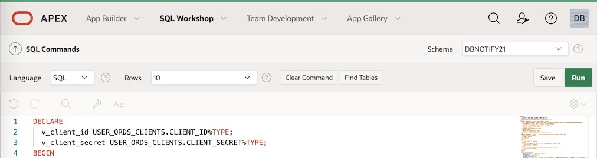

28. If everything is correct, you will get an output similar to this:

    >**Example** :
    ````
    Client ID = dzNFsdDeJS_J-jhADZBqMB..
    Client Secret = WL-Dr8Us9lftgdEkf-c6sl..
    ````

29. Save Client ID and Client Secret values, including the two dots at the end, you will need these strings in the dbNotify mobile application. These are the credentials to your RESTful Web Service, make sure you keep them in a safe place.

30. From SQL Workshop > **RESTful Services**, copy and paste `alert_web_service` URL in your notes (next to Client ID and Client Secret values), removing `alerts/` at the end. This URL is also needed in the dbNotify mobile application login.

    >**Example** :
    ````
    alert_web_service URL = https://xxxx9xxxxxx27x4-adbname.adb.eu-frankfurt-1.oraclecloudapps.com/ords/dbnotify21/
    ````

    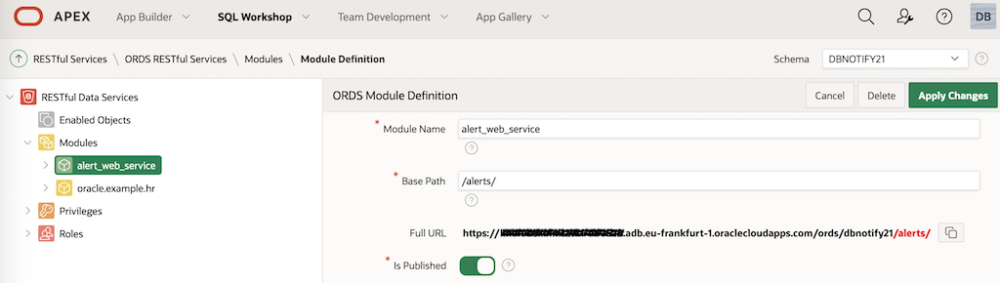

    >**Note** : `alert_web_service` URL may look too long, however, once you configure APEX instance to use your domain name, this URL looks like `https://your_domain.com/ords/dbnotify21/` and it is easy to remember.

## Task 3: Use ORDS into dbNotify mobile demo application

1. Install dbNotify application on your mobile phone: [App Store](https://apps.apple.com/us/app/dbnotify/id1583780865) or [Google Play](https://play.google.com/store/apps/details?id=com.hls.dbnotify).

2. Send Client ID, Client Secret and `alert_web_service` URL values to your mobile phone using notes or your email client.

3. Launch dbNotify mobile application, choose a user name, and copy/paste Client ID, Client Secret and `alert_web_service` URL in the last three fields. The user name must be short, alphanumeric, and without spaces. Click `Login`.

   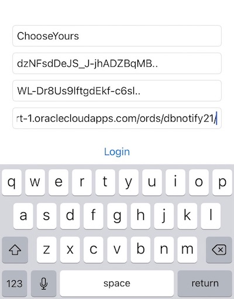

4. At this moment you have no alerts in your application. Alerts can be generated by inserting any text in `MSG_TEXT` column of `MOBILE_ALERTS` table from `DBNOTIFY21` schema.

   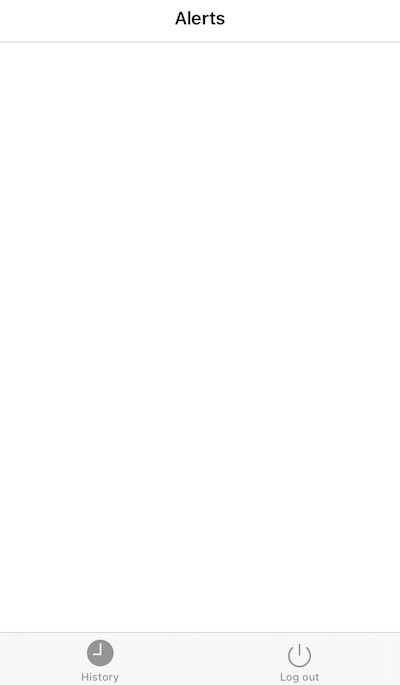

5. Use App Builder Import tool to import [MobileAlerts.sql](https://objectstorage.eu-zurich-1.oraclecloud.com/p/RHLAHUAUpU4TNciN1g7Sn4HgZcotNp_ffaA2Ls7MXC-TVTS7rA8K4TfowUC5Ugkw/n/zrzzjaap2wvk/b/web-files/o/MobileAlerts.sql) Mobile Alerts application in your Application Express instance.

6. Launch Mobile Alerts Apex application, and create your first alert.

   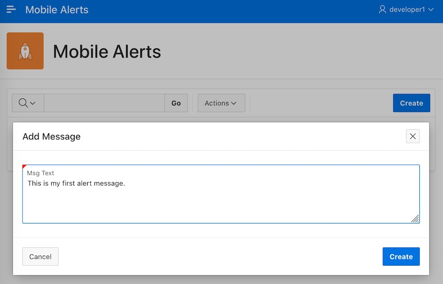

7. When a new message is inserted in `MOBILE_ALERTS` table, this generates an alert on your mobile phone.

   

8. Open the alert in dbNotify mobile application.

   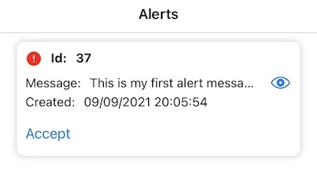

9. Message is truncated, if you want to see the entire message click view icon on the right (eye icon).

   

10. An alert can have three stages: new, accepted, and solved. To accept an alert, click **Accept**.

   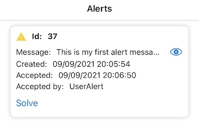

11. After being accepted, to solve an alert, click **Solve**. Once solved, the alert message goes into History.

   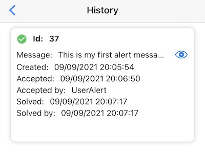

12. It is a good practice to test the web service before using it in application development. The easiest way to do it is with cURL (Client URL). This is a `POST` call to the token endpoint of the ORDS instance using the client credentials retrieves the access token that can be used to perform REST API calls to your protected web service.

    ````bash
    <copy>
    curl -i --user dzNFsdDeJS_J-jhADZBqMB..:WL-Dr8Us9lftgdEkf-c6sl.. --data "grant_type=client_credentials" https://xxxx9xxxxxx27x4-adbname.adb.eu-frankfurt-1.oraclecloudapps.com/ords/dbnotify21/oauth/token
    </copy>
    ````

13. The response has a JSON format containing the access token, the type, and the time this token is valid for in seconds.

    ````json
    {"access_token":"G9xxKxxHxxU99xAx#XXXXX","token_type":"bearer","expires_in":3600}
    ````

14. Using the access token retrieved, perform a `GET` call to `alert_web_service` module `open_alerts` template to retrieve all unsolved messages in a JSON document that contains an array.

    ````bash
    <copy>
    curl -i -H "Authorization: Bearer G9xxKxxHxxU99xAx#XXXXX" https://xxxx9xxxxxx27x4-adbname.adb.eu-frankfurt-1.oraclecloudapps.com/ords/dbnotify21/alerts/open_alerts/
    </copy>
    ````

15. If you want to change the status of one unaccepted message to `Accepted`, perform a `POST` call to `alert_web_service` module `accept_alert` handler, including two parameters: user name and message ID.

    ````bash
    <copy>
    curl -H "Authorization: Bearer G9xxKxxHxxU99xAx#XXXXX" -d "vusername=NotifyUser&vid=1" -X POST https://xxxx9xxxxxx27x4-adbname.adb.eu-frankfurt-1.oraclecloudapps.com/ords/dbnotify21/alerts/accept_alert/
    </copy>
    ````

16. If you want to change the status of one accepted but unsolved message to `Solved`, perform a `POST` call to `alert_web_service` module `solve_alert` handler, including two parameters: user name and message ID.

    ````bash
    <copy>
    curl -H "Authorization: Bearer G9xxKxxHxxU99xAx#XXXXX" -d "vusername=AlertUser&vid=1" -X POST https://xxxx9xxxxxx27x4-adbname.eu-frankfurt-1.oraclecloudapps.com/ords/dbnotify21/alerts/solve_alert/
    </copy>
    ````

17. At this point, if all previous steps have been completed successfully, you are ready to start developing your own mobile application using your favorite mobile platform and programming language.

### Demo mobile application current limitations

* One dbNotify application can be used per cloud tenancy.
* Message text is up to 4000 characters long.


## Acknowledgements

- **Author** - Valentin Leonard Tabacaru
- **Last Updated By/Date** - Valentin Leonard Tabacaru, March 2023
