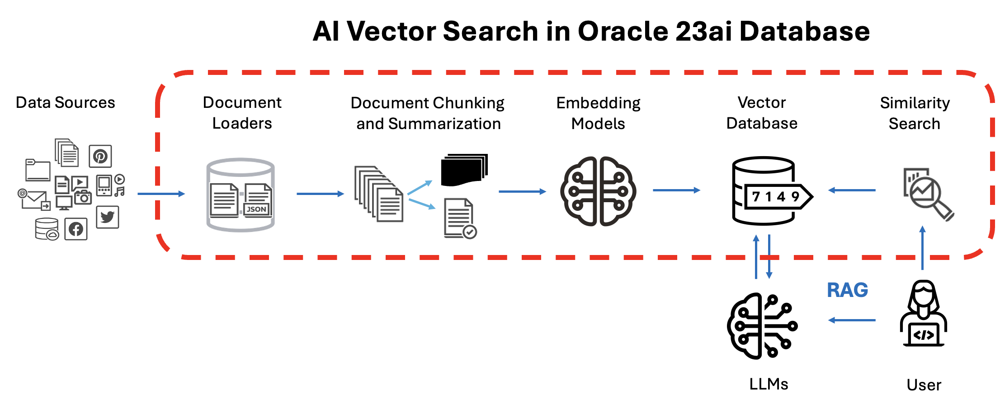

# AI Vector Search - Complete RAG applications with Oracle AI Vector Search and PLSQL

## About this Workshop

Retrieval Augmented Generation (RAG) plays a pivotal role in Generative AI, offering significant advantages to Gen AI applications. Here are three compelling reasons why integrating RAG into your Gen AI setup is paramount:

1. Minimize Hallucinations:  Large Language Models (LLMs) may generate inaccurate or irrelevant responses if they lack training on prompts. Re-training LLMs to align with desired responses incurs substantial costs.  
2. Safeguarding Confidentiality: LLMs are trained on publicly available information from the internet – they do not know about your company specific data. Do not send your company specific information across the internet as you are giving away your private information to a 3rd party.  Instead keep your enterprise data within your realm by using local LLMs within your data center or cloud tenancy.
3. Up to date information: LLMs are trained up to a certain date [eg Sept 2021 for ChatGPT], newer events/facts are unknown. The LLM can provide responses based on up-to-date facts in the form of prompts provided by your vector database.  This means that your LLM has the benefit of the latest data from your company without the need to train the LLM on your company data.

RAG addresses these challenges by enabling the inclusion of vital context alongside prompts provided to LLMs. In our laboratory scenario, this context comprises business information stored in Oracle Database 23ai as vectors.Leveraging Oracle PLSQL & the Oracle AI Vector Search functionality extend your application capabilities seamless retrieval of context.

In this workshop, you'll construct a straightforward yet robust RAG application utilizing Oracle AI Vector Search using PLSQL code. This application serves as a versatile blueprint applicable across various use cases, with Oracle Database 23ai serving as an optimal vector store for storing relevant context.

Estimated Time:  15 min

### **About Oracle AI Vector Search**

Oracle AI Vector Search is a feature of Oracle Database 23ai.  It allows the  searching of AI vectors in the database.  Oracle AI Vector Search supports fast search with a number of indexing strategies and can handle very large amounts of vector data.

AI Vector Search makes it possible for LLMs to query private business data using a natural language interface and helps LLMs provide more accurate and relevant results. In addition, AI Vector Search allows developers to easily add semantic search capabilities to both new applications and existing applications.

### Objectives

The labs in this workshop focus on the following:
* Get familiar with the new Vector Datatype & PLSQL packages for manipulating vector data and operations
* Using  PLSQL for developing applications with Large Language Models (LLMs)
* Using Oracle AI Vector Search to store and search vectors in Oracle Database 23ai
* Access to popular LLMs to generate response
* Run a complete sample application to implement all learnings

### Prerequisites

- An Oracle LiveLabs Account

## Learn More

See below for more information on Oracle Database 23ai and Oracle AI Vector Search

* [Oracle Database 23ai Documentation](https://docs.oracle.com/en/database/oracle/oracle-database/)
* [Oracle AI Vector Search User's Guide](https://docs.oracle.com/en/database/oracle/oracle-database/23/vecse/index.html)
* [Oracle AI Vector Search Blog](https://blogs.oracle.com/database/post/oracle-announces-general-availability-of-ai-vector-search-in-oracle-database-23ai)

You may now [proceed to the next lab](#next).

## Acknowledgements
* **Authors** - Milton Wan, Vijay Balebail, Douglas Hood
* **Last Updated By/Date** -  Milton Wan, May 2024
