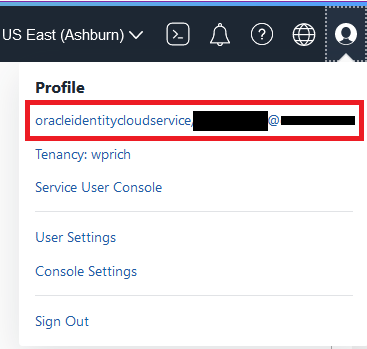
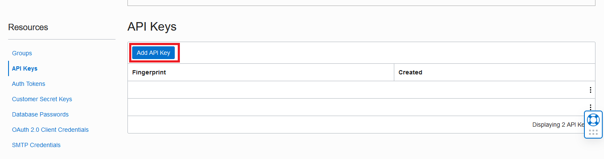
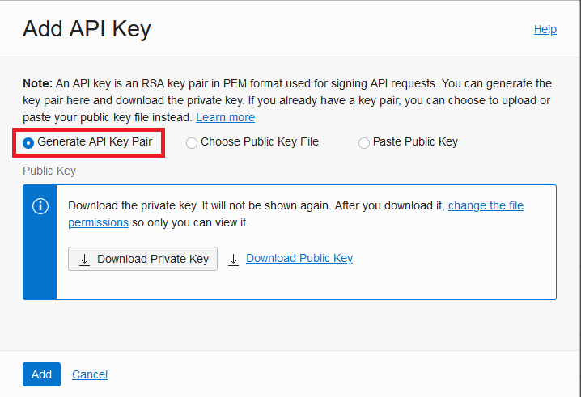
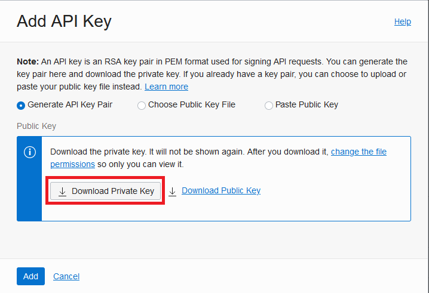
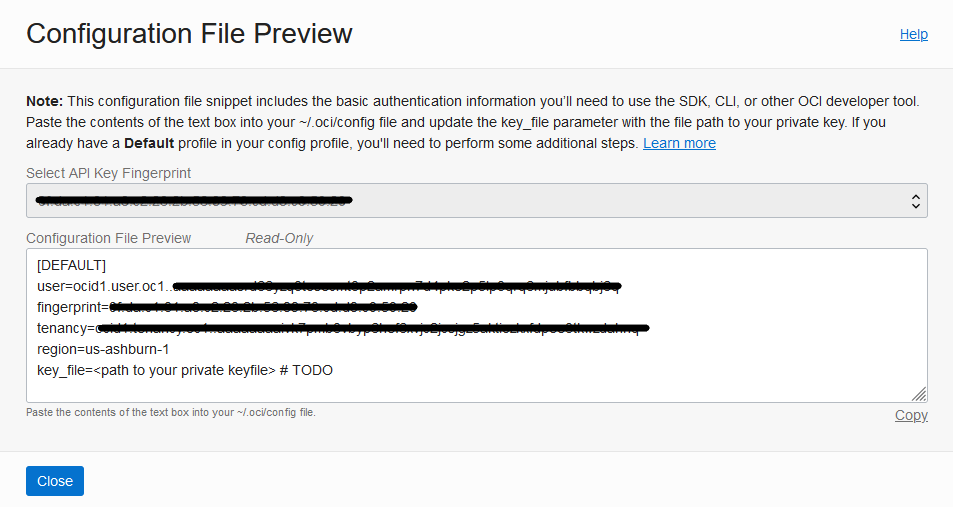
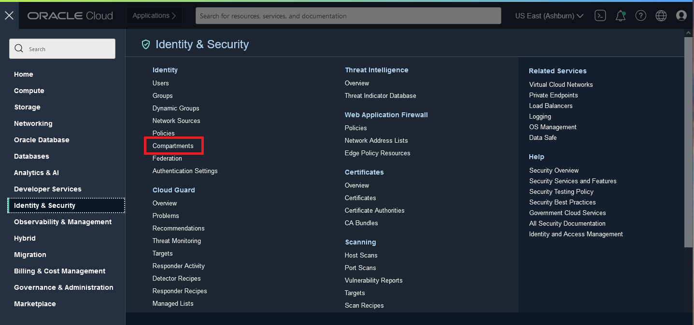
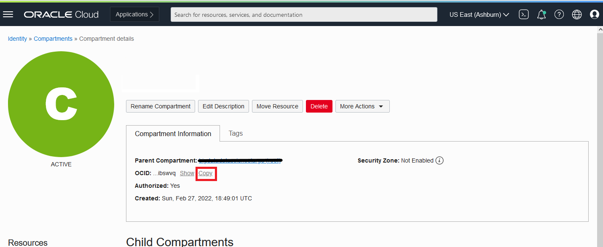
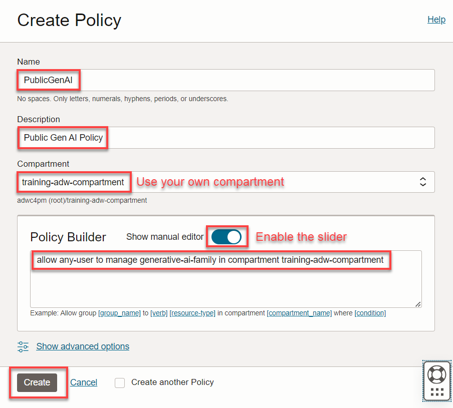

# Lab 0: Setup to access OCI Generative AI Service

## Introduction

In this lab you will setup access from ADB to OCI GenAI service.

Oracle's GenAI service is an LLM service from Oracle Cloud Infrastructure (OCI). The OCI GenAI service provides access to several LLMs that you can pick from.  To enable client applications to access these services, authentication is required. This is accomplished through public and private api keys. The public key is created in the user cloud account, while the corresponding private key is stored on the server where the application runs. 

*Estimated Lab Time*: 10 minutes

### Objectives:
* Learn the basic components of security authentication and authorization to use OCI GenAI service.

### Prerequisites:
* You need an Oracle Cloud tenancy and the ability to grant privileges to groups

## **Task 1:** Get your credential information to access OCI APIs
### Fingerprint and private key

1. Open the OCI Console, click the **Profile** icon, then select **User Settings**.

  

2. The User Details page opens. Under Resources, on the lower left side of the page, select **API Keys**

  

3. Click the **Add API Key** button

  

4. The Add API Key dialog box opens. Select option: **Generate API Key Pair**

  

5. Click the **Download Private Key** button and save the file to your local computer. Remember the location where you saved the private key file (username-date.pem).

  

6. Click the **Add** button in the **Add API Key** dialog. The *Configuration File Preview* dialog opens. Follow the instructions in the **Note** to copy the contents of the text box into a file.
   
  

7. Click **Close** on the *Configuration File Preview* dialog

## **Task 2:** Copy your Compartment OCID

1. Go to the OCI Console and use the hamburger menu to select **Identity & Security**, then, under *Identity*, select **Compartments**.
  

2. The *Compartments* page is displayed and lists all of the compartments. If you are using a new trial tenancy, you will have a root compartment. Click the name of the compartment where you will running this lab. 

3. On the *Compartment details* page, click **Copy** next to the compartment OCID.
  

4. Save the compartment OCID for use later.

## **Task 3:** Create policy to enable access to OCI GenAI

Create an OCI policy to enable access to OCI GenAI service.
Create a policy that will allow you to use OCI GenAI within your previously defined compartment. Make sure your policy uses the compartment where your database is deployed. The policy will be necessary for the database to interact with OCI Generative AI.

1. From the Console, open the Navigation menu and click Identity & Security. Under Identity, click Policies.

2. Click on Create policy and paste the following into the appropriate fields:

Note: Slide the Show manual editor control to display the text field in order to paste the policy.

Name: PublicGenAI

Description: Public Gen AI Policy

Compartment: select your own compartment

Policy: allow any-user to manage generative-ai-family in compartment \<your compartment>

3. Click Create.

 

Note: This policy allows any database in the specified compartment to access OCI Generative AI service. In a production environment, ensure your policy's scope is minimally inclusive.

## **Task :4** Create the credentials for ADB to access OCI GenAI service

1. Open a terminal window in your noVNC remote desktop
2. Change directory to /home/oracle/AIdemo
3. Using an editor such as vi, edit and replace the credential information below with your information in the file create_credential.sql:
   
   * user\_ocid
   * tenancy\_ocid
   * compartment_ocid
   * private\_key - *(Important Note: Put the private key all on a single line.)*
   * fingerprint

    ```
    <copy>
    declare
      jo json_object_t;
    begin
      jo := json_object_t();
      jo.put('user_ocid','ocid1.user.oc1..aabbalbbaa1112233aabb...');
      jo.put('tenancy_ocid','ocid1.tenancy.oc1..aaaaalbbbb1112233aaaab...');
      jo.put('compartment_ocid','ocid1.compartment.oc1..ababalabab1112233ababa...');
      jo.put('private_key','AAAaaaBBB11112222333...AAA111AAABBB222aaa1a...');
      jo.put('fingerprint','01:1a:a1:aa:12:a1:12:1a:ab:12:01:ab:...');
      dbms_vector.create_credential(
        credential_name   => 'GENAI_CRED',
        params            => json(jo.to_string));
    end;
    /
    </copy>
    ```
4. Go to /home/oracle/AIdemo
5. sqlplus vector/vector@freepdb1
6. SQL> @dropcred.sql
7. SQL> @create_cred.sql
   
