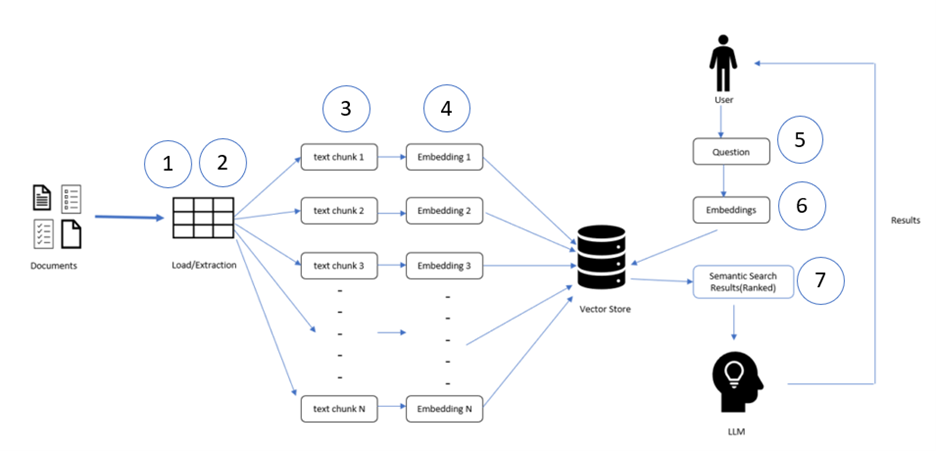
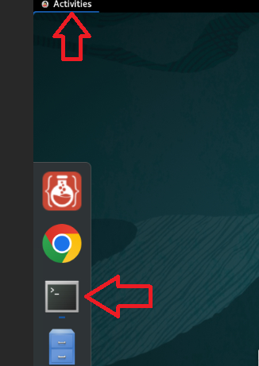
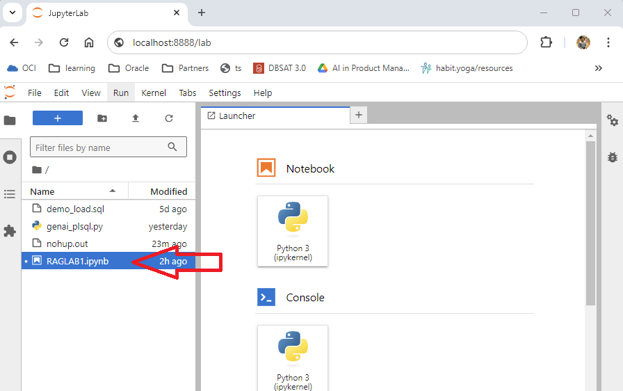
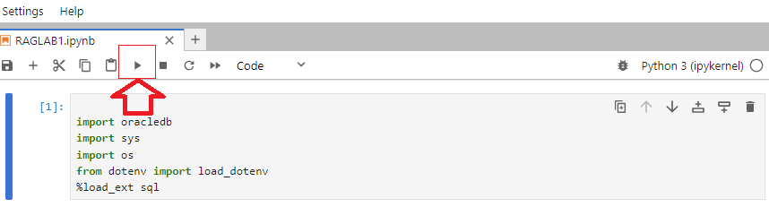

# Lab 1: Build and Run the RAG Application with Oracle AI Vector Search and PLSQL

## Introduction

A typical RAG application design has 7 steps and requires a vector store.  Oracle Database 23ai will be used as the vector store. In this lab, we will use documents as the source data, but you can apply these steps to other data types including audio and video.
1.	Load your document.
2.	Transform the document to text.
3.	Chunk the text document into smaller pieces.
4.	Using an embedding model, embed the chunks as vectors into Oracle Database 23ai.
5.	Ask the question for the prompt, the prompt will use the same embedding model to vectorize the question.
6.	The question will be passed to Oracle Database 23ai and a similarity search is performed on the question.
7.	The results (context) of the search and the prompt are passed to the LLM to generate the response.

 

Estimated Time: 10 min

To simplify and complete this application in less than 10 minutes, the workshop comes with a sandbox instance which has all the software and code used in the labs.  The sandbox instance comes with Oracle Database 23ai Free edition installed along with SQLPlus, SQL Developer, and environment setting needed to connect to LLMs and Oracle database.  We will have you execute the important steps for the RAG application step by step by running the code snippet provided in Jupyter notebook.

### Objectives

In this lab, you will:
* Use PLSQL to build the RAG application with Oracle Database 23ai

### Prerequisites

* Environment with Oracle Database 23ai

## Task 1: Launch Jupyter notebook, check connection to the database, create tables

1. From the Activities menu, open a terminal window if it is not already opened.

   

2. From the terminal OS prompt type the following to launch jupyter notebook:

    ```
        $ cd /home/oracle/aidemo
        $ jupyter lab
    ```

3. Open the notebook **RAGLAB1.ipynb**. You can double click or right-click and select **Open**.

    


    Now you're ready to run each code snippet in sequence starting from the top in Jupyter.  To run a code snippet, select the cell of the code and click **Run** to execute the code.  You don't need to edit any of the code for this application to run.

    When the code snippet has completed running a number will appear in the square brackets. You can then proceed to the next cell and code snippet.  Some of the code will print an output so you can get feedback. Pay attention to the 7 steps for RAG as you proceed. At any time you can also re-run the code snippets in the Jupyter cell.

    In the current environment all the required libraries and modules have already been installed for this RAG application. We are going to use the **oracledb** python driver which is the latest driver release for the 23ai database.  We no longer need the **cx\_oracle** driver.


    *`from dotenv import load_dotenv`* statement will load environment variables from .env file on the current directory.  This will have the connection and authentication information.

    *`%load_ext sql`* is used to run sql statements from Jupyter notebook,  it is the part of the Jupyter magic SQL extension.


    Let's import the libraries.

4. Select the code snippet and click **Run** in Jupyter. A blue line indicates the cell is selected.

    

    ```sql
    # Import libraries and modules

    import oracledb
    import sys
    import os
    from dotenv import load_dotenv
    %load_ext sql

    ```

5. This code will establish the connection to Oracle Database 23ai using the oracledb driver. Select the code snippet and click **Run**.

    ``` 
    # Load environment variables

    load_dotenv()
    username = os.getenv("username")
    password = os.getenv("password")
    dsn = os.getenv("dsn")
    COMPARTMENT_OCID = os.getenv("COMPARTMENT_OCID")
    print("The database user name is:",username)
    print("Database connection information is:",dsn)

    # Connect to the database
    try: 
        conn23ai = oracledb.connect(user=username, password=password, dsn=dsn)
        print("Connection successful!")
    except Exception as e:
        print("Connection failed!")

    ```

6. This code will create a table named *MY\_BOOKS* in the VECTOR schema. We will use this table to load the original PDF file as a BLOB. Select the code snippet and click **Run**.

    ``` 
    %%sql

    CREATE TABLE IF NOT EXISTS "VECTOR"."MY_BOOKS"
        ( 
        ID              INTEGER GENERATED BY DEFAULT ON NULL AS IDENTITY 
            ( START WITH 1 CACHE 20 ) PRIMARY KEY, 
        file_name      VARCHAR2 (900) , 
        file_size      INTEGER , 
        file_type       VARCHAR2 (100) , 
        file_content    BLOB
        ) 
        LOGGING 
    ```

7. This code will create a table named *VECTOR\_STORE* in the VECTOR schema. This is used to store the corresponding text chunks and embeddings in a column of vector datatype. Select the code snippet and click **Run**.

    ``` 
    %%sql

    CREATE TABLE IF NOT EXISTS VECTOR_STORE
      (	"DOC_ID" NUMBER(*,0) NOT NULL ENABLE, 
      "EMBED_ID" NUMBER, 
      "EMBED_DATA" VARCHAR2(4000 BYTE), 
      "EMBED_VECTOR" VECTOR,
        FOREIGN KEY (DOC_ID) REFERENCES MY_BOOKS(ID)
      )

    ```

## Task 2: Understanding `DBMS_VECTOR_CHAIN` package.


**1 - Load the document**


1. Using the below code we will load the file into the table **MY\_BOOKS**. The document in our use case is in PDF format.  The file 'Release\_notes.pdf' is already present on the OS, and directory  **VEC\_DUMP** has been precreated to point to '/home/oracle/'.  Select the code snippet and click **Run**.

    ```
    %%sql 
    insert into my_books(file_name,file_size,file_type,file_content)  values
    ('Release_notes.pdf',dbms_lob.getlength(to_blob(bfilename('VEC_DUMP', 'Release_notes.pdf'))),'PDF', to_blob(bfilename('VEC_DUMP', 'Release_notes.pdf')))

    ```

2. Commit the inserted rows.  Select the cell and click **Run**.

    ```
    %%sql commit
    ```

**2 - Transform the document to text**

3. Use package **DBMS\_VECTOR\_CHAIN.utl\_to\_text** to convert the BLOB column to plain text.  The following statement shows the output of the first 2000 chars from the PDF.

    ``` 
    %%sql
    select id, SUBSTR( REPLACE (REPLACE(TRIM( dbms_vector_chain.utl_to_text(dt.file_content)),'  ',' ') , CHR(10), ''), 1, 2000) from my_books dt 
    ```

**3 - Split the text into chunks**

4. Use package **DBMS\_VECTOR\_CHAIN.utl\_to_chunks** to convert the BLOB into plain text and then show the first three text chunks.  Click **Run** to execute the code.

    ``` 
    %%sql 
    SELECT ct.* from 
    my_books dt, 
    dbms_vector_chain.utl_to_chunks(dbms_vector_chain.utl_to_text(dt.file_content)) ct where rownum < 4
    ```

    The output has the following columns:

    • chunk\_id specifies the chunk ID for each chunk

    • chunk\_offset specifies the original position of each chunk in the source document, relative to the start of document which has a position of 1

    • chunk\_length specifies the character length of each chunk

    • chunk\_data displays text pieces from each chunk.

**4 - Converting the single JSON column into multiple columns**

5. JSON\_VALUE is function in Oracle database for string manipulation of JSON datatype.  We will convert single JSON column into multiple columns.  Click **Run** to execute the code.

    ``` 
    %%sql
    SELECT 
    JSON_VALUE(C.column_value, '$.chunk_id' RETURNING NUMBER) AS id,
    JSON_VALUE(C.column_value, '$.chunk_offset' RETURNING NUMBER) AS pos,
    JSON_VALUE(C.column_value, '$.chunk_length' RETURNING NUMBER) AS chunk_length,
    SUBSTR( REPLACE (REPLACE(TRIM( JSON_VALUE(C.column_value, '$.chunk_data')),'  ',' ') , CHR(10), ''), 1, 2000) AS chunk_txt 
    FROM my_books dt, dbms_vector_chain.utl_to_chunks(dbms_vector_chain.utl_to_text(dt.file_content)) C where rownum < 4
    ```


**Tune the text chunk size for improved results and accuracy.**

6. We can tweak the chunk size parameter, in this example we are setting MAX words per text chunk to 300.  This averages to a text chunk size of 1600 characters.  The below SQL will show the first 4 records.

    ``` 
    %%sql

    SELECT 
        JSON_VALUE(C.column_value, '$.chunk_id' RETURNING NUMBER) AS id,
        JSON_VALUE(C.column_value, '$.chunk_offset' RETURNING NUMBER) AS pos,
        JSON_VALUE(C.column_value, '$.chunk_length' RETURNING NUMBER) AS chunk_length,
        JSON_VALUE(C.column_value, '$.chunk_data') AS chunk_txt
    FROM 
        my_books dt, 
        dbms_vector_chain.utl_to_chunks(
            dbms_vector_chain.utl_to_text(dt.file_content),
            JSON('{"by":"words","max":"300","overlap":"0","split":"recursively","language":"american","normalize":"all"}')
        ) C where rownum <= 4

    ```

## Task 3: Get familiar with creating vector embeddings


ONNX, which stands for Open Neural Network Exchange, is an open-source format designed to represent deep learning models. It aims to provide interoperability between different deep learning frameworks, allowing models trained in one framework to be used in another without the need for extensive conversion or retraining.

Using ONNX models in Oracle Database 23ai to create vectors can be more secure, scalable and convenient than creating vectors outside the database. Currently the vector_embedding SQL function is significantly slower than creating vectors outside of the database with local embedding models.


**Load two ONNX models into the database**

1. Oracle AI Vector Search supports ONNX compliant models for vector embedding and search. Load two ONNX models into the database. The models are loaded from the **VEC\_DUMP** directory and stored in the SGA. The models are loaded into the SGA and persisted.

    ```
    # Create a cursor
    cursor = conn23ai.cursor()
    procedure_query = """
    BEGIN
      DBMS_DATA_MINING.DROP_MODEL(model_name => 'TINYBERT_MODEL', force => true);
      DBMS_DATA_MINING.DROP_MODEL(model_name => 'All_MINILM_L6V2MODEL', force => true);
      DBMS_VECTOR.LOAD_ONNX_MODEL('VEC_DUMP','tinybert.onnx','TINYBERT_MODEL',json('{"function":"embedding","embeddingOutput":"embedding",'||'"input":{"input":["DATA"]}}'));
      DBMS_VECTOR.LOAD_ONNX_MODEL( 'VEC_DUMP', 'all-MiniLM-L6-v2.onnx', 'All_MINILM_L6V2MODEL', JSON('{"function" : "embedding",'||'"input":{"input":["DATA"]}}'));
    End;
    """
    # Execute the procedure creation query
    cursor.execute(procedure_query)
    print ("Load the models for embedding and vector search");

    ```
 

2. To verify the model exists in database run the following statement.

    ```
    %%sql
    SELECT MODEL_NAME, MINING_FUNCTION,
    ALGORITHM, ALGORITHM_TYPE, round(MODEL_SIZE/1024/1024) MB FROM user_mining_models 
    ```
**Demonstrate and compare vector embedding using different models**
3. Create vector embeddings for text chunks using the Tinybert model, and observe the text chunks and vectors.

    ```
    %%sql 
    select file_name,file_size,text_chunk , embed_vector from 
    my_books dt
                CROSS JOIN TABLE(
                    dbms_vector_chain.utl_to_embeddings(
                        dbms_vector_chain.utl_to_chunks(
                            dbms_vector_chain.utl_to_text(dt.file_content), 
                            json('{"by":"words","max":"300","split":"sentence","normalize":"all"}')
                        ),
                        json('{"provider":"database", "model":"TINYBERT_MODEL"}')
                    )
                )  t
                CROSS JOIN JSON_TABLE(
                    t.column_value, 
                    '$[*]' COLUMNS (
                        id NUMBER PATH '$.embed_id',
                        text_chunk VARCHAR2(4000) PATH '$.embed_data',
                        embed_vector CLOB PATH '$.embed_vector'
                    )
                ) AS et where rownum < 2
    ```

    Now by just changing the model from tinybert\_model to All\_MINILM\_L6V2MODEL, you will have different vectors for the same document. Each of the models are designed to search the vectors and get the best match according to their algorithms.  Tinybert has 128 dimensions while all-MiniL2-v2 has 384 dimensions.  Usually, the greater the number of dimensions, the higher the quality of the vector embeddings.  A larger number of vector dimensions also tends to result in slower performance.   You should choose an embedding model based on quality first and then consider the size and performance of the vector embedding model.  You may choose to use larger vectors for use cases where accuracy is paramount and smaller vectors where performance is the most important factor.


4. Create vector embedding for text chunk using All\_MINILM\_L6V2MODEL model, and observe the text chunk and vectors.

    ```
    %%sql 
    select file_name,file_size,text_chunk , embed_vector from 
    my_books dt
                CROSS JOIN TABLE(
                    dbms_vector_chain.utl_to_embeddings(
                        dbms_vector_chain.utl_to_chunks(
                            dbms_vector_chain.utl_to_text(dt.file_content), 
                            json('{"by":"words","max":"300","split":"sentence","normalize":"all"}')
                        ),
                        json('{"provider":"database", "model":"All_MINILM_L6V2MODEL"}')
                    )
                )  t
                CROSS JOIN JSON_TABLE(
                    t.column_value, 
                    '$[*]' COLUMNS (
                        id NUMBER PATH '$.embed_id',
                        text_chunk VARCHAR2(4000) PATH '$.embed_data',
                        embed_vector CLOB PATH '$.embed_vector'
                    )
                ) AS et where rownum < 2
    ```


## Task 4: Creating vector embedding using PLSQL packages and storing in vector store

In the below SQL statement we are storing DOC\_ID from MY\_BOOKS table and its corresponding text chunks and vector embedding in the columns embed\_data & embed\_vector of table vector\_store.  The statement converts the document to text chunks and chunks to vector embeddings in a single insert statement.

Note that we are using the local ONNX model for embedding, this ensures no data is sent outside the database which is more secure and faster to create embedding as there are no API calls across internet.

**1 - Create the vector embedding** 

1. Create the vector embedding and storing the embeddings by selecting the cell and clicking **Run**.

    ```
    %%sql 
    INSERT into VECTOR_STORE ( doc_id, embed_id, embed_data, embed_vector) 
    select  id, embed_id, text_chunk ,embed_vector 
    from my_books dt
                CROSS JOIN TABLE(
                    dbms_vector_chain.utl_to_embeddings(
                        dbms_vector_chain.utl_to_chunks(
                            dbms_vector_chain.utl_to_text(dt.file_content), 
                            json('{"by":"words","max":"300","split":"sentence","normalize":"all"}')
                        ),
                        json('{"provider":"database", "model":"TINYBERT_MODEL"}')
                    )
                )  t
                CROSS JOIN JSON_TABLE(
                    t.column_value, 
                    '$[*]' COLUMNS (
                        embed_id NUMBER PATH '$.embed_id',
                        text_chunk VARCHAR2(4000) PATH '$.embed_data',
                        embed_vector CLOB PATH '$.embed_vector'
                    )
                ) AS et 
    ```

2. Commit the changes. Select the cell and click **Run**.

    ```
    %%sql commit

    ```

**Celebrate and take stock of what being done.**

Lets summarize the steps we did so far.

  <table>
    <thead>
      <tr>
        <th style={{ width: "200px" }}>
          Description
        </th>
        <th>
          Package Name
        </th>
      </tr>
    </thead>
      <tbody>
      <tr>
        <td>
          You have successfully loaded a PDF file into table my_books
        </td>
        <td>
          to_blob(bfilename(‘VEC_DUMP’, ‘Release Notes.pdf’))
        </td>
      </tr>
      <tr>
        <td>
          Then you have opened the pdf and extract the text
        </td>
        <td>
          DBMS_VECTOR_CHAIN.UTL_TO_TEXT(dt.file_content))
        </td>
      </tr>
      <tr>
        <td>
          next the text is broken up into text_chunks.
        </td>
        <td>
          DBMS_VECTOR_CHAIN.UTL_TO_CHUNKS
        </td>
      </tr>
          <tr>
        <td>
          next creating vector embeddings for each of the text chunks
        </td>
        <td>
          DBMS_VECTOR_CHAIN.UTL_TO_EMBEDDING
        </td>
      </tr>
      <tr>
        <td>
          finally inserted text_chunk, vectors into vector_store
        </td>
        <td>
          INSERT AS SELECT..
        </td>
      </tr>
      </tbody>
  </table>


This completes the process of loading the PDF file, converting it into text and creating chunks and embeddings.
The next task is to search for the relevant text chunks based on user queries. 

## Task 5: Vectorize the question and perform vector Search

The traditional text search operates directly on textual data using lexical and syntactic analysis, vector search represents data as numerical vectors and compares them based on similarity measures. Vector search tends to offer more advanced semantic understanding and scalability, making it suitable for a wide range of modern applications.

The quality of vector a search result tend to depend on the embedding model being used.  Embedding models with more dimensions tend to provide better quality vectors.

In order to search the relevant text chunks we have to create a vector from the user question.

**1 - Vectorize the user question.**

You need to convert the question/query into a vector.  You must use the same vector embedding model to create the query vector else the similarity search will not work.  You must use the VECTOR_EMBEDDING SQL function to create the query vector.

1. Select the cell and click **Run**.

    ```
    %sql select vector_embedding(tinybert_model USING ‘What is the result of the release version’ as data) as embedding
    ```

**2 - Perform the vector search on the question using Cosine distance function.**

1. We use the VECTOR\_DISTANCE function to do the similarity search. The shorter the vector distance the more relevant the corresponding text chuck will be for the question. The VECTOR\_DISTANCE function supports various algorithms, COSINE, DOT, MANHATTAN, and HAMMING.  COSINE is the default algorithm used when not specified.

In this step we are selecting the text chunks that has relevant information for the user question based on vector search.  We are using COSINE algorithm for vector distance computation. Select the cell and click **Run**.

  ```
  %%sql
  WITH query_vector AS (
              SELECT VECTOR_EMBEDDING(tinybert_model USING ‘list some limitations’ AS data) as embedding)
  SELECT embed_id, embed_data
  FROM VECTOR_STORE, query_vector
  ORDER BY VECTOR_DISTANCE(EMBED_VECTOR, query_vector.embedding, COSINE)
  FETCH APPROX FIRST 4 ROWS ONLY

  ```

## Task 6: Generating output using LLM.

### **Send the text chunks from the vector search with the user question to the LLM and generate the response.**

In this lab we are using the Oracle Gen AI LLM service.   The LLM involves processing both the user question and relevant text excerpts to generate responses tailored specifically to the provided context. It's essential to note that the nature of the response is contingent upon the question and the LLM utilized, with a multitude of parameters available for fine-tuning to optimize response quality.


LLM prompt engineering enables you to craft input queries or instructions to create more accurate and desirable outputs.  The following PLSQL uses a SQL CURSOR and CLOBs to generate the LLM prompt based on facts from the similarity search from Oracle Database 23ai. 


*Note: The generation process involves synthesizing information, considering linguistic nuances, and producing a coherent answer. The model's output reflects its comprehension of the input context and its ability to generate contextually relevant responses, demonstrating the power of AI in natural language understanding and generation tasks.*

In the code below we are embedding the user question, performing a vector search in the database for the relevant text chunks using a vector distance function.  We then send the text chunks to OCI GenAI to provide the response. 

For connecting to OCI GenAI we have pre-created login credentials using DBMS\_VECTOR.CREATE\_CREDENTIAL.  The syntax of establishing the connection with OCI GenAI can be found in the documentation. 

1. Select the cell and click **Run**.

    ```
    # Create a cursor
    cursor = conn23ai.cursor()
    procedure_query = """
    create or replace FUNCTION generate_text_response_gen(user_question VARCHAR2, doc_id number) RETURN CLOB IS
      messages CLOB;
      params_genai CLOB;
      output CLOB;
      message_line VARCHAR2(4000);
      message_cursor SYS_REFCURSOR;
      user_question_vec vector;
        search_query varchar2(4000);
    BEGIN

      --vectorize the user_question
      select to_vector(vector_embedding(tinybert_model USING user_question as data)) as embedding  into  user_question_vec ;
      -- Open the cursor using the provided query string
      search_query := 'SELECT EMBED_DATA from VECTOR_STORE where doc_id ='||doc_id||' ORDER BY vector_distance(EMBED_VECTOR, :user_question_vec, COSINE)'||
      ' FETCH   FIRST 10 ROWS ONLY ' ;
      OPEN message_cursor FOR search_query USING user_question_vec;

      -- Initialize messages CLOB
      messages := '';

      -- Loop through cursor results and construct messages
      LOOP
        FETCH message_cursor INTO message_line;
        EXIT WHEN message_cursor%NOTFOUND;

        -- Append message line to messages CLOB
        messages := messages || '{"message": "' || message_line || '"},' || CHR(10);
      END LOOP;
        -- Finally pass the user question
        messages := messages || '{"Qusetion": "' || user_question  || '"},' || CHR(10);
      -- Close the cursor
      CLOSE message_cursor;

      -- Remove the trailing comma and newline character
      messages := RTRIM(messages, ',' || CHR(10));

      -- Construct params JSON
      -- In order to use the ocigenai provider below we have precreated the credentials
      -- Construct params JSON
      params_genai:=   '{
              "provider": "ocigenai",
              "credential_name" : "GENAI_CRED",
              "url": "https://inference.generativeai.us-chicago-1.oci.oraclecloud.com/20231130/actions/chat",
              "model": "cohere.command-r-16k",
              "chatRequest": {
                "maxTokens": 300}
              }';


    -- dbms_output.put_line(messages);
      dbms_output.put_line(to_char(user_question_vec));

      -- Call UTL function to generate text
      output := dbms_vector_chain.utl_to_generate_text(messages, json(params_genai));
      dbms_output.put_line(output);
      -- Return the generated text
      RETURN output;

    EXCEPTION
      WHEN OTHERS THEN
        RETURN SQLERRM || SQLCODE;
    END;
    """

    # Execute the procedure creation query
    cursor.execute(procedure_query)
    ```

2.  Select the doc id on which to query


   In the function  `generate_text_response_gen`,  we pass the doc\_id to select the chucks related to a PDF doucment we loaded.  This improves the acquracy of the LLM response for the question by restricting the result within the content of PDF.


    ```
    %%sql select   a.file_name, a.file_size , b.doc_id,b.count,b.avg_text_chunk_size, b.max_chunk_size  from
    my_books a, (select doc_id ,count(*)  count, round(avg(length(embed_data))) avg_text_chunk_size, max(length(embed_data)) max_chunk_size from vector_store group by  doc_id) b 
    where a.id = b.doc_id
    ```
3. Generate LLM response

    Generate the response using the query below. This calls function `generate_text_response_gen` and passes the `doc_id` from previous step

    ```
    %%sql
    select generate_text_response_gen('List specific points in the Oracle Database 23c release note', 1)  from dual
    ```


    Observe the output.  Retry by replacing the question and see how the output changes.

    
    We successfully performed the vector search, sent the relevant chunks to the LLM along with the question and got the answer. 

    In this lab we learned how to create a complete RAG solution using PLSQL.  The table below lists the vector functions we used.

    <table>
      <thead>
        <tr>
          <th style={{ width: "200px" }}>
            Description
          </th>
          <th>
            Function
          </th>
        </tr>
      </thead>
        <tbody>
        <tr>
          <td>
            Embedding the user question  
          </td>
          <td>
            VECTOR_EMBEDDING(tinybert_model USING user_question as data)   
          </td>
        </tr>
        <tr>
          <td>
            Do vector search on question against text chunk embeddings
          </td>
          <td>
            VECTOR_DISTANCE(EMBED_VECTOR, :user_question_vec, COSINE)
          </td>
        </tr>
        <tr>
          <td>
            Pass the result chunks and the user question to the LLM 
          </td>
          <td>
            DBMS_VECTOR_CHAIN.UTL_TO_GENERATE_TEXT(messages, json(params_genai))
          </td>
        </tr>          
        </tbody>
    </table>

    **HURRAY!!!  We just completed LAB 1, a complete implementation of RAG using PLSQL**
        


## Task 7: Preparation for LAB 2

In LAB 2 we will run a Python application which uses the functions and code we just learned in the previous steps.    

To prepare for LAB 2, run the following:

a. Create a procedure `insert_my_table_row` to insert the PDF file into the MY\_BOOKS table and return the doc\_id

b. Create a trigger `trg_mybooks_vector_store_compound` to create embedding for the PDF and store it in the VECTOR\_STORE table.

1. Create a procedure `insert_my_table_row`

    ```
    cursor = conn23ai.cursor()
    procedure_query = """
    create or replace PROCEDURE insert_my_table_row(
        p_file_name IN my_books.file_name%TYPE,
        p_file_size IN my_books.file_size%TYPE,
        p_file_type IN my_books.file_type%TYPE,
        p_file_content IN my_books.file_content%TYPE,
        p_new_id OUT number
    )
    IS
        v_count NUMBER;
        v_id    number;
        new_id  number ;
    BEGIN
        -- Check if the combination of a and b already exists
        BEGIN
        SELECT id INTO new_id FROM MY_BOOKS WHERE file_name = p_file_name AND file_size = p_file_size;
        EXCEPTION WHEN NO_DATA_FOUND THEN
        INSERT INTO MY_BOOKS (file_name, file_size, file_type, file_content)
            VALUES (p_file_name, p_file_size, p_file_type, p_file_content)
            RETURNING id into new_id;
        END;
        p_new_id := new_id;
        dbms_output.put_line(new_id);
        COMMIT;
    EXCEPTION
        WHEN OTHERS THEN
            -- Exception handling here, for example, a rollback or a custom error message
                DBMS_OUTPUT.PUT_LINE('Error: ' || SQLERRM);
            --RAISE;
    END insert_my_table_row;
    """

    # Execute the procedure creation query
    cursor.execute(procedure_query)


    ```

2.  Create a trigger `trg_mybooks_vector_store_compound`

    ```
    cursor = conn23ai.cursor()
    create_trigger = """
    CREATE OR REPLACE TRIGGER trg_mybooks_vector_store_compound
    FOR INSERT ON my_books
    COMPOUND TRIGGER

        TYPE t_id_tab IS TABLE OF my_books.id%TYPE INDEX BY PLS_INTEGER;
        v_ids t_id_tab;

        AFTER EACH ROW IS
        BEGIN
            v_ids(v_ids.COUNT + 1) := :NEW.id;
        END AFTER EACH ROW;

        AFTER STATEMENT IS
        BEGIN
            FOR i IN 1 .. v_ids.COUNT LOOP
                INSERT INTO vector_store (doc_id, embed_id, embed_data, embed_vector)
                SELECT dt.id AS doc_id, 
                      et.embed_id, 
                      et.embed_data, 
                      to_vector(et.embed_vector) AS embed_vector
                FROM my_books dt
                CROSS JOIN TABLE(
                    dbms_vector_chain.utl_to_embeddings(
                        dbms_vector_chain.utl_to_chunks(
                            dbms_vector_chain.utl_to_text(dt.file_content), 
                            json('{"by":"words","max":"300","split":"sentence","normalize":"all"}')
                        ),
                        json('{"provider":"database", "model":"tinybert_model"}')
                    )
                )  t
                CROSS JOIN JSON_TABLE(
                    t.column_value, 
                    '$[*]' COLUMNS (
                        embed_id NUMBER PATH '$.embed_id',
                        embed_data VARCHAR2(4000) PATH '$.embed_data',
                        embed_vector CLOB PATH '$.embed_vector'
                    )
                ) AS et
                WHERE dt.id = v_ids(i);
            END LOOP;
        END AFTER STATEMENT;

    END trg_mybooks_vector_store_compound;
    """
    # Execute the trigger creation
    cursor.execute(create_trigger)

    ```


• In the next LAB, python-oracle DB code is only focused on calling the package routines in the 23ai database.

• This means that these packages could then easily be called from any programming language, eg.,

    * JDBC
    * C# with OPD.NET
    * python-oracledb
    * node-oracledb
    * OCI, OCCI, ODBC, Pro*C or Pro*COBOL
    * Go, Rust, PHP, Ruby etc


You may now [proceed to the next lab](#next).


## Acknowledgements
* **Authors** - Vijay Balebail, Milton Wan, Rajeev Rumale
* **Last Updated By/Date** - Vijay Balebail, October 2024
