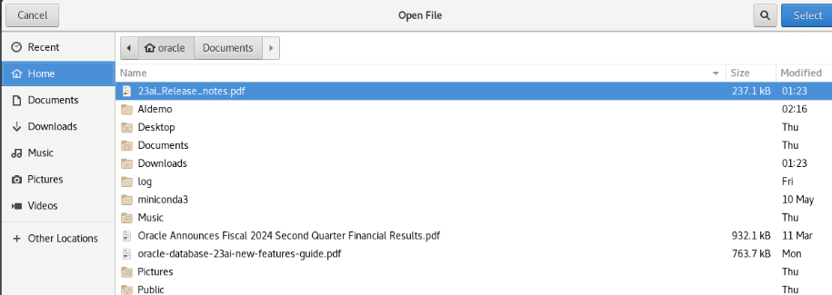
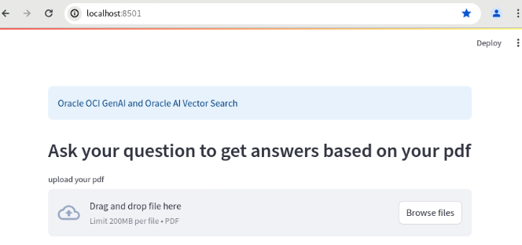

# Lab 2: Run the same RAG Application interactively with a User Interface

## Introduction

Estimated Time: 5 min

### Objectives

In this lab you will run the RAG application interactively using a user interface. You can select and load from several PDF documents, and ask your own question in the prompt.  This is the same application with the 7 essential RAG steps as the previous lab but demonstrates use through a user interface.

### Prerequisites

* Have completed the Task 7 from lab 1


## Task 1: Run the application

1.  From the terminal, go to directory 

    ```
    $ cd /home/oracle/aidemo
    ```

2.  Run the RAG application

    ```
    $ genai_run genai_plsql.py
    ```

3. A browser will launch. If not, open a browser from the Activities menu and select Firefox or Chrome.

4. Enter **localhost:8501** for the URL in the browser.
   
Your application will now be running.  Simply follow the UI.

5. Click on the **Browse files** button and load a PDF document.  If there are no files in the **Recent** folder select **Home** folder to see the PDF files.

    
    
    After a few seconds the PDF document will be loaded, transformed to text, chunked, and vectorized into Oracle Database 23ai.

    

    A prompt area will now appear for you to ask a question about your PDF.  You can type in your own question or use the suggestions listed below. 

6. Type a question and hit return.

    In a few seconds the LLM will answer the question and respond with context stored in Oracle Database 23ai.  

    **Some Suggestions for question to be asked**

    For the Oracle Database 23ai Users Guide:
    - What are the new features in Oracle Database 23ai
    - Tell me more about AI Vector Search
    - Tell me more about new enhancement to SQL
    - Tell me more about JSON Relational Duality

    For the Oracle Fiscal Year 2024 Quarter 2 Financial Results document:
    - Summarize the Oracle 2024 Quarter 2 financial results
    - What did Larry say in the Oracle Fiscal Year 2024 Quarter 2 financial results


**Code for UI application**

Now check out the application code using the UI. From a terminal window type:


```
    $ cd /home/oracle/aidemo
    $ more genai_plsql.py
```

Note the additional imported libraries and **st** objects.
But essentially the code is the same as LAB 1 for building a RAG application with Oracle AI Vector Search and PLSQL.

### Conclusion

By using AI Vector Search in Oracle Database 23ai, you can build RAG applications with important context without having to retrain the LLM.  The context is stored, searched and retrieved from Oracle Database 23ai and passed to the LLM to generate accurate, up to date, and targeted responses to your prompts.  Businesses and enterprises can use RAG with AI Vector Search in Oracle Database 23ai and an LLM to securely respond to important business questions or to generate content for many use cases using private, internal business information.


**Completed. Thanks for running the lab.**

## Acknowledgements
* **Authors** - Vijay Balebail, Milton Wan
* **Contributors** - Rajeev Rumale, Doug Hood
* **Last Updated By/Date** -  Rajeev Rumale, October 2024