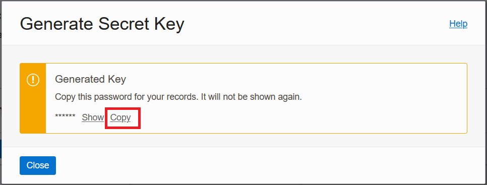
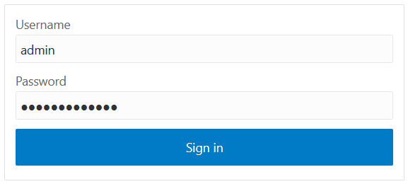
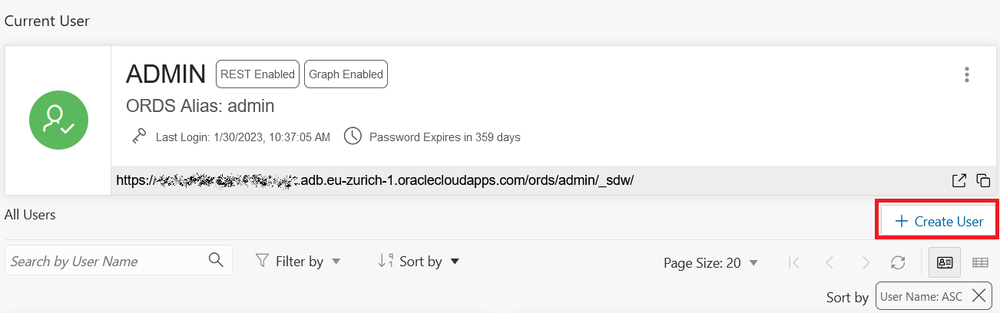
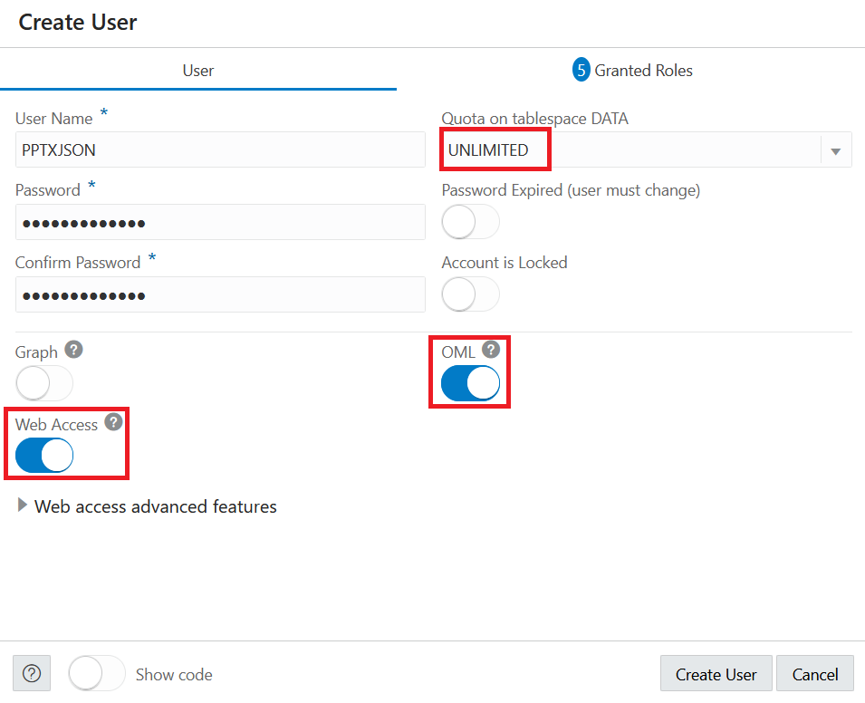

# Provision cloud resources

## Introduction

This workflow can be built and deployed on Oracle Cloud Infrastructure, where you have all the resources you need at a click. Even a free cloud account can do the job if we consider a simple task like this. For example, this challenge requires an autonomous database, the most basic compute instance and some object storage space. Run this hands-on workshop to find out more.

This lab explains how to provision OCI resources and prepare them for the solution deployment.

Estimated Time: 40 minutes

### Objectives

In this lab you will:
* Provision networking resources
* Create object storage buckets
* Provision a small compute instance
* Install the XML file processor
* Mount object storage on compute
* Upload your PowerPoint file to object storage
* Provision an autonomous database instance

### Prerequisites

This lab assumes you have:
* Access to Oracle Cloud Infrastructure
* Basic knowledge of Oracle Cloud resources

## Task 1: Provision Virtual Cloud Network (VCN)

1. Access Oracle cloud console via URL: [https://cloud.oracle.com/](https://cloud.oracle.com/)

    - Cloud Account Name: oci-tenant

    

2. Click **Continue**, and provide your credentials.

    - User Name: oci-username
    - Password: oci-password

    

3. Click **Sign In**.

4. Click on main menu ≡, then Networking > **Virtual Cloud Networks**.

    

5. Select your Region and Compartment assigned by the administrator. Click **Start VCN Wizard**.

    

6. Select **VCN with Internet Connectivity**. Start VCN Wizard.

    

    - VCN Name: LL[Your Initials]-VCN (e.g. LLXXX-VCN)
    - Compartment: [Your Compartment]

    

    - leave other fields with default values

    

7. Click **Next** and **Create**.


## Task 2: Provision object storage buckets

1. Click on main menu ≡, then Storage > **Buckets**.

    

2. Use **Create Bucket** button to create the LLXXX-PPTX bucket for the PPTX presentations.

    - Bucket Name: LL[Your Initials]-PPTX (e.g. LLXXX-PPTX)
    - leave other fields with default values

    

3. Click on main menu ≡, then Storage > **Buckets**. Use **Create Bucket** button to create the LLXXX-JSON bucket for the JSON documents processing.

    - Bucket Name: LL[Your Initials]-JSON (e.g. LLXXX-JSON)
    - leave other fields with default values

    

4. Copy Namespace value from Bucket Information page into your notes. You will need this value to access files in your bucket.

    

## Task 3: Provision compute instance

1. Click on main menu ≡, then Compute > **Instances**.

    

2. Click **Create instance**.

    

    - Name: LL[Your Initials]-VM (e.g. LLXXX-VM)

    

3. **Edit** Networking configuration.

    

    - Primary network: LLXXX-VCN
    - Subnet: Public Subnet-LLXXX-VCN

    

    - leave other fields with default values

4. Click **Save private key** and **Save public key** buttons to save these keys on your computer (by default in your Downloads folder).

    

5. Verify SSH connection from a Linux client. Change the permissions on the private key file you saved. Change `ssh-key-XXXX-XX-XX` with the private key file you saved on your computer. (Linux only)

    ````bash
    <copy>
    chmod 400 Downloads/ssh-key-XXXX-XX-XX.key
    </copy>
    ````

6. Connect to the LLXXX-VM compute instance using SSH. (Linux only)

    

    ````bash
    <copy>
    ssh -C -i Downloads/ssh-key-XXXX-XX-XX.key opc@<LLXXX-VM Public IP Address>
    </copy>
    ````

7. Set SSH connection from a Windows client. Use PuttyGen from your computer to convert the private key file you saved on your computer to Putty `.ppk` format. Click on Conversions > Import Key. Open the private key. Click on Save Private Key and Yes to save without a passphrase. Use the same name for the new `.ppk` key file, add only the extension `.ppk`. (Windows only)

8. Connect to your compute instance Public IP Address port 22. (Windows only)

    

9. Use the `.ppk` private key you converted with PuttyGen. (Windows only)

    

10. Go back to Session, give it a name, and save it. When asked if you trust this host, click **Yes**. (Windows only)

    


## Task 4: Install XQ to convert XML to JSON

1. Use pip3 package manager to install **yq** YAML/XML processor.

    ````bash
    <copy>
    sudo pip3 install yq
    </copy>
    ````

2. Create a new folder for the PowerPoint PPTX presentations.

    ````bash
    <copy>
    mkdir LLPPTX-PPTX
    </copy>
    ````

3. Create a new folder for processing PPTX files as JSON documents.

    ````bash
    <copy>
    mkdir LLPPTX-JSON
    </copy>
    ````

4. Create a flat file where all JSON files in the `LLXXX-JSON` bucket will be written.

    ````bash
    <copy>
    touch LLPPTX-JSON/json_files.csv
    </copy>
    ````

## Task 5: Mount object storage buckets on compute

1. Click on user menu 👤 in the upper-right corner, then click your **oci-username** under Profile.

    

2. In the lower-left Resources menu, click **Customer Secret Keys**.

    

3. Click **Generate Secret Key**. Specify a name.

    - Name: LL[Your Initials]-KEY (e.g. LLXXX-KEY)

    

4. Copy this password for your records. It will not be shown again. Click **Copy** and paste it in your notes. This is your Secret Key value. Now close the dialog.

    

5. Copy the Access Key value from the table. You should have two values in your notes, similar to:

    * Access Key: `c3e00example0028453729eb8256329a1b4b4s`
    * Secret Key: `vC0this0is0example0sf5Yp3K32tIDaStHwVajzI+N=`

    

6. The third value you need is the API endpoint. Replace `<tenancy>` and `<region>` with your values in the following URL to obtain your API endpoint.

    * API endpoint: https://`<tenancy>`.compat.objectstorage.`<region>`.oraclecloud.com

    

    E.g.:
    * API endpoint: https://myaccount.compat.objectstorage.eu-frankfurt-1.oraclecloud.com

7. Save credentials in a file inside your compute instance.

    ````bash
    <copy>
    echo <Access Key>:<Secret Key> > ${HOME}/.clave-s3fs
    </copy>
    ````

    E.g.:
    `echo c3e00example0028453729eb8256329a1b4b4s:vC0this0is0example0sf5Yp3K32tIDaStHwVajzI+N= > ${HOME}/.clave-s3fs`

8. Change permission for your credentials file.

    ````bash
    <copy>
    chmod 600 ${HOME}/.clave-s3fs
    </copy>
    ````

9. Install FUSE-based file system.

    ````bash
    <copy>
    sudo yum --enablerepo="ol8_developer_EPEL" -y install s3fs-fuse
    </copy>
    ````

10. Run this s3fs command to mount the LLXXX-PPTX bucket for the PPTX presentations.

    ````bash
    <copy>
    s3fs LLXXX-PPTX ${HOME}/LLPPTX-PPTX -o endpoint=<region> -o passwd_file=${HOME}/.clave-s3fs -o url=https://<bucket namespace>.compat.objectstorage.<region>.oraclecloud.com/ -onomultipart -o use_path_request_style
    </copy>
    ````

11. Run this s3fs command to mount the LLXXX-JSON bucket for the JSON documents processing.

    ````bash
    <copy>
    s3fs LLXXX-JSON ${HOME}/LLPPTX-JSON -o endpoint=<region> -o passwd_file=${HOME}/.clave-s3fs -o url=https://<bucket namespace>.compat.objectstorage.<region>.oraclecloud.com/ -onomultipart -o use_path_request_style
    </copy>
    ````

## Task 6: Upload PPTX file to presentations bucket

1. Click on main menu ≡, then Storage > **Buckets**. Click **LLXXX-PPTX**.

2. Under Objects, click **Upload**.

    

3. Under Choose Files from your Computer, click **select files**.

    

4. Select a PPTX file from your laptop and click **Upload**. After closing the dialog, the file will be shown in the Objects list.

    

5. On the compute instance, list files in LLPPTX-PPTX folder.

    ````bash
    <copy>
    ls -lah ${HOME}/LLPPTX-PPTX
    </copy>
    ````


## Task 7: Provision Autonomous JSON Database (AJD)

1. Click on main menu ≡, then Oracle Database > **Autonomous JSON Database**.

    

2. Click **Create Autonomous JSON Database**.

    

    - Display name: LL[Your Initials]-AJD (e.g. LLXXX-AJD)
    - Database name: LL[Your Initials]AJD (e.g. LLXXXAJD)

    
    

    - Password: use a strong password and write it down in your notes

    

    - leave other fields with default values

3. Click **Create Autonomous Database**. Wait until the provisioning is complete. Refresh page.

4. On the Oracle Cloud Infrastructure Console, click **Database Actions** next to the big green box. Allow pop-ups from cloud.oracle.com.

    

    - Username: admin
    - Password: the strong password you wrote down in your notes

    

5. Under Administration, click **Database users**.

    

6. Click **+ Create user** button on the right side.

    

    - User Name: PPTXJSON
    - Password: use the strong password you wrote down in your notes
    - Quota on tablespace DATA: UNLIMITED
    - Enable: Web Access and OML

    

    - Click Granted Roles tab, and add `SODA_APP` (Granted and Default)

    

    - leave other fields with default values

7. Click **Create User**.

8. Copy (⧉) the URL under PPTXJSON user into your notes. Open this URL in new tab and login with PPTXJSON user.

    

    - Username: pptxjson
    - Password: the strong password you wrote down in your notes

    

9. Click **SQL** icon on the upper-left under Development.

    

    You may now **proceed to the next lab**.


## Acknowledgements

- **Author** - Valentin Leonard Tabacaru
- **Last Updated By/Date** - Valentin Leonard Tabacaru, DB Product Management, January 2023
