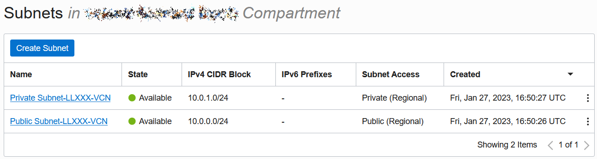
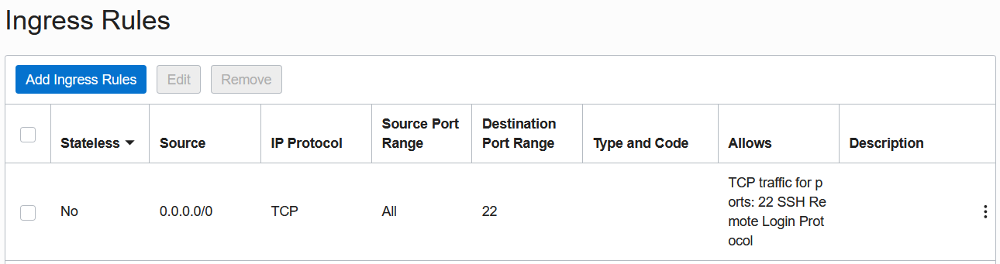

# Prepare cloning environments

## Introduction

In this lab you will provision OCI resources necessary to deploy read-only clones at pluggable database level that can be used for reporting. This workshop hands-on experience has a simple use case with two sites, Site A and Site B. For the purpose of the lab simplicity, both sites will be in the same region, same container, sharing a single Virtual Cloud Network subnet. Each site has an Oracle Base Database Service, with one Pluggable Database for single schema application data.

Estimated Time: 60 minutes

### Objectives

In this lab you will:
* Create a Virtual Cloud Network
* Provision two Database Systems
* Connect to DB System Node via SSH
* Create users and application data

### Prerequisites

This lab assumes you have:
* Access to Oracle Cloud Infrastructure
* Basic understanding of the Oracle Base Database Service
* Basic Oracle Database administration experience

## Task 1: Create a Virtual Cloud Network

Please take a moment to watch the video below to learn how to perform the Database Lifecycle Task using the OCI Console, and then afterwards, follow the steps shown.

[How to Create VCN] (youtube:dqikNCqjsmk)

1. Access Oracle cloud console via URL: [https://cloud.oracle.com/](https://cloud.oracle.com/)

    - Cloud Account Name: oci-tenant

    

2. Click **Next**, and provide your credentials.

    - User Name: oci-username
    - Password: oci-password

    

3. Click **Sign In**.

4. Click on main menu ≡, then Networking > **Virtual Cloud Networks**.

    

5. Select your Region and Compartment assigned by the administrator. Click **Start VCN Wizard**.

    

6. Select **VCN with Internet Connectivity**. Start VCN Wizard.

    

    - VCN Name: LL[Your Initials]-VCN (e.g. LLXXX-VCN)
    - Compartment: [Your Compartment]

    

    - leave other fields with default values

    

7. Click **Next** and **Create**.

8. When complete, create a Security Rule. Click **Public Subnet LLXXX-VCN**.

    

9. Click **Default Security List for LLXXX-VCN**.

    

10. Click **Add Ingress Rules**.

    

    - CIDR Block: 10.0.0.0/16
    - Destination Port Range: 1521
    - Description: Database connection

    

11. Click **Add Ingress Rules**.


## Task 2: Provision Database Systems

Please take a moment to watch the video below to learn how to perform the Database Lifecycle Task using the OCI Console, and then afterwards, follow the steps shown.

[Create Flex VM DB System] (youtube:_GwZYPRwLV8)

1. Click on main menu ≡, then **Oracle Database** > **Oracle Base Database**. Click **Create DB System**. This is Site A.

    - Select your compartment (default).
    - Name your DB system: **DBS21A**
    - Select a shape type: Virtual Machine (default).
    - Select a shape: **VM.Standard.E4.Flex**. Click **Change Shape**. Set **Number of OCPUs per node: 1**.
    - Under Configure storage, click **Change storage**. Select **Logical Volume Manager**, **Storage Volume Performance: Balanced**.
    - Oracle Database software edition: **Enterprise Edition Extreme Performance**.
    - Generate SSH key pair, and save both Private Key (this is the SSH_KEY_FILE) and Public Key files on your computer.
    - Choose a license type: Bring Your Own License (BYOL).

2. Specify the network information.

    - Virtual cloud network: LLXXX-VCN
    - Client Subnet: Public Subnet LLXXX-SUBNET-PUBLIC
    - Hostname prefix: **dbs21a-host**

3. Click Next.

    - Database name: **DBS21A**
    - Database version: **21c**
    - PDB name: Do NOT specify any value.
    - Password: Use a strong password and write it down in your notes (this is the STRONG_PASS).
    - Select workload type: Transaction Processing (default).
    - Leave default values for database backups configuration (default).

4. Click **Create DB System**.

5. Create a second Oracle Base Database System. Click **Create DB System**. This is Site B.

    - Select your compartment (default).
    - Name your DB system: **DBS21B**
    - Select a shape type: Virtual Machine (default).
    - Select a shape: **VM.Standard.E4.Flex**. Click **Change Shape**. Set **Number of OCPUs per node: 1**.
    - Under Configure storage, click **Change storage**. Select **Logical Volume Manager**, **Storage Volume Performance: Balanced**.
    - Oracle Database software edition: **Enterprise Edition Extreme Performance**.
    - Use the Public Key file generated when creating the first DB System DBS21B from your computer.
    - Choose a license type: Bring Your Own License (BYOL).

6. Specify the network information.

    - Virtual cloud network: LLXXX-VCN
    - Client Subnet: Public Subnet LLXXX-SUBNET-PUBLIC
    - Hostname prefix: **dbs21b-host**

7. Click Next.

    - Database name: **DBS21B**
    - Database version: **21c**
    - PDB name: Do NOT specify any value.
    - Password: Use the strong password you saved in your notes (this is the STRONG_PASS).
    - Select workload type: Transaction Processing (default).
    - Leave default values for database backups configuration (default).

8. Click **Create DB System**.


## Task 3: Setup workshop environment

1. Download [prepare.sh](https://objectstorage.eu-frankfurt-1.oraclecloud.com/p/xuJQz3bN4iDWvRGmYmFScAqM1FiL0PYsZm4FdYibDZnv6BAQP0ClxoBXyVONaBgP/n/oraclepartnersas/b/WS-files/o/prepare.sh) on your laptop.

2. Edit prepare.sh in any text editor on your laptop.

3. Set values for all variables in prepare.sh script.

    - SSH key file name **SSH_KEY_FILE**. This is the name of the Private Key file downloaded during DBS21A DB System creation.
    - DBS21A Public IP address **DBS21A_PUBLIC**. On the DBS21A DB System Details page, in the lower left under Resources click on Nodes.
    - DBS21A Private IP address **DBS21A_PRIVATE**. On the DBS21A DB System Details page, in the lower left under Resources click on Nodes.
    - DBS21B Public IP address **DBS21B_PUBLIC**. On the DBS21B DB System Details page, in the lower left under Resources click on Nodes.
    - DBS21B Private IP address **DBS21B_PRIVATE**. On the DBS21B DB System Details page, in the lower left under Resources click on Nodes.
    - DBS21A Database unique name **DBS21A_DB_NAME**. On the DBS21A DB System Details page, in the lower left under Resources click on Databases.
    - DBS21B Database unique name **DBS21B_DB_NAME**. On the DBS21B DB System Details page, in the lower left under Resources click on Databases.
    - Host domain name **DOMAIN_NAME**. On the DBS21A DB System Details page, on the right side under Network. Click Copy link next to Host domain name.
    - Strong password **STRONG_PASS**. Use the strong password you saved in your notes.

4. Open Oracle Cloud Shell.

5. Upload on Cloud Shell environment the **Private Key** downloaded during DBS21A DB System creation and **prepare.sh** script.

6. Make sure prepare.sh script has Unix format.

    ````bash
    <copy>
    dos2unix prepare.sh
    </copy>
    ````

7. Execute prepare.sh script.

    ````bash
    <copy>
    source prepare.sh
    </copy>
    ````

8. Connect via SSH to DBS21A DB System node as **oracle* user using DBS21A Public IP address.

    ````bash
    <copy>
    ssh -C -i SSH_KEY_FILE oracle@DBS21A_PUBLIC
    </copy>
    ````

## Task 4: Prepare application data

1. Start SQL*Plus.

    ````bash
    <copy>
    sqlplus /nolog
    </copy>
    ````

2. Execute the SQL script with all the commands for this task.

    ````sql
    <copy>
    @userdata.sql
    </copy>
    ````

3. This is the SQL script userdata.sql, you don't need to copy and execute it from here.

    ````sql
    -- Connect to DBS21A_PDB1 pluggable database on Site A as SYSDBA.
    conn sys/STRONG_PASS@DBS21A_PRIVATE:1521/dbs21a_pdb1.DOMAIN_NAME as sysdba

    -- Create application user PEOPLEMGR.
    CREATE USER PEOPLEMGR IDENTIFIED BY "STRONG_PASS" DEFAULT TABLESPACE users TEMPORARY TABLESPACE temp;

    -- Grant privileges to application user.
    GRANT connect, resource to PEOPLEMGR;
    GRANT UNLIMITED TABLESPACE TO PEOPLEMGR;
    GRANT CREATE ANY VIEW TO PEOPLEMGR;

    -- Connect to DBS21A_PDB1 pluggable database on Site A as application user.
    conn PEOPLEMGR/STRONG_PASS@DBS21A_PRIVATE:1521/dbs21a_pdb1.DOMAIN_NAME

    -- Create application table.
    CREATE TABLE people (
      id          INTEGER NOT NULL PRIMARY KEY,
      given_name  VARCHAR2(12) NOT NULL,
      family_name VARCHAR2(12) NOT NULL,
      title       VARCHAR2(6),
      birth_date  DATE );

    -- Insert seven records into application table.
    INSERT INTO people (id, given_name, family_name, title, birth_date)
      WITH names AS (
        select 1, 'Dave',     'Badger',   'Mr',    date'1985-01-21'    from dual union all
        select 2, 'Simon',    'Fox',      'Mr',    NULL                from dual union all
        select 3, 'Dave',     'Frog',     'Mr',    date'1991-08-16'    from dual union all
        select 4, 'Ruth',     'Fox',      'Mrs',   date'1997-04-10'    from dual union all
        select 5, 'Isabelle', 'Squirrel', 'Miss',  date'1998-11-01'    from dual union all
        select 6, 'Justin',   'Frog',     'Master',NULL                from dual union all
        select 7, 'Lisa',     'Owl',      'Dr',    NULL                from dual )
      SELECT * FROM names;

    -- Commit all inserted rows.
    commit;

    -- Verify records in application table.
    SELECT * FROM people;

    -- Connect to DBS21B_PDB1 pluggable database on Site B as application user.
    conn PEOPLEMGR/STRONG_PASS@DBS21B_PRIVATE:1521/dbs21b_pdb1.DOMAIN_NAME

    -- Create application table with the same structure.
    CREATE TABLE people (
      id          INTEGER NOT NULL PRIMARY KEY,
      given_name  VARCHAR2(12) NOT NULL,i
      family_name VARCHAR2(12) NOT NULL,
      title       VARCHAR2(6),
      birth_date  DATE );

    -- Insert seven different records in application table.
    INSERT INTO people (id, given_name, family_name, title, birth_date)
      WITH names AS (
        select 1, 'David',    'Rodriguez', 'Sr',  date'1988-05-23'    from dual union all
        select 2, 'Veronica', 'Bravo',     'Sra', date'1981-03-10'    from dual union all
        select 3, 'Oscar',    'Carmona',   'Dr',  NULL                from dual union all
        select 4, 'Maria',    'Ramirez',   'Srta',NULL                from dual union all
        select 5, 'Yolanda',  'Martin',    'Sra', NULL                from dual union all
        select 6, 'Juan',     'Palacios',  'Sr',  date'1999-07-19'    from dual union all
        select 7, 'Mercedes', 'Banderas',  'Dra', date'2000-12-06'    from dual )
      SELECT * FROM names;

    -- Commit inserted rows.
    commit;

    -- Verify rows in application table.
    SELECT * FROM people;
    ````

## Task 5: Create clone administrator

1. Start SQL*Plus.

    ````bash
    <copy>
    sqlplus /nolog
    </copy>
    ````

2. Execute the SQL script with all the commands for this task.

    ````sql
    <copy>
    @cloneadmin.sql
    </copy>
    ````

3. This is the SQL script cloneadmin.sql, you don't need to copy and execute it from here.

    ````sql
    -- Connect to DBS21A container on Site A as SYSDBA.
    conn sys/STRONG_PASS@DBS21A_PRIVATE:1521/DBS21A_DB_NAME.DOMAIN_NAME as sysdba

    -- Create clone administrator user.
    create user C##CLONE_ADMIN identified by STRONG_PASS temporary tablespace TEMP container=ALL;

    -- Grant privileges to clone admin user.
    grant create session, create pluggable database, sysoper to C##CLONE_ADMIN container=ALL;

    -- Connect to DBS21B container database on Site B as SYSDBA.
    conn sys/STRONG_PASS@DBS21B_PRIVATE:1521/DBS21B_DB_NAME.DOMAIN_NAME as sysdba

    -- Create clone administrator user.
    create user C##CLONE_ADMIN identified by STRONG_PASS temporary tablespace TEMP container=ALL;

    -- Grant privileges to clone admin user.
    grant create session, create pluggable database, sysoper to C##CLONE_ADMIN container=ALL;

    -- Connect to DBS21A container on Site A as SYSDBA.
    conn sys/STRONG_PASS@DBS21A_PRIVATE:1521/DBS21A_DB_NAME.DOMAIN_NAME as sysdba

    -- Create database link to DBS21B container on Site B.
    create database link dbs21b connect to c##clone_admin identified by STRONG_PASS using 'DBS21B_PRIVATE:1521/DBS21B_DB_NAME.DOMAIN_NAME';

    -- Test database link from Site A to Site B.
    select * from dual@dbs21b;

    -- Connect to DBS21B container database on Site B as SYSDBA.
    conn sys/STRONG_PASS@DBS21B_PRIVATE:1521/DBS21B_DB_NAME.DOMAIN_NAME as sysdba

    -- Create database link to DBS21A container on Site A.
    create database link dbs21a connect to c##clone_admin identified by STRONG_PASS using 'DBS21A_PRIVATE:1521/DBS21A_DB_NAME.DOMAIN_NAME';

    -- Test database link from Site B to Site A.
    select * from dual@dbs21a;
    ````

    You may now **proceed to the next lab**.

## Acknowledgements

- **Author** - Valentin Leonard Tabacaru
- **Last Updated By/Date** - Valentin Leonard Tabacaru, DB Product Management, February 2023
