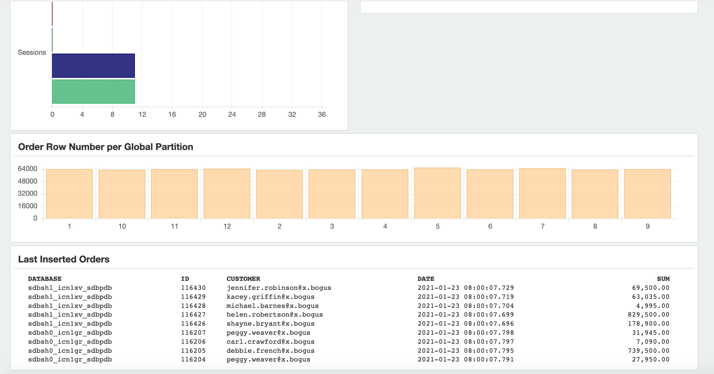

# Deploy the Demo Application

## Introduction

To learn more about Oracle Sharded Databases, download and deploy the system-managed SDB demo application. The demo application uses the SDB environment and schema you have just created to simulate the workload of an online retail store. 

Estimated Lab Time: 30 minutes

### Objectives

In this lab, you will:
- Setup and Configure the sharding demo application
- Start the workload to load the demo data

### Prerequisites

This lab assumes you have already completed the following:
- Sharded Database Deployment
- Create Demo App Schema

## Task 1: Setup and Configure the Sharding Demo Application

1. Login to the shard director host, switch to oracle user.

    ```
    $ ssh -i labkey opc@xxx.xxx.xxx.xxx
    Last login: Sat Jan 23 06:23:18 2021 from 59.66.120.23
    -bash: warning: setlocale: LC_CTYPE: cannot change locale (UTF-8): No such file or directory
    
    [opc@sdbsd0 ~]$ sudo su - oracle
    Last login: Sat Jan 23 06:23:20 GMT 2021 on pts/0
    [oracle@sdbsd0 ~]$ 
    ```

   

2. Download the `sdb-demo-app-qs.zip`  file. 

    ```
    oracle@cata ~]$ <copy>wget https://objectstorage.us-ashburn-1.oraclecloud.com/p/VEKec7t0mGwBkJX92Jn0nMptuXIlEpJ5XJA-A6C9PymRgY2LhKbjWqHeB5rVBbaV/n/c4u04/b/livelabsfiles/o/data-management-library-files/sdb-demo-app-qs.zip</copy>
    ```

   

3. Unzip the file. This will create `sdb-demo-app` directory under the `/home/oracle`

    ```
    [oracle@sdbsd0 ~]$ <copy>unzip sdb_demo_app-qs.zip</copy> 
    Archive:  sdb_demo_app.zip
       creating: sdb_demo_app/
      inflating: sdb_demo_app/license.inc  
       creating: sdb_demo_app/src/
       creating: sdb_demo_app/src/oracle/
      inflating: sdb_demo_app/src/oracle/RandomGenerator.java  
      inflating: sdb_demo_app/src/oracle/JsonSerializer.java  
       creating: sdb_demo_app/src/oracle/monitor/
      inflating: sdb_demo_app/src/oracle/monitor/DatabaseMonitor.java  
      inflating: sdb_demo_app/src/oracle/monitor/Install.java  
      inflating: sdb_demo_app/src/oracle/monitor/Main.java  
      inflating: sdb_demo_app/src/oracle/monitor/FileHandler.java  
       creating: sdb_demo_app/src/oracle/demo/
      inflating: sdb_demo_app/src/oracle/demo/Statistics.java  
      inflating: sdb_demo_app/src/oracle/demo/FillProducts.java  
      inflating: sdb_demo_app/src/oracle/demo/Session.java  
      inflating: sdb_demo_app/src/oracle/demo/ApplicationException.java  
      inflating: sdb_demo_app/src/oracle/demo/CustomerGenerator.java  
       creating: sdb_demo_app/src/oracle/demo/actions/
      inflating: sdb_demo_app/src/oracle/demo/actions/CreateOrder.java  
      inflating: sdb_demo_app/src/oracle/demo/actions/OrderLookup.java  
      inflating: sdb_demo_app/src/oracle/demo/actions/GenerateReport.java  
      inflating: sdb_demo_app/src/oracle/demo/actions/AddProducts.java  
      inflating: sdb_demo_app/src/oracle/demo/actions/CustomerAction.java  
      inflating: sdb_demo_app/src/oracle/demo/Application.java  
      inflating: sdb_demo_app/src/oracle/demo/Main.java  
      inflating: sdb_demo_app/src/oracle/demo/Application.java.orig  
      inflating: sdb_demo_app/src/oracle/demo/Actor.java  
      inflating: sdb_demo_app/src/oracle/demo/InfiniteGeneratingQueue.java  
      inflating: sdb_demo_app/src/oracle/demo/.ApplicationException.java.swp  
      inflating: sdb_demo_app/src/oracle/demo/Test.java  
      inflating: sdb_demo_app/src/oracle/demo/Product.java  
      inflating: sdb_demo_app/src/oracle/demo/InstallSchema.java  
      inflating: sdb_demo_app/src/oracle/demo/Customer.java  
      inflating: sdb_demo_app/src/oracle/Utils.java  
      inflating: sdb_demo_app/src/oracle/SmartLogFormatter.java  
      inflating: sdb_demo_app/src/oracle/ArgParser.java  
       creating: sdb_demo_app/cls/
       creating: sdb_demo_app/cls/oracle/
       creating: sdb_demo_app/cls/oracle/monitor/
       creating: sdb_demo_app/cls/oracle/demo/
       creating: sdb_demo_app/cls/oracle/demo/actions/
      inflating: sdb_demo_app/logging.properties  
      inflating: sdb_demo_app/run.sh     
      inflating: sdb_demo_app/monitor.logging.properties  
       creating: sdb_demo_app/build/
      inflating: sdb_demo_app/build/demo.jar  
      inflating: sdb_demo_app/build.xml  
      inflating: sdb_demo_app/monitor-install.sh  
      inflating: sdb_demo_app/monitor.sh  
      inflating: sdb_demo_app/demo.properties  
      inflating: sdb_demo_app/LICENSE    
      inflating: sdb_demo_app/demo.logging.properties  
       creating: sdb_demo_app/data/
      inflating: sdb_demo_app/data/parts.txt  
      inflating: sdb_demo_app/data/us-places.txt  
      inflating: sdb_demo_app/data/streets.txt  
      inflating: sdb_demo_app/data/first-f.txt  
      inflating: sdb_demo_app/data/last.txt  
      inflating: sdb_demo_app/data/first-m.txt  
      inflating: sdb_demo_app/README _SDB_Demo_Application.pdf  
       creating: sdb_demo_app/log/
      inflating: sdb_demo_app/log/java0.log  
      inflating: sdb_demo_app/log/java1.log  
      inflating: sdb_demo_app/fill.sh    
       creating: sdb_demo_app/web/
      inflating: sdb_demo_app/web/bootstrap.min.css  
      inflating: sdb_demo_app/web/dash.html  
      inflating: sdb_demo_app/web/bootstrap-theme.css  
      inflating: sdb_demo_app/web/bootstrap.js  
      inflating: sdb_demo_app/web/Chart.HorizontalBar.js  
      inflating: sdb_demo_app/web/bootstrap.css  
      inflating: sdb_demo_app/web/db.svg  
      inflating: sdb_demo_app/web/bootstrap.min.js  
      inflating: sdb_demo_app/web/DatabaseWidgets.js  
      inflating: sdb_demo_app/web/jquery-2.1.4.js  
      inflating: sdb_demo_app/web/Chart.js  
      inflating: sdb_demo_app/web/bootstrap-theme.min.css  
      inflating: sdb_demo_app/web/masonry.pkgd.js  
      inflating: sdb_demo_app/web/npm.js  
      inflating: sdb_demo_app/generate_properties.sh  
      inflating: sdb_demo_app/README.md  
       creating: sdb_demo_app/lib/
      inflating: sdb_demo_app/lib/ojdbc8.jar  
      inflating: sdb_demo_app/lib/ons.jar  
      inflating: sdb_demo_app/lib/ucp.jar  
       creating: sdb_demo_app/sql/
      inflating: sdb_demo_app/sql/all.sql  
      inflating: sdb_demo_app/sql/catalog_monitor.sql  
      inflating: sdb_demo_app/sql/shard_helpers.sql  
      inflating: sdb_demo_app/sql/app_schema_user.sql  
      inflating: sdb_demo_app/sql/global_views.sql  
      inflating: sdb_demo_app/sql/demo_app_ext.sql  
      inflating: sdb_demo_app/sql/app_schema_auto.sql  
      inflating: sdb_demo_app/sql/global_views.header.sql  
    [oracle@sdbsd0 ~]$ 
    ```
   
   
   
4. Change to the `sdb_demo_app/sql` directory.

    ```
    [oracle@sdbsd0 ~]$ <copy>cd ~/sdb_demo_app/sql</copy>
    [oracle@sdbsd0 sql]$
    ```

   

5. Edit the content of the `demo_app_ext.sql`. Modify the sys user password to your own in the **two connect strings**. Make sure the connect string is correct.

    ```
    [oracle@sdbsd0 sql]$ <copy>vi demo_app_ext.sql</copy> 
    -- Create catalog monitor packages
    connect sys/your-own-sys-password@sdbsc0:1521/sdbpdb as sysdba
    @catalog_monitor.sql
    
    connect app_schema/App_Schema_Pass_123@sdbsc0:1521/sdbpdb;
    
    alter session enable shard ddl;
    
    CREATE OR REPLACE VIEW SAMPLE_ORDERS AS
      SELECT OrderId, CustId, OrderDate, SumTotal FROM
        (SELECT * FROM ORDERS ORDER BY OrderId DESC)
          WHERE ROWNUM < 10;
    
    alter session disable shard ddl;
    
    -- Allow a special query for dbaview
    connect sys/your-own-sys-password@sdbsc0:1521/sdbpdb as sysdba
    
    -- For demo app purposes
    grant shard_monitor_role, gsmadmin_role to app_schema;
    
    alter session enable shard ddl;
    
    create user dbmonuser identified by TEZiPP4_MsLLL_1;
    grant connect, alter session, shard_monitor_role, gsmadmin_role to dbmonuser;
    
    grant all privileges on app_schema.products to dbmonuser;
    grant read on app_schema.sample_orders to dbmonuser;
    
    alter session disable shard ddl;
    -- End workaround
    
    exec dbms_global_views.create_any_view('SAMPLE_ORDERS', 'APP_SCHEMA.SAMPLE_ORDERS', 'GLOBAL_SAMPLE_ORDERS', 0, 1);
    [oracle@sdbsd0 sql]$ 
    ```
   
   

6. Using SQLPLUS to run the script.

    ```
    [oracle@sdbsd0 sql]$ sqlplus /nolog
    
    SQL*Plus: Release 19.0.0.0.0 - Production on Sat Jan 23 07:41:39 2021
    Version 19.3.0.0.0
    
    Copyright (c) 1982, 2019, Oracle.  All rights reserved.
    
    SQL> @demo_app_ext.sql
    ```
   
   
   
7. The result likes the following.

    ```
    Connected.
    
    Session altered.
    
    
    Session altered.
    
    
    Role created.
    
    
    Grant succeeded.
    
    
    Grant succeeded.
    
    
    Grant succeeded.
    
    
    Grant succeeded.
    
    
    Session altered.
    
    
    Package created.
    
    No errors.
    
    Package body created.
    
    No errors.
    
    PL/SQL procedure successfully completed.
    
    
    Type created.
    
    
    Type created.
    
    
    Package created.
    
    No errors.
    
    Package body created.
    
    No errors.
    
    Package body created.
    
    No errors.
    
    Grant succeeded.
    
    
    Grant succeeded.
    
    
    Grant succeeded.
    
    
    PL/SQL procedure successfully completed.
    
    
    PL/SQL procedure successfully completed.
    
    
    PL/SQL procedure successfully completed.
    
    
    PL/SQL procedure successfully completed.
    
    
    PL/SQL procedure successfully completed.
    
    Connected.
    
    Session altered.
    
    
    View created.
    
    
    Session altered.
    
    Connected.
    
    Session altered.
    
    
    Grant succeeded.
    
    
    Session altered.
    
    
    User created.
    
    
    Grant succeeded.
    
    
    Grant succeeded.
    
    
    Grant succeeded.
    
    
    Session altered.
    
    
    PL/SQL procedure successfully completed.
    
    SQL> 
    ```

   

8. Exit the sqlplus. Change directory to the `sdb_demo_app`.

    ```
    SQL> exit
    Disconnected from Oracle Database 19c EE Extreme Perf Release 19.0.0.0.0 - Production
    Version 19.9.0.0.0
    
    [oracle@sdbsd0 sql]$ cd ~/sdb_demo_app
    [oracle@sdbsd0 sdb_demo_app]$
    ```

   

9. View the `demo.properties` file, make sure it's like the following. Because we have no data guard standby database setup in this lab, we also use the `oltp_rw_srvc.sdb.oradbcloud` for the readonly service.

    ```
    name=demo
    connect_string=(ADDRESS_LIST=(LOAD_BALANCE=off)(FAILOVER=on)(ADDRESS=(HOST=localhost)(PORT=1522)(PROTOCOL=tcp)))
    monitor.user=dbmonuser
    monitor.pass=TEZiPP4_MsLLL_l
    app.service.write=oltp_rw_srvc.sdb.oradbcloud
    #app.service.write=rw.orasdb.oradbcloud
    app.service.readonly=oltp_rw_srvc.sdb.oradbcloud
    #app.service.readonly=ro.orasdb.oradbcloud
    app.user=app_schema
    app.pass=App_Schema_Pass_123
    app.threads=7
    ```

   

   

## Task 2: Start the Workload

1. Start the workload by executing command: `./run.sh demo`.

    ```
    [oracle@sdbsd0 sdb_demo_app]$ <copy>./run.sh demo</copy>
    ```

   

2. The result likes the following.

    ```
    Performing initial fill of the products table...
    Syncing shards...
     RO Queries | RW Queries | RO Failed  | RW Failed  | APS 
              0            0            0            0            0
              0            0            0            0            0
              0            0            0            0            0
            130            0            0            0           40
            130            0            0            0            0
            175           16            0            0           15
           1510          275            0            0          444
           3761          597            0            0          758
           6393         1011            0            0          894
           8829         1373            0            0          818
          11114         1770            0            0          774
          13502         2186            0            0          802
          15981         2618            0            0          839
          18671         3086            0            0          918
          21330         3481            0            0          901
          23936         3927            0            0          888
          26996         4368            0            0         1038
          29798         4795            0            0          952
          32092         5180            0            0          786
    ```
   
   
   
3. Wait several minutes, remember the APS (Transcation per Second).

    ```
    RO Queries | RW Queries | RO Failed  | RW Failed  | APS 
         649078       107862            0            0         1332
         652664       108474            0            0         1361
         656194       109085            0            0         1338
         659527       109634            0            0         1262
         662797       110231            0            0         1218
         666327       110824            0            0         1345
         669844       111398            0            0         1328
         673731       111946            0            0         1481
         676797       112513            0            0         1154
         680017       113077            0            0         1221
         683444       113685            0            0         1277
         686942       114306            0            0         1327
         690470       114894            0            0         1332
         693877       115493            0            0         1273
         697395       116064            0            0         1320
         700774       116677            0            0         1278
         703757       117163            0            0         1143
    ```

   

4. Open another terminal, connect to the shard director host, switch to oracle user. Change the directory to `sdb_demo_app`.

    ```
    $ ssh -i labkey opc@xxx.xxx.xxx.xxx
    Last login: Sat Jan 23 07:27:57 2021 from 59.66.120.23
    -bash: warning: setlocale: LC_CTYPE: cannot change locale (UTF-8): No such file or directory
    
    [opc@sdbsd0 ~]$ sudo su - oracle
    Last login: Sat Jan 23 07:29:32 GMT 2021 on pts/0
    
    [oracle@sdbsd0 ~]$ cd sdb_demo_app
    [oracle@sdbsd0 sdb_demo_app]$ 
    ```

   

5. Start the monitoring tool via the following command. Ignore the FileNotFoundException message.

    ```
     [oracle@sdbsd0 sdb_demo_app]$ <copy>./run.sh monitor</copy>
    @oracle.monitor.Main.registerDatabase : INFO 2020-11-30T06:17:33.417 : Context : /db/demo/info
    @oracle.monitor.DatabaseMonitor$BackgroundStatusCheck.run : java.lang.ArrayIndexOutOfBoundsException : 2
    @oracle.monitor.DatabaseMonitor$BackgroundStatusCheck.run : java.lang.ArrayIndexOutOfBoundsException : 3
    java.io.FileNotFoundException: /favicon.ico
    	at oracle.monitor.FileHandler.handle(FileHandler.java:129)
    	at com.sun.net.httpserver.Filter$Chain.doFilter(Filter.java:79)
    	at sun.net.httpserver.AuthFilter.doFilter(AuthFilter.java:83)
    	at com.sun.net.httpserver.Filter$Chain.doFilter(Filter.java:82)
    	at sun.net.httpserver.ServerImpl$Exchange$LinkHandler.handle(ServerImpl.java:675)
    	at com.sun.net.httpserver.Filter$Chain.doFilter(Filter.java:79)
    	at sun.net.httpserver.ServerImpl$Exchange.run(ServerImpl.java:647)
    	at sun.net.httpserver.ServerImpl$DefaultExecutor.execute(ServerImpl.java:158)
    	at sun.net.httpserver.ServerImpl$Dispatcher.handle(ServerImpl.java:431)
    	at sun.net.httpserver.ServerImpl$Dispatcher.run(ServerImpl.java:396)
    	at java.lang.Thread.run(Thread.java:748)
    ```

   

6. From your laptop, launch a browser and use the URL: `http://xxx.xxx.xxx.xxx:8081`. Using the public ip address of the shard director host and the port number is 8081.

    

   

7. Scroll down the screen, you can see the Last inserted orders:

    

   

8. Press `Ctrl+C` to cancel the demo in both of the terminal.

    

You may now [proceed to the next lab](#next).

## Acknowledgements
* **Author** - Minqiao Wang, DB Product Management, Jan 2021
* **Last Updated By/Date** - Minqiao Wang, Jul 2021
* **Workshop Expiry Date** - Jul 2022