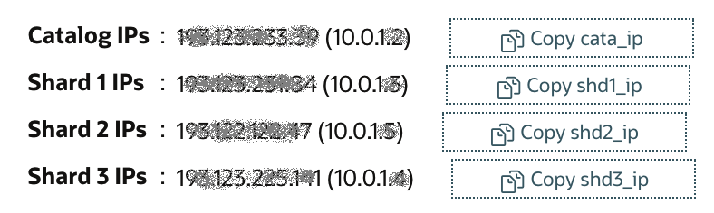
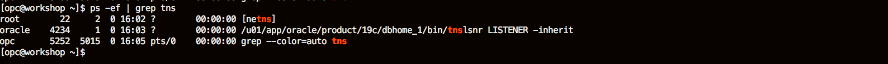

# Access the Workshop Environment

## Introduction

In this lab you will be assigned with 4 compute instances like the following:



The databases are automatically installed in the instances. The public IPs and private IPs are dynamic assigned. The hostnames, CDB and PDB names are fixed, Like the following:

| Display Name | Hostname | CDB Name | PDB Name |
| ------------ | -------- | -------- | -------- |
| Catalog      | cata     | cata     | catapdb  |
| Shard1       | shd1     | shd1     | shdpdb1  |
| Shard2       | shd2     | shd2     | shdpdb2  |
| Shard3       | shd3     | shd3     | shdpdb3  |

In the following steps, we will check if  the environment is ready.

Estimated Lab Time: 30 minutes.

### Objectives

-   Make sure the lab environment is ready.

### Prerequisites

This lab assumes you have already completed the following:
- An Oracle Free Tier, Always Free, Paid or LiveLabs Cloud Account
- Create a SSH Keys pair


## Task 1: Connect to your Instances

### MAC or Windows CYGWIN Emulator

1.  Open up a terminal (MAC) or cygwin emulator as the opc user.  Enter yes when prompted.

    ````
    ssh -i ~/.ssh/optionskey opc@<Your Compute Instance Public IP Address>
    ````

2. After successfully logging in, proceed to STEP 5.

    ```
    ssh -i labkey opc@xxx.xxx.xxx.xxx
    The authenticity of host 'xxx.xxx.xxx.xxx (xxx.xxx.xxx.xxx)' can't be established.
    ECDSA key fingerprint is SHA256:Wq+YNHzgc1JUySBJuTRO0T4NKpeRz5Udw82Mn5RCe6c.
    Are you sure you want to continue connecting (yes/no/[fingerprint])? yes
    Warning: Permanently added 'xxx.xxx.xxx.xxx' (ECDSA) to the list of known hosts.
    -bash: warning: setlocale: LC_CTYPE: cannot change locale (UTF-8): No such file or directory
    [opc@primary ~]$ 
    ```

    

### Windows using Putty

1.  Open up putty and create a new connection.

2.  Enter a name for the session and click **Save**.

    

3.  Click **Connection** > **Data** in the left navigation pane and set the Auto-login username to **opc**.

4.  Click **Connection** > **SSH** > **Auth** in the left navigation pane and configure the SSH private key to use by clicking Browse under Private key file for authentication.

5.  Navigate to the location where you saved your SSH private key file, select the file, and click Open.  NOTE:  You cannot connect while on VPN or in the Oracle office on clear-corporate (choose clear-internet).

    

6.  The file path for the SSH private key file now displays in the Private key file for authentication field.

7.  Click Session in the left navigation pane, then click Save in the Load, save or delete a stored session Step.

8.  Click Open to begin your session with the instance.

## Task 2: Verify the Database is Up

1.  From your connected session of choice **tail** the `buildsingle.log`, This file has the configures log of the database.

    ````
    <copy>
    tail -f /u01/ocidb/buildsingle.log
    </copy>
    ````
    

2.  When you see the following message, the database setup is complete - **Completed successfully in XXXX seconds** (this may take up to 30 minutes). You can press Ctrl-C to exit from the tail command.

    

3.  Run the following command to verify the database with the SID **ORCL** is up and running.

    ````
    <copy>
    ps -ef | grep ORCL
    </copy>
    ````

    

4. Verify the listener is running:

    ````
    <copy>
    ps -ef | grep tns
    </copy>
    ````

    

5.  Do the same steps to the 4 VMs, make sure all the databases are running. 

6. Connect to the 4 databases using SQL*Plus as the **oracle** user from 4 VMs.

    - Connect to the catalog database.

        ```
        <copy>
        sudo su - oracle
        sqlplus system/Ora_DB4U@localhost:1521/catapdb
        </copy>
        ```

       

    - Connect to the shard1 database.

        ```
        <copy>
        sudo su - oracle
        sqlplus system/Ora_DB4U@localhost:1521/shdpdb1
        </copy>
        ```

       

    - Connect to the shard 2 database.

        ```
        <copy>
        sudo su - oracle
        sqlplus system/Ora_DB4U@localhost:1521/shdpdb2
        </copy>
        ```

       

    - Connect to the shard3 database.

        ```
        <copy>
        sudo su - oracle
        sqlplus system/Ora_DB4U@localhost:1521/shdpdb3
        </copy>
        ```

       

    
    
6.  To leave `sqlplus` you need to use the exit command. Copy and paste the text below into your terminal to exit sqlplus.

    ````
    <copy>
    exit
    </copy>
    ````

7.  Copy and paste the below command to exit from oracle user and become an **opc** user.

    ````
    <copy>
    exit
    </copy>
    ````

You now have 4 Oracle Database 19c instances running on Oracle Cloud Compute VMs. 

You may now **proceed to the next lab**.

## Acknowledgements
* **Author** - Minqiao Wang, DB Product Management 
* **Last Updated By/Date** - Andres Quintana, April 2022

