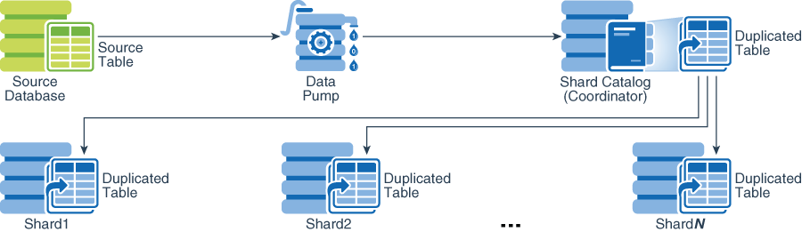
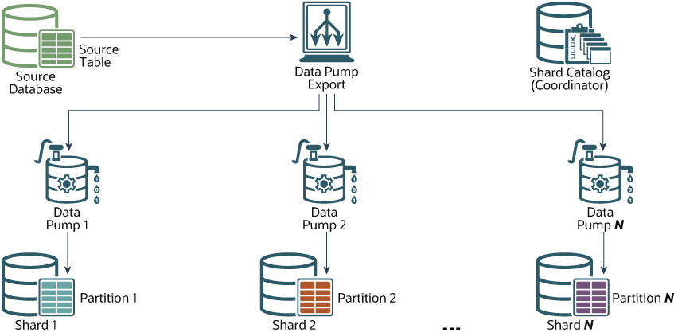

# Migrate the Application to Globally Distribute Database

## Introduction

In order to migrate the application from normal instance to globally distribute database, you need to redesign the schema and application. In this lab you will create a sample schema in the globally distribute database. You will create a sharded table family `Customers->Orders->LineItems` sharded by `CustId`, and a duplicate table `Products`.

Estimated Lab Time: 30 minutes.

### Objectives

In this lab, you will perform the following steps:
- Create the schema user, tablespace set, sharded tables and duplicated tables
- Verify that the DDLs have been propagated to all the shards
- Insert data into the sharded table
- Import dump file into the sharded tables.
- Setup and run the sample application

### Prerequisites

This lab assumes you have already completed the following:
- Deploy the Globally Distributed Database with RAFT
- Set up the non sharded database


## Task 1: Create Sample Schema

1. Login to the gsm host using the public ip address.

    ```
    $ <copy>ssh -i labkey opc@<gsmhost_public_ip></copy>
    Last login: Sun Nov 29 01:26:28 2020 from 59.66.120.23
    -bash: warning: setlocale: LC_CTYPE: cannot change locale (UTF-8): No such file or directory
    
    [opc@gsmhost ~]$
    ```
    
    Switch to oracle user.
    
    ```
    [opc@gsmhost ~]$ <copy>sudo su - oracle</copy>
    Last login: Sat Aug 10 23:59:23 GMT 2024 on pts/0
    [oracle@gsmhost ~]$ 
    ```

   

2. Download the SQL scripts `create-sample-schema.sql`.

    ```
    [oracle@gsmhost ~]$ <copy>wget https://c4u04.objectstorage.us-ashburn-1.oci.customer-oci.com/p/EcTjWk2IuZPZeNnD_fYMcgUhdNDIDA6rt9gaFj_WZMiL7VvxPBNMY60837hu5hga/n/c4u04/b/livelabsfiles/o/create-sample-schema.sql</copy>
    ```

   

3. View the sql scripts file. This scirpt will create a sample schema `app_schema`, then create a sharded table family `Customers->Orders->LineItems` sharded by `CustId`, and a duplicate table `Products`. Make sure the connect string is correct.

    ```
    [oracle@gsmhost ~]$ <copy>cat create-sample-schema.sql</copy>
    set echo on 
    set termout on
    set time on
    spool /home/oracle/create_sample_schema.lst
    REM
    REM Connect to the Shard Catalog and Create Schema
    REM
    connect sys/WelcomePTS_2024#@shardhost0:1521/shard0 as sysdba
    REM alter session set container=catapdb;
    alter session enable shard ddl;
    create user app_schema identified by App_Schema_Pass_123;
    grant connect, resource, alter session to app_schema;
    grant execute on dbms_crypto to app_schema;
    grant create table, create procedure, create tablespace, create materialized view to app_schema;
    grant unlimited tablespace to app_schema;
    grant select_catalog_role to app_schema;
    grant all privileges to app_schema;
    grant gsmadmin_role to app_schema;
    grant dba to app_schema;
    
    
    REM
    REM Create a tablespace set for SHARDED tables
    REM
    CREATE TABLESPACE SET  TSP_SET_1 using template (datafile size 100m autoextend on next 10M maxsize unlimited extent management  local segment space management auto );
    
    REM
    REM Create a tablespace for DUPLICATED tables
    REM
    CREATE TABLESPACE products_tsp datafile size 100m autoextend on next 10M maxsize unlimited extent management local uniform size 1m; 
     
    REM
    REM Create Sharded and Duplicated tables
    REM
    connect app_schema/App_Schema_Pass_123@shardhost0:1521/shard0
    alter session enable shard ddl;
    REM
    REM Create a Sharded table for Customers  (Root table)
    REM
    CREATE SHARDED TABLE Customers
    (
      CustId      VARCHAR2(60) NOT NULL,
      FirstName   VARCHAR2(60),
      LastName    VARCHAR2(60),
      Class       VARCHAR2(10),
      Geo         VARCHAR2(8),
      CustProfile VARCHAR2(4000),
      Passwd      RAW(60),
      CONSTRAINT pk_customers PRIMARY KEY (CustId),
      CONSTRAINT json_customers CHECK (CustProfile IS JSON)
    ) TABLESPACE SET TSP_SET_1
    PARTITION BY CONSISTENT HASH (CustId) PARTITIONS AUTO;
    
    REM
    REM Create a Sharded table for Orders
    REM
    CREATE SHARDED TABLE Orders
    (
      OrderId     INTEGER NOT NULL,
      CustId      VARCHAR2(60) NOT NULL,
      OrderDate   TIMESTAMP NOT NULL,
      SumTotal    NUMBER(19,4),
      Status      CHAR(4),
      constraint  pk_orders primary key (CustId, OrderId),
      constraint  fk_orders_parent foreign key (CustId) 
        references Customers on delete cascade
    ) partition by reference (fk_orders_parent);
    
    REM
    REM Create the sequence used for the OrderId column
    REM
    CREATE SEQUENCE Orders_Seq;
    
    REM
    REM Create a Sharded table for LineItems
    REM
    CREATE SHARDED TABLE LineItems
    (
      OrderId     INTEGER NOT NULL,
      CustId      VARCHAR2(60) NOT NULL,
      ProductId   INTEGER NOT NULL,
      Price       NUMBER(19,4),
      Qty         NUMBER,
      constraint  pk_items primary key (CustId, OrderId, ProductId),
      constraint  fk_items_parent foreign key (CustId, OrderId)
        references Orders on delete cascade
    ) partition by reference (fk_items_parent);
    
    REM
    REM Create Duplicated table for Products
    REM
    CREATE DUPLICATED TABLE Products
    (
      ProductId  INTEGER GENERATED BY DEFAULT AS IDENTITY PRIMARY KEY,
      Name       VARCHAR2(128),
      DescrUri   VARCHAR2(128),
      LastPrice  NUMBER(19,4)
    ) TABLESPACE products_tsp;
    
    REM
    REM Create functions for Password creation and checking – used by the REM demo loader application
    REM
    
    CREATE OR REPLACE FUNCTION PasswCreate(PASSW IN RAW)
      RETURN RAW
    IS
      Salt RAW(8);
    BEGIN
      Salt := DBMS_CRYPTO.RANDOMBYTES(8);
      RETURN UTL_RAW.CONCAT(Salt, DBMS_CRYPTO.HASH(UTL_RAW.CONCAT(Salt, PASSW), DBMS_CRYPTO.HASH_SH256));
    END;
    /
    
    CREATE OR REPLACE FUNCTION PasswCheck(PASSW IN RAW, PHASH IN RAW)
      RETURN INTEGER IS
    BEGIN
      RETURN UTL_RAW.COMPARE(
          DBMS_CRYPTO.HASH(UTL_RAW.CONCAT(UTL_RAW.SUBSTR(PHASH, 1, 8), PASSW), DBMS_CRYPTO.HASH_SH256),
          UTL_RAW.SUBSTR(PHASH, 9));
    END;
    /
    
    REM
    REM
    select table_name from user_tables;
    REM
    REM
    spool off
    ```

   

4. Connect to SQLPLUS.

    ```
    [oracle@gsmhost ~]$ <copy>sqlplus /nolog</copy>
    
    SQL*Plus: Release 23.0.0.0.0 - for Oracle Cloud and Engineered Systems on Sun Aug 11 00:13:46 2024
    Version 23.5.0.24.07
    
    Copyright (c) 1982, 2024, Oracle.  All rights reserved.
    
    SQL> 
    ```

   

5. Run the sql script.

    ```
    SQL> <copy>@create-sample-schema.sql</copy>
    ```
    
    The output like the following
    
    ```
    SQL> set termout on
    SQL> set time on
    00:16:11 SQL> spool /home/oracle/create_sample_schema.lst
    00:16:11 SQL> REM
    00:16:11 SQL> REM Connect to the Shard Catalog and Create Schema
    00:16:11 SQL> REM
    00:16:11 SQL> connect sys/WelcomePTS_2024#@catahost:1521/catapdb as sysdba
    Connected.
    00:16:11 SQL> REM alter session set container=catapdb;
    00:16:11 SQL> alter session enable shard ddl;
    
    Session altered.
    
    00:16:11 SQL> create user app_schema identified by App_Schema_Pass_123;
    
    User created.
    
    00:16:11 SQL> grant connect, resource, alter session to app_schema;
    
    Grant succeeded.
    
    00:16:11 SQL> grant execute on dbms_crypto to app_schema;
    
    Grant succeeded.
    
    00:16:11 SQL> grant create table, create procedure, create tablespace, create materialized view to app_schema;
    
    Grant succeeded.
    
    00:16:11 SQL> grant unlimited tablespace to app_schema;
    
    Grant succeeded.
    
    00:16:11 SQL> grant select_catalog_role to app_schema;
    
    Grant succeeded.
    
    00:16:11 SQL> grant all privileges to app_schema;
    
    Grant succeeded.
    
    00:16:11 SQL> grant gsmadmin_role to app_schema;
    
    Grant succeeded.
    
    00:16:11 SQL> grant dba to app_schema;
    
    Grant succeeded.
    
    00:16:11 SQL> 
    00:16:11 SQL> 
    00:16:11 SQL> REM
    00:16:11 SQL> REM Create a tablespace set for SHARDED tables
    00:16:11 SQL> REM
    00:16:11 SQL> CREATE TABLESPACE SET  TSP_SET_1 using template (datafile size 100m autoextend on next 10M maxsize unlimited extent managementlocal segment space management auto );
    
    Tablespace created.
    
    00:16:11 SQL> 
    00:16:11 SQL> REM
    00:16:11 SQL> REM Create a tablespace for DUPLICATED tables
    00:16:11 SQL> REM
    00:16:11 SQL> CREATE TABLESPACE products_tsp datafile size 100m autoextend on next 10M maxsize unlimited extent management local uniform size 1m;
    
    Tablespace created.
    
    00:16:12 SQL> 
    00:16:12 SQL> REM
    00:16:12 SQL> REM Create Sharded and Duplicated tables
    00:16:12 SQL> REM
    00:16:12 SQL> connect app_schema/App_Schema_Pass_123@catahost:1521/catapdb
    Connected.
    00:16:12 SQL> alter session enable shard ddl;
    
    Session altered.
    
    00:16:12 SQL> REM
    00:16:12 SQL> REM Create a Sharded table for Customers	(Root table)
    00:16:12 SQL> REM
    00:16:12 SQL> CREATE SHARDED TABLE Customers
    00:16:12   2  (
    00:16:12   3  	CustId	    VARCHAR2(60) NOT NULL,
    00:16:12   4  	FirstName   VARCHAR2(60),
    00:16:12   5  	LastName    VARCHAR2(60),
    00:16:12   6  	Class	    VARCHAR2(10),
    00:16:12   7  	Geo	    VARCHAR2(8),
    00:16:12   8  	CustProfile VARCHAR2(4000),
    00:16:12   9  	Passwd	    RAW(60),
    00:16:12  10  	CONSTRAINT pk_customers PRIMARY KEY (CustId),
    00:16:12  11  	CONSTRAINT json_customers CHECK (CustProfile IS JSON)
    00:16:12  12  ) TABLESPACE SET TSP_SET_1
    00:16:12  13  PARTITION BY CONSISTENT HASH (CustId) PARTITIONS AUTO;
    
    Table created.
    
    00:16:12 SQL> 
    00:16:12 SQL> REM
    00:16:12 SQL> REM Create a Sharded table for Orders
    00:16:12 SQL> REM
    00:16:12 SQL> CREATE SHARDED TABLE Orders
    00:16:12   2  (
    00:16:12   3  	OrderId     INTEGER NOT NULL,
    00:16:12   4  	CustId	    VARCHAR2(60) NOT NULL,
    00:16:12   5  	OrderDate   TIMESTAMP NOT NULL,
    00:16:12   6  	SumTotal    NUMBER(19,4),
    00:16:12   7  	Status	    CHAR(4),
    00:16:12   8  	constraint  pk_orders primary key (CustId, OrderId),
    00:16:12   9  	constraint  fk_orders_parent foreign key (CustId)
    00:16:12  10  	  references Customers on delete cascade
    00:16:12  11  ) partition by reference (fk_orders_parent);
    
    Table created.
    
    00:16:12 SQL> 
    00:16:12 SQL> REM
    00:16:12 SQL> REM Create the sequence used for the OrderId column
    00:16:12 SQL> REM
    00:16:12 SQL> CREATE SEQUENCE Orders_Seq;
    
    Sequence created.
    
    00:16:12 SQL> 
    00:16:12 SQL> REM
    00:16:12 SQL> REM Create a Sharded table for LineItems
    00:16:12 SQL> REM
    00:16:12 SQL> CREATE SHARDED TABLE LineItems
    00:16:12   2  (
    00:16:12   3  	OrderId     INTEGER NOT NULL,
    00:16:12   4  	CustId	    VARCHAR2(60) NOT NULL,
    00:16:12   5  	ProductId   INTEGER NOT NULL,
    00:16:12   6  	Price	    NUMBER(19,4),
    00:16:12   7  	Qty	    NUMBER,
    00:16:12   8  	constraint  pk_items primary key (CustId, OrderId, ProductId),
    00:16:12   9  	constraint  fk_items_parent foreign key (CustId, OrderId)
    00:16:12  10  	  references Orders on delete cascade
    00:16:12  11  ) partition by reference (fk_items_parent);
    
    Table created.
    
    00:16:12 SQL> 
    00:16:12 SQL> REM
    00:16:12 SQL> REM Create Duplicated table for Products
    00:16:12 SQL> REM
    00:16:12 SQL> CREATE DUPLICATED TABLE Products
    00:16:12   2  (
    00:16:12   3  	ProductId  INTEGER GENERATED BY DEFAULT AS IDENTITY PRIMARY KEY,
    00:16:12   4  	Name	   VARCHAR2(128),
    00:16:12   5  	DescrUri   VARCHAR2(128),
    00:16:12   6  	LastPrice  NUMBER(19,4)
    00:16:12   7  ) TABLESPACE products_tsp;
    
    Table created.
    
    00:16:12 SQL> 
    00:16:12 SQL> REM
    00:16:12 SQL> REM Create functions for Password creation and checking – used by the REM demo loader application
    00:16:12 SQL> REM
    00:16:12 SQL> 
    00:16:12 SQL> CREATE OR REPLACE FUNCTION PasswCreate(PASSW IN RAW)
    00:16:12   2  	RETURN RAW
    00:16:12   3  IS
    00:16:12   4  	Salt RAW(8);
    00:16:12   5  BEGIN
    00:16:12   6  	Salt := DBMS_CRYPTO.RANDOMBYTES(8);
    00:16:12   7  	RETURN UTL_RAW.CONCAT(Salt, DBMS_CRYPTO.HASH(UTL_RAW.CONCAT(Salt, PASSW), DBMS_CRYPTO.HASH_SH256));
    00:16:12   8  END;
    00:16:12   9  /
    
    Function created.
    
    00:16:12 SQL> 
    00:16:12 SQL> CREATE OR REPLACE FUNCTION PasswCheck(PASSW IN RAW, PHASH IN RAW)
    00:16:12   2  	RETURN INTEGER IS
    00:16:12   3  BEGIN
    00:16:12   4  	RETURN UTL_RAW.COMPARE(
    00:16:12   5  	    DBMS_CRYPTO.HASH(UTL_RAW.CONCAT(UTL_RAW.SUBSTR(PHASH, 1, 8), PASSW), DBMS_CRYPTO.HASH_SH256),
    00:16:12   6  	    UTL_RAW.SUBSTR(PHASH, 9));
    00:16:12   7  END;
    00:16:12   8  /
    
    Function created.
    
    00:16:12 SQL> 
    00:16:12 SQL> REM
    00:16:12 SQL> REM
    00:16:12 SQL> select table_name from user_tables;
    
    TABLE_NAME
    --------------------------------------------------------------------------------
    CUSTOMERS
    ORDERS
    LINEITEMS
    PRODUCTS
    MLOG$_PRODUCTS
    
    00:16:12 SQL> REM
    00:16:12 SQL> REM
    00:16:12 SQL> spool off
    ```

   

6. The shard sample demo schema is created. Exit the sqlplus.

    ```
    SQL> <copy>exit</copy>
    Disconnected from Oracle Database 23ai EE Extreme Perf Release 23.0.0.0.0 - for Oracle Cloud and Engineered Systems
    Version 23.5.0.24.07
    [oracle@gsmhost ~]$ 
    ```

   

## Task 2: Verify the Shard App Schema

1. In the gsm host work with **oracle** user, run GDSCTL command.

    ```
    [oracle@gsmhost ~]$ <copy>gdsctl</copy>
    GDSCTL: Version 23.0.0.0.0 - for Oracle Cloud and Engineered Systems on Sun Aug 11 00:20:37 GMT 2024
    
    Copyright (c) 2011, 2024, Oracle.  All rights reserved.
    
    Welcome to GDSCTL, type "help" for information.
    
    Current GSM is set to SHARDDIRECTOR1
    GDSCTL> 
    ```

   

2. Run the following commands to observe that there are no failures during the creation of tablespaces.

    ```
    GDSCTL> <copy>show ddl</copy>
    Catalog connection is established
    id      DDL Text                                 Failed shards 
    --      --------                                 ------------- 
    9       grant dba to app_schema                                
    10      CREATE TABLESPACE SET  TSP_SET_1 usin...               
    11      CREATE TABLESPACE products_tsp datafi...               
    12      CREATE SHARDED TABLE Customers (   Cu...               
    13      CREATE SHARDED TABLE Orders (   Order...               
    14      CREATE SEQUENCE Orders_Seq                             
    15      CREATE SHARDED TABLE LineItems (   Or...               
    16      CREATE DUPLICATED TABLE Products (   ...               
    17      CREATE OR REPLACE FUNCTION PasswCreat...               
    18      CREATE OR REPLACE FUNCTION PasswCheck...  
    ```

   

3. Run the config commands as shown below for each of the shards(`sdb1_workshop_shard1, sdb2_workshop_shard2, sdb3_workshop_shard3`) and verify if there are any DDL error. 

    ```
    GDSCTL> <copy>config shard -shard sdb1_workshop_shard1</copy>
    
    Name: sdb1_workshop_shard1
    Shard Group: shardspaceora_regionora
    Status: Ok
    State: Deployed
    Region: regionora
    Connection string: shardhost1:1521/shard1:dedicated
    SCAN address: 
    ONS remote port: 0
    Disk Threshold, ms: 20
    CPU Threshold, %: 75
    Version: 23.0.0.0
    Failed DDL: 
    DDL Error: ---
    Management error: 
    Failed DDL id: 
    Availability: ONLINE
    Rack: 
    
    
    Supported services
    ------------------------
    Name                                                            Preferred Status    
    ----                                                            --------- ------    
    oltp_ro_svc                                                     Yes       Enabled   
    oltp_rw_svc                                                     Yes       Enabled 
    ```

   

4. Exit GDSCTL.

    ```
    GDSCTL> <copy>exit</copy>
    [oracle@gsmhost ~]$ 
    ```

   

6. Connect to the shard1 database.

    ```
    [oracle@gsmhost ~]$ <copy>sqlplus sys/WelcomePTS_2024#@shardhost1:1521/shard1 as sysdba</copy>
    
    SQL*Plus: Release 23.0.0.0.0 - for Oracle Cloud and Engineered Systems on Sun Aug 11 00:27:19 2024
    Version 23.5.0.24.07
    
    Copyright (c) 1982, 2024, Oracle.  All rights reserved.
    
    
    Connected to:
    Oracle Database 23ai EE Extreme Perf Release 23.0.0.0.0 - for Oracle Cloud and Engineered Systems
    Version 23.5.0.24.07
    
    SQL> 
    ```

   

7. Check the created tablespace set. There are 18 tablespaces set for chunks.

    ```
    SQL> <copy>select TABLESPACE_NAME, BYTES/1024/1024 MB from sys.dba_data_files order by tablespace_name;</copy>
    
    TABLESPACE_NAME 		       MB
    ------------------------------ ----------
    C001TSP_SET_1			      100
    C002TSP_SET_1			      100
    C003TSP_SET_1			      100
    C004TSP_SET_1			      100
    C005TSP_SET_1			      100
    C006TSP_SET_1			      100
    C007TSP_SET_1			      100
    C008TSP_SET_1			      100
    C009TSP_SET_1			      100
    C00ATSP_SET_1			      100
    C00BTSP_SET_1			      100
    
    TABLESPACE_NAME 		       MB
    ------------------------------ ----------
    C00CTSP_SET_1			      100
    C00DTSP_SET_1			      100
    C00ETSP_SET_1			      100
    C00FTSP_SET_1			      100
    C00GTSP_SET_1			      100
    C00HTSP_SET_1			      100
    C00ITSP_SET_1			      100
    PRODUCTS_TSP			      100
    SYSAUX				      490
    SYSTEM				      290
    TSP_SET_1			      100
    
    TABLESPACE_NAME 		       MB
    ------------------------------ ----------
    UNDOTBS1			      100
    USERS					5
    
    24 rows selected.
    ```

   

8. Verify that the chunks and chunk tablespaces are created. Each sharded table have 18 partitions.

    ```
    SQL> <copy>set linesize 140</copy>
    SQL> <copy>column table_name format a20</copy>
    SQL> <copy>column tablespace_name format a20</copy>
    SQL> <copy>column partition_name format a20</copy>
    SQL> <copy>select table_name, partition_name, tablespace_name from dba_tab_partitions where tablespace_name like 'C%TSP_SET_1' order by tablespace_name;</copy>
    
    TABLE_NAME	     PARTITION_NAME	  TABLESPACE_NAME
    -------------------- -------------------- --------------------
    LINEITEMS	     CUSTOMERS_P1	  C001TSP_SET_1
    ORDERS		     CUSTOMERS_P1	  C001TSP_SET_1
    CUSTOMERS	     CUSTOMERS_P1	  C001TSP_SET_1
    CUSTOMERS	     CUSTOMERS_P2	  C002TSP_SET_1
    ORDERS		     CUSTOMERS_P2	  C002TSP_SET_1
    LINEITEMS	     CUSTOMERS_P2	  C002TSP_SET_1
    ORDERS		     CUSTOMERS_P3	  C003TSP_SET_1
    CUSTOMERS	     CUSTOMERS_P3	  C003TSP_SET_1
    LINEITEMS	     CUSTOMERS_P3	  C003TSP_SET_1
    ORDERS		     CUSTOMERS_P4	  C004TSP_SET_1
    CUSTOMERS	     CUSTOMERS_P4	  C004TSP_SET_1
    
    TABLE_NAME	     PARTITION_NAME	  TABLESPACE_NAME
    -------------------- -------------------- --------------------
    LINEITEMS	     CUSTOMERS_P4	  C004TSP_SET_1
    CUSTOMERS	     CUSTOMERS_P5	  C005TSP_SET_1
    ORDERS		     CUSTOMERS_P5	  C005TSP_SET_1
    LINEITEMS	     CUSTOMERS_P5	  C005TSP_SET_1
    CUSTOMERS	     CUSTOMERS_P6	  C006TSP_SET_1
    ORDERS		     CUSTOMERS_P6	  C006TSP_SET_1
    LINEITEMS	     CUSTOMERS_P6	  C006TSP_SET_1
    LINEITEMS	     CUSTOMERS_P7	  C007TSP_SET_1
    ORDERS		     CUSTOMERS_P7	  C007TSP_SET_1
    CUSTOMERS	     CUSTOMERS_P7	  C007TSP_SET_1
    LINEITEMS	     CUSTOMERS_P8	  C008TSP_SET_1
    
    TABLE_NAME	     PARTITION_NAME	  TABLESPACE_NAME
    -------------------- -------------------- --------------------
    ORDERS		     CUSTOMERS_P8	  C008TSP_SET_1
    CUSTOMERS	     CUSTOMERS_P8	  C008TSP_SET_1
    ORDERS		     CUSTOMERS_P9	  C009TSP_SET_1
    LINEITEMS	     CUSTOMERS_P9	  C009TSP_SET_1
    CUSTOMERS	     CUSTOMERS_P9	  C009TSP_SET_1
    ORDERS		     CUSTOMERS_P10	  C00ATSP_SET_1
    CUSTOMERS	     CUSTOMERS_P10	  C00ATSP_SET_1
    LINEITEMS	     CUSTOMERS_P10	  C00ATSP_SET_1
    LINEITEMS	     CUSTOMERS_P11	  C00BTSP_SET_1
    ORDERS		     CUSTOMERS_P11	  C00BTSP_SET_1
    CUSTOMERS	     CUSTOMERS_P11	  C00BTSP_SET_1
    
    TABLE_NAME	     PARTITION_NAME	  TABLESPACE_NAME
    -------------------- -------------------- --------------------
    CUSTOMERS	     CUSTOMERS_P12	  C00CTSP_SET_1
    ORDERS		     CUSTOMERS_P12	  C00CTSP_SET_1
    LINEITEMS	     CUSTOMERS_P12	  C00CTSP_SET_1
    LINEITEMS	     CUSTOMERS_P13	  C00DTSP_SET_1
    CUSTOMERS	     CUSTOMERS_P13	  C00DTSP_SET_1
    ORDERS		     CUSTOMERS_P13	  C00DTSP_SET_1
    LINEITEMS	     CUSTOMERS_P14	  C00ETSP_SET_1
    ORDERS		     CUSTOMERS_P14	  C00ETSP_SET_1
    CUSTOMERS	     CUSTOMERS_P14	  C00ETSP_SET_1
    LINEITEMS	     CUSTOMERS_P15	  C00FTSP_SET_1
    CUSTOMERS	     CUSTOMERS_P15	  C00FTSP_SET_1
    
    TABLE_NAME	     PARTITION_NAME	  TABLESPACE_NAME
    -------------------- -------------------- --------------------
    ORDERS		     CUSTOMERS_P15	  C00FTSP_SET_1
    CUSTOMERS	     CUSTOMERS_P16	  C00GTSP_SET_1
    LINEITEMS	     CUSTOMERS_P16	  C00GTSP_SET_1
    ORDERS		     CUSTOMERS_P16	  C00GTSP_SET_1
    LINEITEMS	     CUSTOMERS_P17	  C00HTSP_SET_1
    CUSTOMERS	     CUSTOMERS_P17	  C00HTSP_SET_1
    ORDERS		     CUSTOMERS_P17	  C00HTSP_SET_1
    LINEITEMS	     CUSTOMERS_P18	  C00ITSP_SET_1
    ORDERS		     CUSTOMERS_P18	  C00ITSP_SET_1
    CUSTOMERS	     CUSTOMERS_P18	  C00ITSP_SET_1
    
    54 rows selected.
    ```

​      

10. Connect to the catalog database using your own sys user password..

    ```
    SQL> <copy>connect sys/WelcomePTS_2024#@shardhost0:1521/shard0 as sysdba</copy>
    Connected.
    SQL> 
    ```

    

11.  Query the `gsmadmin_internal.chunk_loc` table to observe that the chunks replicated in the three shard.

     ```
     SQL> <copy>column shard format a40</copy>
     SQL> <copy>select a.name Shard,count( b.chunk_number) Number_of_Chunks from gsmadmin_internal.database a, gsmadmin_internal.chunk_loc b where a.database_num=b.database_num group by a.name;</copy>
     
     SHARD					 NUMBER_OF_CHUNKS
     ---------------------------------------- ----------------
     sdb1_workshop_shard1				       18
     sdb2_workshop_shard2				       18
     sdb3_workshop_shard3				       18
     ```


## Task 3: Insert Data Into Sharded Table

1.   Still in the gsm host with **oracle** user. Connect the sharded database using the default ```GDS$CATALOG``` service

     ```
     [oracle@gsmhost ~]$ <copy>sqlplus app_schema/App_Schema_Pass_123@gsmhost:1522/GDS\$CATALOG.oradbcloud</copy>
     
     SQL*Plus: Release 23.0.0.0.0 - for Oracle Cloud and Engineered Systems on Sat Aug 17 05:11:51 2024
     Version 23.5.0.24.07
     
     Copyright (c) 1982, 2024, Oracle.  All rights reserved.
     
     Last Successful login time: Sat Aug 17 2024 05:10:59 +00:00
     
     Connected to:
     Oracle Database 23ai EE Extreme Perf Release 23.0.0.0.0 - for Oracle Cloud and Engineered Systems
     Version 23.5.0.24.07
     
     SQL> 
     ```

     

2.   Run the following script to insert 1000 records into customers table.

     ```
     SQL> <copy>begin
     for i in 1 .. 1000 loop
      insert into customers values(i, 'Firstname', 'Lastname','Gold',NULL,NULL,NULL);
     end loop;
     end;
     /</copy>  2    3    4    5    6  
     
     PL/SQL procedure successfully completed.
     ```

     

3.   Commit

     ```
     SQL> <copy>commit;</copy>
     
     Commit complete.
     ```

     

4.   Check the records in the table.

     ```
     SQL> <copy>select count(*) from customers;</copy>
     
       COUNT(*)
     ----------
           1000
     ```

     

5.   Connect to each of the shard database, check the records in each of the shard.

     ```
     SQL> <copy>connect app_schema/App_Schema_Pass_123@shardhost1:1521/shard1</copy>
     Connected.
     SQL> <copy>select count(*) from customers;</copy>
     
       COUNT(*)
     ----------
            339
     
     SQL> <copy>connect app_schema/App_Schema_Pass_123@shardhost2:1521/shard2</copy>
     Connected.
     SQL> <copy>select count(*) from customers;</copy>
     
       COUNT(*)
     ----------
            335
     
     SQL> <copy>connect app_schema/App_Schema_Pass_123@shardhost3:1521/shard3</copy>
     Connected.
     SQL> <copy>select count(*) from customers;</copy>
     
       COUNT(*)
     ----------
            326
     ```

6.   You can connect to the shard database with a sharding key

     ```
     SQL> <copy>connect app_schema/App_Schema_Pass_123@'(description=(address=(protocol=tcp)(host=gsmhost)(port=1522))(connect_data=(service_name=oltp_rw_svc.orasdb.oradbcloud)(SHARDING_KEY=1)))'</copy>
     Connected.
     ```

     

7.   Show current connected shard DB.

     ```
     SQL> <copy>select db_unique_name from v$database;</copy>
     
     DB_UNIQUE_NAME
     ------------------------------
     sdb1_workshop
     ```

     

8.   Try to connect with another sharding key

     ```
     SQL> <copy>connect app_schema/App_Schema_Pass_123@'(description=(address=(protocol=tcp)(host=gsmhost)(port=1522))(connect_data=(service_name=oltp_rw_svc.orasdb.oradbcloud)(SHARDING_KEY=1000)))'</copy>
     Connected.
     ```

     

9.   Show current connected shard DB

     ```
     SQL> <copy>select db_unique_name from v$database;</copy>
     
     DB_UNIQUE_NAME
     ------------------------------
     sdb2_workshop
     ```

     

10.   Connect to catalog database.

      ```
      SQL> <copy>connect app_schema/App_Schema_Pass_123@gsmhost:1522/GDS$CATALOG.oradbcloud</copy>
      ```

      

11.   Delete the data in the customers table and commit;

      ```
      SQL> <copy>delete from customers;</copy>
      SQL> <copy>commit;</copy>
      ```

      

12.   Exit from SQLPlus.

      

## Task 4: Import Dump File to the Sharded Tables

Now, we will load data into globally distributed database using the dump file which created in the previous lab. 

The duplicated tables reside in the catalog database, they are always loaded into the shard catalog database using any of available data loading utilities, or plain SQL. 



When loading a sharded table, each database shard accommodates a distinct subset of the data set, so the data in each table must be split (partitioned) across shards during the load. You can use the Oracle Data Pump utility to load the data across database shards in subsets. Data from the source database can be exported into a Data Pump dump file. Then Data Pump import can be run on each shard concurrently by using the same dump file.



Loading the data directly into the database shards is much faster, because each shard is loaded separately. The Data Pump Import detects that you are importing into a shard and only load rows that belong to that shard.  

1. From gsmhost **oracle** user, connect to the catalog pdb with `app_schema` user.

    ```
    [oracle@gsmhost ~]$ <copy>sqlplus app_schema/App_Schema_Pass_123@gsmhost:1522/GDS\$CATALOG.oradbcloud</copy>
    
    SQL*Plus: Release 23.0.0.0.0 - for Oracle Cloud and Engineered Systems on Sat Sep 21 01:23:49 2024
    Version 23.5.0.24.07
    
    Copyright (c) 1982, 2024, Oracle.  All rights reserved.
    
    Last Successful login time: Sat Sep 21 2024 01:23:29 +00:00
    
    Connected to:
    Oracle Database 23ai EE Extreme Perf Release 23.0.0.0.0 - for Oracle Cloud and Engineered Systems
    Version 23.5.0.24.07
    
    SQL> 
    ```

    

4. Create a data pump directory. When shard ddl enabled, it will be created in catalog db and each of the sharded db. Exit the SQLPLUS.

    ```
    SQL> <copy>alter session enable shard ddl;</copy>
    
    Session altered.
    
    SQL> <copy>create directory demo_pump_dir as '/home/oracle';</copy>
    
    Directory created.
    
    SQL> <copy>exit</copy>
    Disconnected from Oracle Database 23ai EE Extreme Perf Release 23.0.0.0.0 - for Oracle Cloud and Engineered Systems
    Version 23.5.0.24.07
    [oracle@catahost ~]$ 
    ```

    

5. From the gsm host, run the following command to import the public table data.

    ```
    [oracle@gsmhost ~]$ <copy>impdp app_schema/App_Schema_Pass_123@shardhost0:1521/shard0 directory=demo_pump_dir \
          dumpfile=original.dmp logfile=imp.log \
          tables=Products \
          content=DATA_ONLY</copy>
    ```

    

6. The result screen like the following.

    ```
    Import: Release 23.0.0.0.0 - for Oracle Cloud and Engineered Systems on Fri Sep 20 06:32:02 2024
    Version 23.5.0.24.07
    
    Copyright (c) 1982, 2024, Oracle and/or its affiliates.  All rights reserved.
    
    Connected to: Oracle Database 23ai EE Extreme Perf Release 23.0.0.0.0 - for Oracle Cloud and Engineered Systems
    Master table "APP_SCHEMA"."SYS_IMPORT_TABLE_01" successfully loaded/unloaded
    Starting "APP_SCHEMA"."SYS_IMPORT_TABLE_01":  app_schema/********@catahost:1521/catapdb directory=demo_pump_dir dumpfile=original.dmp logfile=imp.log tables=Products content=DATA_ONLY 
    Processing object type SCHEMA_EXPORT/TABLE/TABLE_DATA
    . . imported "APP_SCHEMA"."PRODUCTS"                      27.4 KB     480 rows
    Processing object type SCHEMA_EXPORT/TABLE/IDENTITY_COLUMN
    Job "APP_SCHEMA"."SYS_IMPORT_TABLE_01" successfully completed at Fri Sep 20 06:32:14 2024 elapsed 0 00:00:08
    ```

    

7. Run the following command to import data into the shard1 tables.

    ```
    [oracle@gsmhost ~]$ <copy>impdp app_schema/App_Schema_Pass_123@shardhost1:1521/shard1 directory=demo_pump_dir \
          dumpfile=original.dmp logfile=imp.log \
          tables=Customers, Orders, LineItems \
          content=DATA_ONLY</copy>
    ```

    

8. The result likes the following. 

    ```
    Import: Release 23.0.0.0.0 - for Oracle Cloud and Engineered Systems on Fri Sep 20 06:34:00 2024
    Version 23.5.0.24.07
    
    Copyright (c) 1982, 2024, Oracle and/or its affiliates.  All rights reserved.
    
    Connected to: Oracle Database 23ai EE Extreme Perf Release 23.0.0.0.0 - for Oracle Cloud and Engineered Systems
    Master table "APP_SCHEMA"."SYS_IMPORT_TABLE_01" successfully loaded/unloaded
    Starting "APP_SCHEMA"."SYS_IMPORT_TABLE_01":  app_schema/********@shardhost1:1521/shard1 directory=demo_pump_dir dumpfile=original.dmp logfile=imp.log tables=Customers, Orders, LineItems content=DATA_ONLY 
    Processing object type SCHEMA_EXPORT/TABLE/TABLE_DATA
    . . imported "APP_SCHEMA"."CUSTOMERS"                      6.6 MB   29481 rows
    . . imported "APP_SCHEMA"."ORDERS"                         2.3 MB   45611 rows
    . . imported "APP_SCHEMA"."LINEITEMS"                      3.2 MB   80891 rows
    Job "APP_SCHEMA"."SYS_IMPORT_TABLE_01" successfully completed at Fri Sep 20 06:34:41 2024 elapsed 0 00:00:37
    ```

    

7. You may notes the all the rows are imported into the sharded tables. However, when you check from each of the shard database, you can found only part of the data in shard1 can be access. Connect to shard1 and check the row count.

    ```
    [oracle@gsmhost ~]$ sqlplus app_schema/App_Schema_Pass_123@shardhost1:1521/shard1
    
    SQL*Plus: Release 23.0.0.0.0 - for Oracle Cloud and Engineered Systems on Sat Sep 21 01:31:51 2024
    Version 23.5.0.24.07
    
    Copyright (c) 1982, 2024, Oracle.  All rights reserved.
    
    Last Successful login time: Sat Sep 21 2024 01:28:12 +00:00
    
    Connected to:
    Oracle Database 23ai EE Extreme Perf Release 23.0.0.0.0 - for Oracle Cloud and Engineered Systems
    Version 23.5.0.24.07
    
    SQL> select count(*) from customers;
    
      COUNT(*)
    ----------
          9838
    ```

    

8. Connect to shard2 or shard3, you can found there is no record can be select.

    ```
    SQL> <copy>connect app_schema/App_Schema_Pass_123@shardhost2:1521/shard2</copy>
    Connected.
    SQL> <copy>select count(*) from customers;</copy>
    
      COUNT(*)
    ----------
    	 0
    ```

    

9. Exit from SQLPlus. Run the following command to load data into shard2 tables.

    ```
    [oracle@gsmhost ~]$ <copy>impdp app_schema/App_Schema_Pass_123@shardhost2:1521/shard2 directory=demo_pump_dir \
          dumpfile=original.dmp logfile=imp.log \
          tables=Customers, Orders, LineItems \
          content=DATA_ONLY</copy>
    ```

    

10. The result like the following.

    ```
    Import: Release 23.0.0.0.0 - for Oracle Cloud and Engineered Systems on Fri Sep 20 06:41:13 2024
    Version 23.5.0.24.07
    
    Copyright (c) 1982, 2024, Oracle and/or its affiliates.  All rights reserved.
    
    Connected to: Oracle Database 23ai EE Extreme Perf Release 23.0.0.0.0 - for Oracle Cloud and Engineered Systems
    Master table "APP_SCHEMA"."SYS_IMPORT_TABLE_01" successfully loaded/unloaded
    Starting "APP_SCHEMA"."SYS_IMPORT_TABLE_01":  app_schema/********@shardhost2:1521/shard2 directory=demo_pump_dir dumpfile=original.dmp logfile=imp.log tables=Customers, Orders, LineItems content=DATA_ONLY 
    Processing object type SCHEMA_EXPORT/TABLE/TABLE_DATA
    . . imported "APP_SCHEMA"."CUSTOMERS"                      6.6 MB   29481 rows
    . . imported "APP_SCHEMA"."ORDERS"                         2.3 MB   45611 rows
    . . imported "APP_SCHEMA"."LINEITEMS"                      3.2 MB   80891 rows
    Job "APP_SCHEMA"."SYS_IMPORT_TABLE_01" successfully completed at Fri Sep 20 06:41:55 2024 elapsed 0 00:00:38
    ```

    

11. Run the following command to load data into shard3 tables.

    ```
    [oracle@gsmhost ~]$ <copy>impdp app_schema/App_Schema_Pass_123@shardhost3:1521/shard3 directory=demo_pump_dir \
          dumpfile=original.dmp logfile=imp.log \
          tables=Customers, Orders, LineItems \
          content=DATA_ONLY</copy>
    ```

    

12. The result like the following.

    ```
    Import: Release 23.0.0.0.0 - for Oracle Cloud and Engineered Systems on Fri Sep 20 06:44:28 2024
    Version 23.5.0.24.07
    
    Copyright (c) 1982, 2024, Oracle and/or its affiliates.  All rights reserved.
    
    Connected to: Oracle Database 23ai EE Extreme Perf Release 23.0.0.0.0 - for Oracle Cloud and Engineered Systems
    Master table "APP_SCHEMA"."SYS_IMPORT_TABLE_01" successfully loaded/unloaded
    Starting "APP_SCHEMA"."SYS_IMPORT_TABLE_01":  app_schema/********@shardhost3:1521/shard3 directory=demo_pump_dir dumpfile=original.dmp logfile=imp.log tables=Customers, Orders, LineItems content=DATA_ONLY 
    Processing object type SCHEMA_EXPORT/TABLE/TABLE_DATA
    . . imported "APP_SCHEMA"."CUSTOMERS"                      6.6 MB   29481 rows
    . . imported "APP_SCHEMA"."ORDERS"                         2.3 MB   45611 rows
    . . imported "APP_SCHEMA"."LINEITEMS"                      3.2 MB   80891 rows
    Job "APP_SCHEMA"."SYS_IMPORT_TABLE_01" successfully completed at Fri Sep 20 06:45:10 2024 elapsed 0 00:00:38
    ```

13. Now all the data from normal instance migrate to the sharded tables.

## Task 5: Setup and Run the Application for Globally Distribute Database

1.   In the gsm host with **oracle** user, change the directory to ```sdb_demo_app/sql```.

     ```
     [oracle@gsmhost ~]$ <copy>cd sdb_demo_app/sql</copy>
     [oracle@gsmhost sql]$
     ```

     

2.   View the content in the file ```sdb_demo_app_ext.sql ```. Make sure the connect string is correct.

     ```
     [oracle@gsmhost sql]$ <copy>cat sdb_demo_app_ext.sql</copy> 
     -- Create catalog monitor packages
     connect sys/WelcomePTS_2024#@shardhost0:1521/shard0 as sysdba
     @catalog_monitor.sql
     
     connect app_schema/App_Schema_Pass_123@shardhost0:1521/shard0;
     
     alter session enable shard ddl;
     
     CREATE OR REPLACE VIEW SAMPLE_ORDERS AS
       SELECT OrderId, CustId, OrderDate, SumTotal FROM
         (SELECT * FROM ORDERS ORDER BY OrderId DESC)
           WHERE ROWNUM < 10;
     
     alter session disable shard ddl;
     
     -- Allow a special query for dbaview
     connect sys/WelcomePTS_2024#@shardhost0:1521/shard0 as sysdba
     
     -- For demo app purposes
     grant shard_monitor_role, gsmadmin_role to app_schema;
     
     alter session enable shard ddl;
     
     create user dbmonuser identified by TEZiPP4_MsLLL_1;
     grant connect, alter session, shard_monitor_role, gsmadmin_role to dbmonuser;
     
     grant all privileges on app_schema.products to dbmonuser;
     grant read on app_schema.sample_orders to dbmonuser;
     
     alter session disable shard ddl;
     -- End workaround
     
     exec dbms_global_views.create_any_view('SAMPLE_ORDERS', 'APP_SCHEMA.SAMPLE_ORDERS', 'GLOBAL_SAMPLE_ORDERS', 0, 1);
     ```

     

3.   Using SQLPlus to run the script. Make sure no error in the result.

     ```
     [oracle@gsmhost sql]$ <copy>sqlplus /nolog</copy>
     
     SQL*Plus: Release 23.0.0.0.0 - for Oracle Cloud and Engineered Systems on Sat Sep 21 23:54:21 2024
     Version 23.5.0.24.07
     
     Copyright (c) 1982, 2024, Oracle.  All rights reserved.
     
     SQL> <copy>@sdb_demo_app_ext.sql</copy>
     ```

     

4.   Exit form SQLPlus. Change the directory to ```sdb_demo_app```

     ```
     [oracle@gsmhost sql]$ <copy>cd ~/sdb_demo_app</copy>
     [oracle@gsmhost sdb_demo_app]$ 
     ```

     

5.   View the content of th property file.  

     ```
     [oracle@gsmhost sdb_demo_app]$ <copy>cat sdbdemo.properties</copy> 
     name=demo
     connect_string=(ADDRESS_LIST=(LOAD_BALANCE=off)(FAILOVER=on)(ADDRESS=(HOST=localhost)(PORT=1522)(PROTOCOL=tcp)))
     monitor.user=dbmonuser
     monitor.pass=TEZiPP4MsLLL
     #app.service.write=oltp_rw_srvc.cust_sdb.oradbcloud
     app.service.write=oltp_rw_svc.orasdb.oradbcloud
     #app.service.readonly=oltp_rw_srvc.cust_sdb.oradbcloud
     app.service.readonly=oltp_ro_svc.orasdb.oradbcloud
     app.user=app_schema
     app.pass=App_Schema_Pass_123
     app.threads=7
     ```

     

6.   Run the application using this property file.

     ```
     [oracle@gsmhost sdb_demo_app]$ <copy>./run.sh demo sdbdemo.properties</copy>
     ```

     The result like the following:

     ```
      RO Queries | RW Queries | RO Failed  | RW Failed  | APS 
               0            0            0            0            3
               3            0            0            0            0
             136            0            0            0           49
            1195          184            0            0          385
            3842          577            0            0          948
            6477         1048            0            0          953
            9666         1541            0            0         1146
           13158         2120            0            0         1257
           17226         2771            0            0         1460
           21349         3433            0            0         1496
           25599         4060            0            0         1534
           29616         4723            0            0         1441
           33419         5424            0            0         1380
           37272         6092            0            0         1400
           41356         6742            0            0         1482
           45025         7409            0            0         1321
           48884         8079            0            0         1403
           52662         8733            0            0         1388
           56624         9386            0            0         1437
           60542        10019            0            0         1442
     ```

     

7.   The application can now running with globally distribute database. Using ```Control+C``` to exit the application.


You may now proceed to the next lab.

## Acknowledgements
* **Author** - Minqiao Wang, Oracle SE
* **Contributor** - Satyabrata Mishra, Database Product Management
* **Last Updated By/Date** - Minqiao Wang, Sep 2024