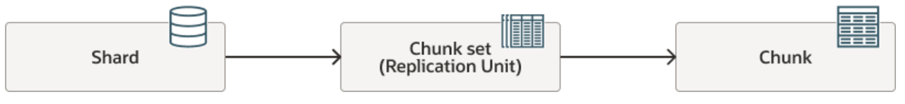
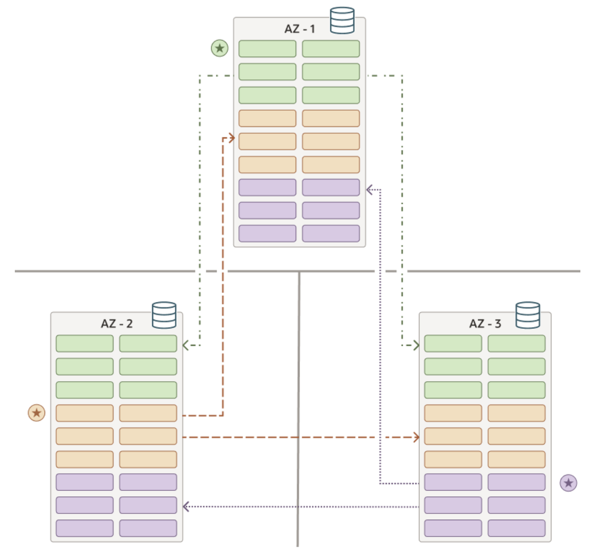

# Introduction

## About this Workshop

In this workshop you will learn how to deploy Oracle Globally Distributed Database with Raft replication. You will also deploy an application base on the Raft with high availability. 

Estimated Lab Time: 4 hours.

### About Oracle Globally Distributed Database

Oracle Globally Distributed Database disperses segments of a data set across many databases (shards) onto different computers—on-premises or in the cloud. It enables globally distributed, linearly scalable, multimodel databases. It requires no specialized hardware or software. Oracle Globally Distributed Database does all this while rendering the strong consistency, full power of SQL, support for structured and unstructured data, and the Oracle Database ecosystem. It meets data sovereignty requirements and supports applications that require low latency and high availability.

## About Raft Replication

Raft Replication enables rapid failover within seconds and zero data loss during node or data center outages, facilitating an Active-Active-Active symmetric distributed database architecture that enhances availability, simplifies management, and optimizes resource utilization globally.

**Replication Unit**

When Raft replication is enabled, a sharded database contains multiple **replication units**. A replication unit (RU) is a set of chunks that have the same replication topology. Each RU has three replicas placed on different shards. The Raft consensus protocol is used to maintain consistency between the replicas in case of failures, network partitioning, message loss, or delay.

Each shard contains replicas from multiple RUs. Some of these replicas are leaders and some are followers. Raft replication tries to maintain a balanced distribution of leaders and followers across shards. By default each shard is a leader for two RUs and is a follower for four other RUs. This makes all shards active and provides optimal utilization of hardware resources.

In Oracle Globally Distributed Database, an RU is a set of chunks, as shown in the image below.

**Raft Group**

Each replication unit contains exactly one chunk set and has a **leader** and a set of **followers**, and these members form a *raft group*. The leader and its followers for a replication unit contain replicas of the same chunk set in different shards as shown below. A shard can be the leader for some replication units and a follower for other replication units.

All DMLs for a particular subset of data are executed in the leader first, and then are replicated to its followers.

**Replication Factor**

The **replication factor** (RF) determines the number of participants in a Raft group. This number includes the leader and its followers.

The RU needs a majority of replicas available for write.

-   RF = 3: tolerates one replica failure
-   RF = 5: tolerates two replica failures

In Oracle Globally Distributed Database , the replication factor is specified for the entire sharded database, that is all replication units in the database have the same RF. The number of followers is limited to two, thus the replication factor is three.

### Objectives

In this workshop, you will

- Deploy a Globally Distributed Database with Raft replication.
- Migrate a single instance application to the Globally Distributed Database.
- Explore the Raft replication features

###  Prerequisites

In order to do this workshop, you need

- An Oracle Free Tier, Always Free, Paid or LiveLabs Cloud Account

## Learn More

- [Oracle Globally Distributed Database](https://docs.oracle.com/en/database/oracle/oracle-database/23/shard/raft-replication.html)

## Acknowledgements

* **Author** - Minqiao Wang, Oracle China

* **Contributor** - Satyabrata Mishra, Database Product Management

* **Last Updated By/Date** - Minqiao Wang, Sep 2024  
