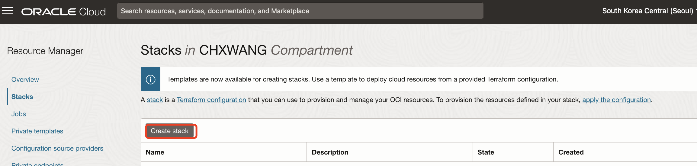
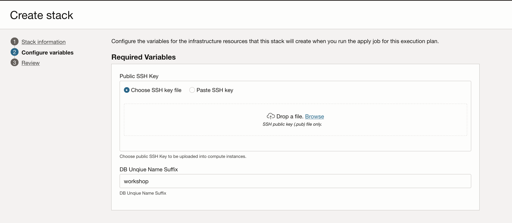
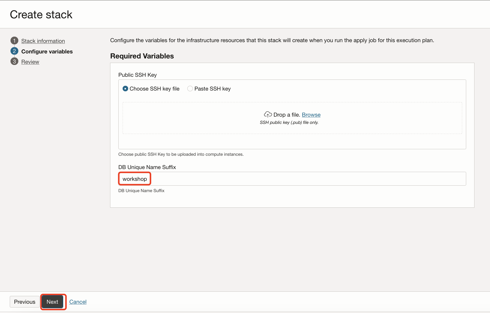
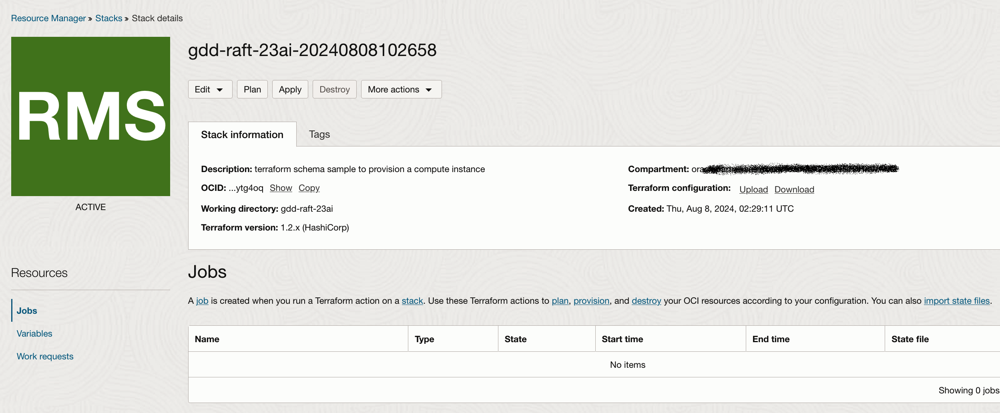
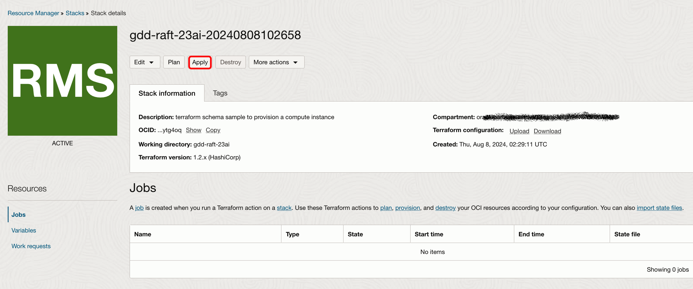
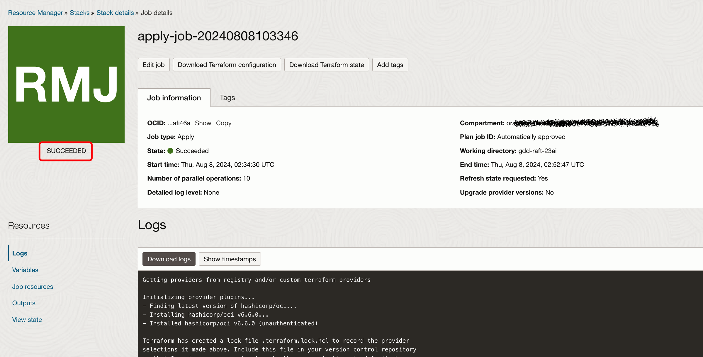
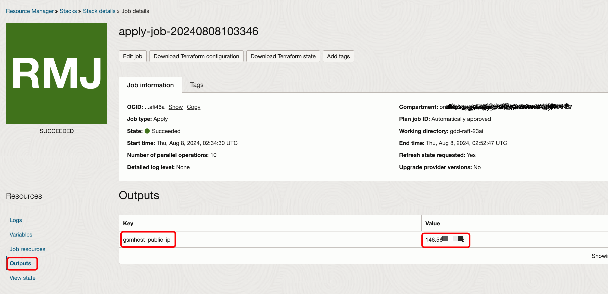

# Provision the Database and Compute Instance

## Introduction

In this lab you will provision 4 OCI Base Database Services an 1 OCI VM Compute Instance using Oracle Resource Manager. After this lab, You will get the following resource:

-   3 Base Database Services for Shards
-   1 Base Database Service for Catalog
-   1 Compute instance for GSM

Estimated Lab Time: 50 minutes.

### Objectives

-   Use Resource Manager to provision the lab resources.

### Prerequisites

This lab assumes you have already completed the following:
- An Oracle Free Tier, Always Free, Paid or LiveLabs Cloud Account
- Create a SSH Keys pair

Click on the link below to download the Resource Manager zip files you need to build your enviornment.

- [gdd-raft-23ai-v5.zip](https://github.com/minqiaowang/globally-distributed-database-with-raft/raw/main/setup-environment/gdd-raft-23ai-v5.zip) - Packaged terraform resources creation script.


## **Task 1:** Create the Resource Manager Stack

1. Login to the Oracle Cloud Console, open the hamburger menu in the left hand corner. Choose **Resource Manager > Stacks**. Choose the **Compartment** that you want to use, click the  **Create Stack** button. *Note: If you are in a workshop, double check your region to ensure you are on the assigned region.*

    

    

    

    

2. Check the **ZIP FILE**, Click the **Browse** link and select the setup zip file (`gdd-raft-23ai.zip`) that you downloaded. Click **Select** to upload the zip file.

    

    
    
    Accept all the defaults and click **Next**.


3. Upload or Paste the content of the public key you create before.

    

4. Input the DB Unique Name Suffix, the default value is "workshop". You can input your own suffix to make sure the db unique name is different from other users when multiple users do the same workshop using the same tenant. Then click **Next**.

    

4. Click **Create**.

    

5. Your stack has now been created!  Now to create your environment. 

    


## **Task 2:** Terraform Apply

When using Resource Manager to deploy an environment, execute a terraform  **Apply**. Let's do that now.

1. At the top of your page, click on **Stack Details**.  Click the button, **Terraform Actions** -> **Apply**. Click **Apply**. This takes about 15-20 minutes, please be patient.

    

    

    

    

    

    

2. Once this job succeeds, you will get an apply complete notification from Terraform.  Click **Outputs**,  you can get the **public ip address** for the GSM host instance. 

    If you encouter with error message like:

    ```
    Error Message: work request did not succeed, workId: ocid1.coreservicesworkrequest.oc1.ap-seoul-1.abu...hmltq, entity: database, action: CREATED. Message: Create DB System operation failed. Refer to work request ID fe65f...t1f when opening a Service Request at My Oracle Support.
    
    Resource OCID: ocid1.dbsystem.oc1.ap-seoul-1.anu...twbq
    
    Suggestion: Please retry or contact support for help with service: Database Db System
    ```

    or

    ```
    Error: 400-InvalidParameter, Cannot access Object Storage using the subnet with the following OCID: ocid1.subnet.oc1.ap-seoul-1.aaa...xfa. Review your VCN configuration. If you need further assistance, contact Oracle Support.
    
    Suggestion: Please update the parameter(s) in the Terraform config as per error message Cannot access Object Storage using the subnet with the following OCID: ocid1.subnet.oc1.ap-seoul-1.aaa...xfa. Review your VCN configuration. If you need further assistance, contact Oracle Support.
    ```

    In this situation, some base databases have been provisioned, others with error. You can click **Apply** again in the stack details page to provision the rest resources).

    

    

3. Write down the gsmhost public ip address. It's will be used in the next Tasks.

4. Now, you have gotten the lab resources like the following (**Note:** the DB Unique Name may different if you input the different suffix name when creating the stack).  The shardhost0 is used for catalog database.

    | Host       | Private IP | DB Name | DB Unique Name | PDB Name |
    | ---------- | ---------- | ------- | -------------- | -------- |
    | shardhost0 | 10.0.0.10  | sdb0    | sdb0_workshop  | shard0   |
    | shardhost1 | 10.0.0.11  | sdb1    | sdb1_workshop  | shard1   |
    | shardhost2 | 10.0.0.12  | sdb2    | sdb2_workshop  | shard2   |
    | shardhost3 | 10.0.0.13  | sdb3    | sdb3_workshop  | shard3   |
    | gsmhost    | 10.0.0.20  |         |                |          |

    The `db_domain` is `subnet1.primaryvcn.oraclevcn.com`. The default password for database dba is `WelcomePTS_2024# `.

## **Task 3:** Connect to your Instance

### MAC or Windows CYGWIN Emulator

1.  Open up a terminal (MAC) or cygwin emulator connect the gsmhost instance as the opc user.  Enter yes when prompted.

    ````
    ssh -i <ssh_private_key> opc@<Your GSM host Public IP Address>
    ````

    The output like this:

    ```
    ssh -i labkey opc@xxx.xxx.xxx.xxx
    The authenticity of host 'xxx.xxx.xxx.xxx (xxx.xxx.xxx.xxx)' can't be established.
    ECDSA key fingerprint is SHA256:Wq+YNHzgc1JUySBJuTRO0T4NKpeRz5Udw82Mn5RCe6c.
    Are you sure you want to continue connecting (yes/no/[fingerprint])? yes
    Warning: Permanently added 'xxx.xxx.xxx.xxx' (ECDSA) to the list of known hosts.
    -bash: warning: setlocale: LC_CTYPE: cannot change locale (UTF-8): No such file or directory
    [opc@gsmhost ~]$ 
    ```

    

### Windows using Putty

1.  Open up putty and create a new connection.

2.  Enter a name for the session and click **Save**.

    

3.  Click **Connection** > **Data** in the left navigation pane and set the Auto-login username to **opc**.

4.  Click **Connection** > **SSH** > **Auth** in the left navigation pane and configure the SSH private key to use by clicking Browse under Private key file for authentication.

5.  Navigate to the location where you saved your SSH private key file, select the file, and click Open.  NOTE:  You cannot connect while on VPN or in the Oracle office on clear-corporate (choose clear-internet).

    

6.  The file path for the SSH private key file now displays in the Private key file for authentication field.

7.  Click Session in the left navigation pane, then click Save in the Load, save or delete a stored session Step.

8.  Click Open to begin your session with the instance.

    

You may proceed to the next lab.

## Acknowledgements
* **Author** - Minqiao Wang, Oracle SE

* **Contributor** - Satyabrata Mishra, Database Product Management

* **Last Updated By/Date** - Minqiao Wang, Sep 2024  

    

