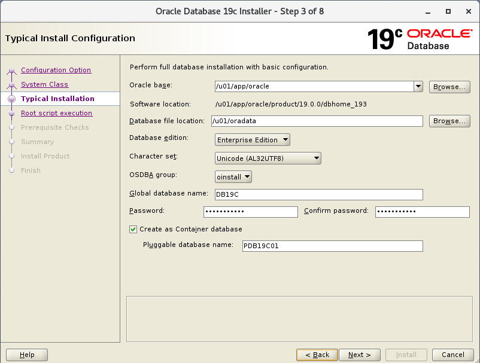
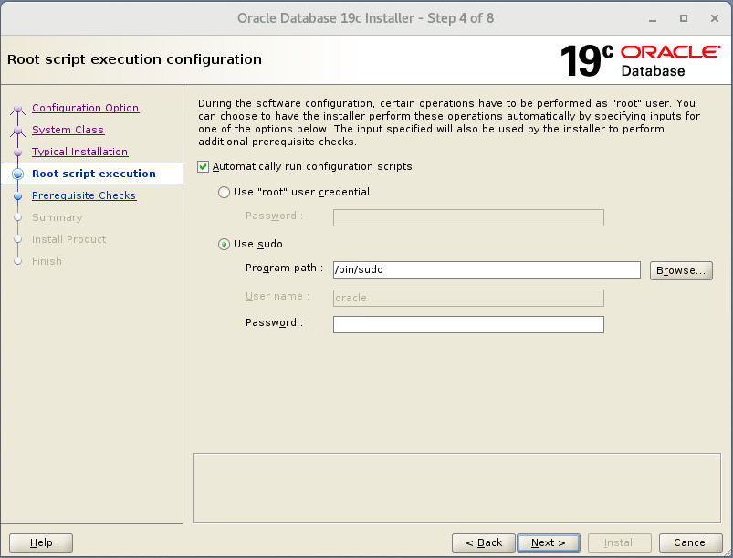
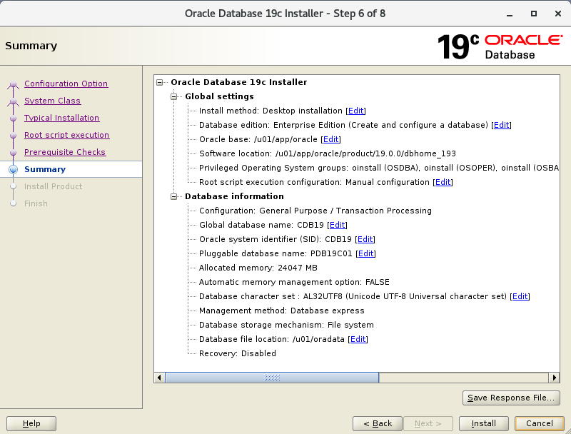
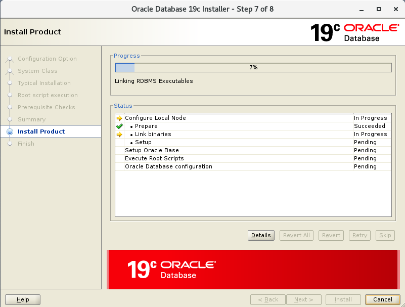
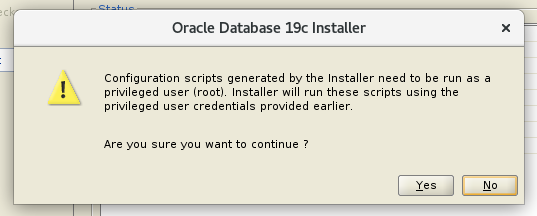
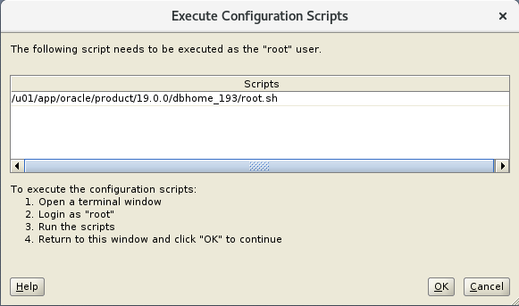
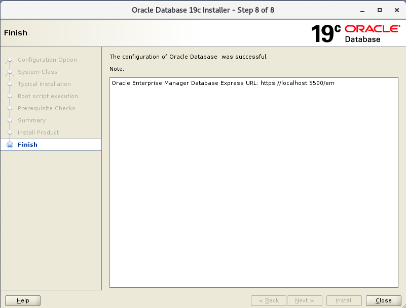

# Install a new 19c database #

## Introduction ##

In this lab, we will install the 19c database software and create a new 19c database (and listener) as a target for the other upgrades.


Estimated Time: 30 minutes

### Objectives ###

In this lab you will

- Learn how to install and register a new Oracle 19c Home in the location of your choice
- Create a new Oracle 19c Multitenant Database with a pluggable database (PDB)
- Install the Oracle 19c preinstall package
- Reduce the memory footprint of the new 19c instance
- Install the latest autoupgrade.jar in the Oracle 19c Home

### Prerequisites ###

- You have access to the Upgrade to a 19c Hands-on-Lab client image
- You have connected to the Hands-on-Lab client image using the supplied NoVNC link

## Task 1: prepare 19c software and operating system ##

 Before we can upgrade to Oracle 19c, we need to have the Oracle software installed. Outside of this training environment, you should download the production software base release from [https://eDelivery.oracle.com](https://eDelivery.oracle.com "eDelivery.oracle.com"). In a production environment, please also download the patches required and apply them before you create or upgrade any instances. The DBA can download patches to upgrade the base 19c version (19.3.0) from [https://support.oracle.com](https://support.oracle.com).

 In this workshop, we have already downloaded the software for you. You need to adhere to the Oracle license restrictions when using this software. For training purposes when using this Hands-On Lab, the Oracle Technology Network license will apply. All software required is available in the `/source` directory in your image.

### Locate 19c software and unzip in the correct location ###

 The software downloaded from the Oracle network is a zip file for your operating system/architecture. In 19c, the location where you unzip the software and start the Oracle Universal Installer (OUI) **will be used as your new Oracle Home**, so be careful where you unzip the software. The running of the OUI will only register the software with the inventory (or will create an inventory if none exists).

1. First, we need to create a new location for the software. Execute the following command as an oracle user after starting a new terminal window in your image:

    ```
    $ <copy>mkdir -p /u01/app/oracle/product/19.0.0/dbhome_193</copy>
    ```

2. We can now use this new location to unzip our software.

    ```
    $ <copy>cd /u01/app/oracle/product/19.0.0/dbhome_193</copy>
    ```

    ```
    $ <copy>unzip /source/db_home_193_V982063.zip</copy>

    ...
      javavm/admin/classes.bin -> ../../javavm/jdk/jdk8/admin/classes.bin
      javavm/admin/libjtcjt.so -> ../../javavm/jdk/jdk8/admin/libjtcjt.so
      jdk/jre/bin/ControlPanel -> jcontrol
      javavm/admin/lfclasses.bin -> ../../javavm/jdk/jdk8/admin/lfclasses.bin
      javavm/lib/security/cacerts -> ../../../javavm/jdk/jdk8/lib/security/cacerts
      javavm/lib/sunjce_provider.jar -> ../../javavm/jdk/jdk8/lib/sunjce_provider.jar
      javavm/lib/security/README.txt -> ../../../javavm/jdk/jdk8/lib/security/README.txt
      javavm/lib/security/java.security -> ../../../javavm/jdk/jdk8/lib/security/java.security
      jdk/jre/lib/amd64/server/libjsig.so -> ../libjsig.so
    ```

We will not install any patches during this workshop; therefore, we can continue to prepare the operating system environment.

### Install the 19c pre-install RPM on the system ###

An easy way to make sure all system parameters are correct in a Linux environment is to use the preinstall rpm package. For non-Linux environments, please check the manual for the appropriate environment values. We have already downloaded the preinstall rpm in the environment, so you can simply install it.

4. Run the installer to start the database software install

    ```
    $ <copy>sudo yum -y localinstall /source/oracle-database-preinstall-19c-1.0-1.el7.x86_64.rpm</copy>

    Loaded plugins: langpacks, ulninfo
    Examining /source/oracle-database-preinstall-19c-1.0-1.el7.x86_64.rpm: oracle-database-preinstall-19c-1.0-1.el7.x86_64
    Marking /source/oracle-database-preinstall-19c-1.0-1.el7.x86_64.rpm to be installed
    Resolving Dependencies
    ...
    Running transaction
      Installing : oracle-database-preinstall-19c-1.0-1.el7.x86_64          1/1
      Verifying  : oracle-database-preinstall-19c-1.0-1.el7.x86_64          1/1

    Installed:
      oracle-database-preinstall-19c.x86_64 0:1.0-1.el7                                                                    

    Complete!
    ```

## Task 2: run OUI and create new 19c database ##

 Before using the unzipped Oracle software, we need to run the Oracle Universal Installer (OUI) to register the software to the Oracle Inventory on the system and do mandatory (relinking) steps for this OS. This can either be done in a GUI mode or in a character mode (for systems that do not have access to a graphical interface). In this lab, we will run the OUI in GUI mode for learning purposes.

### Run OUI ###

 While running the OUI, we have the option to install only the software (so no database) or to install the software and create a database. For various reasons, we will both install the software and create a new database in this lab.

 1. Execute the following commands in your terminal window as oracle user:

    ```
    $ <copy>cd /u01/app/oracle/product/19.0.0/dbhome_193</copy>
    ```
    ```
    $ <copy>./runInstaller</copy>
    ```

    The following screen should be visible on your (remote) desktop:

     

    - Keep the default 'Create and Configure a single instance database' and press `NEXT`

3. In the next screen, choose 'Desktop class' and press `NEXT`

4. The desktop-class will display one screen with all of the information required to create this type of database. If you think you need (for your local environment) other settings than displayed on the Desktop class screen, feel free to use the Server class. If you choose the Server class, please check the documentation for the values to be used. For the Oracle provided Workshop environment, the Desktop class is enough.

    Make sure to check and change the following values in the various fields:

    - Oracle Base
        - /u01/app/oracle (no changes)
    - Database File Location
        - /u01/oradata **(change this value)**
    - Database Edition
        - Enterprise Edition (no changes)
    - Characterset
        - Unicode (no changes)
    - OSBDA group
        - oinstall (no changes)
    - Global Database name
        - DB19C **(change this value)**
    - Password
        - Welcome_123 **(change this value)**
    - Create as Container database
        - Checked (no changes)
    - Pluggable database name
        - PDB19C01 **(change this value)**

    

    - After you have entered the correct values, please press the `NEXT` button to continue.

5. The following screen should be visible:

    

    Like previous installations, the `root.sh` script needs to be executed after the relinking and registration of the Oracle Home. This screen lets you decide whether or not you want the OUI to do this for you. In this workshop environment, you can use the sudo option for the automatic execution of the root.sh script(s). For your local environment (at home), do what applies to your situation.

    - Check the option to execute the configuration scripts automatically
        - Select the 'Use sudo' radio button
        - Change the command to execute to `/bin/sudo`
        - Enter *any* password in the Password field.
            - Please note the screen will display an error if you do not supply a (random) Password
    - Click the 'Next' button to continue.

 6. The system will now start checking the prerequisites for the 19c installation.

    

 7. If all prerequisites have been checked and the preparation check can find no warnings or errors, the OUI will display the summary screen:

    

    - Press the `Install` button to start the installation and database creation.

    

 8. After about 5 minutes, provided there are no issues during the installation, the root.sh script needs to be executed. If you have entered the password for the root user in the OUI, the pop-up box will ask permission to execute the scripts:

    

    - Click the `Yes` button to continue

    > If you did not provide a root password or sudo information, a different window will be displayed.
    >
    > 
    >
    > If you do not get the option to click `Yes`, please execute the script mentioned in the window as root user in a terminal environment.

9. The installer will now start to create the new CDB database with its PDB. The processes will take between 20 and 40 minutes.

    If this is an instructor-led class (either on-site or through a Live-Virtual-Class system) **Please inform your instructor that you are waiting for the database install to finish** to keep track of the progress of the installs perhaps continue with presentations if everybody is waiting.

10. After the database creation has finished, the OUI  will display the following screen (or similar):

    

    - Press the `Close` button to end the Universal Installer session.

    Your 19c Oracle Home has been created, and the initial database (DB19C) has been started.

## Task 3: change default memory parameters and perform administration ##

 The OUI takes a certain percentage of the available memory in our environment as default SGA size. In our workshop environment, this is an SGA of 18G. We need the memory for other tasks (databases) later on, so we will need to lower the memory usage of the new instance:

1. Please execute the following commands as Oracle user to login to the database:

    ```
    $ <copy>. oraenv</copy>
    ```
    ```
    ORACLE_SID = [oracle] ? <copy>DB19C</copy>
    The Oracle base remains unchanged with value /u01/app/oracle\
    ```
    ```
    $ <copy>sqlplus / as sysdba</copy>

    SQL*Plus: Release 19.0.0.0.0 - Production on Thu Apr 2 11:39:20 2020
    Version 19.3.0.0.0

    Copyright (c) 1982, 2019, Oracle.  All rights reserved.

    Connected to:
    Oracle Database 19c Enterprise Edition Release 19.0.0.0.0 - Production
    Version 19.3.0.0.0
    ```
2. Change the parameters for the memory setting to a lower value:

    ```
    SQL> <copy>alter system set sga_max_size=1300M scope=spfile;</copy>

    System altered.
    ```
    ```
    SQL> <copy>alter system set sga_target=1300M scope=spfile;</copy>

    System altered.
    ```
3. Shutdown and startup the database to get the parameters into effect:

    ```
    SQL> <copy>shutdown immediate</copy>
    Database closed.
    Database dismounted.
    ORACLE instance shut down.
    ```
    ```
    SQL> <copy>startup</copy>
    ORACLE instance started.

    Total System Global Area 1375728872 bytes
    Fixed Size                  9135336 bytes
    Variable Size             385875968 bytes
    Database Buffers          973078528 bytes
    Redo Buffers                7639040 bytes
    Database mounted.
    Database opened.
    ```

4. We can now exit SQLPlus:

    ```
    SQL> <copy>exit</copy>
    ```

### Make your 19c database startup using dbstart ###

5. If you shut down your Hands-On-Lab environment, you will need to start the databases again. To make this automatic (using the default dbstart tool), execute the following command:

    ```
    $ <copy>sudo sed -i 's/:N/:Y/' /etc/oratab</copy>
    ```

## Task 4: upgrade autoupgrade.jar file ##

For the autoupgrade lab, we need to put the latest version in the new 19c Oracle home.

1. Please execute the following commands:

    ```
    $ <copy>mv /u01/app/oracle/product/19.0.0/dbhome_193/rdbms/admin/autoupgrade.jar /u01/app/oracle/product/19.0.0/dbhome_193/rdbms/admin/autoupgrade.jar.org</copy>
    ```
    ```
    $ <copy>cp /source/autoupgrade.jar /u01/app/oracle/product/19.0.0/dbhome_193/rdbms/admin/</copy>
    ```

You may now proceed to the next lab.

## Acknowledgements ##

- **Author** - Robert Pastijn, Database Product Management, PTS EMEA - initial version March 2019
- **Last Update** - Robert Pastijn, Database Product Management, PTS EMEA - November 2021
