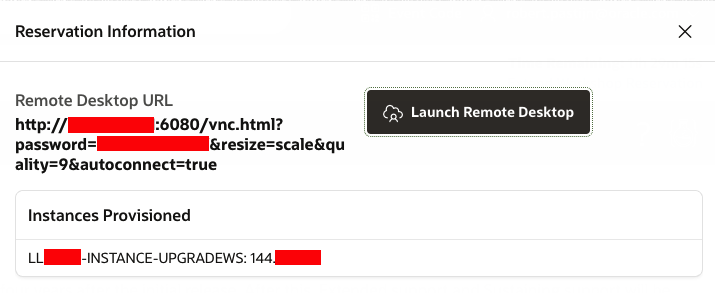

# Verify the environment #

## Introduction ##

 Since we will upgrade databases, we have prepared an image with several database versions already set up. This image is accessible through a NoVNC URL and runs in the Oracle OCI Cloud.

 Estimated time: 5 minutes

### Objectives ###

In this lab, you will

- Connect to the hands-on lab client
- Optionally connect using an ssh client

### Prerequisites ###

 To complete this lab, you need the following account credentials and assets:

- Oracle PTS 19c Lab environment
    - This environment has been pre-setup by the Livelabs environment
    - Your IP address is visible on the Livelabs -> View Login Info screen
    - The Launch button and URL to the NoVNC Remote Desktop are also visible on this screen

   

## Task 1: Connect to the Hands-On Lab client image using NoVNC ##

 Click on the "Launch Remote Desktop: button on the LiveLabs "Reservation Information" page. A new browser window should open and show you a running Linux desktop like this:

   

If you see a warning that Chrome cannot be updated, simply close this warning.

## Options ##

### Change the size of your remote screen ###
 If your screen resolution is more than 1280x900, you can increase the size of your screen by setting the Scaling Mode to 'Remote'. This option is available in the NoVNC Settings option.

### Connection through SSH ###
 This hands-on was written to be executed fully through the NoVNC Remote Desktop screen. However, some people prefer using local SSH connections using their SSH application of choice.

 By default, the SSH ports are enabled, and the SSH daemon is running in the image so that you can connect your favourite SSH client to the image for all non-graphical steps in the labs.

 > **The ssh server only accepts public/private key authentication.  
 > It is NOT allowed to change the authentication method to accept passwords !**

 You are allowed to add your public key to the `authorized_keys` file in the image.
 It is out of the scope of this hands-on lab to demonstrate how to do this.

## Next step: Lab 2 - Install 19c ##

- **All labs depend on the 19c installation in lab 2**
- There is no dependency between the labs after lab 2
- Please continue with your hands-on experience by running the steps in Lab 2
- After finishing Lab 2, continue as instructed to the next lab or choose an exciting lab
    - If one lab is executing the upgrade, you can start another Lab if you want to
    - Every Lab has its dedicated instances and versions, so even the upgrade can run in parallel

You may now **proceed to the next lab**.

## Acknowledgements ##

- **Author** - Robert Pastijn, Database Product Management, PTS EMEA - April 2020
- **Last update** - Robert Pastijn, Database Product Development, PTS EMEA - February 2023
