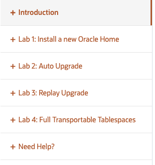

# Introduction

## Introduction

**Oracle AI Database 26ai** is the next long-term release version after the current long-term release version 19c. It will be supported for at least 5 years after the initial release of your platform. After this, "Extended Support" and "Sustaining Support" will be available. This hands-on workshop focuses on **upgrading your environment to version 23.26 or higher (also known as the Oracle AI Database 26ai)** demonstrating three scenarios that you can use (both on-premises and in the cloud) to upgrade your environment to database version 23.26 (Oracle AI Database 26ai) in a Container Architecture (Multitenant) setup.

This hands-on lab can be run standalone, but be aware that individual steps might take time to complete. Usually, the hands-on lab is delivered as part of the PTS "Oracle AI Database 26ai Upgrade Workshop", and uses the time you need to wait with explanations and additional information.

Estimated time: 3 hours.

### Objectives

- Learn to install a new Oracle AI Database 26ai Home
- Upgrade databases by using the AutoUpgrade tool
- Upgrade a pluggable database using Replay Upgrade
- Upgrade a database using Full Transportable tablespaces

### Prerequisites

- A provisioned LiveLabs Environment
  - The labs have been set up to work with a "noVNC" remote desktop environment using an HTML5-compatible browser. This setup will work with most proxy systems.
  - On the Attendee Page, you should see the noVNC URL
- If you want to run (parts) of the workshop using a direct SSH connection, you need direct access to the Internet or a proxy that supports tunneling.
  - All labs (except lab 1) can be executed using SSH only.
  - The setup of SSH for your keys (password authentication is not allowed) is not described in the lab, but if you know how it works, you can set it up and use it.

## Task 1: Access the labs

- Use the **Lab Contents** menu on the left side of the screen to access the labs.

  - If the menu is not displayed, click the menu button  at the top left to make it visible.

- From the menu, click on the lab that you would like to run. For example, if you want to proceed to **Lab 1**, click **Lab 1: Install a new Oracle Home**.

  

- You may close the menu by clicking the  again.

You may now **proceed to the next lab**.

## Acknowledgements

- **Author** - Robert Pastijn, Database Product Management, PTS EMEA - January 2026
