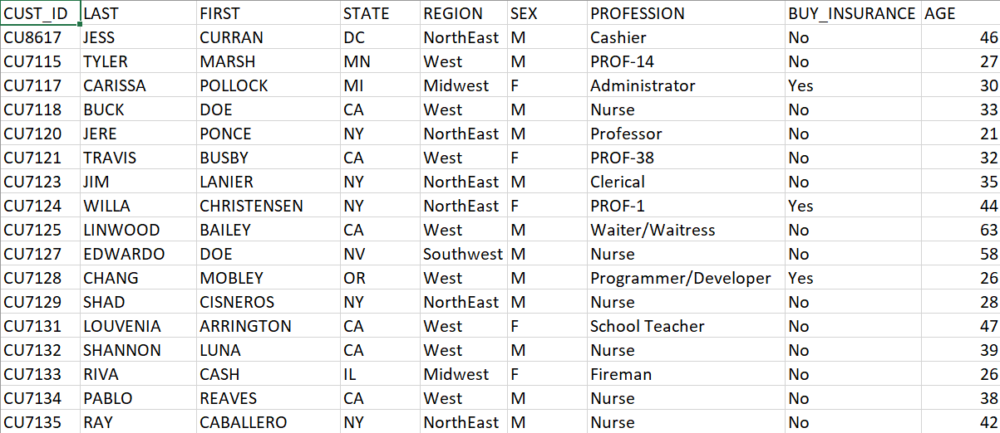
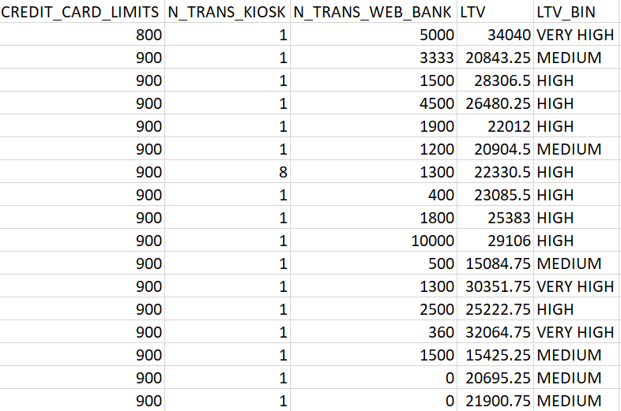
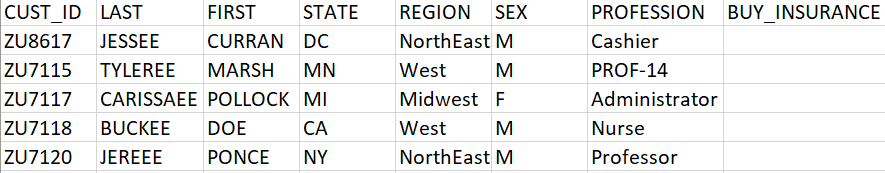
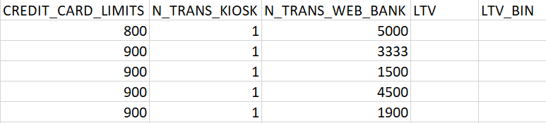

# Understand the dataset

## Introduction

Before starting the lab exercises, let's examine the use case and understand what we are trying to achieve with machine learning.  

We are using customer insurance data for a business selling insurance. The data contains over 15,000 customer information records such as name, customer ID, age, marital status, income, and important business information such as whether the customer bought the insurance and whether the customer is considered to have business value with an attribute called lifetime value or LTV.  

The insurance business wants to predict whether new customers will buy the insurance and whether customers have a high lifetime value (LTV). High lifetime value customers have the potential to generate more revenue in the future, so the business will want to retain the customer long-term by providing promotions or discounts. Attributes such as buy insurance and LTV are essential to the insurance business and can use by machine learning to predict future customer outcomes.

We can use historical records to make predictions with machine learning. An employee of the business has kept records of the customers on a spreadsheet for many years. The records already have the data and whether a customer bought insurance, and an analyst has determined LTV with business formulas. Recently the CFO has asked all these records to be kept in a database and figure out a way to predict customer outcomes faster.

Estimated Time:  5 min

### Objectives

In this lab, you will:
* Examine the customer insurance historical data set.
* Review the buy insurance and LTV columns.
* Examine the new customer data set.

### Prerequisites

* Access to the Oracle database containing the customer insurance table.

## Task 1: Review the Customer Insurance Data

1. Review the historical customer data.  Note the Buy Insurance column.  
  

2. Note the LTV and LTV\_BIN columns. LTV gives us a numerical score of the life time value of the customer, and LTV\_BIN is just a readable category derived from the score with VERY HIGH, HIGH, MEDIUM, and LOW business value.

  

Since the data already has the buy insurance and LTV information and the other data, we can use all this information in machine learning to "train" and build a model that can predict new customer outcomes for buy insurance and LTV.

3. Consider the following new customer records with the buy insurance column empty.

  

4. And with the LTV and LTV_BIN columns empty.

  

5. In this workshop, you will pass new records to machine learning models to predict whether the customer will buy the insurance and automatically determine the LTV without humans.  Have fun.

    You may now **proceed to the next lab**.

## Acknowledgements
* **Author** - Valentin Leonard Tabacaru, Milton Wan, Rajeev Rumale
* **Last Updated By/Date** -  Valentin Leonard Tabacaru, February 2023
